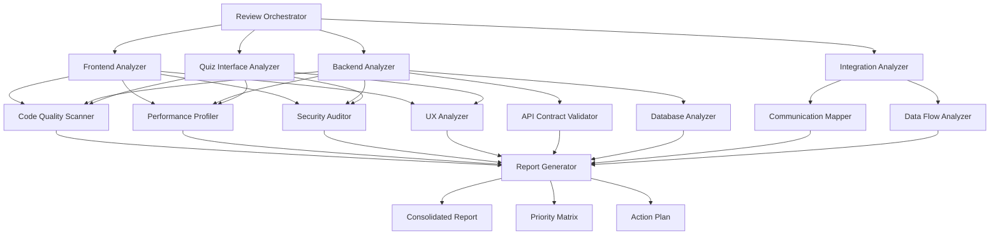

# Design Document - Comprehensive System Review

## Overview

Este documento detalha o design para um sistema abrangente de review que analisará todos os componentes do ecossistema Hormonia. O sistema será implementado como uma suite de ferramentas de análise automatizada que produzirá relatórios detalhados e acionáveis para cada área crítica identificada nos requisitos.

## Architecture

### High-Level Architecture



### Component Architecture

#### 1. Review Orchestrator
- **Responsabilidade**: Coordenar todas as análises e consolidar resultados
- **Tecnologia**: Python com asyncio para execução paralela
- **Inputs**: Configuração de análise, caminhos dos projetos
- **Outputs**: Relatório consolidado e plano de ação

#### 2. Analyzers Específicos
Cada analyzer implementa a interface `BaseAnalyzer` com métodos padronizados:
- `analyze()`: Executa a análise específica
- `generate_report()`: Produz relatório estruturado
- `get_recommendations()`: Retorna recomendações priorizadas

## Components and Interfaces

### BaseAnalyzer Interface

```python
from abc import ABC, abstractmethod
from typing import Dict, List, Any
from dataclasses import dataclass

@dataclass
class Finding:
    category: str
    severity: str  # CRITICAL, HIGH, MEDIUM, LOW
    title: str
    description: str
    file_path: str
    line_number: int = None
    recommendation: str = ""
    effort_estimate: str = ""  # SMALL, MEDIUM, LARGE

@dataclass
class AnalysisResult:
    analyzer_name: str
    findings: List[Finding]
    metrics: Dict[str, Any]
    summary: str
    recommendations: List[str]

class BaseAnalyzer(ABC):
    @abstractmethod
    async def analyze(self, project_path: str) -> AnalysisResult:
        pass
    
    @abstractmethod
    def get_supported_file_types(self) -> List[str]:
        pass
```

### Frontend Analyzer

```python
class FrontendAnalyzer(BaseAnalyzer):
    def __init__(self):
        self.code_scanner = CodeQualityScanner()
        self.performance_profiler = PerformanceProfiler()
        self.security_auditor = SecurityAuditor()
        self.ux_analyzer = UXAnalyzer()
    
    async def analyze(self, project_path: str) -> AnalysisResult:
        # Análise específica para React/Vite
        # - Bundle size analysis
        # - Component complexity
        # - Hook usage patterns
        # - State management review
        # - Accessibility compliance
        pass
```

### Backend Analyzer

```python
class BackendAnalyzer(BaseAnalyzer):
    def __init__(self):
        self.api_validator = APIContractValidator()
        self.db_analyzer = DatabaseAnalyzer()
        self.security_auditor = SecurityAuditor()
        self.performance_profiler = PerformanceProfiler()
    
    async def analyze(self, project_path: str) -> AnalysisResult:
        # Análise específica para FastAPI/Python
        # - API endpoint analysis
        # - Database query optimization
        # - Authentication/authorization review
        # - Error handling patterns
        # - Dependency injection usage
        pass
```

### Quiz Interface Analyzer

```python
class QuizInterfaceAnalyzer(BaseAnalyzer):
    def __init__(self):
        self.nextjs_analyzer = NextJSAnalyzer()
        self.performance_profiler = PerformanceProfiler()
        self.security_auditor = SecurityAuditor()
    
    async def analyze(self, project_path: str) -> AnalysisResult:
        # Análise específica para Next.js
        # - SSR/SSG optimization
        # - Route analysis
        # - API routes security
        # - Image optimization
        # - SEO compliance
        pass
```

## Data Models

### Configuration Model

```python
@dataclass
class ReviewConfiguration:
    projects: Dict[str, str]  # name -> path
    analysis_types: List[str]
    severity_threshold: str
    output_format: str
    include_metrics: bool
    parallel_execution: bool
    
    # Specific configurations
    frontend_config: FrontendConfig
    backend_config: BackendConfig
    quiz_config: QuizConfig
```

### Report Models

```python
@dataclass
class ConsolidatedReport:
    timestamp: datetime
    configuration: ReviewConfiguration
    analysis_results: List[AnalysisResult]
    cross_cutting_findings: List[Finding]
    priority_matrix: PriorityMatrix
    action_plan: ActionPlan
    metrics_summary: Dict[str, Any]

@dataclass
class PriorityMatrix:
    critical_items: List[Finding]
    high_priority_items: List[Finding]
    medium_priority_items: List[Finding]
    low_priority_items: List[Finding]
    
@dataclass
class ActionPlan:
    immediate_actions: List[ActionItem]
    short_term_actions: List[ActionItem]
    long_term_actions: List[ActionItem]
    
@dataclass
class ActionItem:
    title: str
    description: str
    related_findings: List[Finding]
    estimated_effort: str
    priority: str
    dependencies: List[str]
```

## Error Handling

### Error Categories

1. **Configuration Errors**: Problemas na configuração inicial
2. **File Access Errors**: Problemas de acesso aos arquivos/diretórios
3. **Analysis Errors**: Falhas durante análises específicas
4. **Report Generation Errors**: Problemas na geração de relatórios

### Error Handling Strategy

```python
class ReviewError(Exception):
    def __init__(self, message: str, category: str, recoverable: bool = True):
        self.message = message
        self.category = category
        self.recoverable = recoverable
        super().__init__(message)

class ErrorHandler:
    def __init__(self):
        self.errors: List[ReviewError] = []
        self.warnings: List[str] = []
    
    def handle_error(self, error: ReviewError) -> bool:
        self.errors.append(error)
        if error.recoverable:
            logging.warning(f"Recoverable error: {error.message}")
            return True
        else:
            logging.error(f"Critical error: {error.message}")
            return False
    
    def generate_error_report(self) -> Dict[str, Any]:
        return {
            "errors": [{"message": e.message, "category": e.category} for e in self.errors],
            "warnings": self.warnings,
            "total_errors": len(self.errors),
            "critical_errors": len([e for e in self.errors if not e.recoverable])
        }
```

## Testing Strategy

### Unit Testing

1. **Analyzer Tests**: Cada analyzer terá testes unitários específicos
2. **Model Tests**: Validação de modelos de dados
3. **Utility Tests**: Testes para funções auxiliares

### Integration Testing

1. **End-to-End Tests**: Teste completo do pipeline de análise
2. **Cross-Component Tests**: Testes de integração entre analyzers
3. **Report Generation Tests**: Validação da geração de relatórios

### Test Data Strategy

```python
# Test fixtures para cada tipo de projeto
@pytest.fixture
def sample_frontend_project():
    return create_temp_react_project()

@pytest.fixture  
def sample_backend_project():
    return create_temp_fastapi_project()

@pytest.fixture
def sample_quiz_project():
    return create_temp_nextjs_project()
```

### Performance Testing

1. **Benchmark Tests**: Medição de tempo de execução para projetos de diferentes tamanhos
2. **Memory Usage Tests**: Monitoramento do uso de memória durante análises
3. **Parallel Execution Tests**: Validação da execução paralela de analyzers

## Implementation Phases

### Phase 1: Core Infrastructure
- Implementar BaseAnalyzer e modelos de dados
- Criar Review Orchestrator básico
- Implementar sistema de configuração
- Testes unitários básicos

### Phase 2: Basic Analyzers
- Implementar Code Quality Scanner
- Implementar Security Auditor básico
- Implementar Performance Profiler básico
- Testes de integração

### Phase 3: Specialized Analyzers
- Frontend Analyzer completo
- Backend Analyzer completo
- Quiz Interface Analyzer completo
- Cross-cutting analysis

### Phase 4: Advanced Features
- Integration Analyzer
- UX Analyzer
- Database Analyzer avançado
- Priority Matrix e Action Plan

### Phase 5: Reporting and Visualization
- Report Generator completo
- Dashboard web (opcional)
- Export para diferentes formatos
- Métricas e trending

## Security Considerations

### Data Protection
- Não armazenar código fonte em logs
- Sanitizar informações sensíveis nos relatórios
- Criptografar dados temporários se necessário

### Access Control
- Validar permissões de acesso aos diretórios
- Implementar rate limiting para análises
- Auditoria de execuções

### Secure Coding Practices
- Input validation rigorosa
- Escape de outputs
- Tratamento seguro de exceções
- Logging seguro (sem dados sensíveis)

## Performance Optimization

### Parallel Processing
- Execução paralela de analyzers independentes
- Pool de workers para análise de arquivos
- Async/await para I/O operations

### Caching Strategy
- Cache de resultados de análise por hash de arquivo
- Cache de métricas computadas
- Invalidação inteligente de cache

### Memory Management
- Streaming de arquivos grandes
- Garbage collection otimizado
- Limits de memória por analyzer

### Scalability Considerations
- Suporte a projetos de grande escala
- Análise incremental (apenas arquivos modificados)
- Distribuição de carga entre múltiplas instâncias