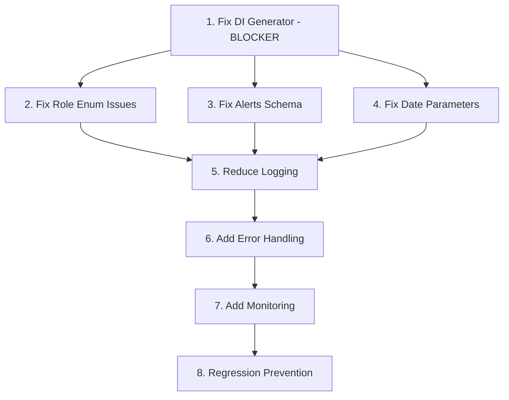
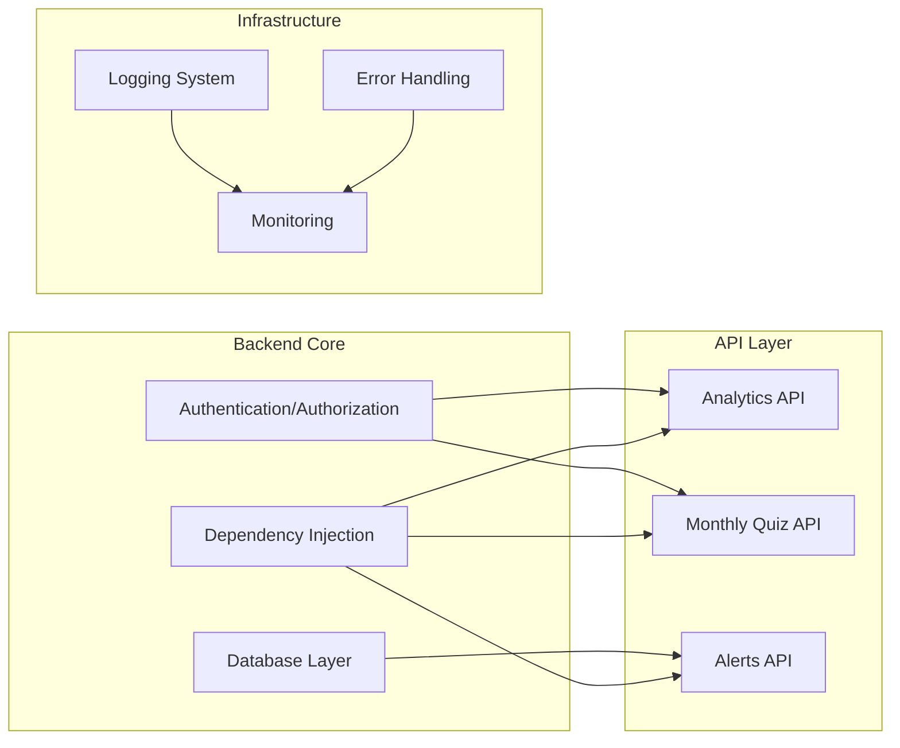

# Design Document - Critical Bug Fixes

## Overview

This document details the design for fixing critical bugs in the Hormonia system that are causing immediate production issues. The fixes are designed to be minimal, safe, and backward-compatible while addressing the root causes of dependency injection failures, role enum mismatches, database schema drift, and other high-priority issues.

## Architecture

### Fix Priority and Dependencies



### Component Impact Analysis



## Components and Interfaces

### 1. Dependency Injection Fix

#### Current Issue
```python
# BROKEN: app/dependencies/service_dependencies.py
class _ThreadSafeProviderDependency:
    def __call__(self) -> Generator:
        return get_thread_safe_service_provider()  # Returns generator object
```

#### Fixed Implementation
```python
# FIXED: app/dependencies/service_dependencies.py
class _ThreadSafeProviderDependency:
    def __call__(self):
        from app.dependencies import get_thread_safe_service_provider
        # Yield the actual provider, not the generator object
        yield from get_thread_safe_service_provider()
```

#### Validation Strategy
```python
# Test to ensure fix works
def test_dependency_injection_fix():
    provider_dep = _ThreadSafeProviderDependency()
    provider = next(provider_dep())
    
    # Should have service attributes, not be a generator
    assert hasattr(provider, 'monthly_quiz_service')
    assert hasattr(provider, 'quiz_service')
    assert not hasattr(provider, '__next__')  # Not a generator
```

### 2. Role Enum Alignment

#### Current Issues and Fixes

```python
# ISSUE 1: app/models/user.py - Limited enum
class UserRole(enum.Enum):
    ADMIN = "admin"
    DOCTOR = "doctor"
    # Missing: SUPER_ADMIN, NURSE, PATIENT, etc.

# ISSUE 2: app/api/v1/analytics.py - References non-existent role
# BROKEN:
allowed_roles = {UserRole.ADMIN, UserRole.SUPER_ADMIN}

# FIXED:
allowed_roles = {UserRole.ADMIN}

# ISSUE 3: app/api/v1/monthly_quiz.py - String comparison
# BROKEN:
if current_user.role == "admin":

# FIXED:
if current_user.role == UserRole.ADMIN:
```

#### Role Validation Utility
```python
# New utility: app/core/role_utils.py
from typing import Set
from app.models.user import UserRole

def validate_user_roles(required_roles: Set[UserRole], user_role: UserRole) -> bool:
    """Validate user role against required roles with proper enum comparison."""
    return user_role in required_roles

def get_admin_roles() -> Set[UserRole]:
    """Get all administrative roles (currently just ADMIN)."""
    return {UserRole.ADMIN}

def is_admin_user(user_role: UserRole) -> bool:
    """Check if user has administrative privileges."""
    return user_role in get_admin_roles()
```

### 3. Alerts Schema Alignment

#### Schema Mismatch Analysis
```sql
-- Current DB Schema (sql/SCHEMA_MASTER_COMPLETO.sql)
CREATE TABLE alerts (
    id UUID PRIMARY KEY,
    patient_id UUID REFERENCES patients(id),
    type VARCHAR(50) NOT NULL,           -- NOT alert_type
    message TEXT NOT NULL,               -- NOT description  
    severity VARCHAR(20) NOT NULL,
    data JSONB,
    acknowledged BOOLEAN DEFAULT FALSE,  -- NOT status enum
    acknowledged_by UUID REFERENCES users(id),
    acknowledged_at TIMESTAMP,
    created_at TIMESTAMP DEFAULT NOW(),
    updated_at TIMESTAMP DEFAULT NOW()
    -- Missing: quiz_session_id, status
);
```

#### Option A: Quick Compatibility Fix (Recommended)
```python
# Modified: app/models/alert.py
from sqlalchemy import Column, String, Text, Boolean, DateTime, UUID, JSON
from sqlalchemy.orm import relationship

class Alert(Base):
    __tablename__ = "alerts"
    
    id = Column(UUID(as_uuid=True), primary_key=True, default=uuid.uuid4)
    patient_id = Column(UUID(as_uuid=True), ForeignKey("patients.id"))
    
    # Map to existing DB columns
    alert_type = Column("type", String(50), nullable=False)  # Map type -> alert_type
    description = Column("message", Text, nullable=False)    # Map message -> description
    severity = Column(String(20), nullable=False)
    data = Column(JSON)
    
    # Map acknowledged boolean to status-like behavior
    acknowledged = Column(Boolean, default=False)
    acknowledged_by = Column(UUID(as_uuid=True), ForeignKey("users.id"))
    acknowledged_at = Column(DateTime)
    
    created_at = Column(DateTime, default=datetime.utcnow)
    updated_at = Column(DateTime, default=datetime.utcnow, onupdate=datetime.utcnow)
    
    # Virtual properties for backward compatibility
    @property
    def status(self) -> str:
        return "acknowledged" if self.acknowledged else "pending"
    
    @status.setter
    def status(self, value: str):
        self.acknowledged = value == "acknowledged"
    
    # Handle quiz_session_id via data JSONB
    @property
    def quiz_session_id(self) -> Optional[UUID]:
        if self.data and "quiz_session_id" in self.data:
            return UUID(self.data["quiz_session_id"])
        return None
    
    @quiz_session_id.setter
    def quiz_session_id(self, value: Optional[UUID]):
        if self.data is None:
            self.data = {}
        if value:
            self.data["quiz_session_id"] = str(value)
        elif "quiz_session_id" in self.data:
            del self.data["quiz_session_id"]
```

#### Repository Updates
```python
# Modified: app/repositories/alert.py
class AlertRepository:
    def get_by_quiz_session(self, quiz_session_id: UUID) -> List[Alert]:
        """Get alerts by quiz session ID stored in data JSONB."""
        return self.db.query(Alert).filter(
            Alert.data.op('->>')('quiz_session_id') == str(quiz_session_id)
        ).all()
    
    def get_by_status(self, status: str) -> List[Alert]:
        """Get alerts by status (maps to acknowledged field)."""
        acknowledged = status == "acknowledged"
        return self.db.query(Alert).filter(Alert.acknowledged == acknowledged).all()
```

### 4. Date Parameter Handling

#### Current Issue
```python
# BROKEN: Pydantic rejects datetime strings for date fields
def get_analytics(start_date: Optional[date], end_date: Optional[date]):
    # Fails when client sends "2025-10-05T15:01:57.695Z"
```

#### Fixed Implementation
```python
# New utility: app/core/date_utils.py
from datetime import datetime, date
from typing import Optional, Union
import re

def coerce_to_date(value: Union[str, date, datetime, None]) -> Optional[date]:
    """Convert various date/datetime formats to date object."""
    if value is None:
        return None
    
    if isinstance(value, date) and not isinstance(value, datetime):
        return value
    
    if isinstance(value, datetime):
        return value.date()
    
    if isinstance(value, str):
        # Handle ISO format with timezone
        iso_pattern = r'(\d{4}-\d{2}-\d{2})T.*'
        match = re.match(iso_pattern, value)
        if match:
            return datetime.fromisoformat(match.group(1)).date()
        
        # Handle simple date format
        try:
            return datetime.fromisoformat(value.replace('Z', '+00:00')).date()
        except ValueError:
            try:
                return datetime.strptime(value, '%Y-%m-%d').date()
            except ValueError:
                raise ValueError(f"Invalid date format: {value}")
    
    raise ValueError(f"Cannot convert {type(value)} to date: {value}")

# Modified endpoints: app/api/v1/analytics.py
from app.core.date_utils import coerce_to_date

@router.get("/engagement-range")
async def get_engagement_range(
    start_date: Optional[str] = None,  # Accept as string
    end_date: Optional[str] = None,    # Accept as string
    current_user: User = Depends(get_current_user)
):
    # Convert to dates with proper error handling
    try:
        start_date_obj = coerce_to_date(start_date)
        end_date_obj = coerce_to_date(end_date)
    except ValueError as e:
        raise HTTPException(status_code=400, detail=f"Invalid date format: {e}")
    
    # Set defaults if needed
    if end_date_obj is None:
        end_date_obj = datetime.utcnow().date()
    if start_date_obj is None:
        start_date_obj = end_date_obj - timedelta(days=6)
```

### 5. Logging Optimization

#### Current Issues
- INFO-level logging for every request
- Repeated stack traces during DI failures
- Railway rate limit of 500 logs/sec exceeded

#### Logging Strategy
```python
# New configuration: app/core/logging_config.py
import logging
from typing import Dict, Any
import time
from collections import defaultdict

class RateLimitedLogger:
    def __init__(self, max_logs_per_second: int = 100):
        self.max_logs_per_second = max_logs_per_second
        self.log_counts: Dict[str, list] = defaultdict(list)
    
    def should_log(self, log_key: str) -> bool:
        """Check if we should log based on rate limiting."""
        now = time.time()
        # Clean old entries (older than 1 second)
        self.log_counts[log_key] = [
            timestamp for timestamp in self.log_counts[log_key] 
            if now - timestamp < 1.0
        ]
        
        if len(self.log_counts[log_key]) < self.max_logs_per_second:
            self.log_counts[log_key].append(now)
            return True
        return False

# Modified middleware logging
class RequestLoggingMiddleware:
    def __init__(self, app):
        self.app = app
        self.rate_limiter = RateLimitedLogger(max_logs_per_second=50)
    
    async def __call__(self, scope, receive, send):
        if scope["type"] == "http":
            # Only log at DEBUG level for routine requests
            log_key = f"request_{scope['path']}"
            if self.rate_limiter.should_log(log_key):
                logger.debug(f"API Request: {scope['method']} {scope['path']}")
        
        return await self.app(scope, receive, send)
```

## Data Models

### Error Tracking Models
```python
# New: app/models/error_tracking.py
from sqlalchemy import Column, String, Text, Integer, DateTime, JSON
from app.database.base import Base

class ErrorLog(Base):
    __tablename__ = "error_logs"
    
    id = Column(UUID(as_uuid=True), primary_key=True, default=uuid.uuid4)
    error_type = Column(String(100), nullable=False)  # "DI_GENERATOR", "ROLE_ENUM", etc.
    error_message = Column(Text, nullable=False)
    stack_trace = Column(Text)
    context = Column(JSON)  # Additional context data
    count = Column(Integer, default=1)  # For deduplication
    first_seen = Column(DateTime, default=datetime.utcnow)
    last_seen = Column(DateTime, default=datetime.utcnow)
    resolved = Column(Boolean, default=False)
```

### Configuration Models
```python
# Enhanced: app/core/config.py
class Settings(BaseSettings):
    # Existing settings...
    
    # New logging settings
    log_level: str = "INFO"
    max_logs_per_second: int = 100
    enable_request_logging: bool = True
    log_stack_traces: bool = True
    
    # Error handling settings
    enable_error_tracking: bool = True
    max_error_logs: int = 1000
    error_deduplication_window: int = 3600  # seconds
```

## Error Handling

### Centralized Error Handler
```python
# New: app/core/error_handler.py
from typing import Optional, Dict, Any
import traceback
import logging
from app.models.error_tracking import ErrorLog
from app.database.session import get_db

class CriticalErrorHandler:
    def __init__(self):
        self.logger = logging.getLogger(__name__)
        self.error_counts: Dict[str, int] = {}
    
    async def handle_di_error(self, error: Exception, context: Dict[str, Any]):
        """Handle dependency injection errors with fallback."""
        error_key = "DI_GENERATOR_ERROR"
        
        # Log with rate limiting
        if self.should_log_error(error_key):
            self.logger.error(f"DI Error: {error}", extra={"context": context})
            await self.track_error(error_key, str(error), context)
        
        # Provide fallback or re-raise with better message
        raise HTTPException(
            status_code=500,
            detail="Service temporarily unavailable. Please try again."
        )
    
    async def handle_role_error(self, error: AttributeError, user_role: str):
        """Handle role enum errors with secure fallback."""
        error_key = "ROLE_ENUM_ERROR"
        
        if self.should_log_error(error_key):
            self.logger.error(f"Role Error: {error}", extra={"role": user_role})
            await self.track_error(error_key, str(error), {"role": user_role})
        
        # Secure fallback: deny access
        raise HTTPException(
            status_code=403,
            detail="Access denied. Invalid role configuration."
        )
    
    def should_log_error(self, error_key: str, max_per_hour: int = 10) -> bool:
        """Rate limit error logging to prevent spam."""
        current_count = self.error_counts.get(error_key, 0)
        if current_count < max_per_hour:
            self.error_counts[error_key] = current_count + 1
            return True
        return False
    
    async def track_error(self, error_type: str, message: str, context: Dict[str, Any]):
        """Track error in database for monitoring."""
        try:
            db = next(get_db())
            # Check for existing error (deduplication)
            existing = db.query(ErrorLog).filter(
                ErrorLog.error_type == error_type,
                ErrorLog.error_message == message
            ).first()
            
            if existing:
                existing.count += 1
                existing.last_seen = datetime.utcnow()
            else:
                error_log = ErrorLog(
                    error_type=error_type,
                    error_message=message,
                    context=context,
                    stack_trace=traceback.format_exc()
                )
                db.add(error_log)
            
            db.commit()
        except Exception as e:
            self.logger.error(f"Failed to track error: {e}")
```

## Testing Strategy

### Unit Tests for Each Fix
```python
# tests/test_critical_fixes.py
import pytest
from app.dependencies.service_dependencies import _ThreadSafeProviderDependency
from app.models.user import UserRole
from app.core.date_utils import coerce_to_date
from app.core.error_handler import CriticalErrorHandler

class TestDependencyInjectionFix:
    def test_di_returns_provider_not_generator(self):
        """Test that DI returns actual provider, not generator object."""
        provider_dep = _ThreadSafeProviderDependency()
        provider = next(provider_dep())
        
        assert hasattr(provider, 'monthly_quiz_service')
        assert not hasattr(provider, '__next__')

class TestRoleEnumFix:
    def test_role_comparison_with_enum(self):
        """Test proper enum comparison instead of string."""
        user_role = UserRole.ADMIN
        assert user_role == UserRole.ADMIN
        assert user_role != "admin"  # Should not equal string

class TestDateParameterFix:
    @pytest.mark.parametrize("input_date,expected", [
        ("2025-10-05T15:01:57.695Z", "2025-10-05"),
        ("2025-10-05", "2025-10-05"),
        (None, None),
    ])
    def test_date_coercion(self, input_date, expected):
        """Test date parameter coercion from various formats."""
        result = coerce_to_date(input_date)
        if expected:
            assert result.isoformat() == expected
        else:
            assert result is None
```

### Integration Tests
```python
# tests/integration/test_critical_fixes_integration.py
import pytest
from fastapi.testclient import TestClient
from app.main import app

class TestCriticalFixesIntegration:
    def test_analytics_endpoint_with_datetime_params(self):
        """Test analytics endpoint accepts datetime strings."""
        client = TestClient(app)
        response = client.get(
            "/api/v1/analytics/engagement-range",
            params={
                "start_date": "2025-10-05T15:01:57.695Z",
                "end_date": "2025-10-12T15:01:57.695Z"
            },
            headers={"Authorization": "Bearer valid_token"}
        )
        assert response.status_code != 422  # Should not be validation error
    
    def test_monthly_quiz_role_check(self):
        """Test monthly quiz endpoints use proper role comparison."""
        client = TestClient(app)
        # Test with admin user
        response = client.get(
            "/api/v1/monthly-quiz/dashboard-stats",
            headers={"Authorization": "Bearer admin_token"}
        )
        assert response.status_code != 500  # Should not be AttributeError
```

## Implementation Phases

### Phase 1: Critical Blockers (Immediate)
1. Fix dependency injection generator issue
2. Fix role enum references in analytics
3. Fix monthly quiz role comparison

### Phase 2: Schema and Validation (Next)
1. Implement alerts schema compatibility
2. Fix date parameter handling
3. Add error handling for edge cases

### Phase 3: Optimization and Monitoring (Follow-up)
1. Implement logging rate limiting
2. Add error tracking and monitoring
3. Create regression prevention tests

### Phase 4: Long-term Improvements (Future)
1. Consider alerts schema migration
2. Implement comprehensive role system
3. Add performance monitoring

## Security Considerations

### Secure Error Handling
- Never expose internal errors to API consumers
- Log security-relevant errors for monitoring
- Implement secure fallbacks (deny access when in doubt)

### Role-Based Access Control
- Default to most restrictive access when role checks fail
- Audit all role-based decisions
- Implement proper enum-based role checking

### Data Protection
- Sanitize error logs to remove sensitive data
- Implement proper database column mapping
- Validate all date inputs to prevent injection

## Performance Optimization

### Logging Performance
- Implement rate limiting to prevent log flooding
- Use structured logging for better parsing
- Sample repetitive errors instead of logging all occurrences

### Database Performance
- Use proper column mapping to avoid unnecessary queries
- Implement efficient JSONB queries for quiz_session_id
- Add indexes for frequently queried alert fields

### Memory Management
- Avoid storing large error contexts in memory
- Implement error log rotation and cleanup
- Use efficient data structures for rate limiting