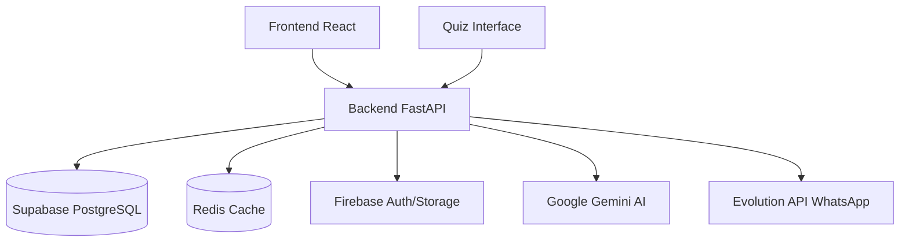

# Próximos Passos - Documentação

**Data**: 2025-10-02
**Prioridade**: Recomendações pós-refatoração

## 🎯 Ações Imediatas (Alta Prioridade)

### 1. Atualizar Links Internos
**Estimativa**: 1-2 horas
**Impacto**: Alto

Muitos documentos ainda referenciam caminhos antigos. Necessário atualizar:

```bash
# Buscar referências aos arquivos movidos
cd "c:\Meu Projetos\clinica-oncologica-v02"

# Exemplos de buscas necessárias:
grep -r "BANCO_DE_DADOS_COMPLETO.md" --include="*.md" --include="*.py" --include="*.ts"
grep -r "TESTES_RLS_API_GUIA.md" --include="*.md"
grep -r "REDIS_USAGE_GUIDE.md" --include="*.md" --include="*.py"

# Atualizar para novos caminhos:
# BANCO_DE_DADOS_COMPLETO.md → backend-hormonia/docs/db/BANCO_DE_DADOS_COMPLETO.md
# TESTES_RLS_API_GUIA.md → backend-hormonia/docs/security/rls/TESTES_RLS_API_GUIA.md
```

**Arquivos que provavelmente precisam de update**:
- `backend-hormonia/docs/MIGRATION_QUICK_REFERENCE.md`
- `backend-hormonia/docs/QUIZ_PUBLIC_API_INDEX.md`
- Qualquer doc em `deployment/` que referencie DB ou Redis

### 2. Testar CI Workflow
**Estimativa**: 30 minutos
**Impacto**: Alto

```bash
# 1. Criar branch de teste
git checkout -b test/docs-ci

# 2. Fazer pequena alteração em qualquer .md
echo "# Test" >> backend-hormonia/docs/README.md

# 3. Commit e push
git add .
git commit -m "test: validate docs CI workflow"
git push origin test/docs-ci

# 4. Abrir PR e verificar:
# - ✅ Markdown lint passa
# - ✅ Link check passa
# - ✅ Structure check passa
# - ⚠️  Spelling pode ter warnings (ok)

# 5. Corrigir qualquer erro encontrado
```

### 3. Corrigir Links Quebrados
**Estimativa**: 1 hora
**Impacto**: Médio

Após testar CI, o link checker pode reportar links quebrados. Priorizar:

1. Links internos (dentro do repo)
2. Links de documentação externa crítica
3. Links para APIs/serviços (Supabase, Firebase, etc)

## 📚 Melhorias de Médio Prazo (Média Prioridade)

### 4. Consolidar Docs de Deployment
**Estimativa**: 2-3 horas
**Impacto**: Médio

Atualmente temos múltiplos arquivos de deployment:
- `backend-hormonia/docs/deployment/DEPLOYMENT.md`
- `backend-hormonia/docs/deployment/ENVIRONMENT_VARIABLES.md`
- `backend-hormonia/docs/deployment/MIGRATIONS_GUIDE.md`
- `frontend-hormonia/docs/deployment/DEPLOYMENT_GUIDE.md`
- `quiz-mensal-interface/docs/deployment/DEPLOYMENT_GUIDE.md`

**Ação**:
- Criar guia master de deployment no root
- Referenciar guias específicos de cada serviço
- Adicionar diagrama de arquitetura de deployment

### 5. Adicionar Diagramas
**Estimativa**: 3-4 horas
**Impacto**: Alto (para onboarding)

Criar diagramas usando Mermaid (suportado no GitHub):

```markdown
# Exemplo: Diagrama de Arquitetura

```

**Diagramas recomendados**:
1. Arquitetura geral do sistema
2. Fluxo de autenticação (Firebase + Supabase)
3. RLS policies por role
4. Pipeline de deployment
5. Fluxo de quiz (patient → link → response)

### 6. Review de Docs Arquivados
**Estimativa**: 2 horas
**Impacto**: Baixo

Revisar `incidents/_archive/` e:
- Extrair aprendizados importantes
- Criar "Lessons Learned" doc
- Deletar relatórios obsoletos (após 6+ meses)

## 🚀 Melhorias de Longo Prazo (Baixa Prioridade)

### 7. Migrar para MkDocs (Opcional)
**Estimativa**: 1 dia
**Impacto**: Alto (UX de docs)

**Benefícios**:
- Site de docs navegável
- Busca integrada
- Versioning de docs
- Melhor UX para novos desenvolvedores

**Passos**:
```bash
# 1. Install
pip install mkdocs mkdocs-material

# 2. Init
mkdocs new .

# 3. Configurar mkdocs.yml
# 4. Migrar estrutura atual
# 5. Deploy em GitHub Pages
```

### 8. Adicionar ADRs (Architecture Decision Records)
**Estimativa**: Ongoing
**Impacto**: Médio (histórico de decisões)

Criar `docs/adr/` para documentar decisões arquiteturais:
- Por que Supabase + Firebase (dual-auth)?
- Por que RLS via middleware em vez de só no DB?
- Por que Redis dual-client?
- Por que FastAPI em vez de Django?

**Template ADR**:
```markdown
# ADR-001: Título da Decisão

**Status**: Accepted | Proposed | Deprecated
**Data**: YYYY-MM-DD
**Decisores**: [Nome, Nome]

## Context
[Contexto e problema]

## Decision
[Decisão tomada]

## Consequences
[Consequências positivas e negativas]

## Alternatives Considered
[Alternativas consideradas]
```

### 9. Internacionalização de Docs (i18n)
**Estimativa**: 2-3 dias
**Impacto**: Baixo (se não houver necessidade internacional)

Se o sistema for usado internacionalmente:
- Traduzir docs chave para EN
- Estrutura: `docs/en/`, `docs/pt-br/`
- Manter PT-BR como canônico

### 10. API Docs Auto-geração
**Estimativa**: 4 horas
**Impacto**: Alto (manutenibilidade)

Automatizar geração de API docs:
```python
# backend-hormonia/scripts/generate_api_docs.py
from app.main import app
import json

# Export OpenAPI spec
with open("docs/api/openapi.json", "w") as f:
    json.dump(app.openapi(), f, indent=2)

# Generate markdown from spec
# Use redoc-cli ou openapi-generator
```

**Integrar no CI**:
- Toda mudança em routers → regenera docs
- Commit automático se houver diff
- Evita docs de API desatualizados

## ✅ Checklist de Priorização

### Fazer Agora (Semana 1)
- [ ] Atualizar links internos
- [ ] Testar CI workflow
- [ ] Corrigir links quebrados
- [ ] Commit e PR da refatoração

### Fazer Este Mês
- [ ] Consolidar docs de deployment
- [ ] Adicionar diagramas principais
- [ ] Review de arquivados (extrair learnings)
- [ ] Começar ADRs para decisões recentes

### Considerar Depois
- [ ] Avaliar necessidade de MkDocs
- [ ] Avaliar necessidade de i18n
- [ ] Setup de auto-geração de API docs
- [ ] Estabelecer processo de review de docs (junto com code review)

## 🎯 Objetivos de Qualidade

### Métricas de Sucesso (3 meses)
- [ ] 100% dos links internos válidos
- [ ] CI de docs passa em todos os PRs
- [ ] Tempo médio de onboarding < 2 horas (via docs)
- [ ] Zero issues reportadas sobre docs desatualizados
- [ ] Diagrama de arquitetura atualizado mensalmente

### Processo Contínuo
1. **Toda feature nova** → doc atualizado no mesmo PR
2. **Toda breaking change** → migration guide atualizado
3. **Review trimestral** → docs arquivados, links validados
4. **ADR para decisões** → contexto preservado

## 📞 Suporte

Em caso de dúvidas sobre:
- **Estrutura**: Ver [DOCS_REFACTOR_PLAN.md](DOCS_REFACTOR_PLAN.md)
- **Resumo**: Ver [DOCS_REFACTOR_SUMMARY.md](DOCS_REFACTOR_SUMMARY.md)
- **Navegação**: Começar por [README.md](README.md)

---

**Próximos Passos Definidos**: 2025-10-02
**Responsável**: Time de Desenvolvimento
**Review**: Mensal
