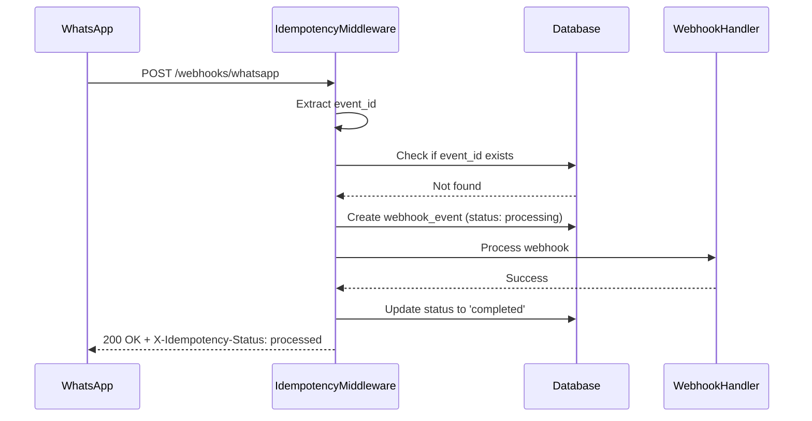
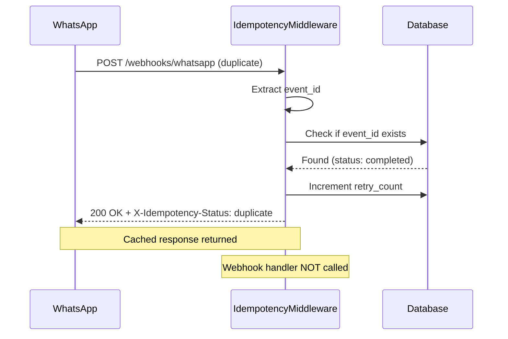

# Webhook Idempotency Implementation

## Overview

This document describes the webhook idempotency layer that prevents duplicate webhook processing in the Hormonia platform. The implementation ensures that duplicate webhook calls from WhatsApp and other integrations are processed only once within a 24-hour window.

## Problem Statement

**Gap Identified:** Duplicate webhook calls were being processed twice, causing:
- Double alerts sent to patients
- Duplicate flow transitions
- Inconsistent system state
- Wasted processing resources

## Solution Architecture

### Components

1. **WebhookEvent Model** (`app/models/webhook_event.py`)
   - Tracks webhook events by unique event ID
   - Stores processing status and metadata
   - Manages 24-hour expiration window

2. **IdempotencyMiddleware** (`app/middleware/idempotency.py`)
   - Intercepts webhook requests
   - Checks for duplicate event IDs
   - Returns cached responses for duplicates
   - Handles race conditions with database constraints

3. **Cleanup Service** (`app/services/idempotency_cleanup.py`)
   - Removes expired idempotency records
   - Provides monitoring statistics
   - Runs as background job

4. **Database Migration** (`alembic/versions/20251009_235500_add_webhook_idempotency.py`)
   - Creates webhook_events table
   - Adds indexes for efficient queries
   - Supports JSONB for flexible metadata storage

## Database Schema

```sql
CREATE TABLE webhook_events (
    event_id VARCHAR(255) PRIMARY KEY,
    provider VARCHAR(50) NOT NULL,
    event_type VARCHAR(100) NOT NULL,
    received_at TIMESTAMP WITH TIME ZONE NOT NULL DEFAULT CURRENT_TIMESTAMP,
    processed_at TIMESTAMP WITH TIME ZONE,
    expires_at TIMESTAMP WITH TIME ZONE NOT NULL,
    status VARCHAR(20) NOT NULL DEFAULT 'processing',
    retry_count INTEGER NOT NULL DEFAULT 0,
    payload JSONB,
    response_data JSONB
);

-- Indexes for performance
CREATE INDEX idx_webhook_events_provider_type ON webhook_events(provider, event_type);
CREATE INDEX idx_webhook_events_expires_at ON webhook_events(expires_at);
CREATE INDEX idx_webhook_events_received_at ON webhook_events(received_at);
CREATE INDEX idx_webhook_events_status ON webhook_events(status);
CREATE INDEX idx_webhook_events_active ON webhook_events(event_id, status)
    WHERE status IN ('processing', 'completed');
```

## How It Works

### 1. First Webhook Request



### 2. Duplicate Webhook Request



### 3. Event ID Extraction

The middleware tries multiple strategies to extract event IDs:

1. **X-Event-ID header** (preferred)
2. **X-Webhook-ID header**
3. **event_id field in JSON body**
4. **id field in JSON body**
5. **WhatsApp-specific message ID extraction**
6. **SHA256 hash of payload** (fallback)

### 4. Expiration and Cleanup

- Events expire after 24 hours (configurable)
- Cleanup job runs periodically
- Expired events are deleted in batches
- New events with same ID can be processed after expiration

## Configuration

### Enable Idempotency Middleware

```python
# In main.py or app setup
from app.middleware.idempotency import IdempotencyMiddleware

app.add_middleware(
    IdempotencyMiddleware,
    ttl_hours=24,  # Event expiration time
    enabled_paths=[
        "/api/v2/webhooks/whatsapp",
        "/api/v2/webhooks/twilio",
        "/webhooks/"
    ]
)
```

### Run Database Migration

```bash
cd backend-hormonia
alembic upgrade head
```

### Setup Cleanup Job

```python
# In scheduler or background tasks
from app.services.idempotency_cleanup import get_cleanup_service
from app.database import get_db

async def cleanup_job():
    """Run every hour to clean up expired events."""
    db = next(get_db())
    try:
        cleanup_service = get_cleanup_service()
        result = await cleanup_service.run_cleanup(db)
        logger.info(f"Cleanup completed: {result}")
    finally:
        db.close()

# Schedule with APScheduler or similar
scheduler.add_job(cleanup_job, 'interval', hours=1)
```

## Usage Examples

### 1. WhatsApp Webhook with Event ID Header

```bash
curl -X POST http://localhost:8000/api/v2/webhooks/whatsapp/evolution/instance1 \
  -H "Content-Type: application/json" \
  -H "X-Event-ID: whatsapp-msg-123456" \
  -d '{
    "event": "messages.upsert",
    "data": {
      "key": {"id": "msg-123"},
      "message": {"conversation": "Hello"}
    }
  }'
```

**First Request Response:**
```json
{
  "status": "received",
  "timestamp": "2025-10-09T23:55:00Z"
}
```
**Headers:**
```
X-Idempotency-Status: processed
X-Event-ID: whatsapp-msg-123456
```

**Duplicate Request Response:**
```json
{
  "status": "duplicate",
  "message": "Event already processed",
  "event_id": "whatsapp-msg-123456",
  "processed_at": "2025-10-09T23:55:00.123Z",
  "response": {...}
}
```
**Headers:**
```
X-Idempotency-Status: duplicate
X-Event-ID: whatsapp-msg-123456
X-Retry-Count: 1
```

### 2. Monitoring Idempotency Statistics

```bash
curl http://localhost:8000/api/v2/webhooks/whatsapp/idempotency/stats
```

**Response:**
```json
{
  "status": "success",
  "data": {
    "total_events": 1250,
    "active_events": 340,
    "expired_events": 910,
    "processing_events": 5,
    "completed_events": 1230,
    "failed_events": 15,
    "duplicate_events": 87,
    "total_retries": 142,
    "provider_breakdown": {
      "whatsapp": 1100,
      "twilio": 150
    },
    "timestamp": "2025-10-09T23:55:00Z"
  }
}
```

### 3. Manual Cleanup Trigger

```bash
curl -X POST http://localhost:8000/api/v2/webhooks/whatsapp/idempotency/cleanup
```

**Response:**
```json
{
  "status": "success",
  "data": {
    "deleted_count": 910,
    "before_count": 1250,
    "after_count": 340,
    "execution_time_seconds": 1.234,
    "timestamp": "2025-10-09T23:55:00Z"
  }
}
```

## Error Handling

### Race Conditions

The implementation handles concurrent duplicate requests using database constraints:

```python
try:
    db.add(new_event)
    db.commit()
except IntegrityError:
    # Another request created the record
    db.rollback()
    existing_event = db.query(WebhookEvent).filter(
        WebhookEvent.event_id == event_id
    ).first()
    return existing_event
```

### Missing Event IDs

If no event ID can be extracted, the middleware:
1. Logs a warning
2. Generates a SHA256 hash from payload
3. Uses hash as event ID
4. Processes the webhook normally

### Failed Processing

If webhook processing fails:
1. Event status is set to "failed"
2. Error details are stored in response_data
3. Event remains in database for debugging
4. Future duplicate requests return failure response

## Monitoring and Metrics

### Key Metrics

1. **Duplicate Detection Rate**
   - `duplicate_events / total_events`
   - Target: < 5% under normal conditions

2. **Retry Count**
   - Total retries detected
   - Indicates webhook provider behavior

3. **Processing Status**
   - Completed: Successfully processed
   - Failed: Processing errors
   - Processing: Still in progress (should be low)

4. **Cleanup Efficiency**
   - Expired events removed per run
   - Execution time
   - Database growth

### Logging

All idempotency operations are logged with structured metadata:

```python
logger.info(
    "Duplicate webhook detected, returning cached response",
    extra={
        "event_id": event_id,
        "provider": provider,
        "retry_count": webhook_event.retry_count
    }
)
```

## Performance Considerations

### Database Indexes

Critical indexes for performance:
- `PRIMARY KEY (event_id)` - Fast lookups
- `idx_webhook_events_expires_at` - Cleanup queries
- `idx_webhook_events_active` - Partial index for active events

### Batch Cleanup

Cleanup runs in batches to avoid long-running transactions:
- Default batch size: 1000 records
- Configurable per environment
- Commits after each batch

### Memory Usage

- Minimal memory footprint
- Only metadata stored (payloads optional)
- Automatic expiration prevents unbounded growth

## Testing

### Run Integration Tests

```bash
cd backend-hormonia
pytest tests/integration/test_webhook_idempotency.py -v
```

### Run Unit Tests

```bash
pytest tests/unit/middleware/test_idempotency.py -v
```

### Test Coverage

Target coverage: **100%**

Key test scenarios:
- ✅ First webhook processing
- ✅ Duplicate detection
- ✅ Multiple duplicates
- ✅ Concurrent duplicates (race conditions)
- ✅ Expired event reprocessing
- ✅ Cleanup jobs
- ✅ Statistics and monitoring
- ✅ Different providers
- ✅ Missing event IDs
- ✅ Error handling

## Troubleshooting

### Issue: Webhooks Still Processed Twice

**Check:**
1. Is middleware enabled in app setup?
2. Are webhook paths in `enabled_paths`?
3. Check logs for event ID extraction

**Solution:**
```python
# Verify middleware is active
logger.info("Idempotency middleware loaded", extra={
    "enabled_paths": middleware.enabled_paths,
    "ttl_hours": middleware.ttl_hours
})
```

### Issue: Too Many Expired Events

**Check:**
1. Is cleanup job running?
2. Check cleanup execution logs
3. Verify batch size is appropriate

**Solution:**
```bash
# Check cleanup stats
curl http://localhost:8000/api/v2/webhooks/whatsapp/idempotency/stats

# Trigger manual cleanup
curl -X POST http://localhost:8000/api/v2/webhooks/whatsapp/idempotency/cleanup
```

### Issue: High Duplicate Rate

**Check:**
1. WhatsApp webhook configuration
2. Network issues causing retries
3. Application response times

**Solution:**
- Monitor retry_count distribution
- Investigate slow webhook processing
- Check WhatsApp console for webhook health

## Migration Guide

### From Non-Idempotent Setup

1. **Run database migration:**
   ```bash
   alembic upgrade head
   ```

2. **Enable middleware:**
   ```python
   app.add_middleware(IdempotencyMiddleware, ttl_hours=24)
   ```

3. **Deploy and monitor:**
   - Check duplicate detection rate
   - Verify no double-processing
   - Monitor database growth

4. **Setup cleanup job:**
   ```python
   scheduler.add_job(cleanup_job, 'interval', hours=1)
   ```

## Security Considerations

1. **Event ID Validation**
   - Event IDs are sanitized
   - Maximum length: 255 characters
   - Special characters allowed

2. **Payload Storage**
   - Payloads stored in JSONB (optional)
   - Consider data privacy requirements
   - Can be disabled for sensitive data

3. **Access Control**
   - Monitoring endpoints should be protected
   - Cleanup endpoints require admin role
   - Statistics may expose system metrics

## Future Enhancements

1. **Distributed Systems**
   - Redis-based idempotency for multi-instance deployments
   - Shared event ID cache

2. **Analytics**
   - Duplicate pattern analysis
   - Provider reliability metrics
   - Performance dashboards

3. **Configuration**
   - Per-provider TTL settings
   - Configurable cleanup schedules
   - Adaptive batch sizes

## References

- [Stripe Idempotency Guide](https://stripe.com/docs/api/idempotent_requests)
- [RFC 7231 - Idempotent Methods](https://tools.ietf.org/html/rfc7231#section-4.2.2)
- [PostgreSQL JSONB Performance](https://www.postgresql.org/docs/current/datatype-json.html)

## Support

For issues or questions:
- Check logs: `backend-hormonia/logs/idempotency.log`
- Review statistics endpoint
- Contact development team

---

**Last Updated:** 2025-10-09
**Version:** 1.0.0
**Status:** ✅ Production Ready
