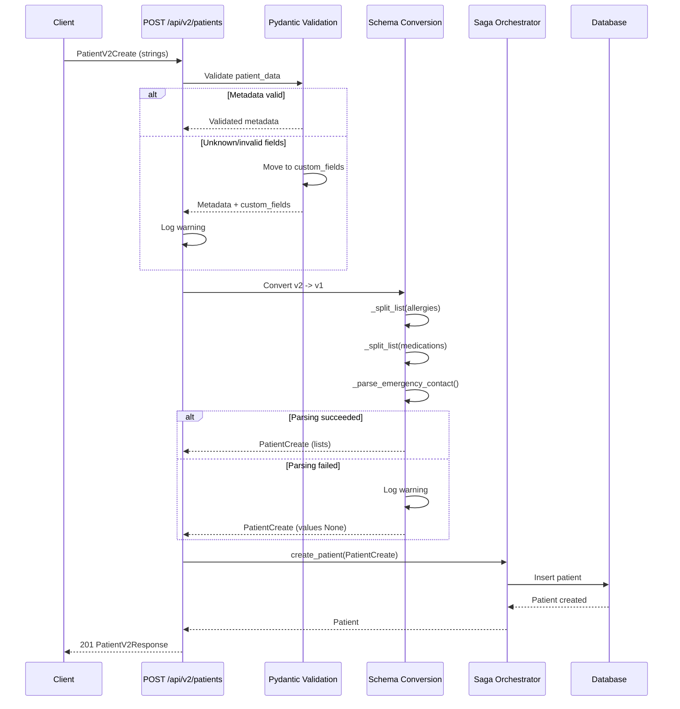

# Patient Metadata Validation and Schema Conversion (v2)

This document describes how v2 patient payloads validate metadata (patient_data)
and how clinical fields are converted to v1-friendly structures.

## Metadata structure

Allowed top-level keys and expected types:

- preferences: object
- medical_history: object
- blood_type: string (A+, A-, B+, B-, AB+, AB-, O+, O-)
- emergency_contact: object
- insurance: object
- onboarding: object
- custom_fields: object (free-form)
- doctor_name: string
- system: object

Behavior:

- Unknown top-level keys are moved to custom_fields automatically.
- Invalid types or values are moved to custom_fields and a warning is logged.
- Metadata is validated with Pydantic (PatientMetadataV2) before being passed
  to the v1 schema validator (jsonb_validator).

## Schema conversion (v2 -> v1)

Clinical fields accepted as strings:

- allergies: comma, semicolon, or newline-delimited string
  - "Penicilina, Dipirona"
  - "Penicilina; Dipirona"
- medications: same rules as allergies
  - "Levotiroxina 100mcg, Metformina 500mg"
- emergency_contact: "Name - Phone", "Name: Phone", or "Name | Phone"
  - "Maria Silva - (11) 99999-9999"
  - "Maria Silva: 11999999999"

Parsing rules:

- Separators: comma, semicolon, newline. Empty items are ignored.
- Slash (/) splits only when the item has no digits.
  - "A/B" -> ["A", "B"]
  - "Med 500mg/dia" -> ["Med 500mg/dia"]
- emergency_contact phone is normalized to E.164.
- If parsing fails, the value is ignored and a warning is logged.

## Logging and observability

Warnings are emitted when:

- A metadata key is moved to custom_fields due to unknown key.
- A metadata key is moved to custom_fields due to type/value mismatch.
- A clinical field cannot be parsed into the expected structure.

Log structure (extra fields):

- field: the logical field path (e.g., patient_data.preferences)
- original_value: the raw input
- parsed_value: the resulting value or target bucket
- error: optional error description

## Examples

Valid request:

```json
{
  "name": "Joao Silva",
  "phone": "(11) 99999-9999",
  "doctor_id": "123e4567-e89b-12d3-a456-426614174000",
  "allergies": "Penicilina, Dipirona",
  "medications": "Levotiroxina 100mcg, Metformina 500mg",
  "emergency_contact": "Maria Silva - (11) 99999-9999",
  "patient_data": {
    "preferences": {"communication_channel": "whatsapp"},
    "insurance": {"provider": "Unimed"},
    "doctor_name": "Dr. Test",
    "system": {"source": "api"}
  }
}
```

Request with invalid metadata:

```json
{
  "name": "Joao Silva",
  "phone": "(11) 99999-9999",
  "doctor_id": "123e4567-e89b-12d3-a456-426614174000",
  "patient_data": {
    "unknown_key": "value",
    "preferences": "sms"
  }
}
```

Resulting stored patient_data (simplified):

```json
{
  "custom_fields": {
    "unknown_key": "value",
    "preferences": "sms"
  }
}
```

## Flow diagram


