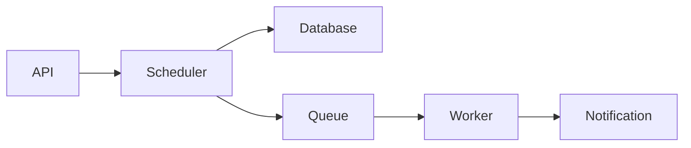

# ADR-0007: SPARC Methodology for Development

## Status

Accepted

Date: 2024-01-21

## Context

The Clínica Hormonia project faces typical software development challenges:
- **Code quality**: Ensuring maintainable, well-documented code
- **Architecture consistency**: Maintaining clean architecture principles
- **Test coverage**: Achieving comprehensive test coverage (target 80%+)
- **Development velocity**: Balancing speed with quality
- **Technical debt**: Preventing accumulation of shortcuts
- **Team coordination**: Multiple developers need consistent workflow
- **AI assistance**: Leveraging Claude AI effectively

We need a systematic development methodology that:
- Enforces specification-first thinking
- Integrates testing from the start
- Maintains architectural integrity
- Works well with AI-assisted development
- Scales across team members

## Decision

We will adopt **SPARC (Specification, Pseudocode, Architecture, Refinement, Completion)** as our standard development methodology, integrated with Claude-Flow orchestration.

SPARC workflow:
1. **Specification**: Define requirements and acceptance criteria
2. **Pseudocode**: Design algorithms and logic flow
3. **Architecture**: Design system structure and components
4. **Refinement**: Implement with TDD (test-driven development)
5. **Completion**: Integration, documentation, and deployment

Integration with development:
- All features must go through SPARC phases
- Claude Code assists in each phase
- Automated validation at each stage
- Phase artifacts stored in version control
- Metrics tracked for continuous improvement

## Consequences

### Positive Consequences

- **Clarity**: Requirements clear before coding starts
- **Quality**: Test-first approach ensures correctness
- **Documentation**: Specs and pseudocode serve as documentation
- **Architecture**: Systematic design prevents technical debt
- **AI efficiency**: Claude AI works better with structured inputs
- **Onboarding**: New developers understand rationale
- **Predictability**: Consistent development velocity
- **Maintenance**: Well-documented code easier to maintain

### Negative Consequences

- **Upfront time**: Initial phases take time before coding
- **Process overhead**: May feel bureaucratic for small changes
- **Learning curve**: Team needs training on SPARC
- **Discipline required**: Easy to skip steps under pressure
- **Documentation burden**: Need to maintain phase artifacts

### Risks

- **Process fatigue**: Developers may resist formal process
- **Over-specification**: Risk of analysis paralysis
- **Outdated docs**: Phase artifacts can become stale
- **Flexibility loss**: Hard to pivot during implementation
- **Tool dependency**: Relies on Claude-Flow tooling

## Alternatives Considered

### Alternative 1: Traditional Agile/Scrum

**Description**: Standard agile with user stories and sprints

**Pros**:
- Team familiar with agile
- Flexible and adaptive
- Industry standard
- Good for iterative development

**Cons**:
- Less structured upfront design
- Weak architecture enforcement
- Testing often afterthought
- Documentation often neglected
- Not optimized for AI assistance

**Why rejected**: Lacks structured design phase and AI integration

### Alternative 2: Waterfall

**Description**: Sequential phases with full upfront design

**Pros**:
- Comprehensive planning
- Clear phases
- Extensive documentation

**Cons**:
- Too rigid for startup
- Slow feedback loops
- Hard to adapt to changes
- Outdated methodology
- Poor fit for modern development

**Why rejected**: Too rigid and slow for our needs

### Alternative 3: Extreme Programming (XP)

**Description**: Engineering practices focused on code quality

**Pros**:
- Strong testing culture
- Pair programming
- Continuous integration
- Refactoring emphasis

**Cons**:
- Weak on architecture
- Less formal specification
- No pseudocode phase
- Not AI-optimized

**Why rejected**: Lacks structured design and AI integration

### Alternative 4: No Formal Methodology

**Description**: Developers choose their own approach

**Pros**:
- Maximum flexibility
- No process overhead
- Fast for experienced developers

**Cons**:
- Inconsistent quality
- Knowledge silos
- Technical debt accumulation
- Hard to onboard new developers
- No architecture governance

**Why rejected**: Too risky for healthcare software with compliance requirements

## Implementation Notes

### SPARC Phase Structure

```bash
# Phase 1: Specification
npx claude-flow sparc run spec-pseudocode "Feature: Monthly quiz scheduling"
# Output: docs/specs/monthly-quiz-scheduling.md

# Phase 2: Pseudocode (combined with spec)
# Output: Algorithm design in specification

# Phase 3: Architecture
npx claude-flow sparc run architect "Feature: Monthly quiz scheduling"
# Output: docs/architecture/monthly-quiz-system.md

# Phase 4: Refinement (TDD)
npx claude-flow sparc tdd "Feature: Monthly quiz scheduling"
# Output: tests/ and src/ with full implementation

# Phase 5: Completion
npx claude-flow sparc run integration "Feature: Monthly quiz scheduling"
# Output: Integration tests, documentation, deployment config
```

### Specification Template

```markdown
# Feature Specification: [Feature Name]

## Overview
[Brief description of the feature]

## Requirements
### Functional Requirements
- REQ-001: [Description]
- REQ-002: [Description]

### Non-Functional Requirements
- NFR-001: Performance - [metric]
- NFR-002: Security - [requirement]

## User Stories
As a [role], I want [feature] so that [benefit]

## Acceptance Criteria
Given [context]
When [action]
Then [expected result]

## Technical Constraints
- [Constraint 1]
- [Constraint 2]

## Dependencies
- [Dependency 1]
- [Dependency 2]

## Risks
- [Risk 1]: [Mitigation]
- [Risk 2]: [Mitigation]
```

### Pseudocode Template

```markdown
## Algorithm Design

### Data Structures
```python
class MonthlyQuizSchedule:
    - quiz_template_id: UUID
    - scheduled_date: DateTime
    - target_patients: List[UUID]
    - status: ScheduleStatus
```

### Key Algorithms

#### Schedule Monthly Quiz
```
function scheduleMonthlyQuiz(template_id, target_date):
    1. Validate template exists
    2. Check for conflicting schedules
    3. Query target patients based on criteria
    4. Create schedule record
    5. Queue notification tasks
    6. Return schedule confirmation
```

### Architecture Template

```markdown
## System Architecture

### Components
1. **QuizScheduler Service**
   - Responsibility: Manage quiz schedules
   - Interfaces: REST API, Celery tasks
   - Dependencies: Database, Redis, Celery

2. **NotificationService**
   - Responsibility: Send notifications
   - Interfaces: Email, WhatsApp
   - Dependencies: Evolution API, SMTP

### Data Flow


### TDD Workflow

```python
# 1. Write failing test
def test_schedule_monthly_quiz():
    schedule = schedule_monthly_quiz(
        template_id="uuid",
        target_date=datetime(2024, 2, 1)
    )
    assert schedule.status == ScheduleStatus.PENDING
    assert len(schedule.target_patients) > 0

# 2. Run test (should fail)
pytest tests/test_scheduler.py::test_schedule_monthly_quiz

# 3. Implement minimal code to pass
def schedule_monthly_quiz(template_id, target_date):
    # Implementation
    return Schedule(...)

# 4. Run test (should pass)
# 5. Refactor and repeat
```

### Claude-Flow Integration

```bash
# Initialize project with SPARC
npx claude-flow init --methodology sparc

# Run full SPARC pipeline
npx claude-flow sparc pipeline "Feature: Patient risk assessment"

# Run specific mode
npx claude-flow sparc run architect "Design cache layer"

# Batch multiple features
npx claude-flow sparc batch spec,architect "Feature 1, Feature 2, Feature 3"
```

### Validation Gates

Each phase has validation before proceeding:

1. **Spec → Pseudocode**: Requirements completeness check
2. **Pseudocode → Architecture**: Algorithm feasibility review
3. **Architecture → Refinement**: Design review approval
4. **Refinement → Completion**: Test coverage threshold (80%+)
5. **Completion → Deploy**: Integration test pass, security scan pass

### Metrics Tracking

```python
# Track SPARC metrics
metrics = {
    "phase_durations": {
        "specification": timedelta,
        "pseudocode": timedelta,
        "architecture": timedelta,
        "refinement": timedelta,
        "completion": timedelta
    },
    "quality_indicators": {
        "test_coverage": percentage,
        "code_quality_score": float,
        "documentation_completeness": percentage
    }
}
```

### Migration Path

1. ✅ SPARC methodology documented
2. ✅ Claude-Flow installed and configured
3. ✅ Templates created for each phase
4. ✅ Team training completed
5. 🔄 Validation gates implemented
6. 🔄 Metrics dashboard created
7. 🔄 CI/CD integration for phase validation
8. 🔄 Retrospectives to refine process

## References

- [SPARC Methodology Documentation](https://github.com/ruvnet/sparc)
- [Claude-Flow GitHub](https://github.com/ruvnet/claude-flow)
- [Test-Driven Development](https://martinfowler.com/bliki/TestDrivenDevelopment.html)
- [Clean Architecture](https://blog.cleancoder.com/uncle-bob/2012/08/13/the-clean-architecture.html)
- [AI-Assisted Development Best Practices](https://docs.anthropic.com/claude/docs)

## Metadata

- **Author**: Engineering Leadership
- **Reviewers**: Development Team, Architecture Team
- **Last Updated**: 2024-01-21
- **Related ADRs**: ADR-0008 (Hive Mind), ADR-0009 (Clean Architecture)
- **Tags**: methodology, process, development, quality, tdd
