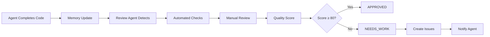

# Sprint 2 Code Review System

**Status**: ACTIVE MONITORING
**Role**: Continuous Code Reviewer
**Session**: swarm_1763232586649_oxgpjn9tm

---

## Quick Start

### For Implementation Agents

When you complete a file:

```bash
# 1. Notify via memory
npx claude-flow@alpha memory store "sprint2/agent/[your-name]/status" "completed [component]"

# 2. Update coordination
npx claude-flow@alpha hooks post-edit \
  --file "app/[path]/[file].py" \
  --memory-key "sprint2/implementations/[component]"
```

The review agent will automatically:
- Detect your completion
- Review your code
- Generate detailed report
- Assign quality score
- Flag any issues

### For Reading Reviews

All reviews are in this directory:

```
docs/sprint2/reviews/
├── README.md                          (this file)
├── CONTINUOUS_REVIEW_REPORT.md        (main status)
├── REVIEW_CRITERIA.md                 (standards)
├── MONITORING_STATUS.md               (dashboard)
└── [component]_review.md              (individual reviews)
```

---

## Review Process

### Automated Pipeline



### Review Checklist

Every implementation gets:

1. ✅ **SOLID Principles Check** (30%)
   - Single Responsibility
   - Open/Closed
   - Liskov Substitution
   - Interface Segregation
   - Dependency Inversion

2. ✅ **Breaking Changes Detection** (25%)
   - API signature validation
   - Backward compatibility
   - Migration safety

3. ✅ **Test Quality Analysis** (25%)
   - Coverage ≥ 90% (services)
   - Test meaningfulness
   - Edge case coverage

4. ✅ **Architecture Compliance** (20%)
   - Matches design document
   - LOC targets met
   - Dependencies valid

---

## Quality Scores

### Interpretation

| Score | Status | Meaning |
|-------|--------|---------|
| 90-100 | ✅ APPROVED | Production ready, merge immediately |
| 80-89 | ✅ APPROVED* | Good quality, minor notes |
| 70-79 | ⚠️ NEEDS_WORK | Revisions required |
| <70 | 🚫 BLOCKED | Major issues, reject |

*Note: ANY breaking change caps score at 79 (NEEDS_WORK)

### Current Scores

**Waiting for implementations...**

---

## Documents

### 1. CONTINUOUS_REVIEW_REPORT.md

**Purpose**: Main status and coordination
**Updates**: Real-time
**Contains**:
- Current review status
- Components reviewed
- Issues found
- Next actions

### 2. REVIEW_CRITERIA.md

**Purpose**: Standards and requirements
**Updates**: Rarely (version controlled)
**Contains**:
- Quality gates
- SOLID principles guide
- Test requirements
- Scoring rubric

### 3. MONITORING_STATUS.md

**Purpose**: Live dashboard
**Updates**: Every 2 minutes
**Contains**:
- Implementation progress
- Test coverage status
- Issue counts
- Recent activity

### 4. [Component]_review.md

**Purpose**: Individual component reviews
**Updates**: After each review
**Contains**:
- Quality score breakdown
- SOLID compliance
- Issues found
- Recommendations
- Approval status

---

## Issue Severity Levels

### 🚫 BLOCKER (P0)
Prevents merge, requires immediate fix

**Examples**:
- Breaking changes to public API
- Security vulnerabilities
- Data loss risk
- Test failures
- >30% performance degradation

### ⚠️ CRITICAL (P1)
Must fix before merge

**Examples**:
- SRP violations (god classes)
- Missing error handling
- Test coverage <80%
- No rollback strategy
- Undocumented changes

### 📋 MAJOR (P2)
Should fix, negotiable

**Examples**:
- Code duplication
- Poor naming
- Missing docstrings
- 10-30% performance degradation
- Test quality issues

### 💡 MINOR (P3)
Nice to fix, optional

**Examples**:
- Style inconsistencies
- TODO comments
- Verbose code
- Minor optimizations

---

## Coordination

### Memory Keys

Review system uses these memory namespaces:

```
sprint2/
├── reviews/
│   ├── status                    (overall status)
│   ├── [component]               (individual reviews)
│   └── issues/                   (issue tracking)
├── implementations/
│   └── [component]               (completed work)
└── agents/
    └── [agent-name]/status       (agent updates)
```

### Hooks

Automatically triggered:

**Before Review**:
```bash
npx claude-flow@alpha hooks pre-task \
  --description "Review [component]"
```

**After Review**:
```bash
npx claude-flow@alpha hooks post-edit \
  --file "docs/sprint2/reviews/[component]_review.md" \
  --memory-key "sprint2/reviews/[component]"
```

---

## Examples

### Example Review

See: `docs/sprint2/reviews/REVIEW_CRITERIA.md` → "Template: Service Review"

### Example Issue

```markdown
### CRITICAL (P1): SRP Violation

**File**: app/domain/patient/onboarding/coordinator.py:45
**Severity**: P1 (Critical)

**Issue**:
OnboardingCoordinator contains business logic for patient validation.
This violates Single Responsibility Principle.

**Current Code**:
```python
class OnboardingCoordinator:
    async def create_patient(self, data):
        # Business logic - should be in service!
        if not data.email or '@' not in data.email:
            raise ValidationError("Invalid email")
```

**Recommended Fix**:
```python
class OnboardingCoordinator:
    async def create_patient(self, data):
        # Delegate to validation service
        await self.validation_service.validate_patient_data(data)
```

**Impact**: Architecture compliance
**Priority**: Must fix before merge
```

---

## FAQ

**Q: How long does a review take?**
A: Automated checks: <2 minutes. Manual review: 5-15 minutes per component.

**Q: What if I disagree with a review finding?**
A: Comment on the review document, tag @code-review-agent. Provide justification.

**Q: Can I request re-review after fixes?**
A: Yes. Update memory: `sprint2/agent/[name]/status = "ready-for-rereview"`

**Q: What happens if breaking changes are unavoidable?**
A: Get architectural approval, document migration guide, coordinate with team.

**Q: How do I see all issues for my component?**
A: Check `[component]_review.md` → "Issues Found" section.

---

## Support

**Review Agent**: This automated system
**Escalation**: Tag senior developer in review document
**Questions**: Add comment to relevant review file

---

**Status**: READY FOR IMPLEMENTATIONS ✅
**Next Action**: Wait for agents to complete code
**Auto-Monitor**: Active, checking every 2 minutes
