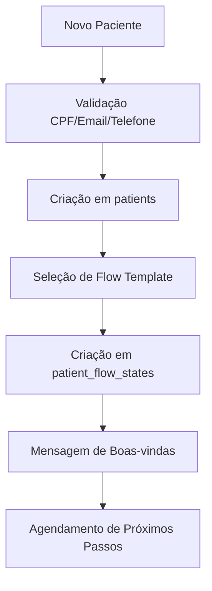
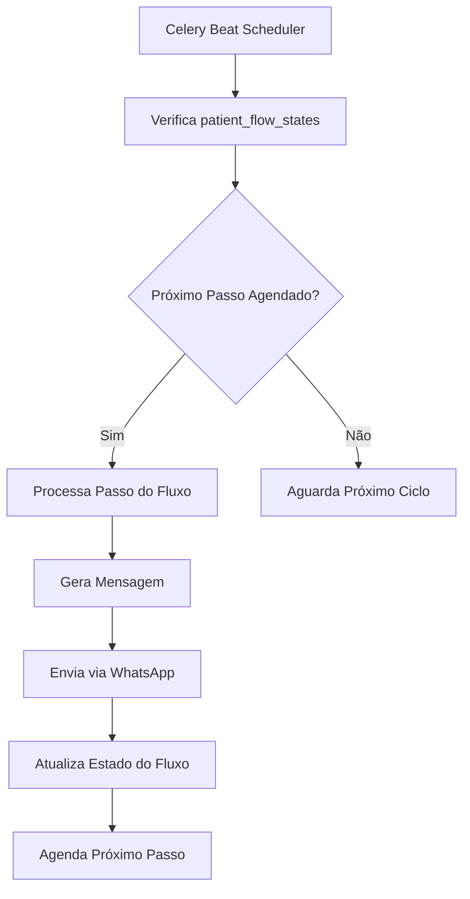
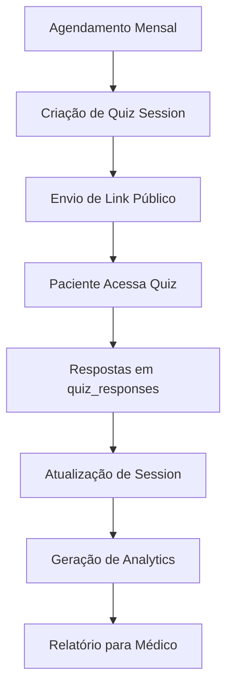

# Database Data Flow & Integration Guide

> Atualizado em **15/10/2025** com base no ambiente de produção PostgreSQL 17.4  
> **4 templates de fluxo ativos** após limpeza de versões v1

## Status Atual dos Fluxos (Produção)

**Templates de Fluxo Ativos (4):**
1. **Days 16-45 Engagement Flow** (v2) - Engajamento profundo e otimização do tratamento
2. **Initial 15 Days Onboarding Flow** (v2) - Introdução e construção de vínculo inicial  
3. **Monthly Recurring Maintenance Flow** (v2) - Suporte contínuo e monitoramento mensal
4. **Fluxo Dias 1-15** (v1) - Fluxo inicial de 15 dias em português

**Flow Kinds Configurados (4):**
- `initial_15_days` - Initial 15 Days Onboarding Flow
- `days_16_45` - Days 16-45 Engagement Flow  
- `monthly_recurring` - Monthly Recurring Maintenance Flow
- `day_1_15` - Fluxo Dias 1-15

**Quiz Templates Ativos (1):**
- `monthly_comprehensive` (v1.0.0) - 10 perguntas completas sobre bem-estar, energia, humor, sono, sintomas físicos, adesão ao tratamento, efeitos colaterais, mudanças de estilo de vida, preocupações e satisfação

## Fluxo de Dados Principal

### 1. Cadastro de Paciente → Início de Fluxo



**Tabelas Envolvidas**:
- `patients` - Dados do paciente
- `flow_template_versions` - Template selecionado
- `patient_flow_states` - Estado do fluxo
- `messages` - Mensagem de boas-vindas

### 2. Fluxo de Acompanhamento Diário



**Tabelas Envolvidas**:
- `patient_flow_states` - Controle de progresso
- `flow_template_versions` - Definição dos passos
- `messages` - Mensagens geradas
- `whatsapp_instances` - Configuração WhatsApp

### 3. Quiz Mensal → Respostas → Analytics



**Tabelas Envolvidas**:
- `quiz_templates` - Template do quiz
- `quiz_sessions` - Sessão individual
- `quiz_responses` - Respostas do paciente
- `quiz_template_performance_metrics` - Métricas

## Integrações Externas

### 1. WhatsApp Integration

**Fluxo de Envio**:
```sql
-- 1. Criação da mensagem
INSERT INTO messages (patient_id, direction, type, content, status)
VALUES ($1, 'outbound', 'text', $2, 'pending');

-- 2. Processamento pelo worker
UPDATE messages 
SET status = 'sent', sent_at = now(), whatsapp_id = $3
WHERE id = $4;

-- 3. Confirmação de entrega (webhook)
UPDATE messages 
SET status = 'delivered', delivered_at = now()
WHERE whatsapp_id = $5;
```

**Tabelas Relacionadas**:
- `messages` - Mensagens do sistema
- `whatsapp_instances` - Configuração da API
- `whatsapp_messages` - Mensagens WhatsApp
- `message_status_events` - Eventos de status

### 2. Webhook Processing

**Fluxo de Webhook**:
```sql
-- 1. Recebimento do webhook
INSERT INTO webhook_events (event_type, payload, source, processed)
VALUES ($1, $2, 'whatsapp', false);

-- 2. Processamento assíncrono
UPDATE webhook_events 
SET processed = true, processed_at = now()
WHERE id = $3;

-- 3. Atualização do estado
UPDATE messages 
SET status = $4, read_at = $5
WHERE whatsapp_id = $6;
```

### 3. Firebase Authentication

**Sincronização de Usuários**:
```sql
-- 1. Criação/atualização de usuário
INSERT INTO users (email, firebase_uid, auth_provider, firebase_email_verified)
VALUES ($1, $2, 'firebase', $3)
ON CONFLICT (email) DO UPDATE SET
    firebase_uid = EXCLUDED.firebase_uid,
    firebase_email_verified = EXCLUDED.firebase_email_verified,
    last_firebase_sync = now();

-- 2. Log de sincronização
INSERT INTO user_sync_log (supabase_user_id, firebase_uid, sync_status)
VALUES ($4, $2, 'success');
```

## Fluxos de Dados por Módulo

### 1. Módulo de Pacientes

**Entrada de Dados**:
- Cadastro via API (`/api/v1/patients`)
- Importação de dados médicos
- Sincronização com sistemas externos

**Processamento**:
- Validação de dados obrigatórios
- Verificação de duplicatas
- Criação automática de fluxo

**Saída de Dados**:
- Dashboard de pacientes
- Relatórios médicos
- Integração WhatsApp

### 2. Módulo de Fluxos

**Entrada de Dados**:
- Templates de fluxo (YAML/JSON)
- Configurações de agendamento
- Dados de progresso do paciente

**Processamento**:
- Execução de passos do fluxo
- Agendamento de mensagens
- Controle de estado

**Saída de Dados**:
- Mensagens automáticas
- Notificações para médicos
- Analytics de engajamento

### 3. Módulo de Quiz

**Entrada de Dados**:
- Templates de quiz
- Respostas dos pacientes
- Dados de sessão

**Processamento**:
- Cálculo de pontuação
- Análise de respostas
- Geração de relatórios

**Saída de Dados**:
- Links públicos de quiz
- Relatórios de performance
- Métricas de engajamento

### 4. Módulo de Mensagens

**Entrada de Dados**:
- Mensagens automáticas (fluxos)
- Mensagens manuais (médicos)
- Webhooks WhatsApp

**Processamento**:
- Fila de envio
- Retry automático
- Tracking de status

**Saída de Dados**:
- Envio via WhatsApp
- Notificações de status
- Histórico de conversas

## ETL e Transformações

### 1. Dados de Pacientes

**Transformações**:
- Normalização de telefones
- Validação de CPF
- Padronização de datas
- Enriquecimento de metadados

### 2. Dados de Fluxo

**Transformações**:
- Parsing de templates YAML
- Cálculo de próximos passos
- Agendamento inteligente
- Personalização de mensagens

### 3. Dados de Quiz

**Transformações**:
- Cálculo de pontuação
- Análise de respostas
- Geração de insights
- Agregação de métricas

## Auditoria e Rastreabilidade

### 1. Logs de Auditoria

**Tabelas de Auditoria**:
- `audit_logs` - Logs gerais do sistema
- `audit_log_entries` - Entradas detalhadas
- `security_audit_log` - Eventos de segurança
- `admin_audit_log` - Ações administrativas

**Campos Rastreados**:
- Usuário que executou a ação
- Timestamp da operação
- Dados antes/depois da mudança
- IP de origem
- Tipo de operação

### 2. Trilha de Dados

**Rastreamento Completo**:
- Criação de registros
- Modificações de dados
- Exclusões lógicas
- Acessos a dados sensíveis

## Backup e Recuperação

### 1. Estratégia de Backup

**Backup Completo**:
- Backup diário completo
- Backup incremental a cada 4 horas
- Backup de logs de transação

**Retenção**:
- Backups diários: 30 dias
- Backups semanais: 12 semanas
- Backups mensais: 12 meses

### 2. Pontos de Recuperação

**RTO/RPO**:
- RTO (Recovery Time Objective): 4 horas
- RPO (Recovery Point Objective): 1 hora

**Testes de Recuperação**:
- Teste mensal de recuperação
- Validação de integridade
- Teste de performance pós-recuperação

## Monitoramento de Integridade

### 1. Verificações Automáticas

**Integridade Referencial**:
- Validação de foreign keys
- Verificação de constraints
- Detecção de órfãos

**Consistência de Dados**:
- Validação de enums
- Verificação de ranges
- Detecção de duplicatas

### 2. Alertas de Sistema

**Alertas Críticos**:
- Falha de integração WhatsApp
- Erro em processamento de fluxo
- Falha de autenticação
- Problemas de performance

**Alertas de Negócio**:
- Paciente sem fluxo ativo
- Quiz não respondido
- Mensagem não entregue
- Dados inconsistentes

---

## Resumo dos Fluxos de Dados (Produção)

**Status Atual:**
- ✅ **4 templates de fluxo** ativos e funcionais
- ✅ **1 quiz template** completo com 10 perguntas
- ✅ **4 flow kinds** configurados corretamente
- ✅ **Limpeza de versões v1** realizada com sucesso

**Fluxos Operacionais:**
- Cadastro de pacientes → Início de fluxo automático
- Acompanhamento diário via Celery Beat
- Quiz mensal com analytics
- Integração WhatsApp funcional
- Auditoria completa de todas as operações

**Próximos Passos:**
1. Monitorar performance dos fluxos com dados reais
2. Implementar métricas de engajamento
3. Otimizar agendamento de mensagens

## Métricas de Qualidade

### 1. Qualidade dos Dados

**Indicadores**:
- Taxa de dados completos
- Taxa de validação
- Taxa de duplicatas
- Taxa de inconsistências

### 2. Performance de Integração

**Indicadores**:
- Taxa de sucesso de envio
- Tempo de resposta da API
- Taxa de retry
- Disponibilidade do serviço

### 3. Engajamento dos Pacientes

**Indicadores**:
- Taxa de resposta a mensagens
- Taxa de conclusão de quiz
- Taxa de engajamento com fluxos
- Tempo médio de resposta
