# Database Relationships

Entity-Relationship documentation for the Hormonia Backend database schema.

## Table of Contents

- [ER Diagrams](#er-diagrams)
- [Core Relationships](#core-relationships)
- [Detailed Relationship Maps](#detailed-relationship-maps)
- [Cascade Rules](#cascade-rules)
- [Referential Integrity](#referential-integrity)

---

## ER Diagrams

### Core Entity Relationships (Mermaid)

```mermaid
erDiagram
    users ||--o{ patients : "manages"
    users ||--o{ sessions : "has"
    users ||--o{ treatments : "manages"
    users ||--o{ appointments : "schedules"
    users ||--o{ medications : "prescribes"
    users ||--o{ notifications : "receives"
    users ||--o{ consents : "witnesses"
    users ||--o{ medical_reports : "generates"
    users ||--o{ audit_logs : "tracked_in"

    patients ||--o{ messages : "sends/receives"
    patients ||--o{ patient_flow_states : "tracks"
    patients ||--o{ patient_onboarding_saga : "onboards_via"
    patients ||--o{ quiz_sessions : "participates_in"
    patients ||--o{ quiz_responses : "answers"
    patients ||--o{ treatments : "receives"
    patients ||--o{ appointments : "has"
    patients ||--o{ medications : "takes"
    patients ||--o{ alerts : "triggers"
    patients ||--o{ consents : "grants"
    patients ||--o{ notifications : "relates_to"
    patients ||--o{ medical_reports : "subject_of"
    patients ||--o{ flow_analytics : "tracked_in"

    quiz_templates ||--o{ quiz_sessions : "defines"
    quiz_templates ||--o{ quiz_responses : "contains"
    quiz_templates ||--o{ quiz_questions : "includes"

    quiz_sessions ||--o{ quiz_responses : "records"

    flow_kinds ||--o{ flow_template_versions : "versioned_as"
    flow_template_versions ||--o{ patient_flow_states : "executes"
    flow_template_versions ||--o{ flow_messages : "contains"
    flow_template_versions ||--o{ flow_analytics : "tracks"

    treatments ||--o{ medications : "includes"

    patients {
        uuid id PK
        uuid doctor_id FK
        string phone UK
        string email UK
        string cpf UK
        date birth_date
        flow_state flow_state
    }

    users {
        uuid id PK
        string email UK
        user_role role
        string firebase_uid UK
        boolean is_active
    }

    messages {
        uuid id PK
        uuid patient_id FK
        message_direction direction
        messagetype type
        message_status status
        string idempotency_key UK
    }

    quiz_sessions {
        uuid id PK
        uuid patient_id FK
        uuid quiz_template_id FK
        string status
        timestamptz expiration_date
    }

    quiz_responses {
        uuid id PK
        uuid patient_id FK
        uuid quiz_template_id FK
        uuid quiz_session_id FK
        string question_id
        jsonb response_value
    }

    flow_template_versions {
        uuid id PK
        uuid flow_kind_id FK
        integer version_number
        boolean is_active
        boolean is_draft
        jsonb steps
    }

    patient_flow_states {
        uuid id PK
        uuid patient_id FK
        uuid flow_template_version_id FK
        integer current_step
        integer version
    }

    treatments {
        uuid id PK
        uuid patient_id FK
        uuid doctor_id FK
        treatment_type treatment_type
        treatment_status status
    }

    appointments {
        uuid id PK
        uuid patient_id FK
        uuid practitioner_id FK
        timestamptz scheduled_at
    }

    medications {
        uuid id PK
        uuid patient_id FK
        uuid prescribed_by_id FK
        uuid treatment_id FK
    }

    audit_logs {
        uuid id PK
        audit_event_type event_type
        uuid user_id FK
        inet ip_address
        timestamptz created_at
    }
```



---

## Core Relationships

### User-Centric Relationships

```
users (1) ──< (N) patients
  │ Relationship: A user (doctor) manages multiple patients
  │ Cascade: ON DELETE affects patients (typically RESTRICT)
  │ Business Rule: Patients cannot exist without an assigned doctor

users (1) ──< (N) sessions
  │ Relationship: A user has multiple active sessions
  │ Cascade: ON DELETE CASCADE (remove all sessions)
  │ Business Rule: Sessions are user-specific

users (1) ──< (N) treatments
  │ Relationship: A doctor manages multiple treatments
  │ Cascade: ON DELETE SET NULL (preserve treatment history)
  │ Business Rule: Treatments can outlive doctor assignment

users (1) ──< (N) appointments
  │ Relationship: A practitioner schedules multiple appointments
  │ Cascade: ON DELETE SET NULL (preserve appointment history)
  │ Business Rule: Appointments can be reassigned

users (1) ──< (N) medications
  │ Relationship: A doctor prescribes multiple medications
  │ Cascade: ON DELETE SET NULL (preserve prescription history)
  │ Business Rule: Prescriptions remain valid after doctor changes

users (1) ──< (N) notifications
  │ Relationship: A user receives multiple notifications
  │ Cascade: ON DELETE CASCADE (remove user notifications)
  │ Business Rule: Notifications are user-specific

users (1) ──< (N) consents
  │ Relationship: A user manages multiple consents
  │ Cascade: ON DELETE SET NULL (preserve consent records)
  │ Business Rule: Consent records are permanent

users (1) ──< (N) medical_reports
  │ Relationship: A user generates multiple reports
  │ Cascade: ON DELETE (preserve reports)
  │ Business Rule: Reports are permanent records

users (1) ──< (N) audit_logs
  │ Relationship: User actions are tracked in audit logs
  │ Cascade: No FK (user_id can be NULL for failed logins)
  │ Business Rule: Audit logs are immutable
```

### Patient-Centric Relationships

```
patients (1) ──< (N) messages
  │ Relationship: A patient sends/receives multiple messages
  │ Cascade: ON DELETE CASCADE
  │ Business Rule: Message history is tied to patient record

patients (1) ──< (N) patient_flow_states
  │ Relationship: A patient has multiple flow states (one per flow template version)
  │ Cascade: ON DELETE CASCADE
  │ Unique Constraint: (patient_id, flow_template_version_id)
  │ Business Rule: One active flow state per template version

patients (1) ──< (N) patient_onboarding_saga
  │ Relationship: A patient may have multiple onboarding attempts
  │ Cascade: ON DELETE CASCADE
  │ Business Rule: Saga records track transaction history

patients (1) ──< (N) quiz_sessions
  │ Relationship: A patient participates in multiple quiz sessions
  │ Cascade: ON DELETE CASCADE
  │ Unique Constraint: One active session per (patient_id, quiz_template_id)
  │ Business Rule: Only one active session allowed

patients (1) ──< (N) quiz_responses
  │ Relationship: A patient provides multiple quiz responses
  │ Cascade: ON DELETE CASCADE
  │ Unique Constraint: (quiz_session_id, question_id)
  │ Business Rule: One response per question per session

patients (1) ──< (N) treatments
  │ Relationship: A patient receives multiple treatments
  │ Cascade: ON DELETE CASCADE
  │ Business Rule: Treatments are patient-specific

patients (1) ──< (N) appointments
  │ Relationship: A patient has multiple appointments
  │ Cascade: ON DELETE CASCADE
  │ Business Rule: Appointments tied to patient

patients (1) ──< (N) medications
  │ Relationship: A patient takes multiple medications
  │ Cascade: ON DELETE CASCADE
  │ Business Rule: Medication records are patient-specific

patients (1) ──< (N) alerts
  │ Relationship: A patient triggers multiple alerts
  │ Cascade: No explicit FK (default)
  │ Business Rule: Alerts monitor patient health

patients (1) ──< (N) consents
  │ Relationship: A patient grants multiple consents
  │ Cascade: ON DELETE CASCADE
  │ Business Rule: Consents are patient-specific

patients (1) ──< (N) notifications
  │ Relationship: Notifications relate to patients
  │ Cascade: ON DELETE CASCADE
  │ Business Rule: Notifications tied to patient context

patients (1) ──< (N) medical_reports
  │ Relationship: Reports are generated for patients
  │ Cascade: No explicit FK (default)
  │ Business Rule: Reports are permanent patient records

patients (1) ──< (N) flow_analytics
  │ Relationship: Analytics track patient engagement
  │ Cascade: ON DELETE CASCADE
  │ Business Rule: Analytics are patient-specific
```

### Quiz System Relationships

```
quiz_templates (1) ──< (N) quiz_sessions
  │ Relationship: A template defines multiple sessions
  │ Cascade: ON DELETE RESTRICT (cannot delete active templates)
  │ Business Rule: Templates cannot be deleted if sessions exist

quiz_templates (1) ──< (N) quiz_responses
  │ Relationship: A template contains multiple responses
  │ Cascade: ON DELETE RESTRICT
  │ Business Rule: Templates preserve historical responses

quiz_templates (1) ──< (N) quiz_questions
  │ Relationship: A template includes multiple questions
  │ Cascade: No explicit FK
  │ Business Rule: Questions are template-specific

quiz_sessions (1) ──< (N) quiz_responses
  │ Relationship: A session records multiple responses
  │ Cascade: ON DELETE CASCADE
  │ Unique Constraint: (quiz_session_id, question_id)
  │ Business Rule: Responses tied to session lifecycle
```

### Flow Engine Relationships

```
flow_kinds (1) ──< (N) flow_template_versions
  │ Relationship: A flow kind has multiple versions
  │ Cascade: ON DELETE CASCADE
  │ Unique Constraint: (flow_kind_id, version_number)
  │ Business Rule: Versioned templates for the same flow kind

flow_template_versions (1) ──< (N) patient_flow_states
  │ Relationship: A template version executes in multiple patient flows
  │ Cascade: No explicit FK (default)
  │ Unique Constraint: (patient_id, flow_template_version_id)
  │ Business Rule: One flow state per patient per version

flow_template_versions (1) ──< (N) flow_messages
  │ Relationship: A template version contains multiple messages
  │ Cascade: No explicit FK
  │ Business Rule: Messages define flow steps

flow_template_versions (1) ──< (N) flow_analytics
  │ Relationship: Analytics track template version performance
  │ Cascade: No explicit FK
  │ Business Rule: Analytics aggregated per version
```

### Treatment Relationships

```
treatments (1) ──< (N) medications
  │ Relationship: A treatment includes multiple medications
  │ Cascade: ON DELETE SET NULL (medications can outlive treatment)
  │ Business Rule: Medications may be treatment-independent
```

---

## Detailed Relationship Maps

### Patient Onboarding Flow

```
┌─────────────────┐
│     Doctor      │
│    (users)      │
└────────┬────────┘
         │ creates
         ▼
┌─────────────────────────────┐
│ Patient Onboarding Saga     │
│ (patient_onboarding_saga)   │
│                             │
│ Steps:                      │
│ 1. Create patient record    │──┐
│ 2. Create Firebase user     │  │
│ 3. Initialize flow          │  │
│ 4. Send welcome message     │  │
└─────────────────────────────┘  │
                                 │
         ┌───────────────────────┘
         │ success
         ▼
┌─────────────────┐
│    Patient      │
│   (patients)    │
└────────┬────────┘
         │
         ├──> patient_flow_states
         ├──> messages
         ├──> quiz_sessions
         └──> flow_analytics
```

### Quiz Participation Flow

```
┌───────────────────┐
│  Quiz Template    │
│ (quiz_templates)  │
└─────────┬─────────┘
          │
          ▼
┌─────────────────────┐     ┌──────────────┐
│    Quiz Session     │◄────│   Patient    │
│  (quiz_sessions)    │     │  (patients)  │
└──────────┬──────────┘     └──────────────┘
           │
           │ 1:N
           ▼
┌─────────────────────┐
│   Quiz Response     │
│  (quiz_responses)   │
│                     │
│ • response_value    │ (JSONB)
│ • question_id       │
│ • responded_at      │
└─────────────────────┘
```

### Message Delivery Flow

```
┌──────────────┐
│   Patient    │
│  (patients)  │
└───────┬──────┘
        │
        ├──> messages (outbound: patient → system)
        └──< messages (inbound: system → patient)
                 │
                 ├──> whatsapp_id (Evolution API)
                 ├──> idempotency_key (deduplication)
                 └──> priority (queue ordering)
```

### Treatment Management Flow

```
┌──────────────┐         ┌──────────────┐
│    Doctor    │         │   Patient    │
│   (users)    │         │  (patients)  │
└───────┬──────┘         └───────┬──────┘
        │                        │
        └──────────┬─────────────┘
                   │ creates
                   ▼
           ┌──────────────┐
           │  Treatment   │
           │ (treatments) │
           └───────┬──────┘
                   │
                   ├──> medications (1:N)
                   └──> appointments (related but not FK)
```

### Consent Tracking Flow

```
┌──────────────┐         ┌──────────────┐
│   Patient    │         │    Doctor    │
│  (patients)  │         │   (users)    │
└───────┬──────┘         └───────┬──────┘
        │                        │
        │      ┌─────────────────┘
        │      │ (consented_by)
        ▼      ▼
    ┌──────────────────┐
    │     Consent      │
    │   (consents)     │
    │                  │
    │ • type           │ (treatment, data_sharing, etc.)
    │ • status         │ (pending, granted, revoked)
    │ • version        │
    │ • signature_data │ (JSONB)
    │ • expires_at     │
    └──────────────────┘
            │
            └──> previous_consent_id (version history)
```

---

## Cascade Rules

### ON DELETE CASCADE

These relationships delete child records when parent is deleted:

```python
# Patient deletions cascade to:
- messages
- patient_flow_states
- patient_onboarding_saga
- quiz_sessions
- quiz_responses
- treatments
- appointments
- medications
- consents
- notifications (related_patient)
- flow_analytics

# User deletions cascade to:
- sessions
- notifications (user)
- patient_onboarding_saga (doctor)

# Quiz session deletions cascade to:
- quiz_responses

# Flow kind deletions cascade to:
- flow_template_versions

# Treatment deletions cascade to:
- medications (via relationship, not FK)
```

### ON DELETE SET NULL

These relationships preserve child records but clear the foreign key:

```python
# Doctor deletions set NULL on:
- patients (doctor_id) *may vary by implementation
- treatments (doctor_id)
- appointments (practitioner_id)
- medications (prescribed_by_id)
- consents (consented_by_id, witness_id)
- medications (treatment_id)
```

### ON DELETE RESTRICT

These relationships prevent parent deletion if children exist:

```python
# Cannot delete if children exist:
- quiz_templates (if quiz_sessions or quiz_responses exist)
```

---

## Referential Integrity

### Composite Unique Constraints

**patients table:**
```sql
UNIQUE (email, doctor_id)     -- One email per doctor
UNIQUE (cpf, doctor_id)        -- One CPF per doctor
UNIQUE (phone, doctor_id)      -- One phone per doctor
```
**Rationale:** Patients are scoped to their doctor. Different doctors can have patients with the same email/CPF/phone.

**patient_flow_states table:**
```sql
UNIQUE (patient_id, flow_template_version_id)
```
**Rationale:** One flow state per patient per template version.

**quiz_sessions table:**
```sql
UNIQUE (patient_id, quiz_template_id) WHERE status = 'started'
```
**Rationale:** Only one active session allowed (partial unique index).

**quiz_responses table:**
```sql
UNIQUE (quiz_session_id, question_id)
```
**Rationale:** One response per question per session.

**quiz_templates table:**
```sql
UNIQUE (name, version)
```
**Rationale:** Template versioning by name.

**flow_kinds table:**
```sql
UNIQUE (kind_key)
```
**Rationale:** Unique flow type identifier.

**flow_template_versions table:**
```sql
UNIQUE (flow_kind_id, version_number)
```
**Rationale:** Version numbering per flow kind.

### Orphan Prevention

**Quiz System:**
- Cannot delete `quiz_templates` if `quiz_sessions` exist (RESTRICT)
- Deleting `quiz_sessions` cascades to `quiz_responses`

**Patient System:**
- Deleting `patients` cascades to all related records
- Cannot create `patient_flow_states` without valid `patient_id`

**User System:**
- Deleting `users` cascades to `sessions`
- Sets NULL on `treatments`, `appointments`, `medications`

---

## Relationship Cardinality

### One-to-Many (1:N)

Most relationships in the system:
- users → patients
- patients → messages
- quiz_templates → quiz_sessions
- flow_kinds → flow_template_versions

### Many-to-Many (M:N)

Implemented via junction tables or JSONB arrays:
- **Users ↔ Roles:** Stored in `role` enum (not normalized)
- **Quiz Templates ↔ Questions:** Stored in JSONB `questions` array
- **Flow Templates ↔ Messages:** Via `flow_messages` junction

### One-to-One (1:1)

Special cases:
- **Active Quiz Session:** Enforced by partial unique index
- **Current Flow State:** One per patient per template version

---

## Circular References

### Consent Versioning

```
consents.previous_consent_id → consents.id
```
**Rationale:** Tracks consent version history.
**Handled by:** Self-referential foreign key, nullable.

---

## Relationship Indexes

### Foreign Key Indexes

All foreign keys are indexed for efficient joins:

```sql
-- Example indexes
CREATE INDEX idx_patients_doctor_id ON patients(doctor_id);
CREATE INDEX idx_messages_patient_id ON messages(patient_id);
CREATE INDEX idx_quiz_sessions_patient_id ON quiz_sessions(patient_id);
CREATE INDEX idx_quiz_sessions_quiz_template_id ON quiz_sessions(quiz_template_id);
```

### Composite Indexes

For common join patterns:

```sql
-- Patient lookup with status
CREATE INDEX idx_quiz_sessions_patient_status ON quiz_sessions(patient_id, status);

-- Template lookup with status
CREATE INDEX idx_quiz_sessions_template_status ON quiz_sessions(quiz_template_id, status);

-- Patient phone lookup per doctor
CREATE INDEX idx_patient_phone_doctor ON patients(phone, doctor_id);
```

---

## Relationship Validation

### Application-Level Checks

**Patient Onboarding Saga:**
- Step 1: Patient must not exist before creation
- Step 2: Firebase UID must be unique
- Step 3: Flow template version must be active
- Step 4: Patient must exist for message sending

**Quiz Session:**
- Patient must exist
- Quiz template must be active
- No other active session for same (patient, template)

**Message Sending:**
- Patient must exist and be active
- Idempotency key must be unique per patient
- Priority must be valid enum value

---

## See Also

- [SCHEMA_OVERVIEW.md](./SCHEMA_OVERVIEW.md) - High-level schema organization
- [TABLES_REFERENCE.md](./TABLES_REFERENCE.md) - Detailed table documentation
- [INDEXES.md](./INDEXES.md) - Index optimization
- [DATA_FLOW.md](./DATA_FLOW.md) - Data flow through the system
