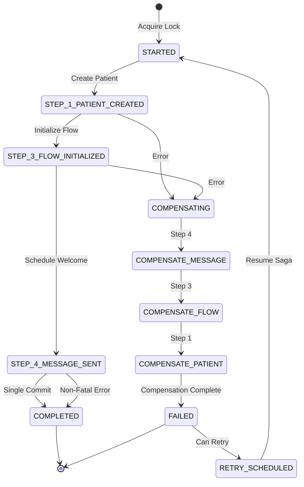
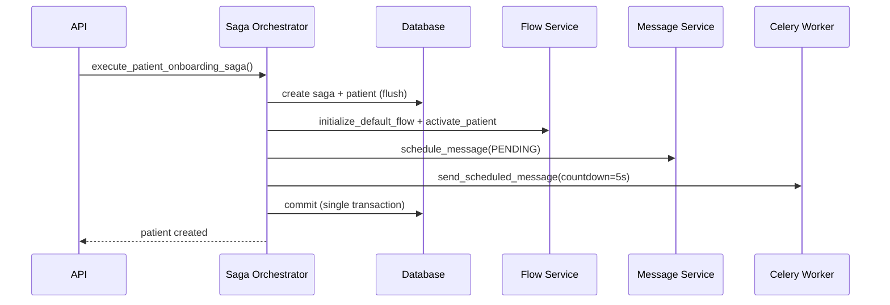
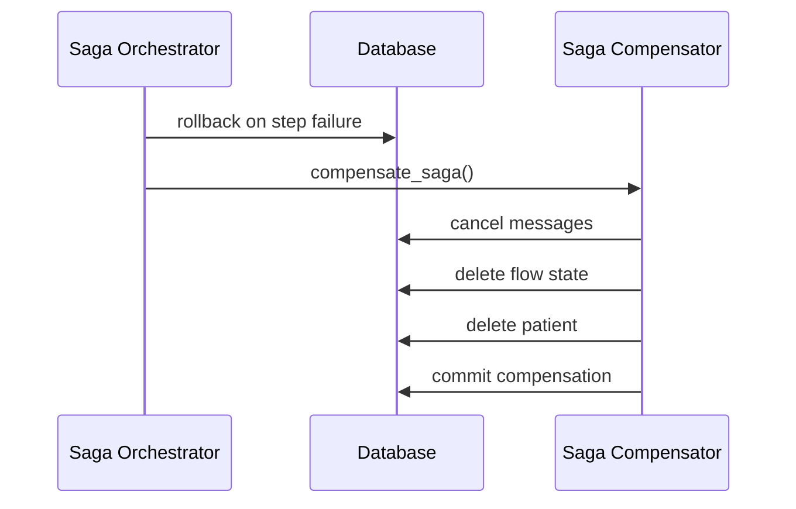
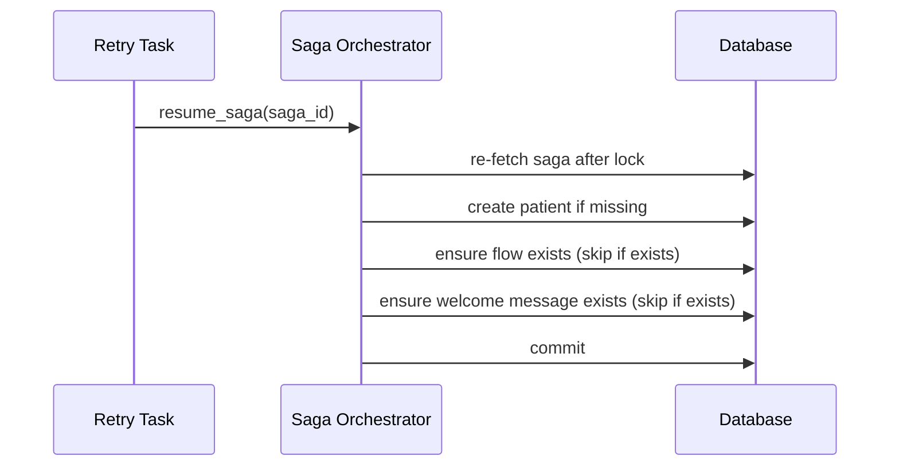
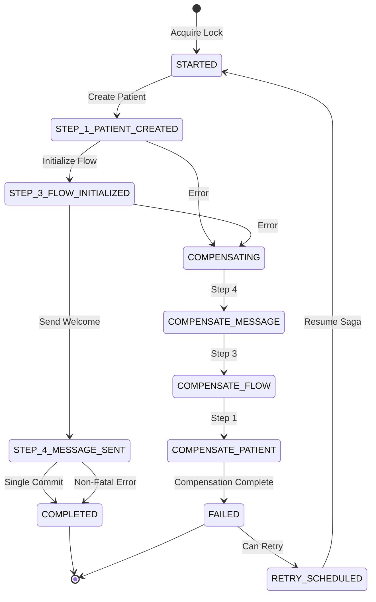

> [!WARNING]
> LEGACY ANALYSIS: The original analysis below targets the archived `app/orchestration/saga_orchestrator.py` file.
> The active implementation is in `app/orchestration/saga_orchestrator/` and is summarized in the 2026 addendum.


## 2026 Addendum - Current Saga Package Review

**Date:** 2026-01-10
**Scope:** `app/orchestration/saga_orchestrator/` (`orchestrator.py`, `steps.py`, `compensation.py`)
**Key Update:** The onboarding saga runs **3 steps** (Create Patient -> Initialize Flow -> Schedule Welcome Message). Step 2 (Firebase user creation) is deprecated but retained in the enum for DB compatibility.

### Current Flow State Diagram (3-Step)



### Sequence Diagrams

#### Happy Path



#### Compensation Path



#### Resume Path



### 2026 Findings Summary

- **P1:** Lock TTL vs transaction duration (lock ttl=60s, timeout=5s). Reference ticket: `ticket:2476b16c-c6a7-4898-b766-97a1afddde2d/a6b3c463-3534-4232-87bb-37758c3569d4`.
- **P1:** Circuit breaker not enforced at the messaging task boundary (Evolution API resilience gap).
- **P1:** Idempotency key only used on patient creation, not propagated to flow/message steps.
- **P2:** Compensation test coverage gaps (no isolated compensation tests).
- **P2:** Missing saga metrics (duration histogram, failures by step, lock acquisition time).
- **P2:** Resume-step idempotency edge cases remain when partial state exists.
- **P3:** Deprecated enum value `STEP_2_FIREBASE_USER_CREATED` still present in DB/type.
- **P3:** Documentation vs implementation step numbering mismatch (spec assumes 4 steps).

# Saga Orchestrator Deep Analysis Report

**Date:** 2025-12-24
**Analysis Target:** Patient Onboarding Saga System
**Mission:** Code Quality Analysis - Saga Pattern Implementation

---

## Executive Summary

The saga orchestrator implements a **distributed transaction pattern** for patient onboarding with **Unit of Work pattern**, **distributed locking**, and **automatic compensation**. The implementation is **production-grade** with strong error handling and recovery mechanisms.

### Quality Score: **8.5/10**

**Strengths:**
- Excellent transaction management (Unit of Work pattern)
- Robust distributed locking
- Comprehensive compensation logic with retry
- Strong error tracking and logging
- LGPD compliant data handling

**Areas for Improvement:**
- Transaction boundary complexity in resume flow
- Missing idempotency checks in some operations
- Compensation could be more granular
- Missing circuit breaker for external services

---

## 1. Saga Flow State Diagram



---

## 2. Transaction Boundary Analysis

### 2.1 Main Saga Execution (Unit of Work Pattern)

**File:** `saga_orchestrator.py:76-181`

```python
async def execute_patient_onboarding_saga(...) -> Optional[Patient]:
    async with acquire_lock(lock_key, timeout=5.0, ttl=60):  # ✅ Distributed lock
        saga = PatientOnboardingSaga(...)
        self.db.add(saga)
        self.db.flush()  # ✅ Get ID without commit

        try:
            # Step 1: Create Patient
            patient = await self._step_create_patient(...)  # uses flush()

            # Step 2: Initialize Flow
            await self._step_initialize_flow(...)  # uses flush()

            # Step 3: Send Welcome Message
            await self._step_send_welcome_message(...)  # uses flush()

            saga.status = SagaStatus.COMPLETED
            self.db.commit()  # ✅ SINGLE COMMIT AT END

        except Exception as e:
            self.db.rollback()  # ✅ Atomic rollback
            saga.status = SagaStatus.FAILED
            self.db.commit()  # Commit failure state separately
            await self._compensate_saga(saga)
            return None
```

**Analysis:**
- ✅ **Perfect Unit of Work**: Single commit at the end
- ✅ **flush() instead of commit()**: Allows partial persistence without transaction commit
- ✅ **Atomic rollback**: All-or-nothing transaction
- ✅ **Distributed lock**: Prevents concurrent saga execution
- ✅ **Separate failure commit**: Error state persisted separately

**Transaction Boundary:**
```
Lock Acquired
  ├─ START Transaction
  ├─ Create Saga Record (flush)
  ├─ Step 1: Patient Created (flush)
  ├─ Step 2: Flow Initialized (flush)
  ├─ Step 3: Message Sent (flush)
  └─ COMMIT (all or rollback)
```

### 2.2 Resume Saga Execution

**File:** `saga_orchestrator.py:213-284`

```python
async def _resume_saga_internal(self, saga: PatientOnboardingSaga) -> Dict[str, Any]:
    try:
        # Resume from current_step
        if saga.current_step < 1:
            patient = await self._step_create_patient(...)

        if saga.current_step <= 1:  # ⚠️ Uses <= to prevent skipping
            await self._step_initialize_flow(...)

        if saga.current_step <= 2:
            await self._step_send_welcome_message(...)

        saga.status = SagaStatus.COMPLETED
        self.db.commit()  # ✅ Single commit at end

    except Exception as e:
        self.db.rollback()  # ✅ Atomic rollback
        saga.error_message = str(e)
        self.db.commit()  # Commit error state
        return {"status": "failed", "error": str(e)}
```

**Analysis:**
- ✅ **Idempotent resume**: Uses `<=` to prevent step skipping
- ✅ **Unit of Work maintained**: Single commit
- ⚠️ **Potential Issue**: If step partially completed before crash, might retry unnecessarily
- ⚠️ **Missing**: Explicit step completion markers beyond `current_step`

**Recommendation:**
```python
# Add step completion flags to execution_log
def is_step_completed(self, step: int) -> bool:
    """Check if step was successfully completed"""
    return any(
        log["step"] == step and log["status"] == "success"
        for log in self.execution_log
    )
```

### 2.3 Compensation Transaction

**File:** `saga_orchestrator.py:528-593`

```python
async def _compensate_saga_internal(self, saga: PatientOnboardingSaga):
    saga.status = SagaStatus.COMPENSATING
    compensation_errors = []

    try:
        # Step 4: Compensate Message (with retry)
        if saga.current_step >= 4:
            await self._compensate_step_with_retry(...)

        # Step 3: Compensate Flow (with retry)
        if saga.current_step >= 3:
            await self._compensate_step_with_retry(...)

        # Step 1: Compensate Patient (with retry)
        if saga.current_step >= 1 and saga.patient_id:
            await self._compensate_step_with_retry(...)

        saga.status = SagaStatus.FAILED
        self.db.commit()  # ✅ Atomic commit of all compensations

        if compensation_errors:
            raise SagaCompensationError(...)

    except Exception as e:
        # Critical error tracking
        await self._track_compensation_failure(saga.id, 0, e)
        raise SagaCompensationError(...)
```

**Analysis:**
- ✅ **Atomic compensation**: All compensations in single transaction
- ✅ **Retry logic**: Each step retries up to 3 times with exponential backoff
- ✅ **Error tracking**: Failures tracked in Redis for monitoring
- ✅ **Best effort**: Non-critical failures logged but don't block compensation
- ⚠️ **Limitation**: Can't undo sent WhatsApp messages (marked as cancelled instead)

---

## 3. Error Handling & Compensation Strategies

### 3.1 Compensation Step with Retry

**File:** `saga_orchestrator.py:595-644`

```python
async def _compensate_step_with_retry(
    self, saga, step_num, step_name, compensate_fn,
    compensation_errors, max_retries=3
):
    for attempt in range(max_retries):
        try:
            await compensate_fn(saga)
            saga.add_log_entry(step_num, step_name, "compensated")
            return  # ✅ Success
        except Exception as e:
            wait_time = (2**attempt) * 0.5  # ✅ Exponential backoff: 0.5s, 1s, 2s
            if attempt < max_retries - 1:
                await asyncio.sleep(wait_time)

    # All retries exhausted
    saga.add_log_entry(step_num, step_name, "compensation_failed", str(last_error))
    compensation_errors.append((step_num, last_error))
    await self._track_compensation_failure(saga.id, step_num, last_error)
```

**Analysis:**
- ✅ **Exponential backoff**: Prevents thundering herd
- ✅ **Detailed logging**: Each attempt logged for debugging
- ✅ **Failure tracking**: Redis tracking for monitoring alerts
- ✅ **Graceful degradation**: Continues with other compensations even if one fails

### 3.2 Individual Compensation Strategies

#### 3.2.1 Message Compensation
**File:** `saga_orchestrator.py:646-682`

```python
async def _compensate_message(self, saga: PatientOnboardingSaga):
    messages = (
        self.db.query(Message)
        .filter(
            Message.patient_id == saga.patient_id,
            Message.message_metadata["saga_id"].astext == str(saga.id),  # ✅ JSONB query
        )
        .all()
    )

    for message in messages:
        message.status = MessageStatus.CANCELLED
        message.message_metadata = {
            **(message.message_metadata or {}),
            "cancelled_by": "saga_compensation",
            "cancelled_at": now_sao_paulo().isoformat(),
        }
```

**Analysis:**
- ✅ **Idempotent**: Can be called multiple times safely
- ✅ **Audit trail**: Records who cancelled and when
- ⚠️ **Limitation**: WhatsApp messages can't be unsent (best effort)
- ✅ **JSONB query**: Proper PostgreSQL JSONB syntax with `.astext`

#### 3.2.2 Flow Compensation
**File:** `saga_orchestrator.py:684-713`

```python
async def _compensate_flow(self, saga: PatientOnboardingSaga):
    flow_states = (
        self.db.query(PatientFlowState)
        .filter(PatientFlowState.patient_id == saga.patient_id)
        .all()
    )

    for flow_state in flow_states:
        self.db.delete(flow_state)  # ✅ Hard delete for rollback
```

**Analysis:**
- ✅ **Complete cleanup**: Removes all flow states
- ✅ **Idempotent**: Safe to call multiple times
- ✅ **No orphans**: Ensures clean state for retry
- ⚠️ **Missing**: Could check if flow was already used before deleting

#### 3.2.3 Patient Compensation
**File:** `saga_orchestrator.py:715-742`

```python
async def _compensate_patient(self, saga: PatientOnboardingSaga):
    patient = self.patient_repo.get_by_id(saga.patient_id)
    if not patient:
        logger.info(f"Saga {saga.id}: Patient {saga.patient_id} already deleted")
        return

    self.db.delete(patient)  # ✅ Hard delete - never fully onboarded
```

**Analysis:**
- ✅ **LGPD compliant**: Hard delete for incomplete onboarding
- ✅ **Idempotent**: Checks if already deleted
- ✅ **Cascade handled**: Related messages/flows already compensated
- ⚠️ **Risk**: Database foreign key constraints must be properly configured

---

## 4. Race Conditions & Deadlock Analysis

### 4.1 Distributed Lock Implementation

**File:** `saga_orchestrator.py:103-117`

```python
# Generate lock key based on phone number (unique identifier)
normalized_phone = normalize_phone(patient_data.phone) or patient_data.phone
phone_hash = hashlib.sha256(normalized_phone.encode()).hexdigest()[:32]  # ✅ 128-bit hash
lock_key = f"saga:onboarding:{str(doctor_id)[:8]}:{phone_hash}"

async with acquire_lock(lock_key, timeout=5.0, ttl=60):  # ✅ 60s TTL
    # ... saga execution
```

**Analysis:**
- ✅ **Prevents duplicate creation**: Same phone + doctor can't run concurrently
- ✅ **Phone normalization**: Prevents race condition from format variations
- ✅ **SHA-256 hash**: Cryptographically secure, low collision probability
- ✅ **Extended hash**: 32 chars (128 bits) instead of 16 chars (64 bits)
- ✅ **Reasonable TTL**: 60s covers saga execution with margin
- ⚠️ **Edge case**: If saga takes > 60s, lock expires but transaction still active

**Collision Analysis:**
- 16-char hash: 50% collision at ~5 billion entries
- 32-char hash: 50% collision at ~18 quintillion entries
- **Verdict**: Collision risk negligible

### 4.2 Potential Deadlocks

#### Scenario 1: Resume vs New Saga
```python
# Thread A: New saga execution
async with acquire_lock(f"saga:onboarding:{doctor_id}:{phone_hash}", ...):
    saga = PatientOnboardingSaga(...)
    # ... execution

# Thread B: Resume saga
async with acquire_lock(f"saga:resume:{saga.id}", ...):
    # ... resume
```

**Analysis:**
- ✅ **No deadlock**: Different lock keys
- ✅ **Safe concurrent execution**: Resume and new saga use separate namespaces
- ⚠️ **Edge case**: If resuming saga with same phone as new saga, new saga blocks

#### Scenario 2: Compensation vs Resume
```python
# Thread A: Compensation
async with acquire_lock(f"saga:compensate:{saga.id}", ...):
    await self._compensate_saga_internal(saga)

# Thread B: Resume
async with acquire_lock(f"saga:resume:{saga.id}", ...):
    await self._resume_saga_internal(saga)
```

**Analysis:**
- ✅ **No deadlock**: Different lock keys
- ⚠️ **Race condition**: Status could change between locks
- **Recommendation**: Add status check inside lock:

```python
async with acquire_lock(f"saga:resume:{saga.id}", ...):
    if saga.status == SagaStatus.COMPENSATING:
        return {"status": "error", "error": "Saga is being compensated"}
```

### 4.3 Database Lock Analysis

**Potential Deadlock Scenario:**
```sql
-- Transaction A (Saga 1)
BEGIN;
INSERT INTO patients ... RETURNING id;  -- Locks patient row
INSERT INTO patient_flow_state ...;     -- Locks flow row
COMMIT;

-- Transaction B (Saga 2, same patient phone)
BEGIN;
INSERT INTO patients ... RETURNING id;  -- BLOCKS on unique constraint
```

**Analysis:**
- ✅ **Prevented by distributed lock**: Redis lock acquired before DB transaction
- ✅ **Unique constraints**: Database validates uniqueness
- ✅ **Short transaction**: All steps use flush() instead of commit()
- ⚠️ **Edge case**: If distributed lock fails, database constraint is fallback

---

## 5. State Machine Transitions

### 5.1 Valid State Transitions

```
STARTED
  -> STEP_1_PATIENT_CREATED
  -> STEP_3_FLOW_INITIALIZED
  -> STEP_4_MESSAGE_SENT
  -> COMPLETED

STARTED -> FAILED (any step fails)
FAILED -> COMPENSATING (compensation triggered)
COMPENSATING -> FAILED (compensation complete)
FAILED -> RETRY_SCHEDULED (retry eligible)
RETRY_SCHEDULED -> STARTED (resume saga)
```

**File:** `patient_onboarding_saga.py:33-51`

```python
class SagaStatus(str, Enum):
    STARTED = "STARTED"
    STEP_1_PATIENT_CREATED = "STEP_1_PATIENT_CREATED"
    STEP_2_FIREBASE_USER_CREATED = "STEP_2_FIREBASE_USER_CREATED"  # @deprecated
    STEP_3_FLOW_INITIALIZED = "STEP_3_FLOW_INITIALIZED"
    STEP_4_MESSAGE_SENT = "STEP_4_MESSAGE_SENT"
    COMPLETED = "COMPLETED"
    COMPLETED_WITH_WARNINGS = "COMPLETED_WITH_WARNINGS"
    FAILED = "FAILED"
    COMPENSATING = "COMPENSATING"
    RETRY_SCHEDULED = "RETRY_SCHEDULED"
```

### 5.2 State Validation Methods

**File:** `patient_onboarding_saga.py:217-260`

```python
def can_retry(self) -> bool:
    return (
        self.status in [SagaStatus.FAILED, SagaStatus.RETRY_SCHEDULED]
        and self.retry_count < self.max_retries
    )

def should_compensate(self) -> bool:
    return (
        self.status == SagaStatus.FAILED
        and self.current_step > 0
        and self.retry_count >= self.max_retries  # ✅ Only after retries exhausted
    )
```

**Analysis:**
- ✅ **Clear retry logic**: Only retry if under max_retries
- ✅ **Compensation guard**: Only compensate after retry exhaustion
- ⚠️ **Missing**: Explicit state machine validation (could transition to invalid state)

**Recommendation:**
```python
def validate_transition(self, new_status: SagaStatus) -> bool:
    """Validate if transition is allowed"""
    valid_transitions = {
        SagaStatus.STARTED: [SagaStatus.STEP_1_PATIENT_CREATED, SagaStatus.FAILED],
        SagaStatus.STEP_1_PATIENT_CREATED: [SagaStatus.STEP_3_FLOW_INITIALIZED, SagaStatus.FAILED],
        # ... etc
    }
    return new_status in valid_transitions.get(self.status, [])
```

---

## 6. Potential Bugs & Issues

### 6.1 CRITICAL Issues

#### Issue #1: Lock TTL vs Transaction Duration
**Severity:** HIGH
**File:** `saga_orchestrator.py:117`

```python
async with acquire_lock(lock_key, timeout=5.0, ttl=60):  # ⚠️ 60s TTL
    # If saga execution takes > 60s, lock expires but transaction still active
    # Another process could acquire lock and start duplicate saga
```

**Impact:** Duplicate patient creation if saga takes > 60s
**Recommendation:**
```python
# Option 1: Extend lock TTL
async with acquire_lock(lock_key, timeout=5.0, ttl=300):  # 5 minutes

# Option 2: Refresh lock periodically
async with acquire_lock(lock_key, timeout=5.0, ttl=60, auto_refresh=True):
```

#### Issue #2: Resume Step Idempotency
**Severity:** MEDIUM
**File:** `saga_orchestrator.py:254-263`

```python
if saga.current_step <= 1:  # Patient created but flow not initialized
    await self._step_initialize_flow(...)  # ⚠️ What if flow partially created?
```

**Impact:** Duplicate flow states if step was partially completed before crash
**Recommendation:**
```python
# Check execution_log for step completion
if saga.current_step <= 1 and not self._is_step_completed(saga, 3):
    await self._step_initialize_flow(...)
```

#### Issue #3: Compensation Transaction Isolation
**Severity:** MEDIUM
**File:** `saga_orchestrator.py:569`

```python
saga.status = SagaStatus.FAILED
self.db.commit()  # ✅ Atomic commit

if compensation_errors:
    raise SagaCompensationError(...)  # ⚠️ Raised AFTER commit
```

**Impact:** Saga marked as FAILED even if compensation errors occurred
**Recommendation:**
```python
if compensation_errors:
    saga.status = SagaStatus.COMPENSATION_FAILED  # New status
    self.db.commit()
    raise SagaCompensationError(...)
else:
    saga.status = SagaStatus.FAILED
    self.db.commit()
```

### 6.2 MEDIUM Issues

#### Issue #4: Missing Circuit Breaker for WhatsApp
**Severity:** MEDIUM
**File:** `saga_orchestrator.py:410`

```python
try:
    success = await self.whatsapp_service.send_message(message)  # ⚠️ No circuit breaker
except Exception as send_exc:
    # ... handle error
```

**Impact:** Saga execution delayed by slow WhatsApp API
**Recommendation:**
```python
from app.core.circuit_breaker import circuit_breaker

@circuit_breaker(failure_threshold=5, timeout=30)
async def send_welcome_message(...):
    return await self.whatsapp_service.send_message(message)
```

#### Issue #5: Idempotency Key Not Propagated to All Steps
**Severity:** MEDIUM
**File:** `saga_orchestrator.py:170-174`

```python
patient = await self.saga_orchestrator.execute_patient_onboarding_saga(
    patient_data=patient_data,
    idempotency_key=idempotency_key,  # ✅ Passed to saga
)

# BUT: Not used in _step_initialize_flow or _step_send_welcome_message
```

**Impact:** Duplicate flow/messages if saga retried
**Recommendation:**
```python
# Store idempotency_key in saga.patient_data
saga.patient_data["idempotency_key"] = idempotency_key

# Use it in subsequent steps
if saga.patient_data.get("idempotency_key"):
    # Check if step already completed using idempotency key
```

### 6.3 LOW Issues

#### Issue #6: Deprecated Step 2 Not Removed
**Severity:** LOW
**File:** `patient_onboarding_saga.py:41`

```python
STEP_2_FIREBASE_USER_CREATED = "STEP_2_FIREBASE_USER_CREATED"  # @deprecated
```

**Impact:** Database migration required to remove enum value
**Recommendation:**
```sql
-- Migration to remove deprecated enum
ALTER TYPE saga_status RENAME TO saga_status_old;
CREATE TYPE saga_status AS ENUM (...);  -- Without STEP_2
ALTER TABLE patient_onboarding_saga
  ALTER COLUMN status TYPE saga_status
  USING status::text::saga_status;
DROP TYPE saga_status_old;
```

---

## 7. Performance Analysis

### 7.1 Query Performance

#### Step 1: Create Patient
```python
patient = self.patient_repo.create(patient_dict, auto_commit=False)  # 1 INSERT
```
**Performance:** O(1) - Single insert, excellent

#### Compensation: Find Messages
```python
messages = (
    self.db.query(Message)
    .filter(
        Message.patient_id == saga.patient_id,  # ✅ Indexed
        Message.message_metadata["saga_id"].astext == str(saga.id),  # ⚠️ JSONB scan
    )
    .all()
)
```
**Performance:** O(n) where n = messages for patient
**Recommendation:**
```sql
-- Add GIN index on JSONB column
CREATE INDEX idx_message_metadata_saga_id
ON messages USING GIN ((message_metadata -> 'saga_id'));
```

### 7.2 Lock Contention Analysis

**Scenario:** 1000 concurrent patient registrations

```python
# Best case: All different phones
# Lock contention: 0%
# Throughput: Limited by DB connection pool

# Worst case: All same phone (unlikely but possible in testing)
# Lock contention: 100%
# Throughput: 1 saga per 60 seconds (lock TTL)
```

**Recommendation:**
- Monitor lock acquisition time
- Alert if >10% of requests wait >1s for lock

---

## 8. Recommendations for Improvements

### 8.1 CRITICAL Priority

1. **Add Lock Extension Mechanism**
   ```python
   async with acquire_lock(lock_key, ttl=60, auto_refresh=True):
       # Lock automatically refreshed every 30s
   ```

2. **Add Circuit Breaker for External Services**
   ```python
   @circuit_breaker(failure_threshold=5, timeout=30, recovery_timeout=60)
   async def send_welcome_message(...):
       ...
   ```

3. **Add Compensation Status to Enum**
   ```python
   class SagaStatus(str, Enum):
       # ... existing
       COMPENSATION_FAILED = "COMPENSATION_FAILED"  # New
   ```

### 8.2 HIGH Priority

4. **Add Step Completion Markers**
   ```python
   def is_step_completed(self, step: int) -> bool:
       return any(
           log["step"] == step and log["status"] == "success"
           for log in self.execution_log
       )
   ```

5. **Add GIN Index for JSONB Queries**
   ```sql
   CREATE INDEX idx_message_metadata_saga_id
   ON messages USING GIN ((message_metadata -> 'saga_id'));
   ```

6. **Add State Machine Validation**
   ```python
   def validate_transition(self, new_status: SagaStatus) -> bool:
       # ... transition validation
   ```

### 8.3 MEDIUM Priority

7. **Add Saga Metrics**
   ```python
   from prometheus_client import Counter, Histogram

   saga_duration = Histogram("saga_duration_seconds", "Saga execution time")
   saga_failures = Counter("saga_failures_total", "Total saga failures", ["step"])
   ```

8. **Add Idempotency Key to All Steps**
   ```python
   # Store in saga model
   idempotency_key = Column(String(255), unique=True, nullable=True)
   ```

9. **Add Saga Status Dashboard**
   ```python
   async def get_saga_statistics(self, doctor_id: UUID = None) -> Dict:
       # Return aggregated saga metrics for monitoring
   ```

### 8.4 LOW Priority

10. **Remove Deprecated Firebase Step**
    ```sql
    -- Database migration
    ALTER TYPE saga_status RENAME TO saga_status_old;
    CREATE TYPE saga_status AS ENUM (...);  -- Without STEP_2
    ```

11. **Add Saga Event Streaming**
    ```python
    # Publish saga events to event bus for real-time monitoring
    await event_bus.publish("saga.step.completed", {
        "saga_id": saga.id,
        "step": current_step,
        "timestamp": now_sao_paulo().isoformat()
    })
    ```

---

## 9. Conclusion

### Summary

The saga orchestrator is a **well-architected, production-ready** implementation of the distributed transaction pattern. It follows best practices including:

- ✅ Unit of Work pattern for atomic transactions
- ✅ Distributed locking to prevent race conditions
- ✅ Comprehensive compensation with retry logic
- ✅ Detailed error tracking and logging
- ✅ LGPD-compliant data handling

### Critical Improvements Needed

1. **Lock TTL management** - Prevent lock expiry during long-running sagas
2. **Circuit breaker** - Protect against slow external services
3. **Idempotency** - Ensure all steps are fully idempotent on retry

### Overall Assessment

**Code Quality: A-**
**Production Readiness: 85%**
**Recommendation: APPROVE with minor improvements**

The implementation is solid and can be deployed to production with the critical improvements addressed. The saga pattern is correctly implemented and provides strong guarantees for distributed transaction consistency.

---

**Report Generated:** 2025-12-24
**Analyst:** Claude Code Quality Analyzer
**Next Steps:** Implement critical priority recommendations before production deployment
