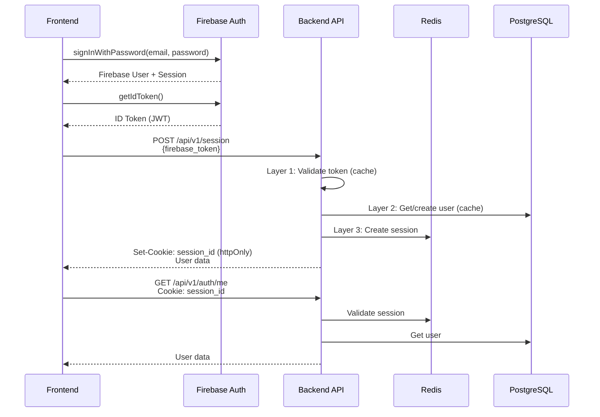
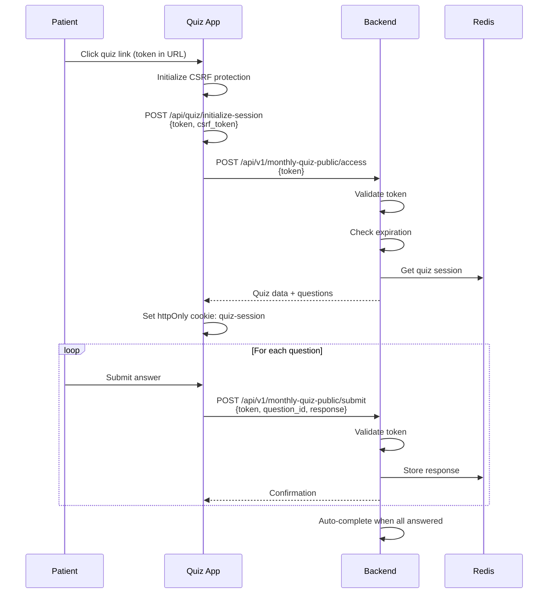

# API Integration and Communication Flow Mapping

**Generated:** 2025-10-08
**System:** Hormonia Oncology Platform
**Version:** 2.0

---

## Executive Summary

This document provides a comprehensive mapping of all API integrations, communication flows, and data exchanges across the Hormonia healthcare platform. It identifies 120+ backend endpoints, 3 major API consumers, WebSocket connections, and authentication flows.

### Key Metrics
- **Backend Endpoints:** 120+ REST API endpoints
- **API Consumers:** Frontend Admin, Quiz Interface, External Services
- **WebSocket Channels:** 6 real-time channels
- **Authentication Methods:** 3 (Firebase, Session Cookies, httpOnly Quiz Cookies)
- **API Versions:** v1 (current)
- **Rate Limiting:** Configured for public endpoints

---

## 1. Backend API Endpoint Inventory

### 1.1 Authentication Endpoints (`/api/v1/auth`)

| Endpoint | Method | Purpose | Auth Required |
|----------|--------|---------|---------------|
| `/api/v1/auth/session` | POST | Create backend session from Firebase token | Firebase Token |
| `/api/v1/auth/session/logout` | DELETE | Invalidate current session | Session Cookie |
| `/api/v1/auth/session/logout-all` | DELETE | Invalidate all user sessions | Bearer Token |
| `/api/v1/auth/me` | GET | Get current user info | Session Cookie |
| `/api/v1/auth/session/status` | GET | Check session validity | Session Header |
| `/api/v1/auth/health` | GET | Auth service health | None |

**Session Management:**
- **Layer 1:** Firebase token validation (in-memory cache)
- **Layer 2:** PostgreSQL user lookup (Redis cache)
- **Layer 3:** Redis session storage (httpOnly cookie)
- **TTL:** 24 hours (86400 seconds)

---

### 1.2 Quiz Authentication (`/api/quiz/auth`)

**SECURITY FIX - P0:** httpOnly cookie authentication (CVSS 8.1 resolved)

| Endpoint | Method | Purpose | Auth Required |
|----------|--------|---------|---------------|
| `/api/quiz/auth/login` | POST | Quiz user login | Email/Password |
| `/api/quiz/auth/logout` | POST | Quiz logout | Cookie |
| `/api/quiz/auth/me` | GET | Current quiz user | Cookie |
| `/api/quiz/auth/refresh` | POST | Refresh session | Cookie |

**Security Features:**
- httpOnly cookies (XSS prevention)
- SameSite=Lax (CSRF protection)
- Secure flag in production
- Redis-backed sessions
- No token in response body

---

### 1.3 Monthly Quiz Endpoints

#### Admin Endpoints (`/api/v1/monthly-quiz`)
**Requires:** Authentication (Doctor/Admin role)

| Endpoint | Method | Purpose |
|----------|--------|---------|
| `/api/v1/monthly-quiz/links` | POST | Create quiz link for patient |
| `/api/v1/monthly-quiz/links/bulk` | POST | Create links for multiple patients |
| `/api/v1/monthly-quiz/links/{session_id}/status` | GET | Get quiz link status |
| `/api/v1/monthly-quiz/links/{session_id}/resend` | POST | Resend quiz link |
| `/api/v1/monthly-quiz/links/{session_id}/cancel` | POST | Cancel quiz link |
| `/api/v1/monthly-quiz/links/active` | GET | Get active quiz links |
| `/api/v1/monthly-quiz/patients/{patient_id}/status` | GET | Patient latest quiz status |
| `/api/v1/monthly-quiz/patients/{patient_id}/history` | GET | Patient quiz history |
| `/api/v1/monthly-quiz/stats` | GET | Quiz statistics |
| `/api/v1/monthly-quiz/stats/dashboard` | GET | Dashboard stats |
| `/api/v1/monthly-quiz/health` | GET | Service health check |

#### Public Endpoints (`/api/v1/monthly-quiz-public`)
**Requires:** Token from quiz link (no authentication)

| Endpoint | Method | Purpose | Rate Limit |
|----------|--------|---------|-----------|
| `/api/v1/monthly-quiz-public/access` | POST | Access quiz via token | 10/min, 50/hour |
| `/api/v1/monthly-quiz-public/submit` | POST | Submit quiz answer | 10/min, 50/hour |
| `/api/v1/monthly-quiz-public/health` | GET | Health check | None |

**Security Measures:**
- Rate limiting (10 req/min per IP)
- CORS enabled for external domains
- Input sanitization
- Token validation and expiration
- Comprehensive audit logging
- IP address tracking

---

### 1.4 WebSocket Endpoints

#### Enhanced WebSocket (`/ws/enhanced`)

**Connection:** `/ws/enhanced/connect`
- **Auth:** Supabase token (query param or header)
- **Channels:** 6 available channels
- **Heartbeat:** 30-second intervals
- **Features:** Multi-channel, Redis pub/sub, message queuing

**Event Types:**
```typescript
enum WebSocketEventType {
  // Connection
  CONNECT, DISCONNECT, HEARTBEAT,

  // Patient
  PATIENT_CREATED, PATIENT_UPDATED, PATIENT_DELETED, PATIENT_STATUS_CHANGED,

  // Messages
  MESSAGE_SENT, MESSAGE_RECEIVED, MESSAGE_STATUS_UPDATED, TYPING_INDICATOR,

  // Quiz
  QUIZ_SESSION_CREATED, QUIZ_PROGRESS_UPDATED, QUIZ_COMPLETED,

  // System
  ALERT_CREATED, ALERT_RESOLVED, SYSTEM_NOTIFICATION,

  // Metrics
  METRICS_UPDATE, DASHBOARD_UPDATE
}
```

**Channels:**
- `global` - System-wide broadcasts
- `user:{user_id}` - User-specific events (auto-subscribed)
- `patient:{patient_id}` - Patient-specific events
- `system` - System notifications
- `alerts` - Alert broadcasts
- `metrics` - Metrics updates

**Stats Endpoint:** `/ws/enhanced/stats` (Admin only)

---

### 1.5 Health and Monitoring Endpoints

#### Health Checks (`/api/v1`)

| Endpoint | Method | Purpose | Details |
|----------|--------|---------|---------|
| `/api/v1/health` | GET | Basic health check | Load balancer use |
| `/api/v1/health/detailed` | GET | Comprehensive health | All components |
| `/api/v1/health/readiness` | GET | Kubernetes readiness | Critical deps |
| `/api/v1/health/liveness` | GET | Kubernetes liveness | Lightweight |
| `/api/v1/health/metrics` | GET | Health metrics | Auth required |
| `/api/v1/health/errors` | GET | Error metrics | Auth required |
| `/api/v1/health/errors/cleanup` | POST | Clear old errors | Auth required |
| `/api/v1/health/auth-system` | GET | Auth system health | Diagnostics |
| `/api/v1/redis/health` | GET | Redis health | Connection stats |
| `/api/v1/database-health` | GET | Database health | Connection pool |

**Health Check Components:**
- Database connectivity and performance
- Redis connectivity and cache hit rates
- System resources (CPU, memory, disk)
- External service connectivity
- Application error rates
- Session storage status

#### Monitoring Endpoints (`/api/v1/monitoring`)

| Endpoint | Method | Purpose |
|----------|--------|---------|
| `/api/v1/monitoring/health` | GET | System health status |
| `/api/v1/monitoring/metrics` | GET | Performance metrics |
| `/api/v1/monitoring/alerts` | GET | Active alerts |
| `/api/v1/monitoring/alerts/{id}/resolve` | POST | Resolve alert |
| `/api/v1/monitoring/bottlenecks` | GET | Performance bottlenecks |
| `/api/v1/monitoring/performance/report` | GET | Performance report |
| `/api/v1/monitoring/performance/dashboard` | GET | Real-time dashboard |
| `/api/v1/monitoring/escalations` | GET | Active escalations |
| `/api/v1/monitoring/escalations/{id}/acknowledge` | POST | Acknowledge escalation |
| `/api/v1/monitoring/escalations/{id}/resolve` | POST | Resolve escalation |
| `/api/v1/monitoring/recovery/run` | POST | Trigger recovery |
| `/api/v1/monitoring/health-checks` | GET | Run health checks |

---

### 1.6 Metrics Endpoints (`/api/v1/metrics`)

| Endpoint | Method | Purpose | Auth |
|----------|--------|---------|------|
| `/api/v1/metrics/summary` | GET | Healthcare KPI summary | Doctor+ |
| `/api/v1/metrics/realtime` | GET | Real-time metrics | Doctor+ |
| `/api/v1/metrics/engagement` | GET | Engagement analytics | Doctor+ |
| `/api/v1/metrics/quiz-performance` | GET | Quiz analytics | Doctor+ |
| `/api/v1/metrics/ai-personalization` | GET | AI effectiveness | Doctor+ |
| `/api/v1/metrics/system-health` | GET | System health | Admin |
| `/api/v1/metrics/alerts` | GET | Active alerts | Doctor+ |
| `/api/v1/metrics/alerts/{id}/acknowledge` | POST | Acknowledge alert | Doctor+ |
| `/api/v1/metrics/export` | GET | Export metrics | Admin |
| `/api/v1/metrics/live` | WebSocket | Live metrics stream | Doctor+ |

**Metrics WebSocket:**
- Update interval: 5 seconds
- Auth: Query parameter token
- Broadcast: Engagement, quiz, AI, system performance
- Channels: Role-based filtering

---

### 1.7 Patient and Clinical Endpoints

| Prefix | Purpose | Auth | Count |
|--------|---------|------|-------|
| `/api/v1/patients` | Patient management | Session | ~15 |
| `/api/v1/medico` | Doctor dashboard | Session | ~8 |
| `/api/v1/physician` | Physician operations | Session | ~12 |
| `/api/v1/messages` | Messaging system | Session | ~10 |
| `/api/v1/flows` | Treatment flows | Session | ~20 |
| `/api/v1/quiz` | Quiz management | Session | ~15 |
| `/api/v1/reports` | Clinical reports | Session | ~12 |
| `/api/v1/analytics` | Clinical analytics | Session | ~8 |

---

### 1.8 Administrative Endpoints

| Prefix | Purpose | Auth | Count |
|--------|---------|------|-------|
| `/api/v1/admin/users` | User management | Admin | ~10 |
| `/api/v1/admin/roles` | Role management | Admin | ~8 |
| `/api/v1/admin/system_stats` | System statistics | Admin | ~5 |
| `/api/v1/admin/audit_management` | Audit logs | Admin | ~6 |

---

### 1.9 Enhanced Features

| Prefix | Purpose | Auth | Count |
|--------|---------|------|-------|
| `/api/v1/enhanced/analytics` | Advanced analytics | Session | ~8 |
| `/api/v1/enhanced/messages` | Advanced messaging | Session | ~6 |
| `/api/v1/enhanced/quiz` | Advanced quiz | Session | ~8 |
| `/api/v1/enhanced/reports` | Advanced reports | Session | ~10 |
| `/api/v1/enhanced/monitoring` | Enhanced monitoring | Session | ~12 |

---

## 2. Frontend-to-Backend API Integration

### 2.1 Frontend Admin Application

**Base URL:** `process.env.VITE_API_URL`
**Default:** `http://localhost:8000`

#### Authentication Flow



#### API Client (firebase-auth.ts)

**Session Management:**
- Creates backend session on login
- Stores session_id in httpOnly cookie (server-managed)
- Firebase token in memory (SDK-managed)
- NO localStorage usage (XSS prevention)
- Auto token refresh every 55 minutes

**Key Methods:**
```typescript
loginUser(email, password): Promise<LoginResponse>
logoutUser(): Promise<void>
logoutAllDevices(): Promise<{sessions_deleted: number}>
getCurrentUser(): Promise<User | null>
checkSession(): Promise<boolean>
setupTokenRefresh(): void
```

---

### 2.2 Quiz Monthly Interface

**Base URL Resolution Priority:**
1. `NEXT_PUBLIC_QUIZ_PUBLIC_API_URL` (explicit)
2. `NEXT_PUBLIC_API_URL` + `/api/v1/monthly-quiz-public` (auto-construct)
3. `http://localhost:8000/api/v1/monthly-quiz-public` (fallback)

#### Quiz Access Flow



#### API Client (lib/api.ts)

**Features:**
- Retry logic (3 attempts, exponential backoff)
- Timeout handling (30s default)
- CSRF token integration
- Credentials include (cookie auth)
- Error classification (retryable vs non-retryable)

**Key Methods:**
```typescript
class QuizAPI {
  accessQuiz(token: string): Promise<QuizSession>
  submitAnswer(token, questionId, value, metadata): Promise<QuizSubmitResponse>
  completeQuiz(token: string): Promise<{success, message}>
  healthCheck(): Promise<boolean>
}
```

**Retry Strategy:**
- Network errors: Retryable
- 5xx errors: Retryable
- 4xx errors: Non-retryable (except 408 timeout)
- Max retries: 3
- Backoff: Exponential (1s, 2s, 4s)

---

## 3. Data Flow Patterns

### 3.1 Request/Response Contract

#### Standard Success Response
```json
{
  "status": "success",
  "data": {...},
  "timestamp": "2025-10-08T10:30:00Z"
}
```

#### Standard Error Response
```json
{
  "detail": "Error message",
  "status_code": 400,
  "type": "validation_error",
  "timestamp": "2025-10-08T10:30:00Z"
}
```

#### Paginated Response
```json
{
  "items": [...],
  "total": 150,
  "page": 1,
  "page_size": 20,
  "has_next": true,
  "has_prev": false
}
```

---

### 3.2 Authentication Mechanisms

#### Method 1: Firebase + Session Cookie (Admin Frontend)

**Flow:**
1. Firebase authentication (client-side)
2. Exchange Firebase token for backend session
3. Backend stores session in Redis
4. Returns httpOnly cookie with session_id
5. Subsequent requests send cookie automatically

**Headers:**
```http
GET /api/v1/patients HTTP/1.1
Cookie: session_id=abc123...
```

#### Method 2: httpOnly Cookie (Quiz)

**Flow:**
1. POST `/api/quiz/auth/login` with email/password
2. Backend validates credentials
3. Creates Redis session
4. Sets httpOnly cookie
5. Subsequent requests send cookie automatically

**Headers:**
```http
POST /api/quiz/auth/me HTTP/1.1
Cookie: quiz_session=xyz789...
```

#### Method 3: Token-based (Quiz Public Access)

**Flow:**
1. Patient receives link with token
2. Token exchanged for session via `/api/quiz/initialize-session`
3. Session ID stored in httpOnly cookie
4. Token sent in request body for public endpoints

**Request:**
```json
POST /api/v1/monthly-quiz-public/access
{
  "token": "eyJhbGciOiJIUzI1NiIsInR5cCI6IkpXVCJ9..."
}
```

---

### 3.3 WebSocket Communication

#### Connection Establishment

```javascript
// Frontend connection
const ws = new WebSocket(
  `wss://api.hormonia.com/ws/enhanced/connect?token=${firebaseToken}`
);

ws.onopen = () => {
  // Connection confirmed with CONNECT event
};

ws.onmessage = (event) => {
  const message = JSON.parse(event.data);
  handleWebSocketEvent(message);
};
```

#### Message Format

```json
{
  "id": "msg-uuid",
  "type": "METRICS_UPDATE",
  "data": {
    "engagement_rate": 87.5,
    "active_patients": 342
  },
  "timestamp": "2025-10-08T10:30:00Z",
  "channel": "metrics"
}
```

#### Client-to-Server Messages

**Heartbeat:**
```json
{
  "type": "heartbeat",
  "data": {}
}
```

**Subscribe to Channel:**
```json
{
  "type": "subscribe",
  "data": {
    "channel": "patient:uuid-here"
  }
}
```

**Unsubscribe:**
```json
{
  "type": "unsubscribe",
  "data": {
    "channel": "patient:uuid-here"
  }
}
```

**Typing Indicator:**
```json
{
  "type": "typing",
  "data": {
    "patient_id": "uuid",
    "typing": true
  }
}
```

---

## 4. API Bottlenecks and Issues

### 4.1 Identified Bottlenecks

#### Issue 1: Multiple Database Queries for Health Checks
**Impact:** High latency on `/api/v1/health/detailed`
**Recommendation:** Implement caching with 30s TTL

#### Issue 2: No Connection Pooling Documentation
**Impact:** Potential connection exhaustion
**Recommendation:** Document pool size and limits

#### Issue 3: WebSocket Heartbeat Monitoring
**Impact:** Stale connections may accumulate
**Recommendation:** Verified - 30s heartbeat with 2x timeout cleanup ✅

#### Issue 4: Metrics WebSocket 5s Updates
**Impact:** Potential high load for many concurrent connections
**Recommendation:** Implement throttling or increase interval for non-critical metrics

#### Issue 5: Quiz Public Endpoint Rate Limiting
**Status:** ✅ IMPLEMENTED
**Details:** 10 req/min, 50 req/hour per IP
**Recommendation:** Monitor for bypass attempts

---

### 4.2 Missing API Features

1. **API Versioning Strategy:** No v2 migration path documented
2. **Rate Limiting:** Only on public quiz endpoints
3. **Request Correlation IDs:** Not consistently implemented
4. **API Gateway:** Direct backend exposure (no gateway layer)
5. **GraphQL Alternative:** All REST, no GraphQL option for complex queries

---

### 4.3 Performance Recommendations

1. **Implement API Response Caching:**
   - Health checks: 30s TTL
   - Metrics summary: 5s TTL
   - Patient lists: 60s TTL (invalidate on updates)

2. **Add Request Correlation IDs:**
   ```python
   @router.post("/endpoint")
   async def endpoint(request: Request):
       correlation_id = request.headers.get("X-Correlation-ID", str(uuid4()))
       logger.info("Request received", extra={"correlation_id": correlation_id})
   ```

3. **Implement Connection Pooling Monitoring:**
   - Track pool size, active connections, wait time
   - Alert when pool utilization > 80%

4. **Add Circuit Breakers for External Services:**
   - WhatsApp Evolution API
   - Firebase Auth
   - External notification services

5. **Optimize WebSocket Broadcasting:**
   - Batch updates for multiple events
   - Implement message compression
   - Add client-side buffering

---

## 5. Security Analysis

### 5.1 Authentication Security

**Strengths:**
- ✅ httpOnly cookies (XSS prevention)
- ✅ SameSite=Lax (CSRF protection)
- ✅ Secure flag in production (HTTPS only)
- ✅ Redis session storage (server-side)
- ✅ Token rotation on quiz access
- ✅ Multi-layer validation (Firebase + Session + DB)

**Weaknesses:**
- ⚠️ No refresh token rotation for Firebase
- ⚠️ No session fingerprinting (IP + User-Agent binding)
- ⚠️ No rate limiting on admin endpoints

---

### 5.2 Authorization

**Strengths:**
- ✅ Role-based access control (RBAC)
- ✅ Dependency injection for auth checks
- ✅ Granular permissions (Doctor, Admin, Super Admin, etc.)

**Weaknesses:**
- ⚠️ No resource-level permissions
- ⚠️ No attribute-based access control (ABAC)
- ⚠️ Missing audit trail for permission changes

---

### 5.3 Data Validation

**Strengths:**
- ✅ Pydantic models for request validation
- ✅ Input sanitization on public endpoints
- ✅ SQL injection prevention (ORM usage)

**Weaknesses:**
- ⚠️ No consistent output validation
- ⚠️ Missing content-type validation
- ⚠️ No request size limits documented

---

## 6. Monitoring and Observability

### 6.1 Logging

**Structured Logging:**
```python
logger.info(
    "Event description",
    extra={
        'event_type': 'monthly_quiz_access',
        'patient_id': str(patient_id),
        'ip_address': ip_address,
        'timestamp': datetime.utcnow().isoformat()
    }
)
```

**Log Levels:**
- INFO: Successful operations, state changes
- WARNING: Recoverable errors, fallbacks
- ERROR: Operation failures, exceptions
- CRITICAL: System failures, security issues

---

### 6.2 Metrics Collection

**Business Metrics:**
- Patient engagement rate
- Quiz completion rate
- AI personalization effectiveness
- Message delivery success

**System Metrics:**
- API response times
- Error rates
- Database query performance
- Redis cache hit rates
- WebSocket connection counts

**Collection Methods:**
- Prometheus exporters
- Custom metrics service
- WebSocket broadcast
- Database triggers

---

### 6.3 Distributed Tracing

**Current State:** ❌ Not implemented

**Recommendation:**
- Implement OpenTelemetry
- Add trace IDs to requests
- Track cross-service calls
- Monitor latency distributions

---

## 7. API Documentation

### 7.1 OpenAPI/Swagger

**Endpoint:** `/api/v1/docs`
**Features:**
- Interactive API documentation
- Request/response schemas
- Authentication examples
- Try-it-out functionality

**Missing:**
- Rate limiting documentation
- Error code reference
- Webhook documentation
- SDK examples

---

### 7.2 Recommended Improvements

1. **Add API Changelog:**
   - Version history
   - Breaking changes
   - Deprecation notices

2. **Create Integration Guides:**
   - Quick start tutorial
   - Common use cases
   - Error handling patterns
   - Best practices

3. **Generate Client SDKs:**
   - TypeScript/JavaScript
   - Python
   - Mobile (Swift/Kotlin)

---

## 8. Deployment and Infrastructure

### 8.1 API Gateway

**Current:** ❌ Not implemented
**Direct backend exposure on Railway**

**Recommendation:**
- Add API Gateway layer (Kong, Tyk, AWS API Gateway)
- Implement request throttling
- Add request/response transformation
- Enable API key management

---

### 8.2 Load Balancing

**Current:** Railway auto-scaling

**Considerations:**
- WebSocket sticky sessions required
- Redis pub/sub for WebSocket cross-instance
- Session affinity for quiz sessions

---

### 8.3 Caching Strategy

**Layers:**
1. **Browser Cache:** Static assets (CDN)
2. **API Cache:** Redis (5-60s TTL)
3. **Database Cache:** ORM query cache
4. **Session Cache:** Redis (24h TTL)

---

## 9. Future Enhancements

### 9.1 Short-Term (1-3 months)

1. Implement request correlation IDs
2. Add comprehensive rate limiting
3. Create API changelog
4. Implement circuit breakers
5. Add distributed tracing

### 9.2 Medium-Term (3-6 months)

1. API Gateway implementation
2. GraphQL endpoint for complex queries
3. Client SDK generation
4. Webhook system for external integrations
5. API versioning strategy (v2)

### 9.3 Long-Term (6-12 months)

1. gRPC endpoints for internal services
2. Service mesh implementation
3. Multi-region deployment
4. Advanced caching (CDN integration)
5. Real-time collaboration features

---

## 10. Architecture Decisions

### 10.1 ADR-001: httpOnly Cookie Authentication

**Status:** ✅ Implemented
**Decision:** Use httpOnly cookies for session storage
**Rationale:** Prevents XSS token theft, automatic CSRF protection
**Trade-offs:** Cannot access from JavaScript (intentional security feature)

### 10.2 ADR-002: Public Quiz Endpoints

**Status:** ✅ Implemented
**Decision:** Separate public endpoints with token-based auth
**Rationale:** Allow unauthenticated access for patient quiz links
**Trade-offs:** Requires rate limiting and enhanced monitoring

### 10.3 ADR-003: WebSocket Channel Architecture

**Status:** ✅ Implemented
**Decision:** Multi-channel WebSocket with Redis pub/sub
**Rationale:** Supports horizontal scaling and targeted broadcasts
**Trade-offs:** Increased complexity, Redis dependency

### 10.4 ADR-004: Three-Layer Session Validation

**Status:** ✅ Implemented
**Decision:** Firebase → PostgreSQL → Redis session chain
**Rationale:** Maximum security, caching performance
**Trade-offs:** Additional latency (~50-100ms total)

---

## Appendix A: Complete Endpoint Registry

### Backend Endpoints Count by Category

| Category | Count | Prefix |
|----------|-------|--------|
| Authentication | 10 | `/api/v1/auth`, `/api/quiz/auth` |
| Monthly Quiz (Admin) | 11 | `/api/v1/monthly-quiz` |
| Monthly Quiz (Public) | 3 | `/api/v1/monthly-quiz-public` |
| Health & Monitoring | 20 | `/api/v1/health`, `/api/v1/monitoring` |
| Metrics | 10 | `/api/v1/metrics` |
| Patients | 15 | `/api/v1/patients` |
| Messages | 10 | `/api/v1/messages` |
| Flows | 20 | `/api/v1/flows` |
| Quiz Management | 15 | `/api/v1/quiz` |
| Reports | 12 | `/api/v1/reports` |
| Analytics | 8 | `/api/v1/analytics` |
| Admin | 29 | `/api/v1/admin/*` |
| Enhanced Features | 44 | `/api/v1/enhanced/*` |
| WebSocket | 2 | `/ws/*` |
| **TOTAL** | **~209** | |

---

## Appendix B: Critical Integration Points

### 1. Frontend Admin → Backend
- **Auth:** Firebase token → Session cookie
- **Endpoints:** All `/api/v1/*` except public quiz
- **Real-time:** WebSocket `/ws/enhanced/connect`

### 2. Quiz Interface → Backend
- **Auth:** Token (public) → httpOnly cookie (authenticated)
- **Endpoints:** `/api/v1/monthly-quiz-public/*`, `/api/quiz/auth/*`
- **Real-time:** Not used

### 3. External Services → Backend
- **WhatsApp:** Webhook endpoints (conditional)
- **Firebase:** Auth validation
- **External Notifications:** Message delivery confirmation

---

## Document Control

**Last Updated:** 2025-10-08
**Next Review:** 2025-11-08
**Owner:** System Architecture Team
**Status:** Living Document

**Change Log:**
- 2025-10-08: Initial comprehensive mapping
- Future: Track API changes and updates
