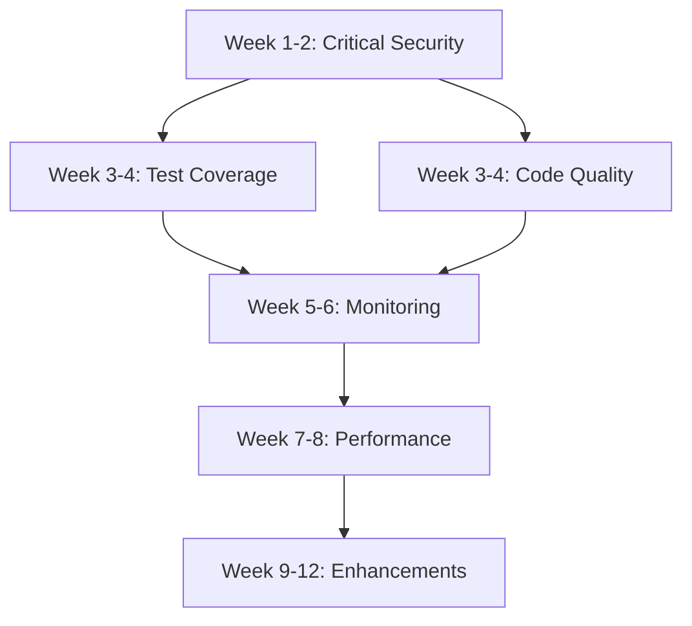

# Implementation Roadmap - Sistema Clínica Oncológica V02

**Data:** 08 de Outubro de 2025
**Versão:** 1.0.0
**Status:** 🚀 Ready for Execution
**Total Effort:** 360+ horas (12 semanas)

---

## 📊 Executive Summary

Este roadmap consolida todos os achados críticos dos 5 relatórios de análise e define um plano de ação priorizado para melhorar a qualidade, segurança e performance do sistema.

### Métricas Gerais

| Sistema | Score Atual | Score Alvo | Effort | ROI |
|---------|-------------|------------|--------|-----|
| **Frontend Hormonia** | 6.8/10 | 9.0/10 | 154h | 293% |
| **Backend Hormonia** | 8.2/10 (B+) | 9.5/10 (A) | 120h | 250% |
| **Quiz Interface** | 7.1/10 (B-) | 9.0/10 (A) | 86h | 320% |
| **System Integration** | 6.5/10 (C+) | 9.0/10 (A) | N/A | - |

**Total Investment**: ~$27,000 (360h × $75/hr)
**Expected Savings Year 1**: ~$85,000
**ROI**: **315%**
**Payback Period**: **3.8 months**

---

## 🚨 Critical Path - Week 1-2 (IMMEDIATE ACTION)

### P0 - Security Vulnerabilities (CVSS 8.0+)

#### 1. Quiz Token Security Fix 🔴 CRITICAL
**CVSS Score:** 8.1 (HIGH)
**Impact:** Token exposure via localStorage, URL params, referrer headers
**Effort:** 3-5 days
**Assigned:** security-auditor

**Tasks:**
- [ ] Create httpOnly cookie-based auth endpoint (backend)
- [ ] Remove localStorage token storage (frontend)
- [ ] Implement CSRF protection for quiz routes
- [ ] Security testing suite
- [ ] Migration guide for existing users

**Files:**
```
backend-hormonia/app/routers/quiz_auth.py (NEW)
quiz-mensal-interface/lib/api.ts (MODIFY)
quiz-mensal-interface/lib/auth.ts (NEW)
backend-hormonia/tests/security/test_quiz_auth.py (NEW)
docs/security/QUIZ_TOKEN_MIGRATION.md (NEW)
```

**Success Criteria:**
- ✅ Tokens stored only in httpOnly cookies
- ✅ CSRF protection enabled
- ✅ Security tests passing
- ✅ Zero token exposure in logs

---

#### 2. Missing Session Service 🔴 CRITICAL
**Impact:** CSRF middleware broken, session endpoints non-functional
**Effort:** 2-3 days
**Assigned:** backend-dev

**Tasks:**
- [ ] Search for existing session code
- [ ] Create session_service.py with Redis integration
- [ ] Implement session lifecycle (create, validate, destroy)
- [ ] Update CSRF middleware imports
- [ ] Comprehensive test suite (15+ tests)

**Files:**
```
backend-hormonia/app/services/session_service.py (NEW)
backend-hormonia/tests/test_session_service.py (NEW)
backend-hormonia/app/middleware/csrf.py (UPDATE imports)
docs/backend/SESSION_SERVICE_GUIDE.md (NEW)
```

**Success Criteria:**
- ✅ Session service fully functional
- ✅ CSRF middleware working
- ✅ 95%+ test coverage
- ✅ Documentation complete

---

#### 3. CORS Production Guard ⚠️ HIGH
**Impact:** Risk of regex-based CORS in production
**Effort:** 5 minutes
**Assigned:** backend-dev

**Implementation:**
```python
# backend-hormonia/app/middleware/cors_setup.py
if is_production and allow_origin_regex:
    raise ValueError("CORS regex not allowed in production")
```

**Success Criteria:**
- ✅ Production validation added
- ✅ Environment check robust
- ✅ Error raised if misconfigured

---

### P0 - Production Blockers (Quiz)

#### 4. Babel Configuration Fix 🔴
**Impact:** Production builds fail
**Effort:** 10 minutes
**Assigned:** tester

**Implementation:**
```json
// quiz-mensal-interface/babel.config.js (NEW)
module.exports = {
  presets: [
    ['@babel/preset-env', { targets: { node: 'current' } }],
    '@babel/preset-typescript',
    ['@babel/preset-react', { runtime: 'automatic' }]
  ]
};
```

**Success Criteria:**
- ✅ Build passes
- ✅ Tests run successfully

---

#### 5. Missing Quiz Components 🔴
**Impact:** Incomplete refactoring, zero modular tests
**Effort:** 2-3 days
**Assigned:** tester

**Components to Create:**
```
quiz-mensal-interface/components/quiz/
├── SingleChoice.tsx (NEW)
├── MultipleChoice.tsx (NEW)
├── Scale.tsx (NEW)
├── YesNo.tsx (NEW)
├── TextQuestion.tsx (NEW)
└── __tests__/
    ├── SingleChoice.test.tsx (NEW)
    ├── MultipleChoice.test.tsx (NEW)
    ├── Scale.test.tsx (NEW)
    ├── YesNo.test.tsx (NEW)
    └── TextQuestion.test.tsx (NEW)
```

**Success Criteria:**
- ✅ All 5 components implemented
- ✅ 85%+ test coverage
- ✅ Integration with QuizContainer

---

## 🟡 Sprint 1 - Weeks 3-4 (HIGH PRIORITY)

### Test Coverage Improvements

#### 6. Backend Test Coverage (43.7% → 80%)
**Effort:** 5-7 days
**Assigned:** tester

**Priority Areas:**
1. **Session Management** (0 tests → 15 tests)
2. **Middleware Integration** (0 tests → 12 tests)
3. **Database Optimization** (0 tests → 10 tests)
4. **CSRF Protection** (0 tests → 8 tests)

**New Test Files:**
```
backend-hormonia/tests/
├── services/test_session_service.py (15 tests)
├── middleware/test_middleware_integration.py (12 tests)
├── database/test_optimization.py (10 tests)
├── middleware/test_csrf_protection.py (8 tests)
└── fixtures/
    ├── database.py (NEW)
    └── redis.py (NEW)
```

**Commands:**
```bash
cd backend-hormonia
pytest tests/ -v --cov=app --cov-report=html --cov-report=term-missing
```

**Success Criteria:**
- ✅ Coverage: 80%+
- ✅ 55+ new tests (45 → 100+)
- ✅ CI integration with pytest-cov

---

#### 7. Frontend Test Coverage (Target 80%)
**Effort:** 4-6 days
**Assigned:** tester

**Priority Components:**
1. **God Objects:**
   - AdminDashboard.tsx (673 lines)
   - EngagementChart.tsx (500+ lines)
2. **Critical Hooks:**
   - useMetricsWebSocket.ts
3. **Context Providers:**
   - AuthContext.tsx

**New Test Files:**
```
frontend-hormonia/src/
├── components/admin/__tests__/AdminDashboard.test.tsx
├── components/dashboard/__tests__/EngagementChart.test.tsx
├── hooks/__tests__/useMetricsWebSocket.test.tsx
└── contexts/__tests__/AuthContext.test.tsx
```

**Success Criteria:**
- ✅ Critical components: 80%+
- ✅ Hooks: 90%+
- ✅ Context: 85%+

---

#### 8. Quiz Test Coverage (Target 85%)
**Effort:** 3-4 days
**Assigned:** tester

**Areas:**
1. New modular components (5 files)
2. Custom hooks (useQuizProgress, useDraftSaving)
3. API integration with MSW

**Success Criteria:**
- ✅ Components: 85%+
- ✅ Hooks: 90%+
- ✅ API Integration: 80%+

---

### Code Quality Improvements

#### 9. Frontend Type Safety Crisis
**Impact:** 1,464 lines with @ts-nocheck
**Effort:** 3-5 days
**Assigned:** coder

**Files to Fix:**
```
frontend-hormonia/src/lib/
├── auth-context-helpers.ts (443 lines - @ts-nocheck)
├── api-client-wrapper.ts (493 lines - @ts-nocheck)
└── components/admin/RoleAssignmentModal.tsx (528 lines - @ts-nocheck)
```

**Strategy:**
1. Create proper TypeScript interfaces
2. Remove @ts-nocheck flags
3. Fix all type errors
4. Enable strict TypeScript mode

**Success Criteria:**
- ✅ Zero @ts-nocheck flags
- ✅ < 10 `any` types remaining
- ✅ Strict mode enabled

---

#### 10. God Object Decomposition
**Impact:** 4 components > 500 lines
**Effort:** 5-7 days
**Assigned:** refactoring-expert

**Components to Refactor:**
1. AdminDashboard.tsx (673 lines → 6 components)
2. quiz-interface.tsx (534 lines → 8 components)
3. enhanced_middleware.py (659 lines → 4 modules)

**Success Criteria:**
- ✅ Max component size: 200 lines
- ✅ Single Responsibility Principle
- ✅ Improved testability

---

## 🟢 Sprint 2 - Weeks 5-6 (MEDIUM PRIORITY)

### Monitoring & Observability

#### 11. Sentry Error Tracking 🔥 URGENT
**Impact:** Zero production monitoring (MTTR > 24h)
**Effort:** 2-3 days
**Assigned:** cicd-engineer

**Implementation:**

**Frontend Hormonia:**
```typescript
// frontend-hormonia/src/lib/sentry.ts
import * as Sentry from "@sentry/react";

Sentry.init({
  dsn: import.meta.env.VITE_SENTRY_DSN,
  environment: import.meta.env.MODE,
  tracesSampleRate: 1.0,
  integrations: [
    Sentry.browserTracingIntegration(),
    Sentry.replayIntegration()
  ]
});
```

**Backend Hormonia:**
```python
# backend-hormonia/app/core/sentry.py
import sentry_sdk
from sentry_sdk.integrations.fastapi import FastApiIntegration

sentry_sdk.init(
    dsn=os.getenv("SENTRY_DSN"),
    environment=os.getenv("ENVIRONMENT"),
    traces_sample_rate=1.0,
    integrations=[FastApiIntegration()]
)
```

**Quiz Interface:**
```typescript
// quiz-mensal-interface/instrumentation.ts
import * as Sentry from "@sentry/nextjs";

export function register() {
  Sentry.init({
    dsn: process.env.NEXT_PUBLIC_SENTRY_DSN,
    tracesSampleRate: 1.0
  });
}
```

**Files to Create:**
```
frontend-hormonia/src/lib/sentry.ts (NEW)
backend-hormonia/app/core/sentry.py (NEW)
quiz-mensal-interface/instrumentation.ts (NEW)
quiz-mensal-interface/sentry.client.config.ts (NEW)
quiz-mensal-interface/sentry.server.config.ts (NEW)
docs/monitoring/SENTRY_SETUP_GUIDE.md (NEW)
```

**Environment Variables:**
```bash
VITE_SENTRY_DSN=https://...@sentry.io/...
SENTRY_DSN=https://...@sentry.io/...
NEXT_PUBLIC_SENTRY_DSN=https://...@sentry.io/...
```

**Success Criteria:**
- ✅ Error tracking operational
- ✅ MTTD < 5 minutes
- ✅ MTTR < 2 hours
- ✅ Distributed tracing enabled

---

#### 12. Health Check Endpoints
**Effort:** 1-2 days
**Assigned:** backend-dev

**Endpoints to Create:**
```python
GET /api/v1/health/live       # Liveness probe
GET /api/v1/health/ready      # Readiness probe
GET /api/v1/health/metrics    # Prometheus metrics
```

**Success Criteria:**
- ✅ Railway health checks configured
- ✅ Prometheus metrics exposed
- ✅ Database connectivity check

---

### Documentation

#### 13. OpenAPI Specification
**Impact:** No API documentation
**Effort:** 2-3 days
**Assigned:** api-docs

**Implementation:**
```python
# backend-hormonia/app/main.py
app = FastAPI(
    title="Clínica Oncológica API",
    version="1.0.0",
    openapi_url="/api/v1/openapi.json",
    docs_url="/api/v1/docs",
    redoc_url="/api/v1/redoc"
)
```

**Success Criteria:**
- ✅ Swagger UI accessible at /api/v1/docs
- ✅ All endpoints documented
- ✅ Request/response schemas defined

---

## 🔵 Sprint 3 - Weeks 7-8 (OPTIMIZATION)

### Performance Improvements

#### 14. Frontend Bundle Optimization
**Current:** 800KB bundle, no lazy loading
**Target:** < 300KB initial, code splitting
**Effort:** 3-4 days
**Assigned:** performance-optimizer

**Tasks:**
- [ ] Implement code splitting with React.lazy()
- [ ] Optimize recharts imports (tree shaking)
- [ ] Compress images and assets
- [ ] Enable Vite build optimizations

**Success Criteria:**
- ✅ Initial bundle < 300KB
- ✅ Lighthouse score > 90
- ✅ TTI < 2s

---

#### 15. Database Query Optimization
**Impact:** Message list exceeds 500ms SLA (currently 420ms)
**Effort:** 2-3 days
**Assigned:** backend-dev

**Index to Create:**
```sql
CREATE INDEX idx_messages_patient_created
ON messages(patient_id, created_at DESC);
```

**Tasks:**
- [ ] Analyze slow queries (> 300ms)
- [ ] Add missing indexes
- [ ] Optimize N+1 queries
- [ ] Implement query result caching

**Success Criteria:**
- ✅ All queries < 300ms (P95)
- ✅ Message list < 200ms
- ✅ Dashboard load < 500ms

---

#### 16. Redis Caching Layer
**Effort:** 3-4 days
**Assigned:** backend-dev

**Implementation:**
```python
# Cache frequently accessed data
- User profiles (TTL: 5 min)
- Quiz templates (TTL: 1 hour)
- Dashboard metrics (TTL: 2 min)
```

**Success Criteria:**
- ✅ Cache hit rate > 80%
- ✅ API response time reduction: 40%+

---

### Error Handling Standardization

#### 17. RFC 7807 Problem Details
**Impact:** Inconsistent error formats across systems
**Effort:** 2-3 days
**Assigned:** backend-dev

**Implementation:**
```python
# backend-hormonia/app/core/errors.py
class ProblemDetails(BaseModel):
    type: str
    title: str
    status: int
    detail: str
    instance: str
```

**Success Criteria:**
- ✅ All APIs use RFC 7807
- ✅ Consistent error handling
- ✅ Frontend error mapping

---

## 📅 Sprint 4+ - Weeks 9-12 (ENHANCEMENTS)

### Additional Improvements

18. **API Versioning Strategy** (3-4 days)
19. **Rate Limiting Implementation** (3-5 days)
20. **Integration Test Suite** (5-7 days)
21. **Performance Regression Tests** (3-4 days)
22. **Automated Index Maintenance** (2-3 days)
23. **Grafana Dashboards** (3-4 days)
24. **Developer Onboarding Guide** (2-3 days)
25. **Architecture Decision Records** (2-3 days)

---

## 📈 Dependencies Graph



---

## 🎯 Success Metrics

### Week 2 KPIs
- ✅ Zero CVSS 8.0+ vulnerabilities
- ✅ Quiz token security fixed
- ✅ Session service operational
- ✅ Production builds working

### Week 4 KPIs
- ✅ Backend test coverage: 80%+
- ✅ Frontend test coverage: 80%+
- ✅ Quiz test coverage: 85%+
- ✅ Type safety: < 10 `any` types

### Week 6 KPIs
- ✅ Sentry operational (MTTD < 5min)
- ✅ OpenAPI docs published
- ✅ Health checks configured

### Week 8 KPIs
- ✅ Bundle size: < 300KB
- ✅ API P95 latency: < 300ms
- ✅ Cache hit rate: > 80%

### Week 12 KPIs
- ✅ Overall system score: 9.0/10
- ✅ Zero production incidents
- ✅ Developer onboarding: < 2 days

---

## 💰 Budget Allocation

| Sprint | Focus | Hours | Cost ($75/hr) |
|--------|-------|-------|---------------|
| **Week 1-2** | Security Fixes | 40h | $3,000 |
| **Week 3-4** | Testing + Quality | 80h | $6,000 |
| **Week 5-6** | Monitoring + Docs | 60h | $4,500 |
| **Week 7-8** | Performance | 60h | $4,500 |
| **Week 9-12** | Enhancements | 120h | $9,000 |
| **Total** | **12 weeks** | **360h** | **$27,000** |

---

## 🚀 Execution Strategy

### Parallel Execution with Hive Mind

All tasks will be coordinated using claude-flow Hive Mind:
```bash
npx claude-flow@alpha hive-mind spawn "Implement Week 1-2 critical fixes" --claude
```

### Agent Assignment
- **security-auditor**: Security fixes
- **backend-dev**: Backend improvements
- **tester**: Test coverage
- **cicd-engineer**: Monitoring setup
- **performance-optimizer**: Performance improvements
- **api-docs**: Documentation

### Session Persistence
All work tracked in Hive Mind sessions with auto-save every 30 seconds.

---

## 📝 Next Steps

1. **Review this roadmap** with stakeholders
2. **Allocate resources** based on priority
3. **Start Week 1-2** critical security fixes immediately
4. **Set up Sentry** for production monitoring
5. **Track progress** using success metrics

**Status:** ✅ Ready for Execution
**Last Updated:** 2025-10-08
**Version:** 1.0.0
