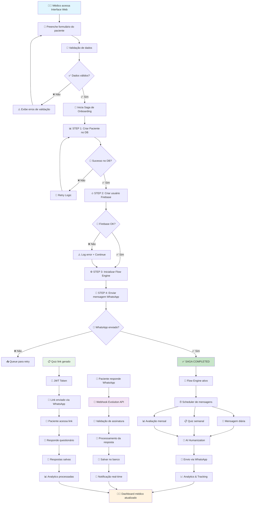
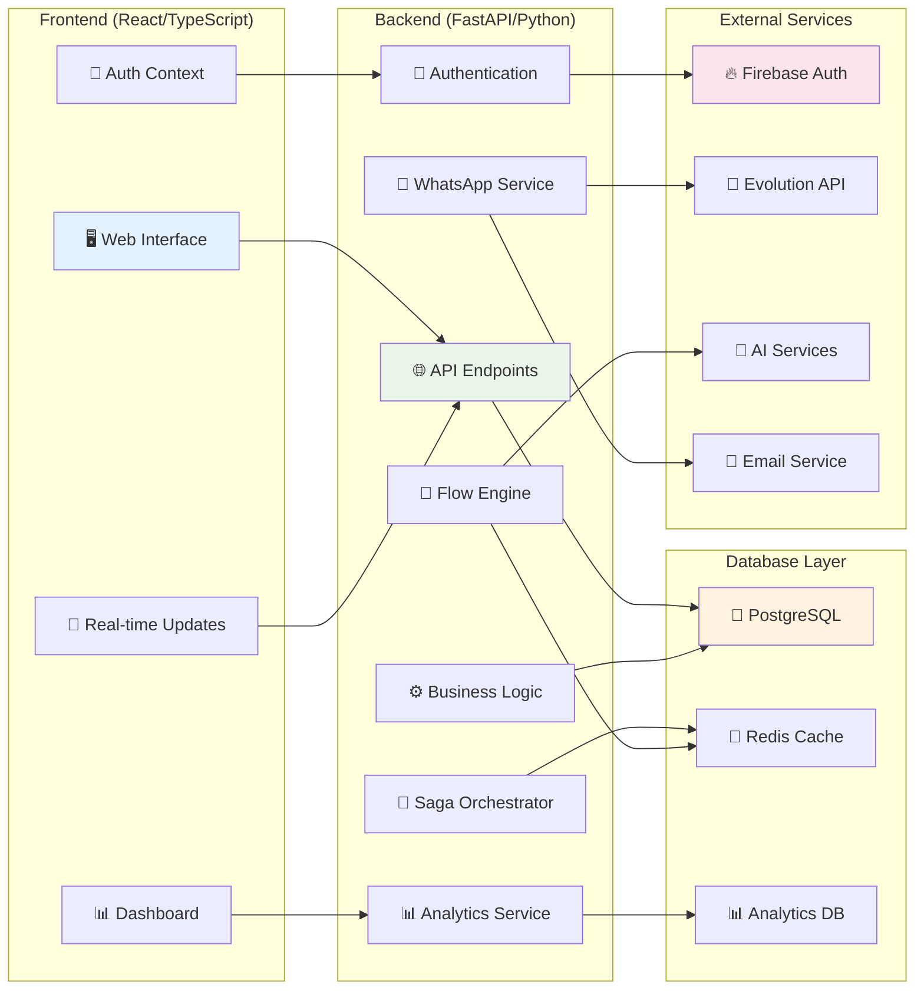
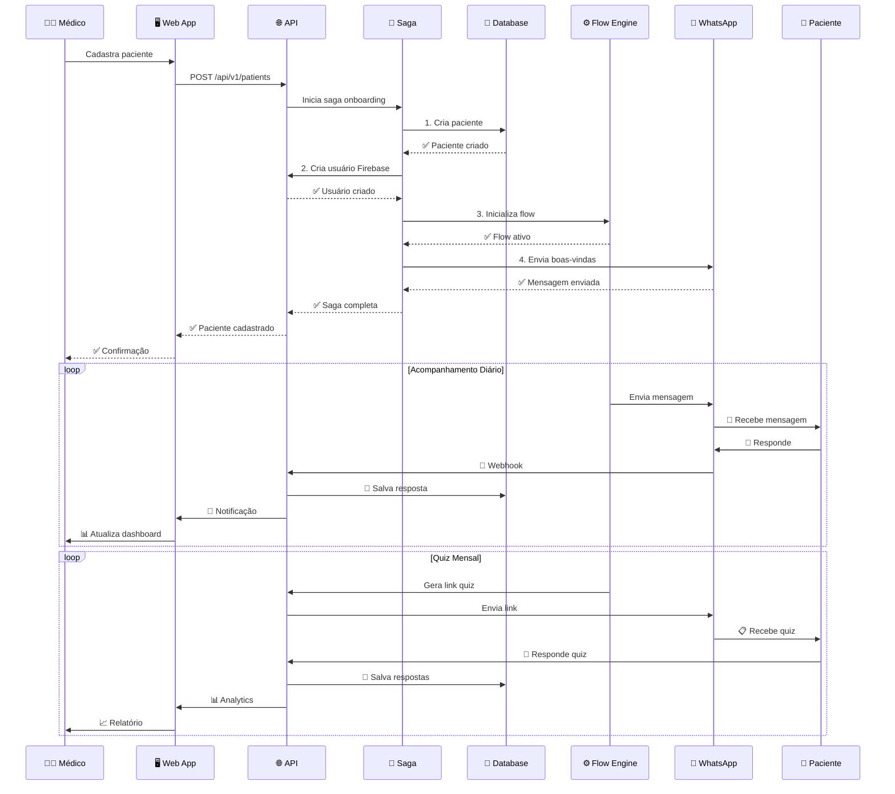

# 🔄 DIAGRAMA DE FLUXO - JORNADA DO PACIENTE
## Sistema Hormonia - Fluxo End-to-End

## 🏗️ ARQUITETURA DE COMPONENTES

## 📊 FLUXO DE DADOS

## 🔧 COMPONENTES TÉCNICOS

### 🎯 Core Services
- **PatientService:** CRUD + business logic
- **SagaOrchestrator:** Distributed transactions
- **FlowEngine:** Message automation + AI
- **WhatsAppService:** Evolution API integration
- **QuizService:** Questionnaire management
- **AnalyticsService:** Metrics & reporting

### 🔄 Background Jobs
- **Message Scheduler:** Celery tasks
- **Flow Processor:** Daily/weekly flows
- **Analytics Aggregator:** Metrics calculation
- **Retry Handler:** Failed operations recovery

### 📊 Data Flow
1. **Input:** Web form → API validation
2. **Processing:** Saga pattern → Service layer
3. **Storage:** PostgreSQL + Redis cache
4. **Output:** WhatsApp + Dashboard updates
5. **Feedback:** Webhooks → Real-time updates

### 🔐 Security Layers
- **Authentication:** Firebase + JWT
- **Authorization:** RLS + role-based
- **Rate Limiting:** Redis-based
- **Input Validation:** Pydantic schemas
- **Audit Logging:** Comprehensive tracking

---

**Legenda:**
- 🟢 **Operacional:** Funcionando corretamente
- 🟡 **Atenção:** Necessita monitoramento
- 🔴 **Crítico:** Requer ação imediata
- ⚪ **Planejado:** Desenvolvimento futuro