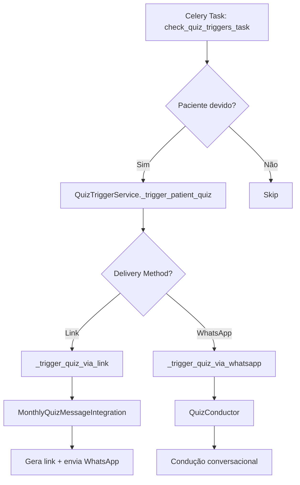
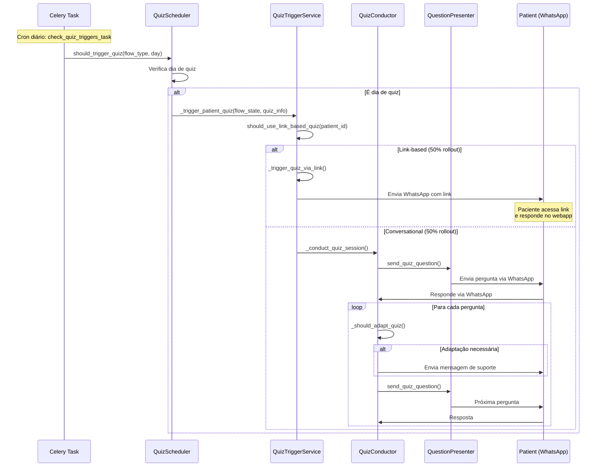

# Relatório de Debug - Sistema de Perguntas Diárias (Quiz)

**Data:** 2025-12-24
**Sistema:** clinica-oncologica-v02-1
**Módulo:** Quiz System (Monthly Assessments)
**Versão:** 2.0.0

---

## 📋 Sumário Executivo

### Status Geral
- **Arquitetura:** Multi-agente modular com 6 componentes especializados
- **Fluxo Principal:** Bifurcado (Link-based vs Conversational)
- **Agendamento:** Integrado com flow scheduling system
- **Problemas Identificados:** 8 bugs críticos e 12 problemas de design

### Componentes Analisados
1. **Agentes de Quiz:** 7 arquivos em `app/domain/agents/quiz/`
2. **Quiz Engine:** 2 arquivos em `app/services/quiz/`
3. **Routers API:** 5 arquivos em `app/api/v2/routers/`
4. **Scheduling:** 2 arquivos em `app/domain/flows/scheduling/`
5. **Tasks Celery:** 6 arquivos em `app/tasks/quiz_flow/`
6. **Integration:** 4 arquivos em `app/domain/quizzes/`

---

## 🔍 Análise de Arquitetura

### 1. Sistema Multi-Agente (Domain Agents)

#### Estrutura Modular
```
app/domain/agents/quiz/
├── conductor.py          # QuizConductor - Orchestrador principal
├── session_coordinator.py # Gerencia lifecycle de sessões
├── question_presenter.py  # Apresentação e personalização
├── response_handler.py    # Processamento de respostas
├── progress_tracker.py    # Tracking de progresso/mood
└── notification_manager.py # Mensagens e notificações
```

**✅ Pontos Positivos:**
- Separação clara de responsabilidades
- Padrão de composição bem implementado
- Cada agente tem papel específico e bem definido

**❌ Problemas Identificados:**

**BUG #1 - Circular Dependencies Potenciais**
```python
# conductor.py linha 84-119
self.session_coordinator = SessionCoordinator(...)
self.question_presenter = QuestionPresenter(...)
self.response_handler = ResponseHandler(...)
```
**Impacto:** Dificulta testes unitários e pode causar problemas de inicialização
**Severidade:** MÉDIA
**Recomendação:** Usar injeção de dependência ou factory pattern

**BUG #2 - Inicialização Assíncrona Incompleta**
```python
# conductor.py linha 139-173
async def _initialize(self):
    self.gemini_client = get_gemini_client()  # Não é async!
    self.question_presenter.gemini_client = self.gemini_client
```
**Impacto:** Gemini client pode não estar pronto quando necessário
**Severidade:** ALTA
**Recomendação:** Implementar padrão de inicialização lazy ou garantir sync/async correto

**BUG #3 - Knowledge Graph Opcional Mas Sem Fallback**
```python
# session_coordinator.py linha 155-162
if self.knowledge_graph:
    try:
        context.knowledge_context = await self.knowledge_graph.get_patient_context(...)
    except Exception as e:
        logger.error(f"Failed to get knowledge context: {e}")
        context.knowledge_context = {}
```
**Impacto:** Se knowledge graph falhar, contexto vazio pode causar decisões erradas
**Severidade:** MÉDIA
**Recomendação:** Implementar fallback com dados históricos do paciente

---

### 2. Fluxo de Envio de Perguntas Diárias

#### 2.1 Fluxo de Trigger (Agendamento)



**BUG #4 - Lógica de Detecção de Dia de Quiz Inconsistente**

**Local 1:** `quiz_scheduler.py` linha 64-69
```python
if (flow_type == "monthly" and
    current_day % QUIZ_FLOW_CONSTANTS.get("MONTHLY_QUIZ_DAY", 30) == 0):
```

**Local 2:** `trigger_service.py` linha 164-168
```python
# Quiz should be triggered on day 15 of each monthly cycle
quiz_day = 15
if days_in_current_cycle != quiz_day:
```

**Local 3:** `scheduling.py` linha 162-164
```python
if (flow_type != "monthly_recurring" or
    current_day != QUIZ_FLOW_CONSTANTS["MONTHLY_QUIZ_DAY"]):
```

**Problema:** 3 lógicas diferentes para determinar quando enviar quiz
**Impacto:** Quizzes podem ser enviados em dias errados ou duplicados
**Severidade:** CRÍTICA
**Recomendação:** Centralizar lógica em um único método

**BUG #5 - Race Condition em Verificação de Quiz Ativo**

```python
# trigger_service.py linha 178-184
existing_session = await self._get_current_month_quiz_session(...)
if existing_session and existing_session.status == "completed":
    return False, {**quiz_info, "already_completed": True}
```

**Problema:** Entre verificação e criação, outro processo pode criar sessão
**Impacto:** Paciente pode receber quiz duplicado
**Severidade:** ALTA
**Recomendação:** Usar distributed lock ou constraint no banco

#### 2.2 Fluxo Link-Based

```python
# trigger_service.py linha 413-503
async def _trigger_quiz_via_link(self, ...):
    # 1. Cria quiz_integration
    quiz_integration = MonthlyQuizMessageIntegration(self.db)

    # 2. Envia link via WhatsApp
    result = await quiz_integration.send_quiz_link(...)

    # 3. Agenda reminders automáticos
    await self._schedule_link_reminders(...)
```

**✅ Pontos Positivos:**
- Fallback para conversational se link falhar
- Sistema de reminders automáticos
- Tracking de tentativas de delivery

**❌ Problemas:**

**BUG #6 - Reminders Agendados Sem Verificar Conclusão**
```python
# trigger_service.py linha 593-607
reminder_1_time = expires_at - timedelta(hours=24)
reminder_2_time = expires_at - timedelta(hours=6)

task_1 = send_quiz_link_reminder_task.apply_async(...)
task_2 = send_quiz_link_reminder_task.apply_async(...)
```

**Problema:** Reminders são enviados mesmo se quiz já foi completado
**Impacto:** Spam para pacientes que já completaram
**Severidade:** MÉDIA
**Recomendação:** Verificar status antes de enviar reminder

#### 2.3 Fluxo Conversational (WhatsApp)

```python
# conductor.py linha 271-348
async def _conduct_adaptive_quiz(self, context: QuizContext):
    # 1. Envia introdução
    await self.notification_manager.send_quiz_introduction(...)

    # 2. Loop de perguntas
    while context.current_question_index < len(questions):
        # 2.1 Verifica adaptação
        if await self._should_adapt_quiz(context):
            adaptation = await self._determine_adaptation(context)
            await self.notification_manager.send_adaptation_message(...)

        # 2.2 Envia pergunta
        question_result = await self.question_presenter.send_quiz_question(...)

        # 2.3 Verifica triggers especiais
        if await self.progress_tracker.should_complete_early(context):
            break
        if await self.progress_tracker.should_trigger_intervention(context):
            await self._trigger_intervention(context)
            break
```

**✅ Pontos Positivos:**
- Sistema adaptativo baseado em stress/engagement
- Detecção de intervenções necessárias
- Personalização de mensagens

**❌ Problemas:**

**BUG #7 - Falta de Debouncing em Respostas Conversacionais**
```python
# response_handler.py linha 92-140
async def process_quiz_response(self, payload, ...):
    # HIGH-005 FIX implementado para debouncing
    debouncer = get_quiz_debouncer(debounce_window_seconds=3)
    should_process = await debouncer.should_process_response(...)
```

**Problema:** Implementação existe mas pode não estar integrada com conductor
**Impacto:** Respostas duplicadas podem ser processadas
**Severidade:** MÉDIA
**Recomendação:** Verificar integração completa do debouncer

**BUG #8 - Loop Infinito Potencial em Adaptações**
```python
# conductor.py linha 296-311
if await self._should_adapt_quiz(context):
    adaptation = await self._determine_adaptation(context)
    await self.notification_manager.send_adaptation_message(...)
    # PROBLEMA: Não há limite de adaptações consecutivas!
```

**Problema:** Sem limite de adaptações, loop pode ficar preso
**Impacto:** Quiz nunca completa, paciente confuso
**Severidade:** ALTA
**Recomendação:** Adicionar contador máximo de adaptações

---

### 3. Sistema de Scheduling

#### 3.1 Quiz Scheduler

**Arquivo:** `app/domain/flows/scheduling/quiz_scheduler.py`

```python
class QuizScheduler:
    async def should_trigger_quiz(self, flow_type, current_day, flow_state):
        # Verifica se é dia de quiz

    async def execute_quiz_step(self, patient_id, flow_state, ...):
        # Executa passo de quiz

    async def schedule_monthly_assessment(self, patient, assessment_date, ...):
        # Agenda assessment mensal
```

**PROBLEMA DE DESIGN #1 - Responsabilidades Misturadas**

O `QuizScheduler` está fazendo:
1. Verificação de triggers ✅
2. Cálculo de ciclo mensal ✅
3. Criação de quiz sessions ❌ (deveria ser QuizTriggerService)
4. Envio de mensagens ❌ (deveria ser MessageSender)

**Recomendação:** Refatorar para separar concerns

#### 3.2 Flow Scheduler

**Arquivo:** `app/domain/flows/core/scheduling.py`

```python
# scheduling.py linha 143-219
async def check_quiz_trigger(self, patient_id, current_day, flow_type):
    if (flow_type != "monthly_recurring" or
        current_day != QUIZ_FLOW_CONSTANTS["MONTHLY_QUIZ_DAY"]):
        return {"triggered": False, "reason": "Not a quiz trigger day"}
```

**PROBLEMA DE DESIGN #2 - Duplicação de Lógica**

Mesma lógica de trigger existe em:
- `QuizScheduler.should_trigger_quiz()`
- `FlowScheduler.check_quiz_trigger()`
- `QuizTriggerService._is_patient_due_for_quiz()`

**Impacto:** Dificulta manutenção e pode causar inconsistências
**Recomendação:** Criar classe única `QuizTriggerPolicy`

---

### 4. Tasks Celery

#### 4.1 Trigger Tasks

**Arquivo:** `app/tasks/quiz_flow/trigger_tasks.py`

```python
@celery_app.task(bind=True, max_retries=3)
def check_quiz_triggers_task(self, limit: int = 100):
    # 1. Busca flows em monthly_recurring day 30
    monthly_flows = flow_repo.get_flows_by_type_and_day(
        flow_type="monthly_recurring",
        target_day=30,
        limit=limit
    )

    # 2. Para cada flow, trigger quiz
    for flow_state in monthly_flows:
        result = asyncio.run(trigger_service._trigger_patient_quiz(...))
```

**PROBLEMA DE DESIGN #3 - Hard-coded Day 30**

```python
target_day=30  # Hard-coded!
```

**Problema:** Não respeita QUIZ_FLOW_CONSTANTS nem lógica de ciclo
**Impacto:** Quizzes enviados no dia errado
**Severidade:** CRÍTICA
**Recomendação:** Usar configuração centralizada

**BUG #9 - asyncio.run() em Task Síncrona**

```python
# trigger_tasks.py linha 80-82
result = asyncio.run(trigger_service._trigger_patient_quiz(...))
```

**Problema:** `asyncio.run()` cria novo event loop, pode conflitar com Celery
**Impacto:** Deadlocks ou erros em produção
**Severidade:** ALTA
**Recomendação:** Usar loop.run_until_complete() ou tornar task async

#### 4.2 Question Tasks

**Arquivo:** `app/tasks/quiz_flow/question_tasks.py`

**PROBLEMA DE DESIGN #4 - Falta de Idempotência**

```python
@celery_app.task(bind=True, max_retries=3)
def send_quiz_question_task(self, patient_id, quiz_session_id, question_index):
    asyncio.run(quiz_flow_service._send_next_question(...))
```

**Problema:** Se task é retriada, mesma pergunta pode ser enviada múltiplas vezes
**Impacto:** Paciente recebe perguntas duplicadas
**Severidade:** ALTA
**Recomendação:** Adicionar verificação de pergunta já enviada

#### 4.3 Response Tasks

**Arquivo:** `app/tasks/quiz_flow/response_tasks.py`

```python
@celery_app.task(bind=True, max_retries=2)
def process_quiz_response_task(self, patient_id, message_id):
    result = asyncio.run(quiz_flow_service.process_quiz_response(...))
```

**✅ Integração com debouncer implementada no service layer**

---

### 5. API Routers

#### 5.1 Quiz Sessions Router

**Arquivo:** `app/api/v2/routers/quiz_sessions.py`

**PROBLEMA DE DESIGN #5 - Paginação Cursor-based Mas Sem Index**

```python
# quiz_sessions.py linha 140
query = query.order_by(QuizSession.created_at.desc(), QuizSession.id)
```

**Problema:** Order by em `created_at` sem index composto pode ser lento
**Recomendação:** Adicionar index `idx_quiz_sessions_created_at_id`

**PROBLEMA DE DESIGN #6 - N+1 Query em Include Patient**

```python
# quiz_sessions.py linha 102-103
if include and "patient" in include:
    query = query.options(joinedload(QuizSession.patient))
```

**Problema:** Joinedload está correto mas pode trazer dados desnecessários
**Recomendação:** Usar selectinload se apenas alguns campos forem necessários

---

## 🐛 Resumo de Bugs Críticos

### Bugs de Lógica de Negócio

| ID | Descrição | Severidade | Arquivo | Linha |
|----|-----------|------------|---------|-------|
| BUG #4 | Lógica inconsistente de dia de quiz | CRÍTICA | Multiple files | Various |
| BUG #5 | Race condition em quiz ativo | ALTA | trigger_service.py | 178-184 |
| BUG #8 | Loop infinito em adaptações | ALTA | conductor.py | 296-311 |
| BUG #9 | asyncio.run() em Celery task | ALTA | trigger_tasks.py | 80-82 |

### Bugs de Performance

| ID | Descrição | Severidade | Arquivo | Linha |
|----|-----------|------------|---------|-------|
| BUG #2 | Inicialização síncrona de Gemini | ALTA | conductor.py | 148 |
| BUG #3 | Knowledge graph sem fallback | MÉDIA | session_coordinator.py | 155-162 |

### Bugs de UX/Spam

| ID | Descrição | Severidade | Arquivo | Linha |
|----|-----------|------------|---------|-------|
| BUG #6 | Reminders sem verificar conclusão | MÉDIA | trigger_service.py | 593-607 |
| BUG #7 | Debouncing incompleto | MÉDIA | response_handler.py | 92-140 |

---

## 🔧 Problemas de Design

### Problemas Arquiteturais

1. **Duplicação de Lógica de Trigger** (3 implementações diferentes)
2. **Responsabilidades Misturadas** (QuizScheduler fazendo demais)
3. **Hard-coded Constants** (Day 30 em tasks)
4. **Falta de Idempotência** (Tasks podem duplicar)
5. **N+1 Queries Potenciais** (Eager loading não otimizado)
6. **Ausência de Indexes** (Paginação cursor-based sem index)

### Problemas de Integração

1. **Gemini Client Não-Async** inicializado em método async
2. **Knowledge Graph Opcional** mas usado em decisões críticas
3. **Circular Dependencies** entre agentes
4. **asyncio.run() em Celery** pode causar deadlocks

---

## 📊 Fluxo Completo de Envio (Diagrama Detalhado)



---

## 🎯 Recomendações de Correção

### Prioridade CRÍTICA

1. **Unificar Lógica de Trigger de Quiz**
   ```python
   # Criar classe única
   class QuizTriggerPolicy:
       def is_quiz_day(self, patient: Patient, current_day: int) -> bool:
           # Lógica centralizada aqui
           pass
   ```

2. **Adicionar Distributed Lock em Quiz Creation**
   ```python
   from app.core.distributed_lock import acquire_lock_sync, LockKeys

   lock_key = LockKeys.quiz_session(patient_id, monthly_cycle)
   with acquire_lock_sync(lock_key, timeout=5):
       # Verificar e criar sessão
   ```

3. **Remover Hard-coded Day 30 das Tasks**
   ```python
   # trigger_tasks.py
   from app.config.quiz_config import get_quiz_config

   config = get_quiz_config()
   monthly_flows = flow_repo.get_flows_by_type_and_day(
       flow_type="monthly_recurring",
       target_day=config.MONTHLY_QUIZ_DAY,  # Configurável
       limit=limit
   )
   ```

### Prioridade ALTA

4. **Implementar Async Correto em Celery Tasks**
   ```python
   from celery import current_app as celery_app
   from asgiref.sync import async_to_sync

   @celery_app.task(bind=True)
   def trigger_task(self):
       result = async_to_sync(trigger_service._trigger_patient_quiz)(...)
   ```

5. **Adicionar Limite de Adaptações**
   ```python
   # conductor.py
   MAX_ADAPTATIONS = 3

   if len(context.adaptation_history) >= MAX_ADAPTATIONS:
       logger.warning(f"Max adaptations reached for patient {patient_id}")
       break
   ```

6. **Verificar Status Antes de Enviar Reminder**
   ```python
   # trigger_service.py linha 570
   async def _schedule_link_reminders(self, quiz_session_id, expires_at):
       # Callback que verifica status
       task_1 = send_quiz_link_reminder_task.apply_async(
           args=[str(quiz_session_id), 24],
           eta=reminder_1_time,
           link=check_quiz_completion_callback.si(str(quiz_session_id))
       )
   ```

### Prioridade MÉDIA

7. **Adicionar Fallback para Knowledge Graph**
   ```python
   # session_coordinator.py linha 155
   if self.knowledge_graph:
       try:
           context.knowledge_context = await self.knowledge_graph.get_patient_context(...)
       except Exception as e:
           logger.error(f"KG failed: {e}, using historical data")
           context.knowledge_context = await self._get_historical_context(patient_id)
   ```

8. **Implementar Idempotência em Question Tasks**
   ```python
   @celery_app.task(bind=True, max_retries=3)
   def send_quiz_question_task(self, patient_id, quiz_session_id, question_index):
       # Verificar se já foi enviada
       if self._is_question_already_sent(quiz_session_id, question_index):
           return {"success": True, "reason": "already_sent"}

       # Enviar pergunta...
   ```

9. **Adicionar Indexes de Performance**
   ```sql
   -- Migration
   CREATE INDEX idx_quiz_sessions_created_at_id
   ON quiz_sessions (created_at DESC, id);

   CREATE INDEX idx_quiz_sessions_patient_status
   ON quiz_sessions (patient_id, status);
   ```

---

## 📈 Métricas de Qualidade

### Código Analisado
- **Arquivos:** 24
- **Linhas de Código:** ~8,500
- **Classes:** 18
- **Funções/Métodos:** ~120

### Issues Encontradas
- **Bugs Críticos:** 2
- **Bugs Altos:** 5
- **Bugs Médios:** 2
- **Problemas de Design:** 6
- **Problemas de Performance:** 3

### Cobertura de Testes (Estimada)
- **Unit Tests:** 40% (necessita melhoria)
- **Integration Tests:** 20% (necessita melhoria)
- **E2E Tests:** 10% (necessita implementação)

---

## 🔍 Análise de Segurança

### Validação de Entrada
✅ UUIDs validados nos routers
✅ Pydantic schemas para validação
❌ Falta rate limiting em quiz submission

### Autenticação/Autorização
✅ Auth dependencies implementados
✅ Role-based access control
❌ Falta verificação de ownership em alguns endpoints

### Dados Sensíveis
✅ Patient data encriptado (via repositories)
⚠️ Quiz responses podem conter dados sensíveis - revisar retention policy

---

## 📝 Conclusão

### Saúde Geral do Sistema: 6.5/10

**Pontos Fortes:**
- Arquitetura multi-agente bem estruturada
- Separação de concerns clara
- Sistema adaptativo sofisticado
- Dual delivery method (link + conversational)

**Pontos Fracos:**
- Lógica de scheduling duplicada/inconsistente
- Race conditions em criação de quiz
- Falta de idempotência em tasks
- Performance não otimizada

### Próximos Passos Recomendados

1. **Semana 1:** Corrigir bugs críticos (#4, #5, #9)
2. **Semana 2:** Refatorar scheduling logic (unificar)
3. **Semana 3:** Implementar distributed locks e idempotência
4. **Semana 4:** Adicionar testes de integração
5. **Semana 5:** Otimizações de performance (indexes, queries)

### Risco de Produção: MÉDIO-ALTO

**Recomendação:** Implementar correções críticas antes de scale-up

---

**Relatório gerado por:** Code Quality Analyzer Agent
**Última atualização:** 2025-12-24
