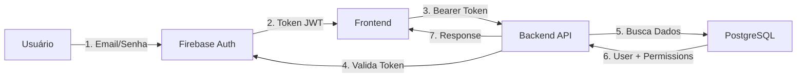

# 🚀 Deploy Railway - Autenticação Firebase (Guia Rápido)

## ✅ Resumo Executivo

**Problema Resolvido**: Tela branca em produção causada por Firebase não configurado.

**Solução**: Configurar credenciais Firebase no Railway + ajustes no código para prevenir loading infinito.

## 📋 Checklist de Deploy (Execute Nesta Ordem)

### 1️⃣ Configurar Firebase (5 minutos)

1. **Acesse** [Firebase Console](https://console.firebase.google.com/)
2. **Crie projeto** ou use existente
3. **Habilite Authentication**:
   - Authentication → Sign-in method → Email/Password → Enable
4. **Obtenha credenciais**:
   - Project Settings → General → Your apps → Web app
   - Copie o `firebaseConfig` object

### 2️⃣ Configurar Railway - Frontend (10 minutos)

No Railway, serviço **frontend-hormonia** → **Variables**:

```bash
# ========== FIREBASE AUTHENTICATION ==========
VITE_FIREBASE_API_KEY=AIzaSy...
VITE_FIREBASE_AUTH_DOMAIN=seu-projeto.firebaseapp.com
VITE_FIREBASE_PROJECT_ID=seu-projeto
VITE_FIREBASE_STORAGE_BUCKET=seu-projeto.firebasestorage.app
VITE_FIREBASE_MESSAGING_SENDER_ID=123456789012
VITE_FIREBASE_APP_ID=1:123456789012:web:abc...
VITE_FIREBASE_MEASUREMENT_ID=G-XXXXXXXXXX

# ========== BACKEND URLS ==========
VITE_API_BASE_URL=https://SEU-BACKEND.up.railway.app
VITE_API_URL=https://SEU-BACKEND.up.railway.app/api/v1
VITE_WS_URL=wss://SEU-BACKEND.up.railway.app/ws

# ========== DESABILITAR MOCK ==========
VITE_USE_MOCK_AUTH=false
```

**⚠️ Substitua**:
- `SEU-BACKEND` pelo domínio real do seu backend Railway
- Valores Firebase pelas suas credenciais reais

### 3️⃣ Criar Usuários no Firebase (2 minutos)

Firebase Console → **Authentication** → **Users** → **Add user**:

```
Administrador:
- Email: admin@seudominio.com.br
- Senha: [senha segura]

Médico:
- Email: medico@seudominio.com.br
- Senha: [senha segura]
```

### 4️⃣ Sincronizar com Banco de Dados Backend (5 minutos)

**Conecte no banco PostgreSQL** e execute:

```sql
-- Criar usuário admin (copie o UID do Firebase Console)
INSERT INTO users (
  id,
  email,
  full_name,
  role,
  is_active,
  metadata,
  created_at,
  updated_at
) VALUES (
  gen_random_uuid(),
  'admin@seudominio.com.br',
  'Administrador do Sistema',
  'admin',
  true,
  jsonb_build_object(
    'firebase_uid', 'COLE_O_FIREBASE_UID_AQUI',  -- Copie do Firebase Console → Users → User UID
    'permissions', '["all"]'::jsonb
  ),
  NOW(),
  NOW()
);
```

**Como obter Firebase UID**:
1. Firebase Console → Authentication → Users
2. Clique no usuário criado
3. Copie o "User UID"

### 5️⃣ Testar em Produção (3 minutos)

1. ✅ **Acesse**: `https://SEU-FRONTEND.up.railway.app/login`
2. ✅ **Digite**: credenciais criadas no Firebase
3. ✅ **Verifique**: deve redirecionar para `/dashboard`
4. ✅ **Console do navegador** (F12) deve mostrar:
   ```
   [FirebaseClient] Firebase initialized successfully with project: seu-projeto
   [AuthContext] Using Firebase authentication
   [AuthContext] Firebase user signed in: admin@seudominio.com.br
   ```

## 🔧 Alterações de Código Aplicadas

### ✅ Arquivos Modificados

1. **[frontend-hormonia/src/contexts/AuthContext.tsx](../frontend-hormonia/src/contexts/AuthContext.tsx:118-123)**
   - ✅ Adicionada verificação `firebaseAuth.isConfigured()`
   - ✅ Finaliza `isLoading` quando Firebase não configurado
   - ✅ Previne tela branca por loading infinito

2. **[frontend-hormonia/src/lib/runtime-config.ts](../frontend-hormonia/src/lib/runtime-config.ts:327-368)**
   - ✅ Validação agora aceita Firebase-only (sem Supabase)
   - ✅ Detecta `VITE_FIREBASE_API_KEY` + `VITE_FIREBASE_PROJECT_ID`
   - ✅ Log de warning se Supabase ausente, mas não invalida config

3. **[frontend-hormonia/App.tsx](../frontend-hormonia/App.tsx:95)**
   - ✅ Mantida rota raiz `"/" → "/dashboard"`
   - ✅ ProtectedRoute redireciona automaticamente para `/login`

## 🐛 Troubleshooting

### Erro: "Firebase not configured"

**Console mostra**: `Firebase not configured - environment variables missing`

**Solução**:
1. Verifique que TODAS as 6 variáveis `VITE_FIREBASE_*` estão no Railway
2. Force redeploy: Railway → Frontend → Deploy → Redeploy
3. Aguarde build completo (2-3 minutos)
4. Limpe cache do navegador (Ctrl+Shift+Delete)

### Tela branca ainda persiste

**Causas possíveis**:
1. ❌ Build Railway não pegou as variáveis → Force redeploy
2. ❌ Variável digitada errada → Verifique ortografia exata
3. ❌ Backend URL incorreta → Teste `https://SEU-BACKEND.up.railway.app/api/v1/health`

**Console deve mostrar**:
```
✅ [AuthContext] Using Firebase authentication
❌ [FirebaseClient] Firebase not configured (ainda com problema)
```

### Login funciona mas dashboard está vazio

**Causa**: Usuário existe no Firebase mas não no banco de dados

**Solução**: Execute o INSERT SQL do **Passo 4** com o Firebase UID correto

### Token expira rapidamente

**Normal**: Firebase tokens expiram em 1 hora

**Automático**: O código já implementa refresh via `onIdTokenChanged()` em [AuthContext.tsx](../frontend-hormonia/src/contexts/AuthContext.tsx:153-169)

## 📊 Estrutura de Autenticação



**Importante**:
- Firebase: Autentica e emite tokens
- Backend: Valida tokens + Autorização (roles/permissions)
- PostgreSQL: Armazena dados do usuário (role, permissions, metadata)

## 🔗 Referências Completas

- **Setup Detalhado**: [firebase-production-setup.md](./firebase-production-setup.md)
- **Env Vars Completas**: [railway-deployment-env-vars.md](./railway-deployment-env-vars.md)
- **Código Firebase**: [frontend-hormonia/src/lib/firebase-client.ts](../frontend-hormonia/src/lib/firebase-client.ts)
- **Código AuthContext**: [frontend-hormonia/src/contexts/AuthContext.tsx](../frontend-hormonia/src/contexts/AuthContext.tsx)

## ⏱️ Tempo Total Estimado

- ✅ Configurar Firebase: **5 min**
- ✅ Configurar Railway: **10 min**
- ✅ Criar usuários: **2 min**
- ✅ Sincronizar banco: **5 min**
- ✅ Testar: **3 min**

**Total**: ~25 minutos

---

**Status**: ✅ Código corrigido e pronto para deploy
**Próximo passo**: Configure as variáveis no Railway e teste!
