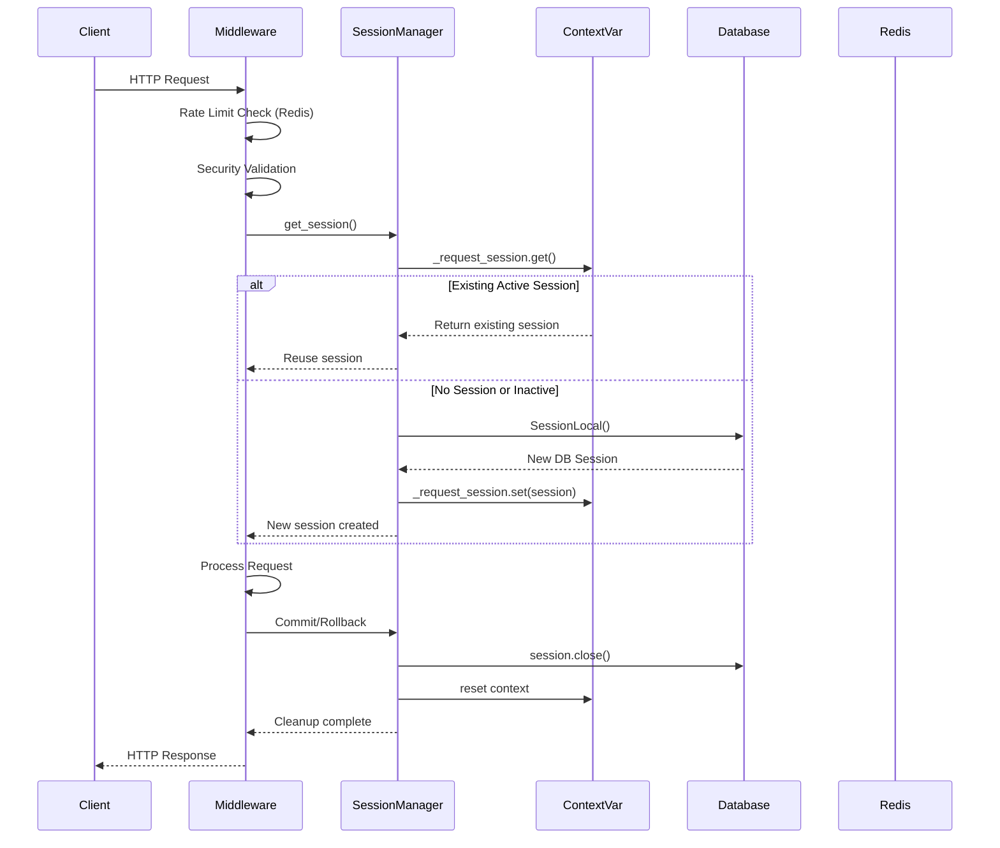
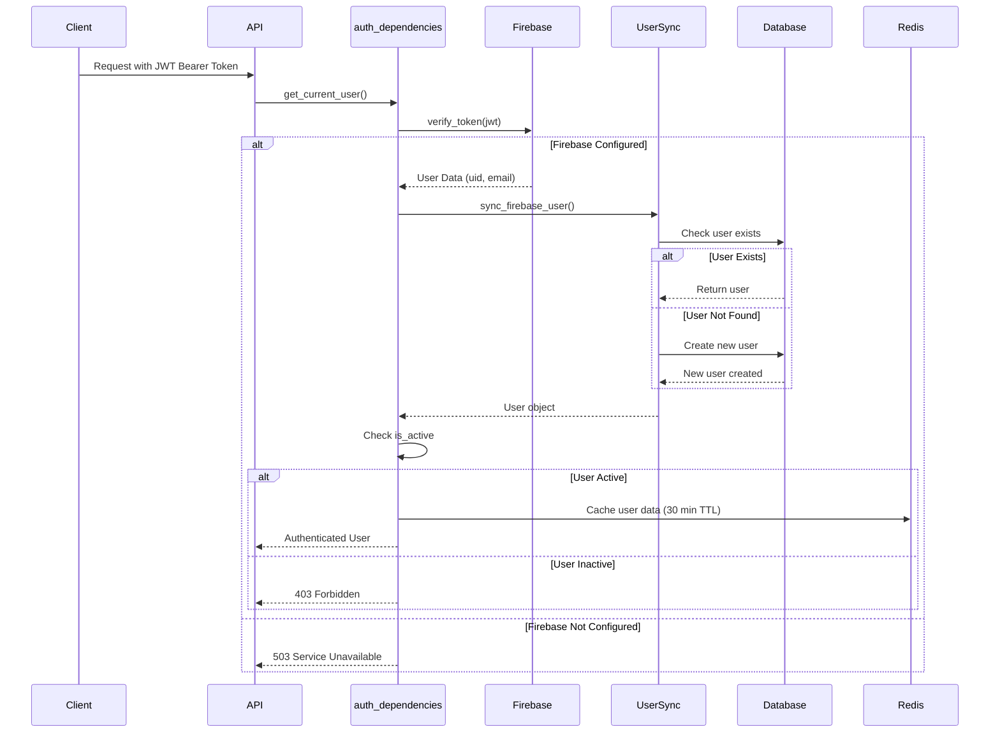
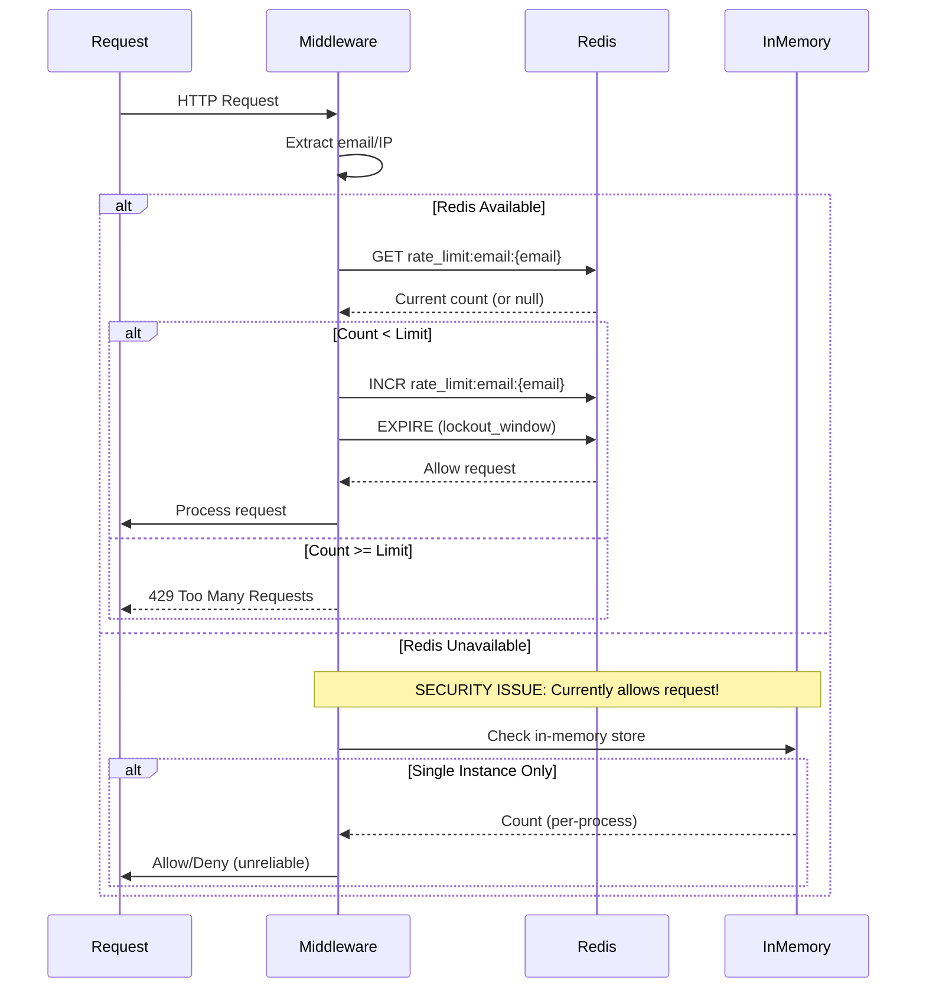
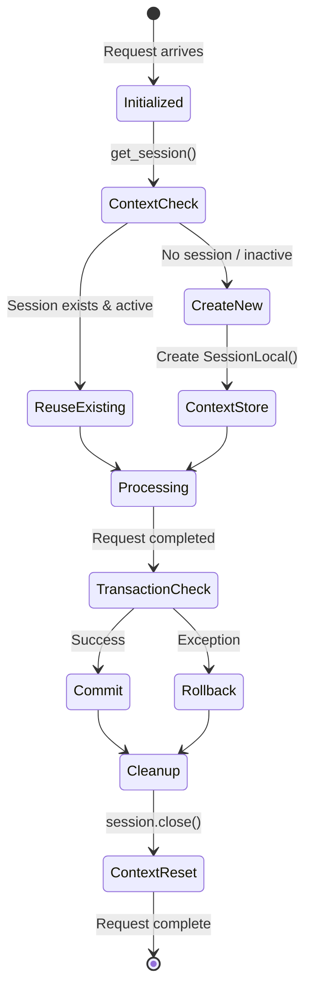
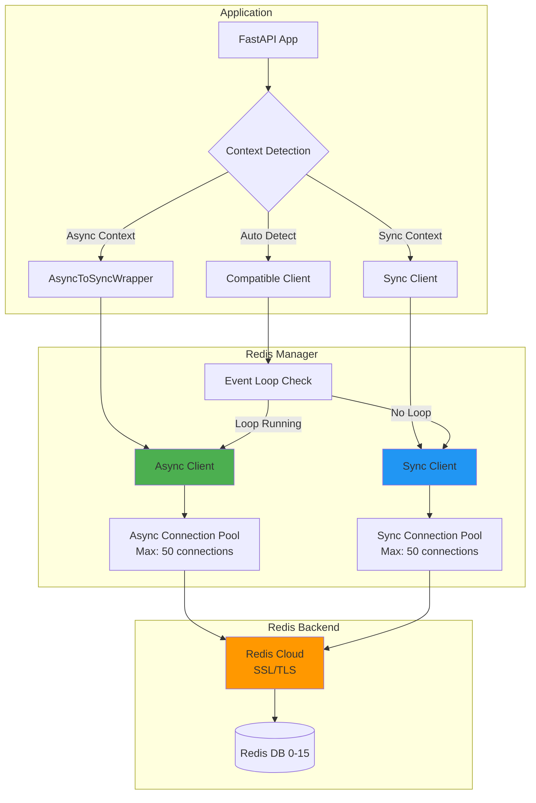
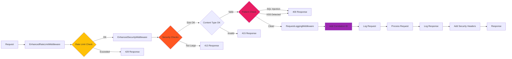
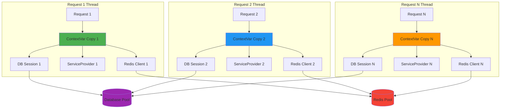
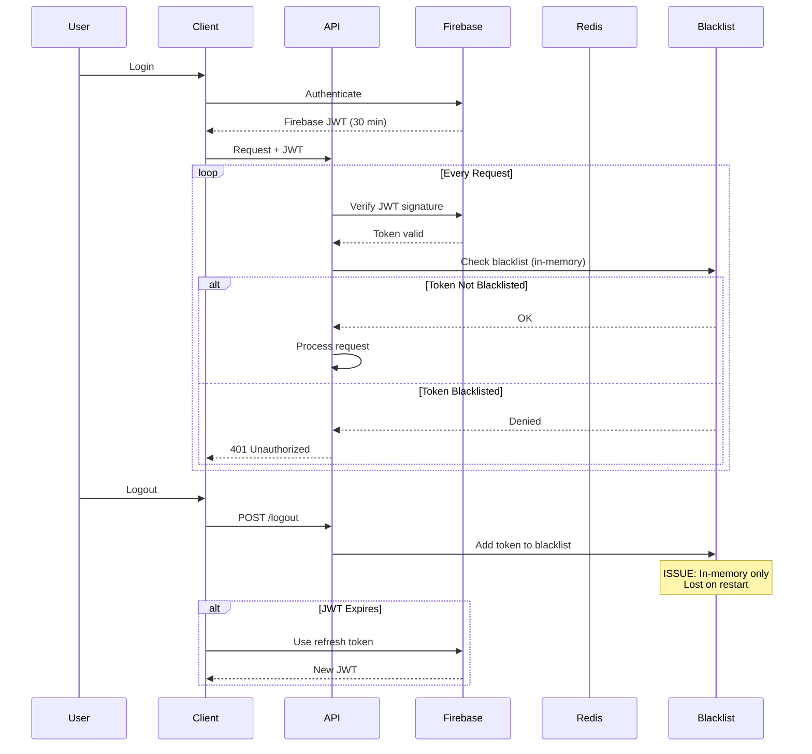
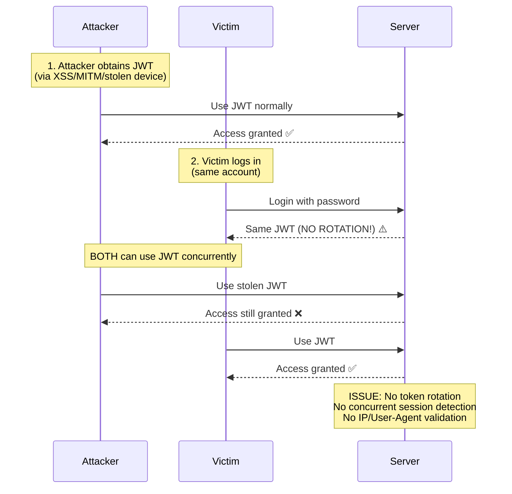
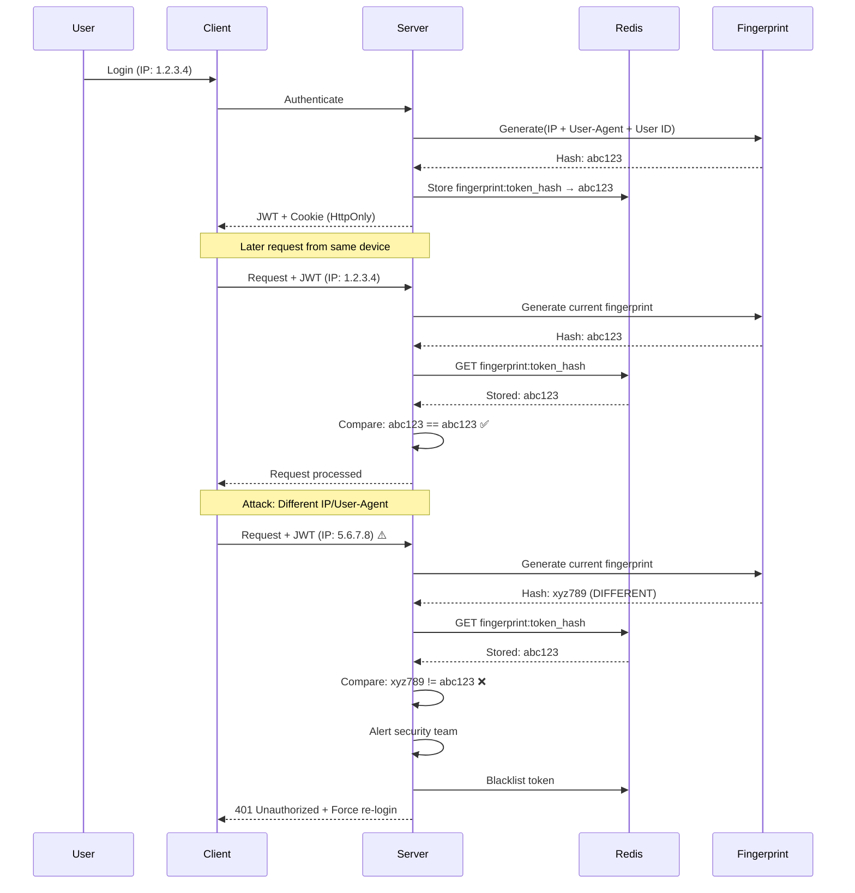

# Session Management Architecture Diagrams

## 1. Session Creation Flow (Thread-Safe)

## 2. Authentication Flow (Firebase + Local Sync)

## 3. Rate Limiting Flow (Distributed)

## 4. Session Lifecycle State Machine

## 5. Redis Manager Architecture (Dual Client)

## 6. Security Middleware Stack

## 7. Thread Safety Isolation (ContextVars)

## 8. Token Lifecycle (JWT)

## 9. Vulnerability: Session Fixation Attack

## 10. Proposed Fix: Session Fingerprinting

---

**Generated:** 2025-10-05
**Related Document:** session-management-analysis.md
