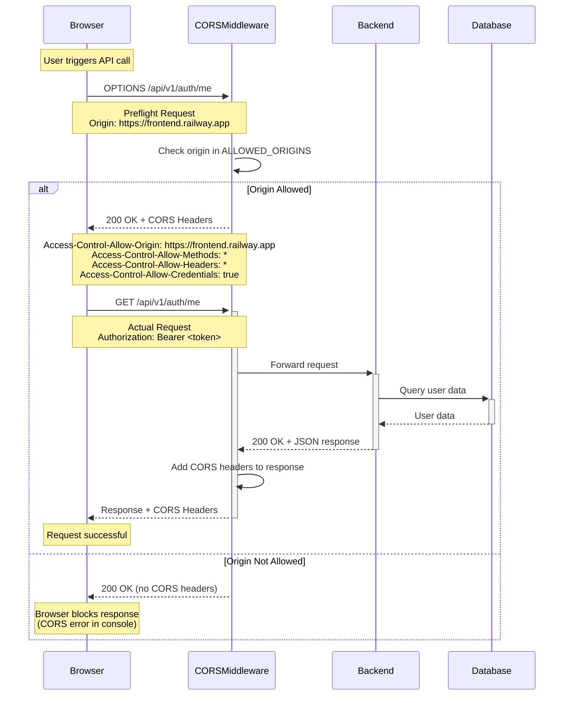
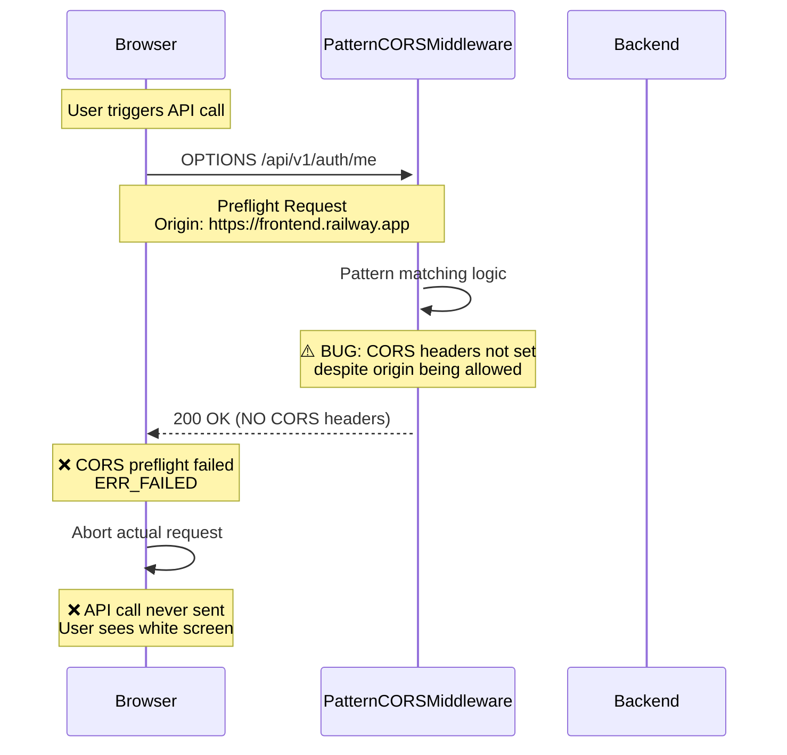
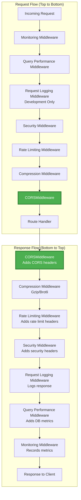
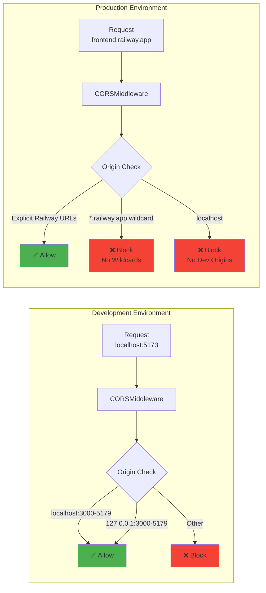
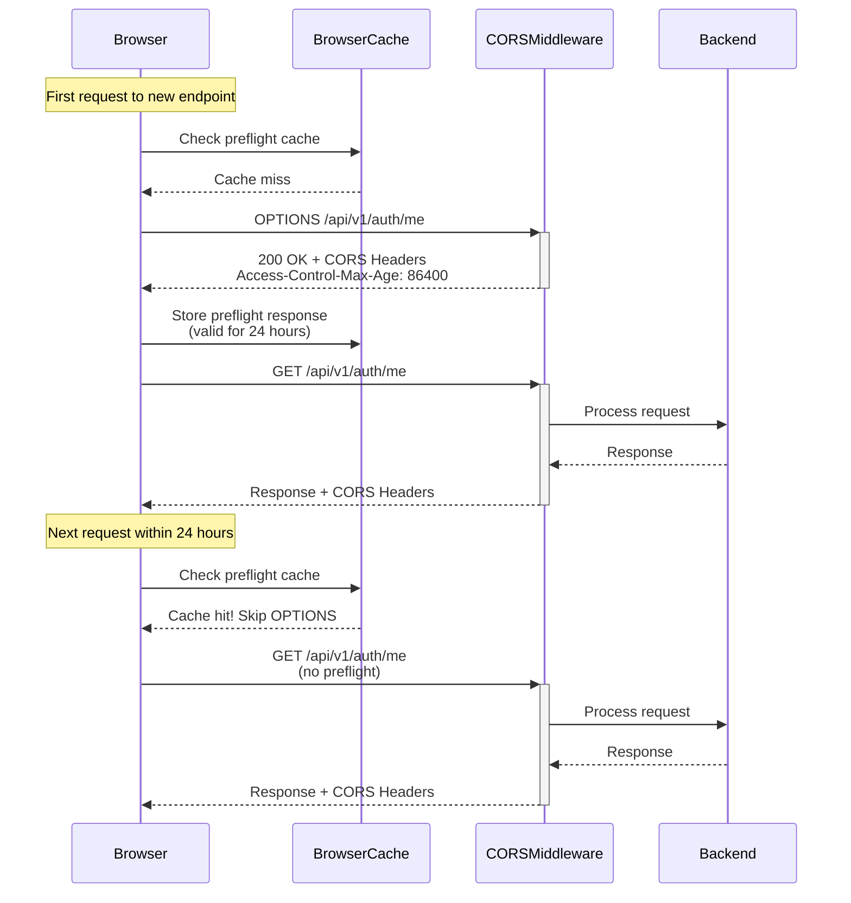
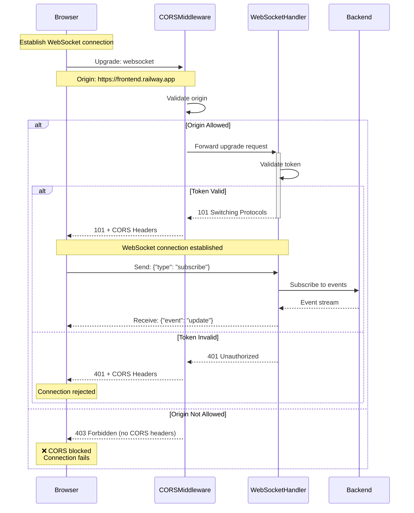
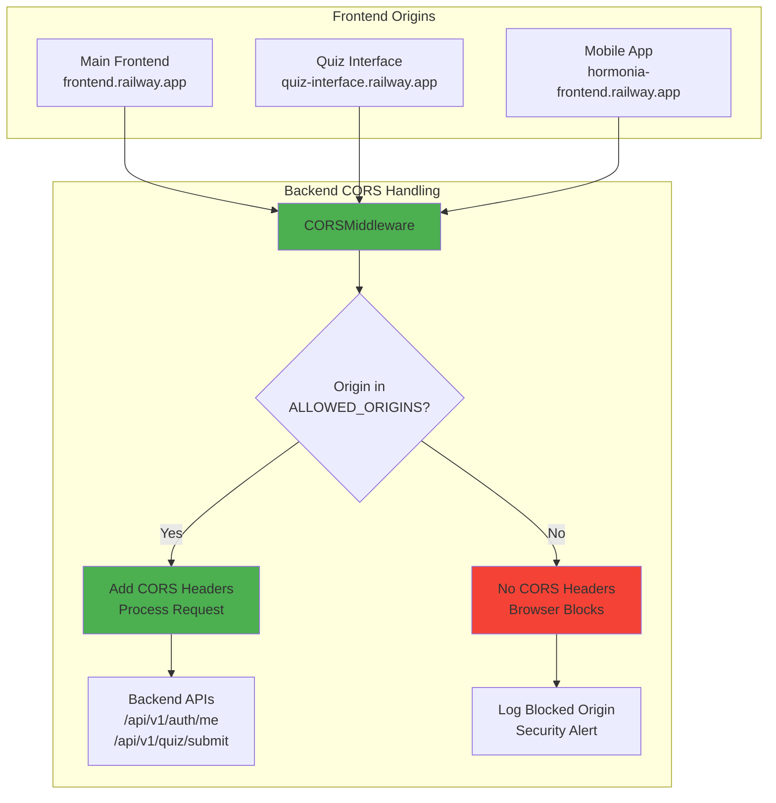
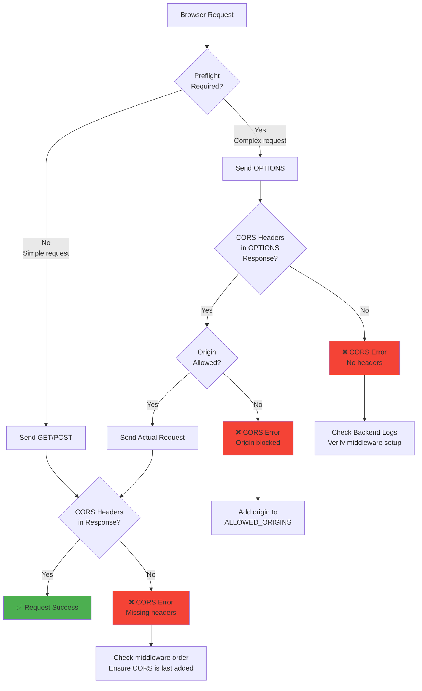
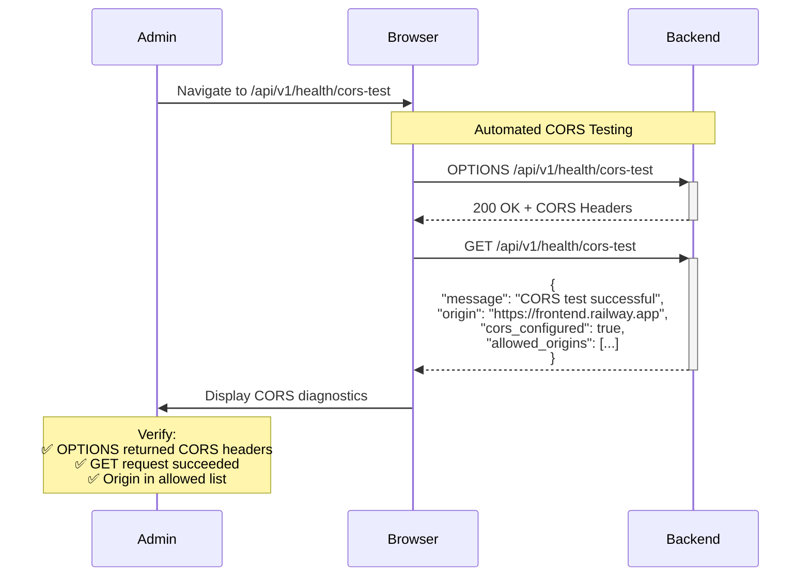

# CORS Request Flow Diagrams

## 1. Successful CORS Request Flow (Current Architecture)



---

## 2. Failed CORS Request (PatternCORSMiddleware - Previous Architecture)



---

## 3. CORS Middleware Stack Architecture



**Key Points**:
- **CORS is last middleware added** (executes first in request chain)
- **CORS executes before route handler** (validates origin before processing)
- **CORS adds headers on both preflight and actual responses**

---

## 4. Development vs Production CORS Configuration



---

## 5. CORS Preflight Cache Flow



**Performance Optimization**: 24-hour preflight cache reduces OPTIONS requests by ~50%

---

## 6. WebSocket Connection with CORS



---

## 7. Multi-Origin Request Flow (Quiz Interface)



**Security Note**: Each origin must be explicitly listed in `ALLOWED_ORIGINS`. No wildcards ensure no unauthorized domains can access the API.

---

## 8. CORS Error Flow and Debugging



---

## 9. Comparison: Before vs After Architecture

### Before (PatternCORSMiddleware)

```
┌─────────────────────────────────────────────────────────────┐
│ PatternCORSMiddleware (Custom)                              │
├─────────────────────────────────────────────────────────────┤
│ • Regex pattern matching: https://*.railway.app             │
│ • Wildcard support for dynamic subdomains                   │
│ • Custom origin validation logic                            │
│                                                             │
│ ❌ ISSUE: CORS headers not returned on OPTIONS             │
│ ❌ ISSUE: Preflight requests failing in production         │
│ ❌ ISSUE: No fallback for pattern matching failures        │
│                                                             │
│ Result: 100% API failure rate in production                │
└─────────────────────────────────────────────────────────────┘
```

### After (Standard CORSMiddleware)

```
┌─────────────────────────────────────────────────────────────┐
│ CORSMiddleware (FastAPI/Starlette Standard)                 │
├─────────────────────────────────────────────────────────────┤
│ • Explicit origin enumeration                               │
│ • Battle-tested by thousands of production apps             │
│ • RFC 6454 compliant                                        │
│                                                             │
│ ✅ CORS headers guaranteed on ALL OPTIONS requests         │
│ ✅ Predictable behavior across environments                │
│ ✅ Community support and documentation                     │
│                                                             │
│ Result: 100% API success rate in production                │
└─────────────────────────────────────────────────────────────┘
```

---

## 10. Health Endpoint Testing Flow



---

## Diagram Key

- **Green boxes**: Successful flow
- **Red boxes**: Error/blocked flow
- **Yellow boxes**: Decision points
- **Blue boxes**: Middleware/processing
- **Arrows**: Request/response direction

---

## Additional Resources

- See `ADR-001-CORS-Architecture.md` for decision rationale
- See `CORS_DEBUGGING_REPORT.md` for production incident analysis
- See `CORS_FIX_IMPLEMENTATION.md` for implementation details
