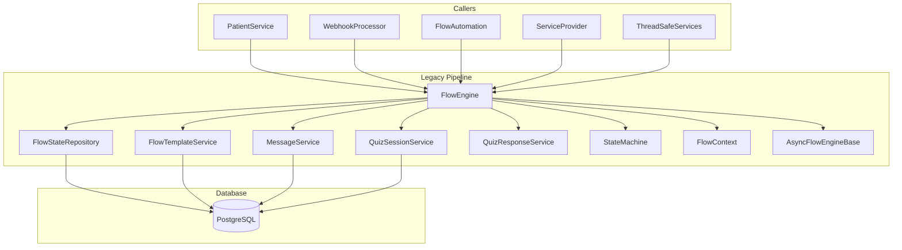
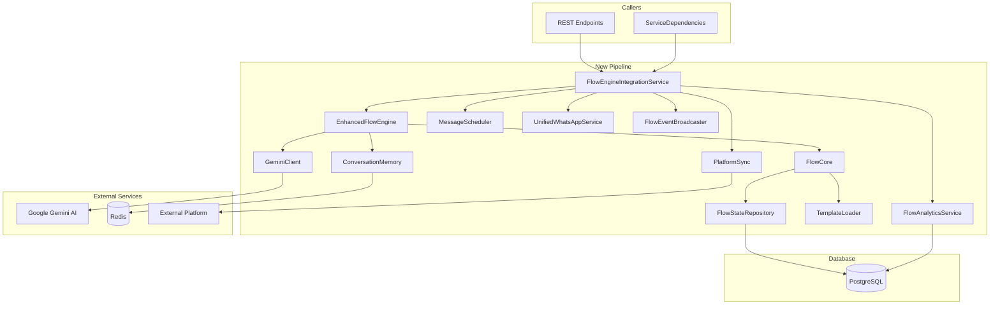
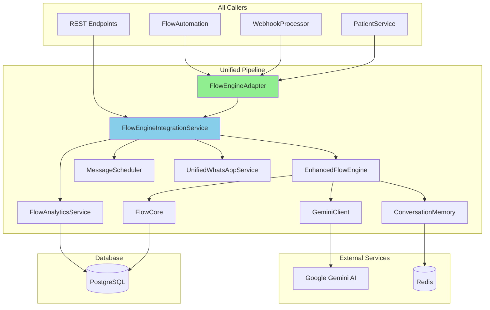

# Flow Engine Dependency Graph

## Legacy FlowEngine Dependencies

## New FlowEngineIntegrationService Dependencies

## Post-Migration Architecture

## Key Changes

### Removed Components
- ❌ FlowEngine (legacy)
- ❌ FlowContext (legacy, replaced by FlowCore methods)
- ❌ Direct MessageService usage (replaced by MessageScheduler)

### Added Components
- ✅ FlowEngineAdapter (compatibility layer)
- ✅ Unified message scheduling via MessageScheduler
- ✅ AI integration (Gemini, Redis)
- ✅ Analytics and monitoring

### Shared/Retained Components
- ✅ FlowStateRepository
- ✅ FlowCore (base class)
- ✅ Database models
- ✅ Template system
