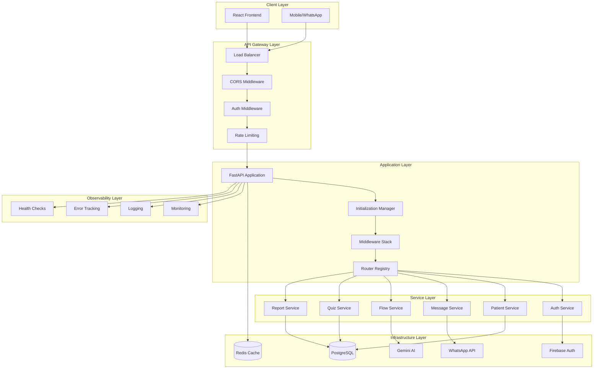
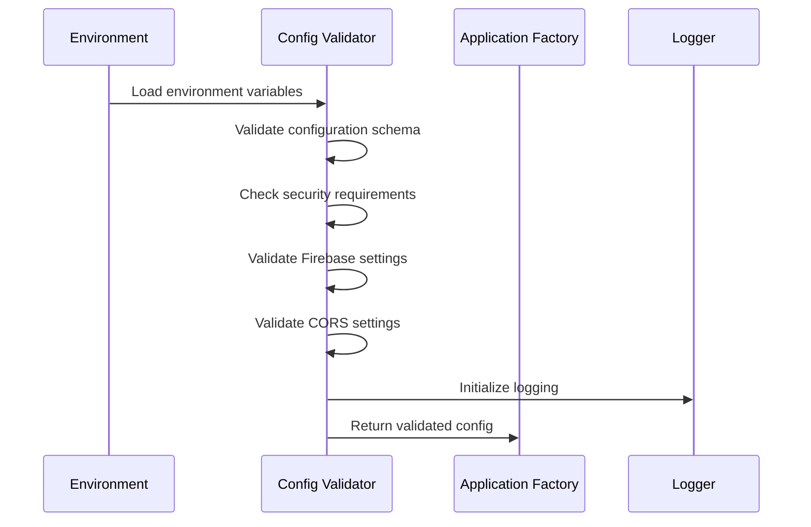
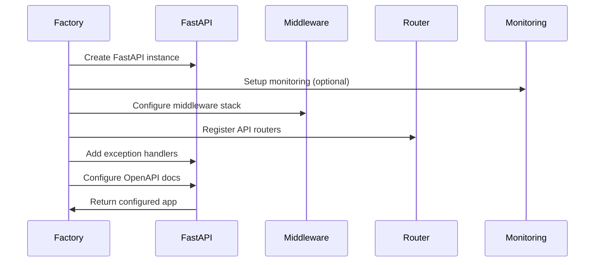
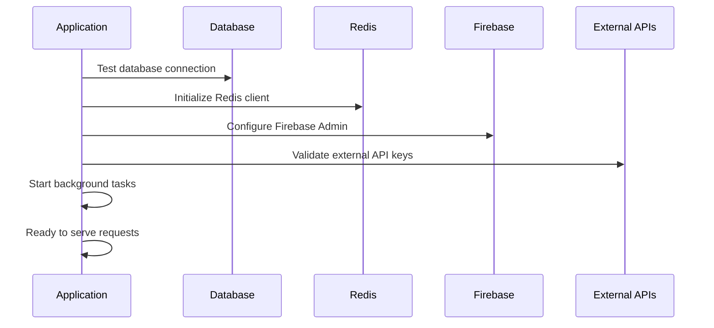

# System Initialization Architecture Design

## Executive Summary

This document defines the comprehensive initialization architecture for the Hormonia Oncology Clinic system, a healthcare communication platform that manages patient engagement through WhatsApp integration, AI-powered conversations, and medical monitoring.

**Architecture Focus**: Robust, secure, and observable initialization process with graceful failure handling and production-ready deployment capabilities.

## System Overview

### Core Components
- **Backend (FastAPI)**: REST API with WebSocket support, Redis caching, PostgreSQL database
- **Frontend (React)**: SPA with lazy loading, React Query caching, Firebase authentication
- **Infrastructure**: Redis for caching/sessions, PostgreSQL for persistence, Firebase for auth
- **Integrations**: WhatsApp API, Google Gemini AI, monitoring systems

### Key Quality Attributes
- **Reliability**: 99.9% uptime target with graceful degradation
- **Security**: Multi-layer security with CORS, CSRF, rate limiting, security headers
- **Observability**: Comprehensive monitoring, logging, and error tracking
- **Performance**: Sub-200ms API response times, lazy loading, efficient caching
- **Scalability**: Horizontal scaling support with session affinity

## Architecture Decision Records (ADRs)

### ADR-001: Application Factory Pattern
**Decision**: Use factory pattern for application initialization
**Rationale**:
- Enables different deployment modes (production, development, debug)
- Supports dependency injection and configuration-based setup
- Facilitates testing with mock dependencies
- Provides clean separation of concerns

**Trade-offs**:
- ✅ Better testability and flexibility
- ❌ Slightly more complex than direct instantiation

### ADR-002: Layered Middleware Architecture
**Decision**: Implement middleware in specific order with enhanced capabilities
**Rationale**:
- Security-first approach with headers, CORS, CSRF protection
- Performance optimization with compression and caching
- Comprehensive monitoring and logging
- Rate limiting for DoS protection

**Order of Execution**:
1. Monitoring (instrumentation)
2. Request logging (debug only)
3. Security headers (OWASP compliance)
4. Enhanced security (input validation)
5. Rate limiting (DoS protection)
6. Compression (performance)
7. CORS (cross-origin access)

### ADR-003: Configuration-Driven Initialization
**Decision**: Use Pydantic Settings with runtime validation
**Rationale**:
- Type-safe configuration with automatic validation
- Environment-specific settings (development vs production)
- Security validation for secrets and credentials
- Clear error messages for misconfiguration

### ADR-004: Graceful Degradation Strategy
**Decision**: Continue operation even if non-critical components fail
**Rationale**:
- Monitoring failure shouldn't prevent application startup
- Static file serving is optional for API functionality
- Debug endpoints only available in appropriate environments
- Error tracking failure doesn't crash the application

## System Architecture Diagram



## Initialization Sequence

### Phase 1: Configuration Loading


### Phase 2: Application Bootstrap


### Phase 3: Service Initialization


## Component Interaction Design

### Core Components

#### 1. Application Factory
**Responsibility**: Orchestrate application creation and configuration
**Dependencies**: Config, Middleware Setup, Router Registry, Monitoring
**Interface**:
```python
def create_application(
    enable_monitoring: bool = True,
    enable_debug_endpoints: bool = None,
    deployment_mode: Literal["production", "development", "debug"] = "production",
    enable_error_tracking: bool = True,
    enable_enhanced_openapi: bool = True
) -> FastAPI
```

#### 2. Configuration Manager
**Responsibility**: Load, validate, and provide configuration settings
**Dependencies**: Environment variables, Pydantic validators
**Key Features**:
- Type-safe configuration with Pydantic
- Runtime validation for security settings
- Environment-specific configuration
- CORS and Firebase validation

#### 3. Middleware Stack
**Responsibility**: Request/response processing pipeline
**Components**:
- Monitoring instrumentation
- Security headers (OWASP)
- Enhanced security validation
- Rate limiting
- Compression
- CORS handling

#### 4. Router Registry
**Responsibility**: API endpoint organization and registration
**Features**:
- Modular router registration
- Tag-based organization
- Graceful failure handling
- Debug endpoint conditional loading

#### 5. Monitoring Manager
**Responsibility**: Observability and health monitoring
**Capabilities**:
- APM instrumentation
- Database query monitoring
- Business metrics collection
- Error tracking integration

## Error Handling and Recovery

### Error Categories and Strategies

#### 1. Configuration Errors (Fail Fast)
- Invalid environment variables
- Missing required secrets
- Security validation failures
- Database connection issues

**Strategy**: Prevent startup with clear error messages

#### 2. Optional Component Failures (Graceful Degradation)
- Monitoring setup failures
- Static file serving issues
- Debug endpoint errors
- Non-critical external service failures

**Strategy**: Log warnings and continue operation

#### 3. Runtime Errors (Graceful Recovery)
- Temporary database connectivity issues
- Redis connection failures
- External API timeouts
- Authentication service disruptions

**Strategy**: Implement retry logic and fallback mechanisms

### Error Tracking Implementation
```python
@app.exception_handler(Exception)
async def global_exception_handler(request: Request, exc: Exception):
    # Generate correlation ID
    request_id = getattr(request.state, 'request_id', 'unknown')

    # Track error with context
    track_error(exc, request)

    # Log with structured data
    logger.error(f"Unhandled exception: {exc}", extra={
        'request_id': request_id,
        'path': str(request.url),
        'method': request.method,
        'deployment_mode': app.state.deployment_mode
    })

    # Return appropriate error response
    return JSONResponse(
        status_code=500,
        content={
            "error": "internal_server_error",
            "message": "An unexpected error occurred",
            "request_id": request_id,
            "timestamp": datetime.utcnow().isoformat()
        }
    )
```

## Security Architecture

### Multi-Layer Security Model

#### Layer 1: Network Security
- HTTPS enforcement in production
- Secure cookie configuration
- HSTS headers for browsers

#### Layer 2: Application Security
- CORS validation with environment-specific rules
- CSRF protection for session-based endpoints
- Input validation and sanitization
- Rate limiting to prevent abuse

#### Layer 3: Authentication & Authorization
- Firebase Admin SDK integration
- JWT token validation
- Role-based access control
- Session management with Redis

#### Layer 4: Data Security
- Database connection encryption
- Sensitive data masking in logs
- Secure configuration management

### Security Headers Configuration
```python
def create_production_security_middleware():
    return SecurityHeadersMiddleware(
        enable_hsts=True,
        hsts_max_age=31536000,  # 1 year
        hsts_include_subdomains=True,
        frame_options="DENY",
        content_type_options="nosniff",
        xss_protection="1; mode=block",
        referrer_policy="strict-origin-when-cross-origin",
        csp_policy="default-src 'self'; script-src 'self' 'unsafe-inline'",
        permissions_policy="geolocation=(), microphone=(), camera=()"
    )
```

## Performance Architecture

### Optimization Strategies

#### 1. Application Level
- Lazy loading for frontend components
- React Query caching with smart invalidation
- Database query optimization with GIN indexes
- Redis caching for frequently accessed data

#### 2. Middleware Level
- Compression middleware for response optimization
- Request deduplication within time windows
- Query performance monitoring
- Efficient CORS handling

#### 3. Database Level
- Connection pooling with SQLAlchemy
- Eager loading for related entities
- GIN indexes for search operations
- Query performance monitoring

### Caching Strategy
```python
# Redis Configuration for Different Use Cases
REDIS_CACHE_DB = 1      # Application caching
REDIS_BROKER_DB = 0     # Celery message broker
REDIS_SESSION_DB = 2    # User sessions
REDIS_RATE_LIMIT_DB = 3 # Rate limiting storage
```

## Monitoring and Observability

### Monitoring Components

#### 1. Application Performance Monitoring (APM)
- Request/response timing
- Error rate tracking
- Throughput metrics
- Resource utilization

#### 2. Database Monitoring
- Query performance tracking
- Connection pool metrics
- Slow query identification

#### 3. Business Metrics
- Patient engagement rates
- Message delivery success rates
- Quiz completion metrics
- Alert generation patterns

#### 4. Infrastructure Monitoring
- Redis cache performance
- External API response times
- Background task execution

### Health Check Endpoints
```python
@app.get("/health")
async def health_check():
    return {
        "status": "healthy",
        "timestamp": datetime.utcnow().isoformat(),
        "version": "2.0.0",
        "uptime": time.time() - app.state.start_time
    }

@app.get("/health/ready")
async def readiness_check():
    # Check critical dependencies
    checks = {
        "database": await check_database_connection(),
        "redis": await check_redis_connection(),
        "firebase": await check_firebase_service()
    }

    if all(checks.values()):
        return {"status": "ready", "checks": checks}
    else:
        raise HTTPException(status_code=503, detail={"status": "not_ready", "checks": checks})
```

## Deployment Architecture

### Environment Configuration

#### Production Environment
- Debug disabled
- Secure cookie settings
- HTTPS enforcement
- Comprehensive security headers
- Error tracking enabled
- Monitoring required

#### Development Environment
- Debug endpoints available
- Relaxed CORS for localhost
- Enhanced error messages
- Optional monitoring
- Development-friendly logging

#### Debug Environment
- All debug features enabled
- Detailed import testing
- Environment variable inspection
- Component health diagnostics

### Scaling Considerations

#### Horizontal Scaling
- Stateless application design
- Redis-based session storage
- Database connection pooling
- Load balancer compatibility

#### Vertical Scaling
- Configurable worker processes
- Memory-efficient caching
- Database query optimization
- Resource monitoring

## Implementation Guidelines

### Development Workflow

#### 1. Configuration First
- Define all settings in Pydantic models
- Validate configuration at startup
- Provide clear error messages for misconfiguration

#### 2. Modular Design
- Separate concerns into focused modules
- Use dependency injection patterns
- Implement graceful failure handling

#### 3. Testing Strategy
- Unit tests for individual components
- Integration tests for component interactions
- End-to-end tests for critical user journeys
- Performance tests for optimization validation

#### 4. Documentation Requirements
- Architecture decision records for major choices
- API documentation with OpenAPI
- Deployment guides for different environments
- Troubleshooting guides for common issues

### Code Organization
```
backend-hormonia/
├── app/
│   ├── core/                    # Core application components
│   │   ├── application_factory.py
│   │   ├── middleware_setup.py
│   │   ├── router_registry.py
│   │   └── lifespan.py
│   ├── middleware/              # Middleware implementations
│   │   ├── cors.py
│   │   ├── security_headers.py
│   │   ├── enhanced_middleware.py
│   │   └── csrf.py
│   ├── api/                     # API routes and endpoints
│   ├── services/                # Business logic services
│   ├── models/                  # Database models
│   ├── utils/                   # Utility functions
│   └── config.py               # Configuration management
└── docs/                       # Architecture documentation
```

## Risk Assessment and Mitigation

### High-Risk Areas

#### 1. Configuration Management
**Risk**: Misconfiguration leading to security vulnerabilities
**Mitigation**:
- Comprehensive validation at startup
- Security-specific validators
- Clear error messages with remediation steps

#### 2. External Service Dependencies
**Risk**: External service failures causing system downtime
**Mitigation**:
- Graceful degradation for non-critical services
- Circuit breaker patterns for external APIs
- Health checks for dependency validation

#### 3. Performance Bottlenecks
**Risk**: Poor performance under load
**Mitigation**:
- Comprehensive monitoring and alerting
- Database query optimization
- Caching strategies for frequently accessed data

### Security Risks

#### 1. CORS Misconfiguration
**Risk**: Unauthorized cross-origin requests
**Mitigation**:
- Environment-specific CORS validation
- Explicit origin whitelisting in production
- Regular security audits

#### 2. Authentication Bypass
**Risk**: Unauthorized access to protected resources
**Mitigation**:
- Firebase Admin SDK integration
- Role-based access control
- Session management with Redis

## Future Enhancements

### Phase 2 Improvements
- Service mesh integration for microservices
- Advanced caching strategies with CDN
- Enhanced monitoring with distributed tracing
- Automated scaling based on metrics

### Phase 3 Considerations
- Multi-region deployment support
- Advanced AI integration with model management
- Real-time collaboration features
- Enhanced analytics and reporting

## Conclusion

This initialization architecture provides a robust foundation for the Hormonia Oncology Clinic system with:

- **Security-first design** with multiple protection layers
- **Observable operations** with comprehensive monitoring
- **Graceful failure handling** for production resilience
- **Performance optimization** for user experience
- **Scalable architecture** for future growth

The modular design enables independent component development while maintaining system cohesion through well-defined interfaces and clear dependency management.