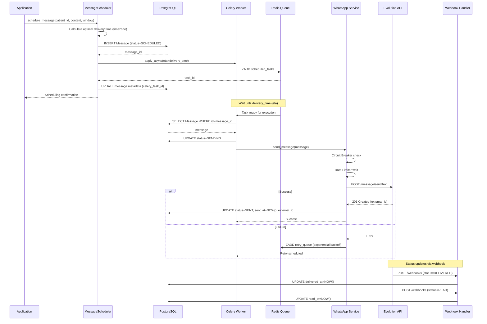
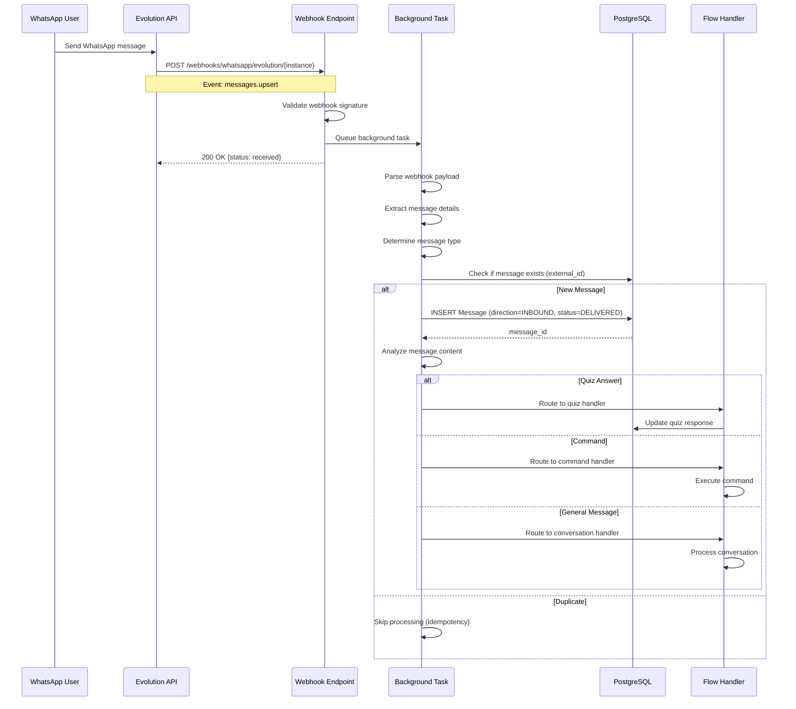
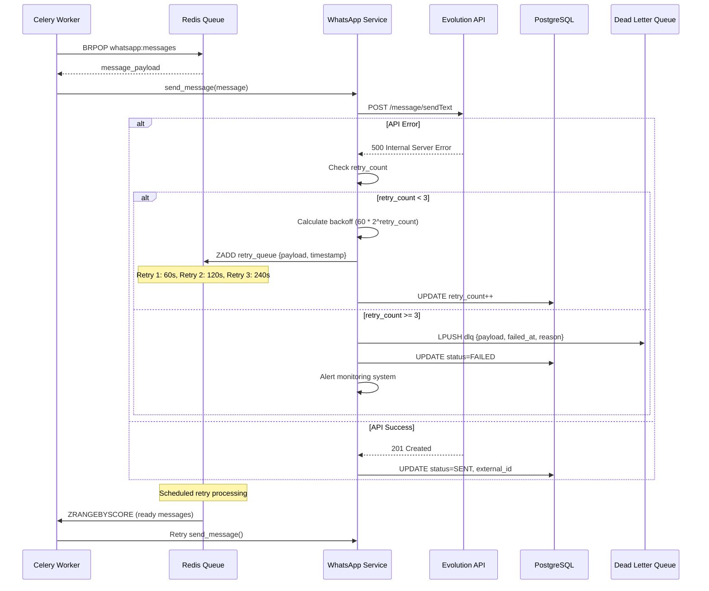
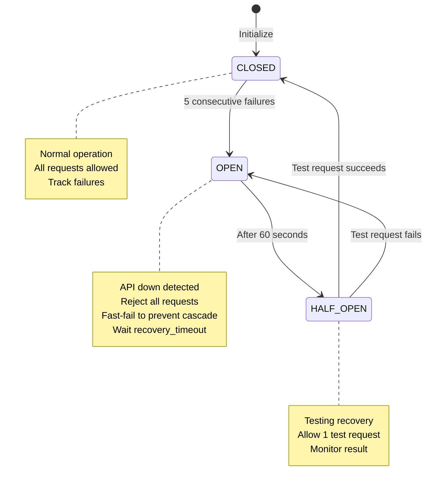

# WhatsApp Integration Architecture - Complete Flow Analysis

**Document Version:** 1.0
**Last Updated:** 2025-10-09
**Analyst:** System Architecture Designer
**Review Scope:** Complete WhatsApp messaging system from creation to delivery confirmation

---

## Table of Contents

1. [Executive Summary](#executive-summary)
2. [System Architecture Overview](#system-architecture-overview)
3. [Component Analysis](#component-analysis)
4. [Message Lifecycle](#message-lifecycle)
5. [Integration Points](#integration-points)
6. [Error Handling & Resilience](#error-handling--resilience)
7. [Performance & Scalability](#performance--scalability)
8. [Key Findings & Recommendations](#key-findings--recommendations)
9. [Sequence Diagrams](#sequence-diagrams)

---

## Executive Summary

### System Overview

The WhatsApp integration implements a **dual-mode messaging architecture** with comprehensive queue management, retry logic, and delivery tracking. The system integrates with Evolution API for WhatsApp Business API communication.

### Key Architectural Patterns

- **Queue-Based Processing:** Redis + Celery for reliable message delivery
- **Circuit Breaker Pattern:** Prevents cascading failures with Evolution API
- **Rate Limiting:** Sliding window algorithm (100 req/60s default)
- **Exponential Backoff:** Automatic retry with 2^n backoff factor
- **Event-Driven Webhooks:** Real-time status updates and incoming messages

### Critical Metrics

| Metric | Current Implementation |
|--------|----------------------|
| **Max Retries** | 3 (configurable per message type) |
| **Rate Limit** | 100 requests/60s (sliding window) |
| **Queue Types** | Primary, Retry, Dead Letter Queue (DLQ) |
| **Timeout** | 30s per API request |
| **Concurrent Connections** | 100 total, 30 per host |

---

## System Architecture Overview

### High-Level Architecture

```
┌─────────────────────────────────────────────────────────────────┐
│                    CLINICA ONCOLOGICA BACKEND                     │
├─────────────────────────────────────────────────────────────────┤
│                                                                   │
│  ┌──────────────┐      ┌─────────────┐      ┌──────────────┐   │
│  │   Message    │──────▶│  Message    │──────▶│   Message    │   │
│  │  Scheduler   │       │   Service   │       │  Repository  │   │
│  │              │       │             │       │              │   │
│  └──────────────┘      └─────────────┘      └──────────────┘   │
│         │                      │                      │          │
│         ▼                      ▼                      ▼          │
│  ┌──────────────────────────────────────────────────────────┐   │
│  │                   Redis Message Queue                     │   │
│  │  ┌──────────┐  ┌──────────┐  ┌──────────────────────┐  │   │
│  │  │ Primary  │  │  Retry   │  │  Dead Letter Queue  │  │   │
│  │  │  Queue   │  │  Queue   │  │       (DLQ)         │  │   │
│  │  └──────────┘  └──────────┘  └──────────────────────┘  │   │
│  └──────────────────────────────────────────────────────────┘   │
│         │                                                        │
│         ▼                                                        │
│  ┌──────────────────────────────────────────────────────────┐   │
│  │              Celery Worker Pool                           │   │
│  │  ┌──────────┐  ┌──────────┐  ┌──────────┐               │   │
│  │  │ Worker 1 │  │ Worker 2 │  │ Worker N │               │   │
│  │  └──────────┘  └──────────┘  └──────────┘               │   │
│  └──────────────────────────────────────────────────────────┘   │
│         │                                                        │
│         ▼                                                        │
│  ┌──────────────────────────────────────────────────────────┐   │
│  │           WhatsApp Message Service                        │   │
│  │         (Queue Manager + Evolution Client)                │   │
│  │  ┌──────────────┐         ┌──────────────────┐           │   │
│  │  │ Circuit      │         │ Rate Limiter     │           │   │
│  │  │ Breaker      │         │ (100/60s)        │           │   │
│  │  └──────────────┘         └──────────────────┘           │   │
│  └──────────────────────────────────────────────────────────┘   │
│         │                                                        │
└─────────┼────────────────────────────────────────────────────────┘
          │
          │ HTTPS + Bearer Auth
          ▼
┌─────────────────────────────────────────────────────────────────┐
│                      EVOLUTION API                               │
│                   (WhatsApp Business API)                        │
└─────────────────────────────────────────────────────────────────┘
          │
          │ Webhooks (POST)
          ▼
┌─────────────────────────────────────────────────────────────────┐
│                    Webhook Endpoints                             │
│  /webhooks/whatsapp/evolution/{instance}                         │
│  - messages.upsert (incoming)                                    │
│  - messages.update (status)                                      │
│  - send.message (outgoing confirmation)                          │
│  - connection.update (instance status)                           │
└─────────────────────────────────────────────────────────────────┘
```

---

## Component Analysis

### 1. Evolution API Client (`evolution_client.py`)

**Location:** `backend-hormonia/app/integrations/whatsapp/services/evolution_client.py`

#### Key Features

```python
class EvolutionAPIClient:
    - Rate Limiting: Sliding window (100 req/60s)
    - Retry Logic: Exponential backoff with @backoff.on_exception
    - Connection Pooling: 100 total, 30 per host
    - Timeout: 30s per request
    - Auto-reconnect: Automatic session management
```

#### API Methods

| Method | Endpoint | Purpose | Retry |
|--------|----------|---------|-------|
| `send_text_message` | `/message/sendText/{instance}` | Send text message | ✓ 3x |
| `send_media_message` | `/message/sendMedia/{instance}` | Send media (image/video/doc) | ✓ 3x |
| `get_instance_status` | `/instance/connectionState/{instance}` | Check connection | ✓ 3x |
| `check_whatsapp_number` | `/chat/whatsappNumbers/{instance}` | Validate number | ✓ 3x |
| `get_contacts` | `/chat/findContacts/{instance}` | Sync contacts | ✓ 3x |
| `set_webhook_url` | `/webhook/{instance}` | Configure webhooks | ✓ 3x |

#### Rate Limiting Implementation

```python
class RateLimiter:
    """Sliding window rate limiter"""
    - max_requests: 100
    - window_seconds: 60
    - Algorithm: Remove expired requests, allow if under limit
    - Blocking: async wait_for_availability()
```

#### Error Handling

```python
@backoff.on_exception(
    backoff.expo,
    (ClientError, asyncio.TimeoutError),
    max_tries=3,
    factor=2,
    max_value=60
)
```

**Backoff Schedule:**
- Try 1: Immediate
- Try 2: 2s delay
- Try 3: 4s delay (max 60s)

---

### 2. Message Queue System (`message_service.py`)

**Location:** `backend-hormonia/app/integrations/whatsapp/services/message_service.py`

#### Queue Architecture

```python
class MessageQueue:
    - Backend: Redis (REDIS_URL from env)
    - Queues:
        * whatsapp:messages (primary)
        * whatsapp:messages:scheduled (delayed execution)
        * whatsapp:messages:retry:scheduled (retry queue)
        * whatsapp:messages:dlq (dead letter queue)
```

#### Queue Flow

```
Message Creation
    │
    ▼
┌──────────────────────────┐
│  Immediate Send?         │
├──────────────────────────┤
│  Yes → Primary Queue     │───▶ BRPOP (blocking pop)
│  No  → Scheduled Queue   │───▶ ZADD with timestamp
└──────────────────────────┘
    │
    ▼
Worker Dequeue
    │
    ▼
┌──────────────────────────┐
│  Process Message         │
├──────────────────────────┤
│  Success → Update DB     │
│  Fail    → Retry Logic   │
└──────────────────────────┘
    │
    ▼
Retry Decision
    │
    ├─▶ retry_count < max_retries → Retry Queue (exponential backoff)
    └─▶ retry_count >= max_retries → Dead Letter Queue
```

#### Retry Configuration

```python
max_retries = 3
backoff_delay = delay_seconds * (2 ** (retry_count - 1))

Example:
- Retry 1: 60s  (1 minute)
- Retry 2: 120s (2 minutes)
- Retry 3: 240s (4 minutes)
- After 3: DLQ
```

---

### 3. Message Models (`message.py`)

**Location:** `backend-hormonia/app/models/message.py`

#### Database Schema

```sql
CREATE TABLE messages (
    id UUID PRIMARY KEY,
    patient_id UUID NOT NULL REFERENCES patients(id),

    -- Message Classification
    direction VARCHAR(20) NOT NULL,  -- INBOUND | OUTBOUND
    type VARCHAR(50) NOT NULL,       -- TEXT | MEDIA | QUIZ_* | MONTHLY_*
    content TEXT,
    message_metadata JSONB,

    -- WhatsApp Integration
    whatsapp_id VARCHAR(255),        -- External message ID
    status VARCHAR(20) NOT NULL,     -- PENDING | SENT | DELIVERED | READ | FAILED

    -- Scheduling & Tracking
    scheduled_for TIMESTAMP,
    sent_at TIMESTAMP,
    delivered_at TIMESTAMP,
    read_at TIMESTAMP,

    -- Timestamps
    created_at TIMESTAMP DEFAULT NOW(),
    updated_at TIMESTAMP DEFAULT NOW()
);

CREATE INDEX idx_messages_patient_id ON messages(patient_id);
CREATE INDEX idx_messages_whatsapp_id ON messages(whatsapp_id);
CREATE INDEX idx_messages_status ON messages(status);
CREATE INDEX idx_messages_scheduled_for ON messages(scheduled_for);
```

#### Message Status Lifecycle

```
PENDING → SCHEDULED → SENDING → SENT → DELIVERED → READ
   │                                │
   └────────────────────────────────┴─▶ FAILED (retry or DLQ)
```

#### Message Types

```python
class MessageType(Enum):
    TEXT = "text"
    BUTTON = "button"
    LIST = "list"
    MEDIA = "media"
    LOCATION = "location"

    # Quiz Messages
    QUIZ_INTRO = "quiz_intro"
    QUIZ_QUESTION = "quiz_question"
    QUIZ_ENCOURAGEMENT = "quiz_encouragement"
    QUIZ_COMPLETION = "quiz_completion"

    # Monthly Quiz
    MONTHLY_QUIZ_LINK = "monthly_quiz_link"
    MONTHLY_QUIZ_REMINDER = "monthly_quiz_reminder"
    MONTHLY_QUIZ_EXPIRED = "monthly_quiz_expired"
    MONTHLY_QUIZ_COMPLETED = "monthly_quiz_completed"
```

---

### 4. Message Scheduler (`message_scheduler.py`)

**Location:** `backend-hormonia/app/services/message_scheduler.py`

#### Scheduling Windows

```python
SCHEDULING_WINDOWS = {
    MORNING: (09:00, 12:00),
    AFTERNOON: (12:00, 17:00),
    EVENING: (17:00, 20:00),
    BUSINESS_HOURS: (09:00, 18:00),
    EXTENDED_HOURS: (08:00, 21:00)
}
```

#### Timezone Handling

```python
DEFAULT_TIMEZONE = "America/Sao_Paulo"

Flow:
1. Get patient timezone from metadata
2. Convert current UTC to patient timezone
3. Calculate next scheduling window
4. Add MIN_SCHEDULING_BUFFER_MINUTES (15 min)
5. Convert back to UTC for database storage
```

#### Celery Integration

```python
# Schedule message for future delivery
task_result = send_flow_message.apply_async(
    args=[patient_id, message_data, message_id],
    eta=delivery_time  # UTC timestamp
)

# Store task_id in message metadata
message.message_metadata["celery_task_id"] = task_result.id
```

#### Cancellation & Rescheduling

```python
# Cancel scheduled message
celery_app.control.revoke(task_id, terminate=True)

# Reschedule
1. Revoke old task
2. Create new task with new eta
3. Update message.scheduled_for
4. Update celery_task_id in metadata
```

---

### 5. Webhook Integration (`webhooks.py`)

**Location:** `backend-hormonia/app/integrations/whatsapp/api/webhooks.py`

#### Webhook Events

```python
WEBHOOK_EVENTS = [
    "messages.upsert",      # Incoming message
    "messages.update",      # Status update (sent → delivered → read)
    "send.message",         # Outgoing confirmation
    "contacts.upsert",      # Contact sync
    "connection.update",    # Instance connection status
    "presence.update",      # Online/offline status
    "chats.upsert",         # Chat updates
]
```

#### Webhook Processing Flow

```
Evolution API POST /webhooks/whatsapp/evolution/{instance}
    │
    ▼
Validate Payload
    │
    ▼
Background Task (FastAPI)
    │
    ├─▶ messages.upsert → handle_message_upsert()
    │   └─▶ Parse message → Store in DB → Route to flow handler
    │
    ├─▶ messages.update → handle_message_update()
    │   └─▶ Map status (1=SENT, 2=DELIVERED, 3=READ) → Update DB
    │
    ├─▶ send.message → handle_send_message()
    │   └─▶ Store external_id → Update status to SENT
    │
    └─▶ connection.update → handle_connection_update()
        └─▶ Update instance status → Update phone/profile
```

#### Message Parsing Logic

```python
# Text messages
if 'conversation' in message_info:
    content = message_info['conversation']

# Extended text (replies, etc.)
elif 'extendedTextMessage' in message_info:
    content = message_info['extendedTextMessage']['text']

# Media messages
elif 'imageMessage' in message_info:
    type = "image"
    media_url = message_info['imageMessage']['url']
    caption = message_info['imageMessage']['caption']

# Similar for video, audio, document
```

---

### 6. Message Repository (`message.py`)

**Location:** `backend-hormonia/app/repositories/message.py`

#### Query Optimization

```python
# PERFORMANCE FIX: Eager loading to prevent N+1 queries
query = query.options(joinedload(Message.patient))

# PERFORMANCE FIX: Database-level filtering
filters = [
    Message.patient_id == patient_id,
    Message.status == status,
    Message.created_at >= start_date
]
query = query.filter(and_(*filters))

# PERFORMANCE FIX: Database aggregation
stats = db.query(
    Message.status,
    func.count(Message.id).label('count')
).group_by(Message.status).all()
```

#### Key Methods

| Method | Purpose | Eager Load | Pagination |
|--------|---------|------------|------------|
| `get_by_patient()` | Patient message history | ✓ | ✓ |
| `get_pending_messages()` | Queue processing | ✓ | ✓ |
| `get_scheduled_messages()` | Celery job fetch | ✗ | ✓ |
| `get_conversation_history()` | Chat view | ✓ | ✓ |
| `get_failed_messages()` | Retry processing | ✓ | ✓ |
| `get_message_statistics()` | Analytics | N/A (aggregation) | ✗ |

#### Integrity Validation

```python
class MessageIntegrityService:
    - validate_message_creation()
        * Required fields check
        * Patient existence
        * Content validation (4096 char limit)
        * Chronological order

    - generate_message_checksum()
        * SHA-256 hash of critical fields
        * Tamper detection

    - validate_conversation_integrity()
        * Checksum verification
        * Chronological order
        * Orphaned message detection
        * Flow consistency
```

---

## Message Lifecycle

### Complete Flow: Outbound Message

```
1. MESSAGE CREATION
   ┌─────────────────────────────────────────────────────┐
   │ MessageScheduler.schedule_message()                 │
   │  - Validate patient, content, scheduling window     │
   │  - Calculate optimal delivery time (timezone-aware) │
   │  - Create Message record (status: SCHEDULED)        │
   └─────────────────────────────────────────────────────┘
                          │
                          ▼
2. CELERY TASK SCHEDULING
   ┌─────────────────────────────────────────────────────┐
   │ send_flow_message.apply_async(eta=delivery_time)    │
   │  - Store celery_task_id in message.metadata         │
   │  - Redis stores task until eta                      │
   └─────────────────────────────────────────────────────┘
                          │
                          ▼
3. QUEUE PROCESSING (at eta time)
   ┌─────────────────────────────────────────────────────┐
   │ Celery Worker picks up task                         │
   │  - Fetch message from database                      │
   │  - Update status: SCHEDULED → SENDING               │
   └─────────────────────────────────────────────────────┘
                          │
                          ▼
4. EVOLUTION API CALL
   ┌─────────────────────────────────────────────────────┐
   │ WhatsAppMessageService.send_message()               │
   │  - Circuit Breaker check                            │
   │  - Rate Limiter wait                                │
   │  - HTTP POST to Evolution API                       │
   │  - Retry on failure (exponential backoff)           │
   └─────────────────────────────────────────────────────┘
                          │
           ┌──────────────┴───────────────┐
           │                              │
    SUCCESS                           FAILURE
           │                              │
           ▼                              ▼
   ┌─────────────────┐          ┌─────────────────┐
   │ Status: SENT    │          │ Retry Logic     │
   │ sent_at: NOW()  │          │  retry_count++  │
   │ external_id: ID │          │  if < max:      │
   └─────────────────┘          │   → Retry Queue │
           │                    │  else:          │
           │                    │   → DLQ         │
           │                    └─────────────────┘
           ▼
5. WEBHOOK STATUS UPDATES
   ┌─────────────────────────────────────────────────────┐
   │ Evolution API → /webhooks/whatsapp/evolution/       │
   │                                                     │
   │ Event: messages.update                              │
   │  - status=1 → SENT                                  │
   │  - status=2 → DELIVERED (delivered_at: NOW())       │
   │  - status=3 → READ (read_at: NOW())                 │
   └─────────────────────────────────────────────────────┘
```

### Complete Flow: Inbound Message

```
1. WHATSAPP USER SENDS MESSAGE
                │
                ▼
2. EVOLUTION API WEBHOOK
   ┌─────────────────────────────────────────────────────┐
   │ POST /webhooks/whatsapp/evolution/{instance}        │
   │ Event: messages.upsert                              │
   │ Payload:                                            │
   │  {                                                  │
   │    "key": {"id": "msg_id", "remoteJid": "phone@"}  │
   │    "message": {"conversation": "text"}             │
   │    "messageTimestamp": 1234567890                  │
   │  }                                                  │
   └─────────────────────────────────────────────────────┘
                │
                ▼
3. WEBHOOK PROCESSING (Background Task)
   ┌─────────────────────────────────────────────────────┐
   │ handle_message_upsert()                             │
   │  - Extract message details                          │
   │  - Determine message type (text/image/etc)          │
   │  - Check if message exists (idempotency)            │
   │  - Create Message record:                           │
   │    * direction: INBOUND                             │
   │    * status: DELIVERED                              │
   │    * sender_id: patient phone                       │
   │    * external_id: Evolution message ID              │
   └─────────────────────────────────────────────────────┘
                │
                ▼
4. FLOW ROUTING (if applicable)
   ┌─────────────────────────────────────────────────────┐
   │ Analyze message content                             │
   │  - Quiz answer detection                            │
   │  - Command recognition                              │
   │  - Flow context matching                            │
   │  - Route to appropriate handler                     │
   └─────────────────────────────────────────────────────┘
```

---

## Integration Points

### 1. Evolution API Integration

**Endpoint:** `https://evolution-api-url/`
**Authentication:** Bearer Token in Authorization header

```python
headers = {
    'Authorization': f'Bearer {api_key}',
    'Content-Type': 'application/json',
    'User-Agent': 'Hormonia-WhatsApp-Integration/1.0'
}
```

#### Connection Management

```python
# TCP Connector with keep-alive
connector = aiohttp.TCPConnector(
    limit=100,              # Total connections
    limit_per_host=30,      # Per-host limit
    keepalive_timeout=30,   # Keep connections alive
    enable_cleanup_closed=True
)
```

### 2. Redis Integration

**Connection:** `REDIS_URL` environment variable
**Usage:** Message queue, scheduled jobs, retry logic

```python
# Queue Operations
LPUSH whatsapp:messages {message_payload}      # Enqueue
BRPOP whatsapp:messages 30                     # Dequeue (30s timeout)
ZADD whatsapp:messages:scheduled {payload} {timestamp}  # Schedule
ZRANGEBYSCORE whatsapp:messages:scheduled 0 {now}       # Get ready
```

### 3. Celery Integration

**Broker:** Redis
**Backend:** Redis
**Task:** `app.tasks.flows.send_flow_message`

```python
@celery_app.task(bind=True, max_retries=3)
def send_flow_message(self, patient_id, message_data, message_id):
    """
    Celery task for scheduled message delivery

    Args:
        patient_id: UUID
        message_data: {content, type, metadata}
        message_id: UUID (for updating existing message)
    """
```

### 4. Database Integration

**ORM:** SQLAlchemy (async)
**Tables:**
- `messages` - Main message storage
- `whatsapp_messages` - WhatsApp-specific data (Evolution integration)
- `whatsapp_contacts` - Contact sync
- `whatsapp_instances` - Instance management

---

## Error Handling & Resilience

### 1. Circuit Breaker Pattern

```python
class CircuitBreaker:
    - failure_threshold: 5 consecutive failures
    - recovery_timeout: 60 seconds
    - States: CLOSED → OPEN → HALF_OPEN → CLOSED

    Flow:
    - CLOSED: Normal operation
    - 5 failures → OPEN (reject all requests)
    - After 60s → HALF_OPEN (allow 1 test request)
    - Success → CLOSED | Failure → OPEN
```

**Impact:** Prevents cascading failures when Evolution API is down

### 2. Retry Strategies

#### API Request Retries (Synchronous)

```python
@backoff.on_exception(backoff.expo, (ClientError, TimeoutError), max_tries=3)
- Try 1: Immediate
- Try 2: 2s delay
- Try 3: 4s delay
```

#### Message Queue Retries (Asynchronous)

```python
retry_count = 0
while retry_count < max_retries:
    try:
        send_message()
        break
    except Exception:
        retry_count += 1
        backoff_delay = 60 * (2 ** (retry_count - 1))
        schedule_retry(backoff_delay)

# Retry schedule:
# - Retry 1: 60s  (1 minute)
# - Retry 2: 120s (2 minutes)
# - Retry 3: 240s (4 minutes)
# - Failed → DLQ
```

### 3. Dead Letter Queue (DLQ)

**Purpose:** Store permanently failed messages for manual review

```python
# Move to DLQ after max retries
await redis.lpush(
    "whatsapp:messages:dlq",
    json.dumps({
        **message_payload,
        "failed_at": datetime.utcnow().isoformat(),
        "failure_reason": error_message,
        "retry_history": retry_attempts
    })
)
```

**DLQ Processing:**
1. Alert monitoring system
2. Log to error tracking (Sentry)
3. Manual investigation required
4. Possible actions: Fix data → Re-enqueue | Mark as undeliverable

### 4. Rate Limiting

**Algorithm:** Sliding Window

```python
def acquire():
    now = datetime.now()
    cutoff = now - timedelta(seconds=window_seconds)

    # Remove expired requests
    requests = [r for r in requests if r > cutoff]

    if len(requests) < max_requests:
        requests.append(now)
        return True
    return False
```

**Behavior:**
- Under limit: Immediate processing
- At limit: Wait 1 second, retry check
- Ensures compliance with Evolution API limits

### 5. Timeout Handling

```python
ClientTimeout(total=30)  # 30 second total timeout

Scenarios:
- Network latency
- Evolution API slow response
- Database query timeout

Action:
- Raise asyncio.TimeoutError
- Trigger retry logic
- Log timeout event
```

---

## Performance & Scalability

### Current Performance Characteristics

| Metric | Value | Bottleneck |
|--------|-------|------------|
| **API Throughput** | 100 req/min | Rate limiter |
| **Queue Throughput** | ~1000 msg/min | Celery workers |
| **Database Queries** | Optimized with eager loading | N+1 prevented |
| **Concurrent Connections** | 100 total, 30/host | TCP connector |
| **Message Size Limit** | 4096 chars (WhatsApp) | Evolution API |

### Scalability Considerations

#### Horizontal Scaling

```
┌──────────────┐    ┌──────────────┐    ┌──────────────┐
│ Celery       │    │ Celery       │    │ Celery       │
│ Worker 1     │    │ Worker 2     │    │ Worker N     │
└──────────────┘    └──────────────┘    └──────────────┘
       │                   │                   │
       └───────────────────┴───────────────────┘
                           │
                    ┌──────────────┐
                    │ Redis Queue  │
                    │  (Shared)    │
                    └──────────────┘
```

**Scaling Strategy:**
- Add Celery workers to increase throughput
- Redis handles coordination
- Database connection pooling per worker

#### Vertical Scaling

- Increase Celery worker concurrency
- Optimize database connection pool size
- Increase Evolution API rate limits (if supported)

### Monitoring Recommendations

```python
# Key metrics to track
{
    "queue_metrics": {
        "pending_messages": len(primary_queue),
        "retry_messages": len(retry_queue),
        "dlq_messages": len(dlq),
        "processing_messages": active_tasks
    },
    "performance_metrics": {
        "avg_send_time": float,
        "avg_delivery_time": float,
        "success_rate": percentage,
        "retry_rate": percentage
    },
    "api_metrics": {
        "rate_limit_hits": count,
        "circuit_breaker_opens": count,
        "timeout_errors": count,
        "api_errors": count
    }
}
```

---

## Key Findings & Recommendations

### ✅ Strengths

1. **Robust Error Handling**
   - Circuit breaker prevents cascading failures
   - Exponential backoff retry logic
   - Dead letter queue for permanent failures

2. **Well-Designed Queue System**
   - Redis-based with scheduled execution
   - Separate retry and DLQ
   - Idempotent processing

3. **Comprehensive Logging**
   - Structured logging throughout
   - Webhook event tracking
   - Error context preservation

4. **Performance Optimizations**
   - Eager loading to prevent N+1 queries
   - Database-level filtering and aggregation
   - Connection pooling and keep-alive

### ⚠️ Areas for Improvement

1. **Observability Gaps**
   - **Issue:** Limited real-time monitoring
   - **Impact:** Difficult to detect issues quickly
   - **Recommendation:** Add Prometheus metrics, Grafana dashboards

2. **Webhook Security**
   - **Issue:** Signature validation exists but not enforced everywhere
   - **Impact:** Potential for webhook spoofing
   - **Recommendation:** Enforce signature validation in all webhook endpoints

3. **Queue Monitoring**
   - **Issue:** No automated alerts for DLQ buildup
   - **Impact:** Failed messages may go unnoticed
   - **Recommendation:** Alert on DLQ threshold (e.g., > 10 messages)

4. **Rate Limit Coordination**
   - **Issue:** Rate limiter is per-instance, not global
   - **Impact:** Multiple workers could exceed API limits
   - **Recommendation:** Use Redis-based distributed rate limiter

5. **Message Deduplication**
   - **Issue:** Webhook events may arrive multiple times
   - **Impact:** Duplicate message processing
   - **Recommendation:** Add idempotency keys to webhook processing

### 🔧 Recommended Enhancements

#### Priority 1: High Impact, Low Effort

1. **Add DLQ Monitoring**
   ```python
   # Add to queue manager
   async def check_dlq_threshold():
       dlq_size = await redis.llen("whatsapp:messages:dlq")
       if dlq_size > 10:
           alert_ops_team(f"DLQ has {dlq_size} messages")
   ```

2. **Enforce Webhook Signatures**
   ```python
   # Add to all webhook endpoints
   if not validate_webhook_signature(request):
       raise HTTPException(status_code=401, detail="Invalid signature")
   ```

3. **Add Prometheus Metrics**
   ```python
   from prometheus_client import Counter, Histogram

   message_sent = Counter('whatsapp_messages_sent_total', 'Total messages sent')
   message_failed = Counter('whatsapp_messages_failed_total', 'Total messages failed')
   send_duration = Histogram('whatsapp_send_duration_seconds', 'Message send duration')
   ```

#### Priority 2: Medium Impact, Medium Effort

1. **Distributed Rate Limiter**
   ```python
   class RedisRateLimiter:
       async def acquire(self, key: str):
           pipe = redis.pipeline()
           now = time.time()
           pipe.zadd(key, {uuid4(): now})
           pipe.zremrangebyscore(key, 0, now - window)
           pipe.zcard(key)
           pipe.expire(key, window)
           results = await pipe.execute()
           return results[2] <= max_requests
   ```

2. **Idempotency Layer**
   ```python
   async def process_webhook_idempotent(webhook_id: str, event_data: dict):
       # Check if already processed
       if await redis.exists(f"webhook:processed:{webhook_id}"):
           logger.info(f"Webhook {webhook_id} already processed")
           return

       # Process
       await process_webhook(event_data)

       # Mark as processed (24h TTL)
       await redis.setex(f"webhook:processed:{webhook_id}", 86400, "1")
   ```

3. **Health Check Dashboard**
   ```python
   @router.get("/health/whatsapp")
   async def whatsapp_health():
       return {
           "evolution_api": await check_evolution_api(),
           "redis_queue": await check_redis_connection(),
           "queue_stats": await get_queue_stats(),
           "recent_errors": await get_recent_errors(limit=5)
       }
   ```

#### Priority 3: Long-term Improvements

1. **Message Delivery SLA Tracking**
   - Track time from creation to delivery
   - Alert on SLA violations (e.g., > 5 minutes)

2. **Advanced Retry Policies**
   - Different retry schedules per message type
   - Priority queue for urgent messages

3. **Analytics Dashboard**
   - Real-time delivery metrics
   - Patient engagement analytics
   - Flow performance tracking

---

## Sequence Diagrams

### 1. Outbound Message Flow with Scheduling



### 2. Inbound Message Flow with Webhook



### 3. Retry Logic with Queue System



### 4. Circuit Breaker Pattern



---

## Answer to Key Questions

### 1. How are messages queued and sent?

**Answer:** Messages use a **dual-mode system**:

- **Immediate Mode:** Direct API call with circuit breaker protection
- **Queue Mode (Default):**
  1. Create Message record in database (status: SCHEDULED)
  2. Schedule Celery task with ETA (delivery time)
  3. Celery stores task in Redis with timestamp
  4. At ETA, worker picks up task
  5. Worker calls WhatsApp Service → Evolution API
  6. Result updates database (SENT or retry/DLQ)

**Queue Implementation:**
```python
# Primary queue
await redis.lpush("whatsapp:messages", message_payload)

# Scheduled execution
await redis.zadd("whatsapp:messages:scheduled", {
    message_payload: execution_timestamp
})
```

### 2. What happens when Evolution API is down?

**Answer:** Multi-layer protection:

1. **Circuit Breaker** opens after 5 consecutive failures
   - Rejects all requests immediately (fast-fail)
   - Prevents resource exhaustion
   - After 60s, allows 1 test request

2. **Retry Logic** with exponential backoff
   - Retry 1: 60 seconds
   - Retry 2: 120 seconds
   - Retry 3: 240 seconds

3. **Dead Letter Queue** after 3 failed retries
   - Stores message for manual review
   - Alerts monitoring system
   - Prevents data loss

4. **Message Status Tracking**
   - Database maintains status history
   - `status=FAILED` with error details
   - `retry_count` and timestamps preserved

### 3. How are delivery confirmations tracked?

**Answer:** **Webhook-based status updates**:

```
Message Lifecycle Tracking:

1. SENT (via Evolution API response)
   - Immediate on successful API call
   - external_id stored
   - sent_at = NOW()

2. DELIVERED (via webhook)
   - Evolution API POST /webhooks
   - Event: messages.update, status=2
   - delivered_at = NOW()

3. READ (via webhook)
   - Evolution API POST /webhooks
   - Event: messages.update, status=3
   - read_at = NOW()
```

**Database Tracking:**
```sql
UPDATE messages SET
    status = 'DELIVERED',
    delivered_at = NOW(),
    updated_at = NOW()
WHERE external_id = 'evolution_message_id';
```

### 4. How do incoming messages route to flows?

**Answer:** **Webhook → Background Processing → Content Analysis → Flow Routing**

```python
# Webhook receives message
POST /webhooks/whatsapp/evolution/{instance}
Event: messages.upsert

# Background task processing
async def handle_message_upsert(data):
    # 1. Store message in database
    message = create_message(direction=INBOUND)

    # 2. Analyze content
    content = extract_content(data)

    # 3. Route based on context
    if is_quiz_answer(content, message.patient_id):
        await route_to_quiz_handler(message)
    elif is_command(content):
        await route_to_command_handler(message)
    else:
        await route_to_conversation_handler(message)
```

**Flow Context Matching:**
- Check patient's active flows from database
- Match message against expected responses
- Update flow state based on response

### 5. What retry mechanism exists for failed messages?

**Answer:** **Exponential Backoff with Dead Letter Queue**

```python
# Retry Configuration
max_retries = 3
base_delay = 60  # seconds

# Retry Schedule
retry_delay = base_delay * (2 ** (retry_count - 1))

Retry 1: 60s   (1 minute)
Retry 2: 120s  (2 minutes)
Retry 3: 240s  (4 minutes)

# After max retries → Dead Letter Queue
if retry_count >= max_retries:
    await redis.lpush("whatsapp:messages:dlq", message)
    alert_monitoring("Message moved to DLQ")
```

**Per-Message-Type Policies:**
```python
retry_policies = {
    'default': {
        'max_retries': 3,
        'backoff_factor': 2,
        'base_delay': 300
    },
    'flow_message': {
        'max_retries': 5,
        'backoff_factor': 1.5,
        'base_delay': 180
    },
    'urgent': {
        'max_retries': 7,
        'backoff_factor': 1.2,
        'base_delay': 60
    }
}
```

### 6. How are media messages handled?

**Answer:** **URL-based media with Evolution API**

```python
# Media message flow
async def send_media_message(instance, to, media_url, type, caption):
    # 1. Validate media URL
    if not is_valid_url(media_url):
        raise ValidationError("Invalid media URL")

    # 2. Prepare Evolution API payload
    payload = {
        "number": to,
        "mediaMessage": {
            "mediatype": type.value,  # image/video/audio/document
            "media": media_url,       # Public URL
            "caption": caption,
            "fileName": filename
        }
    }

    # 3. Send via Evolution API
    response = await evolution_client.post(
        f"/message/sendMedia/{instance}",
        json=payload
    )

    # 4. Track delivery
    return response.external_id
```

**Media Types Supported:**
- IMAGE: JPEG, PNG (max 16MB, 4096x4096)
- VIDEO: MP4, MKV (max 16MB)
- AUDIO: MP3, OGG (max 16MB)
- DOCUMENT: PDF, DOCX, etc (max 100MB)

**Storage:** Media files must be publicly accessible URLs (e.g., AWS S3, Cloudinary)

### 7. What rate limiting is implemented?

**Answer:** **Sliding Window Rate Limiter**

```python
class RateLimiter:
    max_requests = 100
    window_seconds = 60

    async def acquire(self):
        now = datetime.now()
        cutoff = now - timedelta(seconds=60)

        # Remove expired requests
        self.requests = [r for r in self.requests if r > cutoff]

        # Check if under limit
        if len(self.requests) < 100:
            self.requests.append(now)
            return True

        # Wait and retry
        return False
```

**Behavior:**
- **Under Limit:** Immediate processing
- **At Limit:** Wait 1 second, retry check
- **Distributed:** Currently per-worker (IMPROVEMENT NEEDED: Use Redis for global rate limiting)

**Recommended Enhancement:**
```python
# Use Redis-based distributed rate limiter
async def distributed_rate_limit(key: str):
    pipe = redis.pipeline()
    now = time.time()
    pipe.zadd(key, {uuid4(): now})
    pipe.zremrangebyscore(key, 0, now - 60)
    pipe.zcard(key)
    pipe.expire(key, 60)
    results = await pipe.execute()
    return results[2] <= 100
```

### 8. How are WhatsApp template messages used?

**Answer:** **Template messages are NOT implemented in current codebase**

**Current State:**
- Only TEXT and MEDIA messages supported
- No template message implementation found

**Recommended Implementation:**
```python
# Evolution API template message structure
async def send_template_message(instance, to, template_name, params):
    payload = {
        "number": to,
        "template": {
            "name": template_name,
            "language": "pt_BR",
            "components": [
                {
                    "type": "body",
                    "parameters": params
                }
            ]
        }
    }

    return await evolution_client.post(
        f"/message/sendTemplate/{instance}",
        json=payload
    )

# Usage example
await send_template_message(
    instance="primary",
    to="5511999999999",
    template_name="appointment_reminder",
    params=[
        {"type": "text", "text": "Dr. Silva"},
        {"type": "text", "text": "10/10/2025 14:00"}
    ]
)
```

---

## Conclusion

The WhatsApp integration implements a **robust, production-ready messaging system** with:

✅ **Strengths:**
- Comprehensive error handling (circuit breaker, retry, DLQ)
- Queue-based processing for reliability
- Webhook integration for real-time status
- Performance optimizations (eager loading, connection pooling)

⚠️ **Areas for Improvement:**
- Add distributed rate limiting (Redis-based)
- Enforce webhook signature validation
- Implement DLQ monitoring and alerts
- Add Prometheus metrics for observability
- Implement idempotency for webhooks

🎯 **Next Steps:**
1. Implement Priority 1 improvements (monitoring, security)
2. Add comprehensive health check dashboard
3. Create runbook for DLQ processing
4. Implement template message support
5. Add analytics dashboard for delivery metrics

---

**Document End**

*For questions or clarifications, contact the System Architecture team.*
