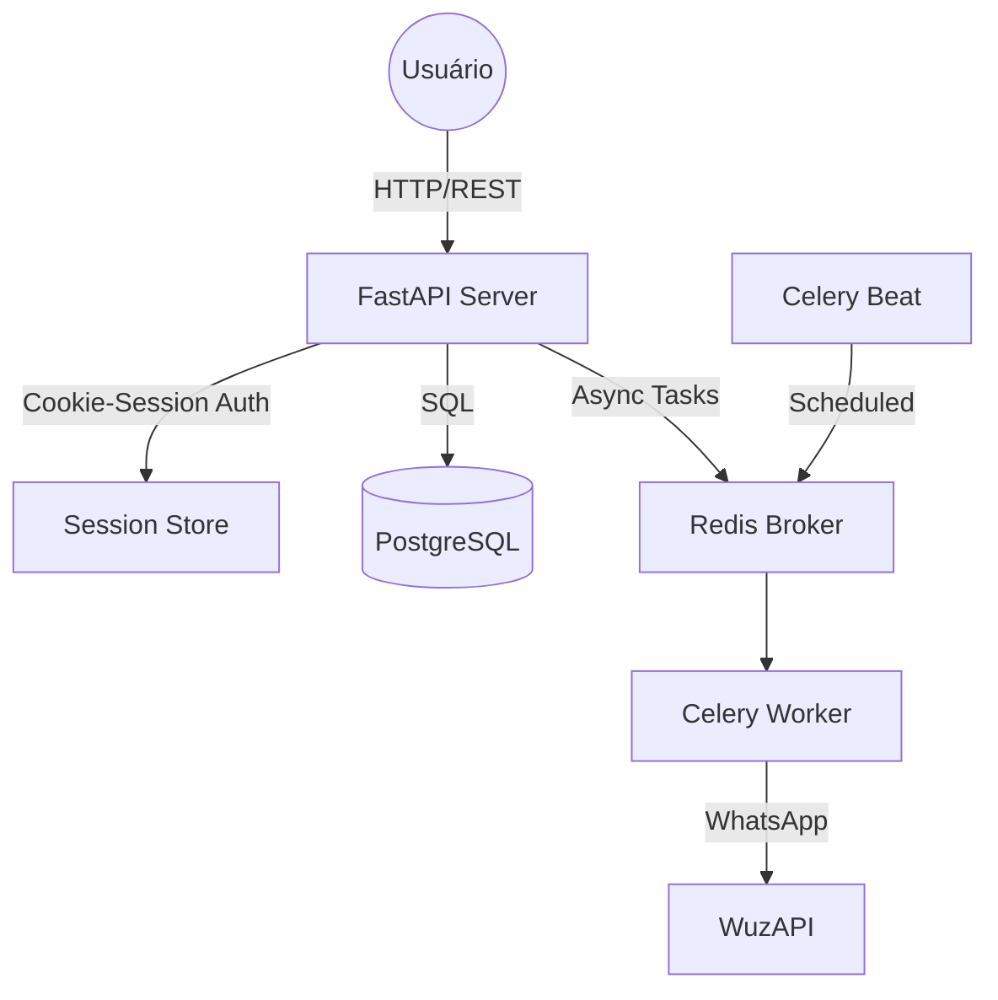

# Visão Geral da Arquitetura do Backend

Este documento descreve a arquitetura técnica, os padrões de design e a infraestrutura do backend do Sistema Hormonia.

## 1. Sumário Executivo

O Sistema Hormonia utiliza uma arquitetura modular baseada em FastAPI, projetada para alta performance, segurança e escalabilidade. Os principais componentes incluem:
- **API Server:** FastAPI com roteamento modular v2.
- **Processamento Assíncrono:** Celery com Redis para tarefas de segundo plano e agendamentos.
- **Camada de Dados:** PostgreSQL (SQLAlchemy 2.0) com Row-Level Security (RLS).
- **Segurança:** Autenticação via cookie-session (HttpOnly, Secure, SameSite) com RBAC (Role-Based Access Control).

## 2. Diagrama de Arquitetura

## 3. Padrões de Design e Estrutura

### 3.1 Camada de Repositório (Repository Pattern)
Utilizamos o padrão Repository para abstrair o acesso aos dados.
- **BaseRepository:** Implementa operações CRUD genéricas, incluindo suporte a Soft Delete e paginação por cursor.
- **Eager Loading:** Configurado por padrão para evitar problemas de N+1 queries.
- **Cache:** Decoradores `@cached_query` integrados com Redis para consultas frequentes.

### 3.2 Camada de Serviço (Service Layer)
A lógica de negócio é encapsulada em serviços, garantindo que os roteadores da API permaneçam leves.
- **Transações:** Uso de gerenciadores de contexto para garantir atomicidade.
- **Orquestração de Sagas:** Implementada para transações distribuídas (ex: criação de paciente + inicialização de fluxo).

### 3.3 Gestão de Conexões (Dual-Engine Architecture)
O sistema utiliza dois engines do SQLAlchemy para diferentes contextos:
1. **Service Role Engine:** Para tarefas de sistema, migrações e background jobs (ignora RLS).
2. **RLS Context Engine:** Para requisições de usuários, injetando claims JWT nas configurações do PostgreSQL para aplicar políticas de Row-Level Security.

## 4. Segurança e Resiliência

### Estratégia de Segurança em Camadas
- **Transporte:** HTTPS/TLS obrigatório.
- **Middleware:** Proteção contra CSRF, CORS com whitelist estrita e Rate Limiting via Redis.
- **Validação:** Todos os inputs são validados via Pydantic Schemas.

### Resiliência
- **Circuit Breaker:** Implementado via `aiobreaker` para proteger contra falhas em serviços externos (ex: Evolution API).
- **Retries:** Estratégias de retry exponencial via `tenacity`.
- **Compensação:** Fluxos de compensação automáticos para falhas em Sagas.

## 5. Monitoramento e Observabilidade

- **Logs:** Estruturados em JSON para fácil indexação.
- **Sentry:** Captura de exceções e monitoramento de performance em produção.
- **Prometheus/Flower:** Métricas de execução de tarefas Celery.
- **Health Checks:** Endpoints dedicados para monitorar a saúde do banco de dados, Redis e conectividade externa.
