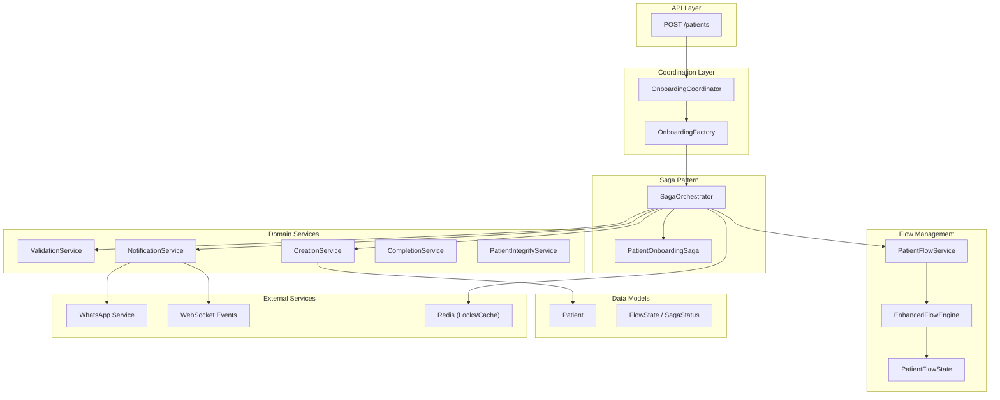
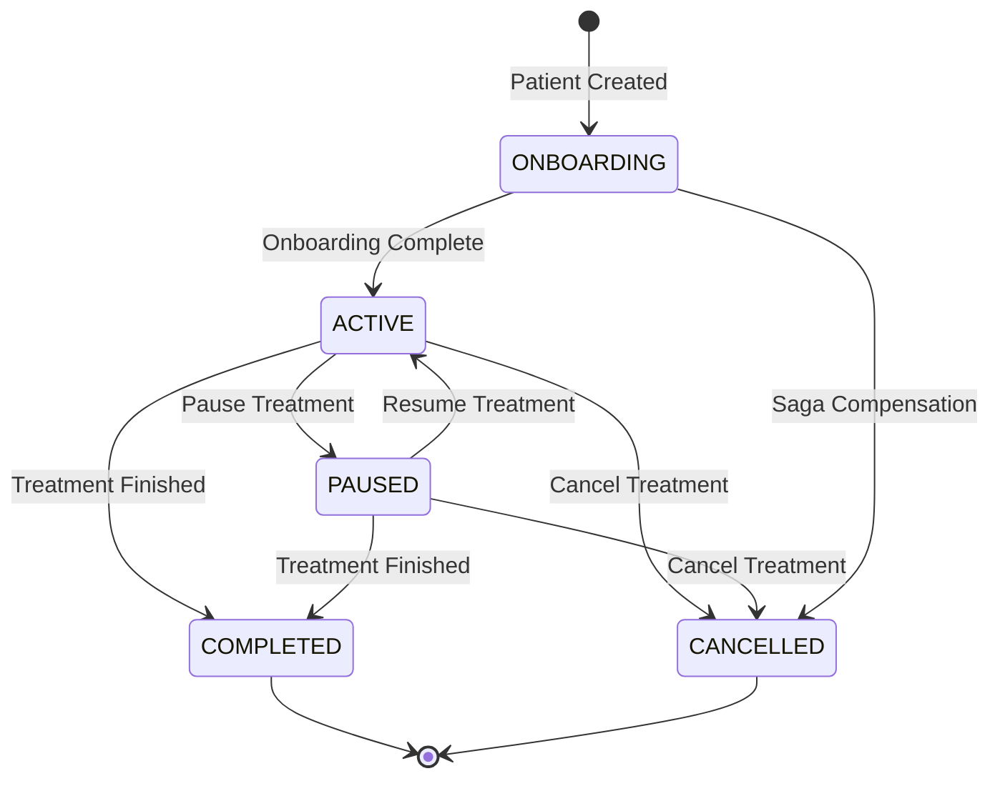
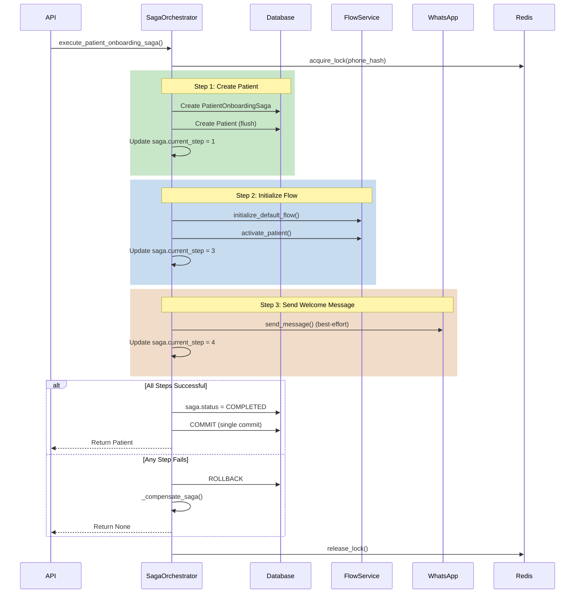

# Patient Flow Domain - Comprehensive Guide

## Overview

The Patient Flow domain in Hormonia manages the complete lifecycle of patient onboarding and treatment flow management for oncology patients. This domain implements robust patterns for distributed transactions, state management, and LGPD compliance.

## Architecture Overview



## Core Components

### 1. FlowState Enum

The `FlowState` enum represents the patient lifecycle states:

**File:** `/backend-hormonia/app/models/enums.py`

```python
class FlowState(enum.Enum):
    """
    Patient flow state enumeration.

    Represents the lifecycle state of a patient in the treatment flow:
    - ONBOARDING: Initial registration and setup
    - ACTIVE: Actively receiving treatment
    - PAUSED: Treatment temporarily suspended
    - COMPLETED: Treatment successfully finished
    - CANCELLED: Treatment cancelled or archived
    """
    ONBOARDING = "onboarding"
    ACTIVE = "active"
    PAUSED = "paused"
    COMPLETED = "completed"
    CANCELLED = "cancelled"
```

**State Transition Diagram:**



### 2. SagaStatus Enum

The `SagaStatus` enum tracks distributed transaction states:

```python
class SagaStatus(str, enum.Enum):
    """
    Saga execution status enumeration.
    """
    STARTED = "STARTED"
    IN_PROGRESS = "IN_PROGRESS"
    STEP_1_PATIENT_CREATED = "STEP_1_PATIENT_CREATED"
    STEP_2_FIREBASE_USER_CREATED = "STEP_2_FIREBASE_USER_CREATED"  # @deprecated
    STEP_3_FLOW_INITIALIZED = "STEP_3_FLOW_INITIALIZED"
    STEP_4_MESSAGE_SENT = "STEP_4_MESSAGE_SENT"
    COMPLETED = "COMPLETED"
    COMPLETED_WITH_WARNINGS = "COMPLETED_WITH_WARNINGS"
    FAILED = "FAILED"
    COMPENSATING = "COMPENSATING"
    COMPENSATED = "COMPENSATED"
    RETRY_SCHEDULED = "RETRY_SCHEDULED"
```

---

## Saga Pattern Implementation

### Overview

The Saga Pattern is implemented to ensure data consistency across the patient onboarding distributed transaction. If any step fails, compensation actions are executed in reverse order.

**File:** `/backend-hormonia/app/orchestration/saga_orchestrator.py`

### Saga Steps



### Key Implementation Details

#### 1. Distributed Lock for Idempotency

```python
async def execute_patient_onboarding_saga(
    self,
    patient_data: PatientCreate,
    doctor_id: UUID,
    current_user: Any = None,
    idempotency_key: Optional[str] = None,
) -> Optional[Patient]:
    """
    Execute the patient onboarding saga.

    Uses distributed lock to prevent concurrent saga execution
    for the same patient (based on normalized phone hash).
    """
    # Normalize phone to E.164-like format before hashing
    normalized_phone = normalize_phone(patient_data.phone) or patient_data.phone
    # Extended hash from 16 to 32 chars (128 bits) to reduce collision risk
    phone_hash = hashlib.sha256(normalized_phone.encode()).hexdigest()[:32]
    # Full doctor_id to prevent collision with similar UUID prefixes
    lock_key = f"saga:onboarding:{str(doctor_id)}:{phone_hash}"

    # Acquire distributed lock (TTL 60s covers entire saga execution)
    async with acquire_lock(lock_key, timeout=5.0, ttl=60):
        # ... saga execution ...
```

#### 2. Unit of Work Pattern

The saga implements the Unit of Work pattern with a single commit at the end:

```python
try:
    # --- STEP 1: Create Patient ---
    patient = await self._step_create_patient(saga, patient_data, doctor_id, idempotency_key)

    # --- STEP 2: Initialize Flow ---
    await self._step_initialize_flow(saga, patient, current_user)

    # --- STEP 3: Send Welcome Message ---
    await self._step_send_welcome_message(saga, patient)

    # --- Complete Saga ---
    saga.status = SagaStatus.COMPLETED
    saga.completed_at = now_sao_paulo()

    # UNIT OF WORK: Single commit at the end for entire transaction
    self.db.commit()

    return patient

except Exception as e:
    # Rollback entire transaction on any failure
    self.db.rollback()
    # ... compensation logic ...
```

#### 3. Compensation with Retry Logic

```python
async def _compensate_step_with_retry(
    self,
    saga: PatientOnboardingSaga,
    step_num: int,
    step_name: str,
    compensate_fn,
    compensation_errors: List[Tuple[int, Exception]],
    max_retries: int = 3,
):
    """
    Execute a compensation step with exponential backoff retry logic.
    """
    last_error = None
    for attempt in range(max_retries):
        try:
            await compensate_fn(saga)
            saga.add_log_entry(step_num, step_name, "compensated")
            return  # Success
        except Exception as e:
            last_error = e
            wait_time = (2**attempt) * 0.5  # 0.5s, 1s, 2s
            if attempt < max_retries - 1:
                await asyncio.sleep(wait_time)

    # All retries exhausted
    compensation_errors.append((step_num, last_error))
    await self._track_compensation_failure(saga.id, step_num, last_error)
```

#### 4. Idempotent Compensation

Compensation steps are idempotent to handle retry scenarios:

```python
async def _compensate_message(self, saga: PatientOnboardingSaga):
    """
    Compensate Step 4: Mark welcome message as cancelled.
    Made idempotent - checks if already compensated before updating.
    """
    # Check if already compensated
    compensated_steps = saga.step_data.get("compensated_steps", []) if saga.step_data else []
    if "message" in compensated_steps:
        logger.info(f"Saga {saga.id}: Message compensation already done, skipping")
        return

    # Find and cancel messages
    messages = (
        self.db.query(Message)
        .filter(
            Message.patient_id == saga.patient_id,
            Message.message_metadata["saga_id"].astext == str(saga.id),
            Message.status != MessageStatus.CANCELLED,  # Only non-cancelled
        )
        .all()
    )

    for message in messages:
        message.status = MessageStatus.CANCELLED
        message.message_metadata = {
            **(message.message_metadata or {}),
            "cancelled_by": "saga_compensation",
            "cancelled_at": now_sao_paulo().isoformat(),
        }

    # Mark step as compensated
    saga.step_data = {
        **(saga.step_data or {}),
        "compensated_steps": compensated_steps + ["message"],
    }
```

---

## Patient Model with LGPD Compliance

### Soft Delete Support

The Patient model implements soft delete for LGPD compliance:

**File:** `/backend-hormonia/app/models/patient.py`

```python
class Patient(BaseModel):
    __tablename__ = "patients"

    # Soft delete support
    deleted_at = Column(DateTime(timezone=True), nullable=True, index=True)

    # LGPD Compliance: Encrypted PII fields
    cpf_encrypted = Column(Text, nullable=True)
    cpf_hash = Column(String(64), nullable=True, index=True)
    email_encrypted = Column(sa.LargeBinary, nullable=True)
    email_hash = Column(String(64), nullable=True, index=True)
    phone_encrypted = Column(sa.LargeBinary, nullable=True)
    phone_hash = Column(String(64), nullable=True, index=True)

    # Unique constraints using hash columns for encrypted data
    __table_args__ = (
        UniqueConstraint("cpf_hash", "doctor_id", name="uq_patient_cpf_hash_doctor"),
        Index(
            "ix_patients_email_hash_doctor",
            "email_hash", "doctor_id",
            unique=True,
            postgresql_where=sa.text("email_hash IS NOT NULL AND deleted_at IS NULL"),
        ),
        Index(
            "ix_patients_phone_hash_doctor",
            "phone_hash", "doctor_id",
            unique=True,
            postgresql_where=sa.text("phone_hash IS NOT NULL AND deleted_at IS NULL"),
        ),
    )
```

### PII Encryption Properties

```python
@property
def phone_decrypted(self) -> Optional[str]:
    """Get decrypted phone value."""
    if self.phone_encrypted:
        from app.services.encryption import get_lgpd_encryption_service
        service = get_lgpd_encryption_service()
        return service.decrypt_phone(self.phone_encrypted)
    return None

def set_phone(self, phone_value: Optional[str]) -> None:
    """Set phone with automatic encryption."""
    if not phone_value:
        self.phone_encrypted = None
        self.phone_hash = None
        return

    from app.services.encryption import get_lgpd_encryption_service
    service = get_lgpd_encryption_service()
    encrypted_phone, phone_hash = service.encrypt_phone(phone_value)

    self.phone_encrypted = encrypted_phone
    self.phone_hash = phone_hash
```

### CPF Encryption Validation Hook

```python
@event.listens_for(Patient, "before_insert")
@event.listens_for(Patient, "before_update")
def validate_cpf_encryption(mapper, connection, target):
    """
    Ensure CPF is properly encrypted before database operations.
    LGPD Compliance validation hook.
    """
    if target.cpf_encrypted:
        if not target.cpf_hash:
            raise ValueError(
                "CPF encryption incomplete: cpf_hash is missing. "
                "Use set_cpf() method to properly encrypt CPF data."
            )
```

---

## Onboarding Coordinator

The `OnboardingCoordinator` orchestrates the complete patient onboarding workflow.

**File:** `/backend-hormonia/app/domain/patient/onboarding/coordinator.py`

```python
class OnboardingCoordinator:
    """
    Coordinator for patient onboarding workflow.

    SINGLE RESPONSIBILITY: Orchestrate service calls in correct order.

    This coordinator has NO business logic - it only:
    1. Validates patient data (via IntegrityService)
    2. Executes saga pattern (via SagaOrchestrator directly)
    3. Sends notifications (via NotificationService)
    4. Completes partial onboarding (via CompletionService)
    """

    def __init__(
        self,
        db: Session,
        integrity_service: "PatientIntegrityService",
        validation_service: "ValidationService",
        saga_orchestrator: Optional["SagaOrchestrator"],
        notification_service: "NotificationService",
        completion_service: "CompletionService",
        creation_service: Optional["CreationService"] = None,
    ):
        # 100% dependency injection
        self.db = db
        self.integrity_service = integrity_service
        self.validation_service = validation_service
        self.saga_orchestrator = saga_orchestrator
        self.notification_service = notification_service
        self.completion_service = completion_service
        self.creation_service = creation_service

    @with_db_retry(max_retries=3)
    async def create_patient(
        self,
        patient_data: PatientCreate,
        doctor_id: UUID,
        current_user: Optional["User"] = None,
        idempotency_key: Optional[str] = None,
    ) -> Patient:
        """
        Orchestrate patient creation workflow.

        Workflow:
        1. Validate patient data (IntegrityService)
        2. Execute Saga Pattern (mandatory)
        3. Notifications/flows handled by saga
        """
        # Step 1: Validate data using SINGLE SOURCE OF TRUTH
        await self.integrity_service.validate_patient_data(
            patient_data=patient_data, doctor_id=doctor_id, is_update=False
        )

        # Step 2: Execute via Saga Pattern (direct call to orchestrator)
        if not self._is_saga_enabled():
            raise ValidationError("Saga Pattern disabled or not configured")

        patient = await self.saga_orchestrator.execute_patient_onboarding_saga(
            patient_data=patient_data,
            doctor_id=doctor_id,
            current_user=current_user,
            idempotency_key=idempotency_key,
        )

        if not patient:
            raise ValidationError("Saga Pattern did not return patient after execution")

        return patient
```

---

## Patient Flow Service

The `PatientFlowService` manages patient flow lifecycle.

**File:** `/backend-hormonia/app/services/patient/flow_service.py`

### Flow Initialization

```python
async def initialize_default_flow(
    self,
    patient: Patient,
    current_user_id: Optional[UUID] = None,
    auto_commit: bool = True,
) -> Optional[PatientFlowState]:
    """
    Initialize default flow for patient based on treatment type.

    Args:
        patient: Patient to initialize flow for
        current_user_id: ID of user creating the flow
        auto_commit: If True, commits immediately.
                     Set to False for saga/Unit of Work pattern.
    """
    if not settings.FLOW_ENABLE_AUTO_ENROLLMENT:
        return None

    template_name = self._select_template(patient.treatment_type)

    # Get flow configuration
    from app.config.template_loader import get_template_loader
    loader = get_template_loader()
    flow_config = loader.get_flow_type_config(template_name)

    # Default to INITIAL_15_DAYS if mapping fails
    flow_type = FlowType.INITIAL_15_DAYS
    if flow_config and flow_config.enum_value:
        try:
            flow_type = FlowType(flow_config.enum_value)
        except ValueError:
            pass

    # Enroll patient (respects auto_commit for saga pattern)
    flow_state = await self.flow_engine.enroll_patient(
        patient_id=patient.id, flow_type=flow_type, auto_commit=auto_commit
    )

    # Update patient metadata
    patient.patient_data.update({
        "auto_flow_started": True,
        "requested_template": template_name,
        "actual_flow_type": flow_type.value,
        "flow_start_time": flow_state.started_at.isoformat(),
        "initialized_by": str(current_user_id) if current_user_id else "system",
    })

    if auto_commit:
        self.db.commit()
    else:
        self.db.flush()

    return flow_state
```

### Flow State Transitions

```python
@with_db_retry(max_retries=3)
async def activate_patient(
    self, patient_id: UUID, auto_commit: bool = True
) -> Optional[Patient]:
    """Activate patient and set flow state to active."""
    repository = PatientRepository(self.db)
    patient = repository.get_by_id(patient_id)
    if not patient:
        return None

    update_data = {"flow_state": FlowState.ACTIVE}
    updated_patient = repository.update(patient, update_data, auto_commit=auto_commit)

    # Publish WebSocket event (non-blocking, best-effort)
    try:
        await websocket_events.broadcast_flow_event(
            event_type=WebSocketEventType.PATIENT_FLOW_CHANGED,
            patient_id=patient_id,
            flow_data={
                "flow_state": FlowState.ACTIVE.value,
                "action": "activated",
                "patient_name": updated_patient.name,
                "doctor_id": str(updated_patient.doctor_id),
            },
        )
    except Exception as ws_error:
        logger.warning(f"Failed to broadcast flow event: {ws_error}")

    return updated_patient

@with_db_retry(max_retries=3)
async def pause_patient(self, patient_id: UUID) -> Optional[Patient]:
    """Pause patient flow."""
    repository = PatientRepository(self.db)
    patient = repository.get_by_id(patient_id)
    if not patient:
        return None

    update_data = {"flow_state": FlowState.PAUSED}
    return repository.update(patient, update_data)
```

---

## Onboarding Services

### ValidationService

**File:** `/backend-hormonia/app/domain/patient/onboarding/validation_service.py`

Handles duplicate detection and data format validation:

```python
async def find_existing_patient(
    self,
    cpf: Optional[str],
    email: Optional[str],
    phone: str,
    doctor_id: UUID,
) -> Optional[Patient]:
    """
    Find existing patient by CPF, email, or phone for the given doctor.
    Uses hash-based lookups for LGPD compliance.
    """
    # Priority 1: Check by CPF (most unique identifier)
    if cpf:
        from app.services.encryption import get_cpf_encryption_service
        service = get_cpf_encryption_service()
        cpf_hash = service.hash_cpf(cpf)

        patient = (
            self.db.query(Patient)
            .filter(
                Patient.cpf_hash == cpf_hash,
                Patient.doctor_id == doctor_id,
                Patient.deleted_at.is_(None),
            )
            .first()
        )
        if patient:
            return patient

    # Priority 2: Check by email
    # Priority 3: Check by phone
    # ...
```

### NotificationService

**File:** `/backend-hormonia/app/domain/patient/onboarding/notification_service.py`

Handles WhatsApp and WebSocket notifications:

```python
async def send_welcome_message(
    self, patient: Patient, current_user: Optional[User] = None
) -> bool:
    """Send WhatsApp welcome message to newly registered patient."""

    # Check if welcome messages are enabled
    if not settings.WHATSAPP_ENABLE_ON_REGISTRATION:
        return False

    if not settings.WHATSAPP_ENABLE_WELCOME_MESSAGE:
        return False

    # Generate welcome message content
    welcome_text = get_welcome_message(
        patient_name=patient.name,
        clinic_name=settings.WHATSAPP_CLINIC_NAME,
        support_phone=settings.WHATSAPP_CLINIC_SUPPORT_PHONE,
    )

    # Schedule message for immediate sending
    message = self.message_service.schedule_message(
        patient_id=patient.id,
        content=welcome_text,
        scheduled_for=now_sao_paulo(),
        message_type=MessageType.TEXT,
        message_metadata={
            "patient_id": str(patient.id),
            "message_type": "welcome",
            "created_by": current_user.email if current_user else "system",
        },
    )

    # Send message via WhatsApp
    return await self.whatsapp_service.send_message(message)
```

### CompletionService

**File:** `/backend-hormonia/app/domain/patient/onboarding/completion_service.py`

Handles completing partial/interrupted onboarding:

```python
async def complete_partial_onboarding(
    self,
    existing_patient: Patient,
    patient_data: PatientCreate,
    current_user: Optional["User"] = None,
) -> Patient:
    """
    Complete onboarding for a partially created patient.

    Prevents duplicate patients by completing the onboarding
    process for patients that were partially created during
    saga failure scenarios.
    """
    # 1. Update patient data with any new information (preserve existing)
    await self._update_patient_data(existing_patient, patient_data)

    # 2. Invalidate caches
    await self._invalidate_cache(existing_patient.doctor_id)

    # 3. Publish completion event
    await self.notification_service.publish_patient_created_event(
        patient=existing_patient,
        doctor_id=existing_patient.doctor_id,
        action="onboarding_completed",
    )

    # 4. Send welcome message if needed
    await self.notification_service.send_welcome_if_needed(
        existing_patient, current_user
    )

    # 5. Initialize flow if not already initialized
    await self._initialize_flow_if_needed(existing_patient, current_user)

    return existing_patient
```

---

## API Integration Points

### Patient Creation Endpoint

```python
@router.post("/patients", response_model=PatientResponse)
async def create_patient(
    patient_data: PatientCreate,
    current_user: User = Depends(get_current_user),
    db: Session = Depends(get_db),
    idempotency_key: Optional[str] = Header(None, alias="X-Idempotency-Key"),
):
    """
    Create a new patient.

    Uses Saga Pattern for distributed transaction management.
    Supports idempotency via X-Idempotency-Key header.
    """
    factory = OnboardingFactory(db)
    coordinator = factory.create_coordinator()

    patient = await coordinator.create_patient(
        patient_data=patient_data,
        doctor_id=current_user.id,
        current_user=current_user,
        idempotency_key=idempotency_key,
    )

    return PatientResponse.from_orm(patient)
```

### Flow State Management Endpoints

```python
@router.post("/patients/{patient_id}/activate")
async def activate_patient(
    patient_id: UUID,
    current_user: User = Depends(get_current_user),
    db: Session = Depends(get_db),
):
    """Activate patient flow."""
    flow_service = PatientFlowService(db)
    patient = await flow_service.activate_patient(patient_id)

    if not patient:
        raise HTTPException(status_code=404, detail="Patient not found")

    return {"status": "activated", "flow_state": patient.flow_state.value}

@router.post("/patients/{patient_id}/pause")
async def pause_patient(
    patient_id: UUID,
    current_user: User = Depends(get_current_user),
    db: Session = Depends(get_db),
):
    """Pause patient flow."""
    flow_service = PatientFlowService(db)
    patient = await flow_service.pause_patient(patient_id)

    if not patient:
        raise HTTPException(status_code=404, detail="Patient not found")

    return {"status": "paused", "flow_state": patient.flow_state.value}
```

### Saga Management Endpoints

```python
@router.get("/sagas/{saga_id}")
async def get_saga_status(
    saga_id: UUID,
    current_user: User = Depends(get_current_user),
    db: Session = Depends(get_db),
):
    """Get saga execution status."""
    orchestrator = SagaOrchestrator(db)
    status = await orchestrator.get_saga_status(saga_id)

    if not status:
        raise HTTPException(status_code=404, detail="Saga not found")

    return status

@router.post("/sagas/{saga_id}/resume")
async def resume_saga(
    saga_id: UUID,
    current_user: User = Depends(get_current_user),
    db: Session = Depends(get_db),
):
    """Resume a failed saga."""
    orchestrator = SagaOrchestrator(db)
    result = await orchestrator.resume_saga(saga_id)

    return result

@router.get("/sagas/failed")
async def list_failed_sagas(
    doctor_id: Optional[UUID] = None,
    limit: int = 50,
    current_user: User = Depends(get_current_user),
    db: Session = Depends(get_db),
):
    """List failed sagas for manual review."""
    orchestrator = SagaOrchestrator(db)
    return await orchestrator.list_failed_sagas(doctor_id=doctor_id, limit=limit)
```

---

## Error Handling Strategies

### 1. Saga Compensation Errors

```python
class SagaCompensationError(Exception):
    """
    Exception raised when saga compensation fails.
    Requires manual intervention.
    """
    def __init__(
        self,
        message: str,
        original_error: Optional[Exception] = None,
        saga_id: Optional[UUID] = None,
    ):
        self.message = message
        self.original_error = original_error
        self.saga_id = saga_id
        super().__init__(self.message)
```

### 2. Compensation Failure Tracking

```python
async def _track_compensation_failure(
    self, saga_id: UUID, step: int, error: Exception
):
    """
    Track compensation failures for audit and manual recovery.
    Stores failures in Redis with 7-day retention.
    """
    if self.redis:
        failure_key = f"saga:compensation_failure:{saga_id}"
        failure_data = {
            "saga_id": str(saga_id),
            "step": step,
            "error": str(error),
            "error_type": type(error).__name__,
            "timestamp": now_sao_paulo().isoformat(),
        }
        self.redis.setex(failure_key, 86400 * 7, json.dumps(failure_data))
```

### 3. Database Retry Decorator

```python
@with_db_retry(max_retries=3)
async def activate_patient(self, patient_id: UUID) -> Optional[Patient]:
    """
    Activate patient with automatic retry on transient failures.
    """
    # ... implementation ...
```

### 4. Best-Effort External Service Calls

```python
# Welcome message sending is best-effort (non-fatal)
try:
    success = await self.whatsapp_service.send_message(message)
except Exception as send_exc:
    # Log but don't fail the saga
    logger.warning(f"Welcome message send failed (non-fatal): {send_exc}")
    message.status = MessageStatus.PENDING  # Keep for retry
    message.message_metadata["welcome_send_failed"] = True
```

---

## PatientOnboardingSaga Model

**File:** `/backend-hormonia/app/models/patient_onboarding_saga.py`

```python
class PatientOnboardingSaga(BaseModel):
    """
    Model for tracking patient onboarding sagas.
    Implements the Saga Pattern for distributed transaction consistency.
    """
    __tablename__ = "patient_onboarding_saga"

    # Primary Key
    id = Column(UUID(as_uuid=True), primary_key=True, default=uuid.uuid4)

    # Foreign Keys
    patient_id = Column(UUID(as_uuid=True), ForeignKey("patients.id"), nullable=True)
    doctor_id = Column(UUID(as_uuid=True), ForeignKey("users.id"), nullable=False)

    # Status and Progress
    status = Column(PG_ENUM(SagaStatus), nullable=False, default=SagaStatus.STARTED)
    current_step = Column(Integer, nullable=False, default=0)

    # Retry Logic
    retry_count = Column(Integer, nullable=False, default=0)
    max_retries = Column(Integer, nullable=False, default=3)
    next_retry_at = Column(DateTime(timezone=True), nullable=True)

    # Data
    patient_data = Column(JSONB, nullable=False)
    execution_log = Column(JSONB, nullable=False, default=list)
    step_data = Column(JSONB, nullable=True, default=dict)  # Compensation tracking

    # Error Information
    error_message = Column(Text, nullable=True)
    error_type = Column(String(255), nullable=True)

    # Timestamps
    started_at = Column(DateTime(timezone=True), nullable=False)
    completed_at = Column(DateTime(timezone=True), nullable=True)
    failed_at = Column(DateTime(timezone=True), nullable=True)

    def can_retry(self) -> bool:
        """Check if saga can be retried."""
        return (
            self.status in [SagaStatus.FAILED, SagaStatus.RETRY_SCHEDULED]
            and self.retry_count < self.max_retries
        )

    def should_compensate(self) -> bool:
        """Check if compensation should be executed."""
        return (
            self.status == SagaStatus.FAILED
            and self.current_step > 0
            and self.retry_count >= self.max_retries
        )
```

---

## Best Practices Summary

1. **Saga Pattern**: Use for all patient creation to ensure consistency across distributed services.

2. **Unit of Work**: Single commit at the end of saga; use `flush()` for intermediate persistence within transaction.

3. **Distributed Locks**: Use Redis locks to prevent concurrent saga execution for the same patient.

4. **Idempotent Compensation**: Track compensated steps to handle retry scenarios safely.

5. **Best-Effort External Calls**: WhatsApp messages are non-fatal; mark as PENDING for retry.

6. **LGPD Compliance**: All PII encrypted; use hash-based lookups for uniqueness.

7. **Soft Delete**: Use `deleted_at` instead of hard delete for LGPD data retention requirements.

8. **Dependency Injection**: All services use constructor injection for testability.

9. **Error Tracking**: Compensation failures tracked in Redis for monitoring and manual intervention.

10. **WebSocket Events**: Broadcast flow state changes in real-time (non-blocking, best-effort).

---

## Related Documentation

- [API Reference](/docs/api/PATIENT_API.md)
- [LGPD Compliance Guide](/docs/security/LGPD_COMPLIANCE.md)
- [Flow Engine Documentation](/docs/flow/FLOW_ENGINE.md)
- [WhatsApp Integration](/docs/integrations/WHATSAPP.md)
