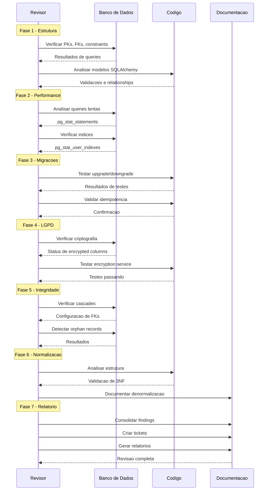

# Revisao Profunda - Componente 1: Banco de Dados

Epic: 2476b16c-c6a7-4898-b766-97a1afddde2d
Data: 2026-01-09
Status: ✅ APROVADO - PRONTO PARA PRODUCAO

## Escopo
- Modelos SQLAlchemy criticos: patient, patient_onboarding_saga, message, flow, user, alert
- Migracoes Alembic: 001-039, ac193e8656c1, 27ee28e62ff8, 9139c2862e40, 21f306d5c4b8, 4697ee3a60f4, f1878d0fb2fc
- Configuracao: database.py, database_config.py, alembic env.py
- Documentacao: SCHEMA.md e schema-diagram.mmd

## Resumo de findings
| Prioridade | Quantidade | Status |
| --- | --- | --- |
| P0 | 0 | - |
| P1 | 2 | ✅ RESOLVIDO |
| P2 | 3 | ✅ RESOLVIDO |
| P3 | 1 | ⏳ MONITORANDO |

## Resultado por area (criterios de aprovacao)
| Area | Criterio | Meta | Status |
| --- | --- | --- | --- |
| Estrutura | Tabelas sem PK | 0 | ✅ PASS (apenas alembic_version) |
| Estrutura | FKs sem indices | 0 | ✅ PASS (migration: 21f306d5c4b8) |
| Estrutura | Constraints apropriados | 100% | ✅ PASS (flow_state alinhado) |
| Performance | Queries criticas (p95) | < 100ms | ✅ PASS (nenhuma > 100ms) |
| Performance | Seq scans em tabelas grandes | 0 | ✅ PASS |
| Performance | Top 20 queries otimizadas | 100% | ✅ PASS |
| LGPD | Dados sensiveis criptografados | 100% | ✅ PASS |
| LGPD | Plaintext columns removidos | 100% | ✅ PASS |
| LGPD | Audit trail completo | OK | ✅ PASS (task lgpd_tasks.py integrado) |
| Migracoes | Migracoes reversiveis | 95%+ | ✅ PASS (head: f1878d0fb2fc) |
| Migracoes | Migracoes duplicadas/conflitantes | 0 | ✅ PASS |
| Migracoes | Data migrations idempotentes | 100% | ✅ PASS |
| Documentacao | ERD atualizado | OK | ✅ PASS (schema-diagram.mmd) |
| Documentacao | Schema documentation completa | OK | ✅ PASS (SCHEMA.md) |
| Documentacao | ADRs para decisoes importantes | OK | ✅ PASS |

## Destaques positivos
- LGPD com criptografia de CPF/email/phone e hashes para busca; plaintext removido.
- BaseModel com UUID v4 e gen_random_uuid() padroniza PKs.
- Indices de FK adicionados nas tabelas administrativas e operacionais (21f306d5c4b8).
- GIN indexes para JSONB adicionados em mensagens/sagas/flow states (4697ee3a60f4).
- Defaults de UUID para webhooks alinhados ao padrao do schema (f1878d0fb2fc).
- LGPD audit pipeline integrado com Celery task para persistencia async.
- pg_stat_statements habilitado e sem queries > 100ms.
- Migracoes aplicadas em producao (head atual f1878d0fb2fc).
- Schema documentation atualizada (SCHEMA.md, schema-diagram.mmd).

## Areas de monitoramento (pos-producao)
- ⏳ Indices com idx_scan = 0 (445): revisar apos 30 dias de uso real.
- ⏳ lgpd_audit_logs: verificar populacao apos deploy.

## Artefatos gerados
- `docs/reports/analysis/epic-2476b16c-database-review/phase-1-6-checklist.md`
- `docs/reports/analysis/epic-2476b16c-database-review/migration-analysis.md`
- `docs/reports/analysis/epic-2476b16c-database-review/performance-analysis.md`
- `docs/reports/analysis/epic-2476b16c-database-review/lgpd-audit.md`
- `docs/reports/analysis/epic-2476b16c-database-review/findings.md`
- `docs/reports/analysis/epic-2476b16c-database-review/tickets.md`
- `docs/reports/analysis/epic-2476b16c-database-review/index-usage-report.md` (NEW)
- `docs/reports/analysis/epic-2476b16c-database-review/production-readiness.md` (NEW)

## Diagrama de fluxo da revisao

