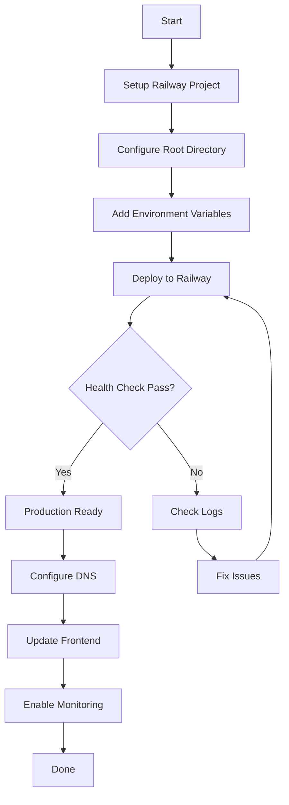

# Backend Railway Deployment - Complete Index

## 📁 Documentation Structure

This folder contains all documentation needed to deploy the Hormonia Backend to Railway.

### Quick Links

1. **[🚀 Quick Start Guide](./BACKEND_DEPLOY_QUICK.md)** - 5-minute deployment
2. **[📘 Complete Deployment Guide](./BACKEND_RAILWAY_DEPLOYMENT.md)** - Full documentation
3. **[🔐 Environment Variables Reference](./RAILWAY_ENV_VARS_COMPLETE.md)** - All 50+ variables
4. **[🌐 DNS Configuration](./RAILWAY_DNS_INDEX.md)** - Frontend-Backend connection

---

## 🗂️ Files Overview

### Configuration Files (In `backend-hormonia/`)
- **`railway.toml`** - Railway deployment configuration
- **`Dockerfile`** - Production Docker image (Python 3.13)
- **`runtime.txt`** - Python version specification
- **`requirements.txt`** - Python dependencies
- **`.env`** - Local environment variables (DO NOT commit real values)

### Documentation Files (In `docs/deployment/`)
- **`BACKEND_DEPLOY_QUICK.md`** - Quick start guide
- **`BACKEND_RAILWAY_DEPLOYMENT.md`** - Complete deployment guide
- **`RAILWAY_ENV_VARS_COMPLETE.md`** - All environment variables
- **`BACKEND_DEPLOYMENT_INDEX.md`** - This file

---

## ⚡ Quick Deploy Steps

### 1. Railway Project Setup
```bash
1. Railway Dashboard → New Project
2. Deploy from GitHub → Select repo
3. Root Directory: backend-hormonia
4. Auto-detect: Dockerfile
```

### 2. Set Environment Variables
**Minimum 20 required variables** - see [Quick Start](./BACKEND_DEPLOY_QUICK.md)

### 3. Deploy
```bash
Railway will automatically:
✓ Build Docker image
✓ Run health checks
✓ Deploy to production
```

### 4. Verify
```bash
curl https://your-backend.railway.app/health
```

---

## 📋 Deployment Checklist

### Pre-Deployment
- [ ] Generate new SECRET_KEY (64 chars)
- [ ] Generate new JWT_SECRET_KEY (64 chars)
- [ ] Generate new ENCRYPTION_KEY (32 chars base64)
- [ ] Get Supabase credentials (URL, keys)
- [ ] Setup Redis Cloud or Railway Redis
- [ ] Get Firebase Admin SDK credentials
- [ ] Get Google Gemini API key
- [ ] Prepare CORS allowed origins list

### Railway Configuration
- [ ] Set root directory to `backend-hormonia`
- [ ] Verify Dockerfile is detected
- [ ] Add all 20+ critical environment variables
- [ ] Configure health check path: `/health`
- [ ] Set restart policy: ON_FAILURE

### Post-Deployment
- [ ] Test health endpoint
- [ ] Verify API documentation (if DEBUG=True)
- [ ] Check Railway logs for errors
- [ ] Test database connectivity
- [ ] Test Redis connectivity
- [ ] Configure custom domain (optional)
- [ ] Setup monitoring (Sentry, etc.)
- [ ] Update frontend configuration

---

## 🔐 Critical Security Checklist

### Environment Configuration
- [ ] `DEBUG=False` in production
- [ ] `ENVIRONMENT=production`
- [ ] All secrets are environment variables (not hardcoded)

### Authentication & Encryption
- [ ] Strong SECRET_KEY (64+ characters)
- [ ] Unique JWT_SECRET_KEY (different from SECRET_KEY)
- [ ] Secure ENCRYPTION_KEY (32 chars base64)
- [ ] `BCRYPT_ROUNDS=12` or higher

### Network Security
- [ ] `SECURE_SSL_REDIRECT=true`
- [ ] `SESSION_COOKIE_SECURE=true`
- [ ] `REDIS_SSL=true`
- [ ] CORS configured with specific origins (no wildcards)

### Database Security
- [ ] Use Supabase connection pooler
- [ ] Connection pool limits configured
- [ ] RLS (Row Level Security) enabled where applicable

---

## 🚨 Common Issues & Solutions

### 404 Application not found
**Symptoms**: Railway shows "Application not found"

**Solutions**:
1. Verify root directory is `backend-hormonia`
2. Check Dockerfile exists in root
3. Ensure Railway detected Dockerfile builder

### Health Check Timeout
**Symptoms**: Deployment fails health checks

**Solutions**:
1. Increase `healthcheckTimeout` in railway.toml
2. Check database connectivity
3. Verify Redis is accessible
4. Review startup logs for errors

### Database Connection Error
**Symptoms**: "Could not connect to database"

**Solutions**:
1. Verify DATABASE_URL format: `postgresql+psycopg://...`
2. Check Supabase allows Railway IPs
3. Test connection pooler settings
4. Verify password is correct

### Redis Connection Error
**Symptoms**: "Redis connection failed"

**Solutions**:
1. Ensure `REDIS_SSL=true`
2. Verify REDIS_URL uses `rediss://` (double s)
3. Check Redis Cloud allows external connections
4. Verify password and host are correct

### CORS Errors
**Symptoms**: Frontend can't connect to backend

**Solutions**:
1. Add frontend URL to ALLOWED_ORIGINS
2. Use exact URLs (no wildcards in production)
3. Include both http and https if needed
4. Check Railway gives you HTTPS URL

---

## 📊 Environment Variables Summary

### By Category

| Category | Count | Critical |
|----------|-------|----------|
| Security Keys | 5 | ✓ |
| Database | 10 | ✓ |
| Redis | 12 | ✓ |
| Supabase | 6 | ✓ |
| Firebase | 9 | ✓ |
| AI/Gemini | 4 | ✓ |
| WhatsApp | 5 | - |
| CORS | 5 | ✓ |
| Application | 6 | ✓ |
| Monitoring | 3 | - |

**Total**: ~50+ variables
**Required**: 20+ critical variables

See [Complete Environment Variables](./RAILWAY_ENV_VARS_COMPLETE.md) for full list.

---

## 🏗️ Architecture Overview

### Stack
- **Runtime**: Python 3.13
- **Framework**: FastAPI
- **Server**: Gunicorn + Uvicorn workers
- **Database**: PostgreSQL (Supabase)
- **Cache**: Redis
- **Queue**: Celery (Redis backend)
- **Storage**: Supabase Storage
- **Auth**: Firebase Admin SDK

### Components
```
┌─────────────────────────────────────────────┐
│            Railway (Production)             │
├─────────────────────────────────────────────┤
│                                             │
│  Backend Service (backend-hormonia)         │
│  ├─ Gunicorn (4 workers)                   │
│  ├─ Uvicorn (ASGI workers)                 │
│  ├─ FastAPI Application                    │
│  └─ Health Checks (/health)                │
│                                             │
├─────────────────────────────────────────────┤
│                                             │
│  External Services                          │
│  ├─ Supabase (Database + Storage)          │
│  ├─ Redis Cloud (Cache + Queue)            │
│  ├─ Firebase (Authentication)               │
│  ├─ Google Gemini (AI)                     │
│  └─ Evolution API (WhatsApp)               │
│                                             │
└─────────────────────────────────────────────┘
```

### Health Endpoints
- **`/health`** - Basic health (Railway uses this)
- **`/health/liveness`** - Kubernetes-style liveness
- **`/health/readiness`** - Kubernetes-style readiness
- **`/health/detailed`** - Full component status

---

## 📖 Complete Documentation Links

### Railway-Specific
1. [Backend Deployment Guide](./BACKEND_RAILWAY_DEPLOYMENT.md)
2. [Environment Variables Complete](./RAILWAY_ENV_VARS_COMPLETE.md)
3. [Quick Deploy Guide](./BACKEND_DEPLOY_QUICK.md)
4. [DNS Configuration](./RAILWAY_DNS_INDEX.md)

### Backend-Specific
1. [Production Checklist](../../backend-hormonia/PRODUCTION_READY_CHECKLIST.md)
2. [Firebase Security README](../../backend-hormonia/FIREBASE_SECURITY_README.md)
3. [RLS Deployment Commands](../../backend-hormonia/RLS_DEPLOYMENT_COMMANDS.md)

### Connection Guides
1. [Backend Connection Guide](../RAILWAY_BACKEND_CONNECTION.md)
2. [Networking Guide](./RAILWAY_NETWORKING_GUIDE.md)

---

## 🎯 Deployment Workflow



---

## 📞 Support & Resources

### Railway Resources
- [Railway Documentation](https://docs.railway.app/)
- [Railway Status](https://status.railway.app/)
- [Railway Community](https://discord.gg/railway)

### Backend Documentation
- API Docs: `https://your-backend.railway.app/docs`
- Health Status: `https://your-backend.railway.app/health`
- Detailed Health: `https://your-backend.railway.app/health/detailed`

### External Services
- [Supabase Dashboard](https://supabase.com/dashboard)
- [Redis Cloud Console](https://redis.com/cloud)
- [Firebase Console](https://console.firebase.google.com)
- [Google AI Studio](https://makersuite.google.com/app/apikey)

---

## 🔄 Updates & Maintenance

### Regular Checks
- Monitor health endpoints
- Review Railway logs
- Check error rates (Sentry)
- Monitor resource usage
- Review database performance

### Scaling
```bash
# Increase replicas in railway.toml
numReplicas = 2

# Or use Railway CLI
railway up --replicas 2
```

### Updates
```bash
# Update dependencies
pip install -r requirements.txt --upgrade

# Run migrations
alembic upgrade head

# Redeploy
git push origin main
```

---

## ✅ Final Verification

After deployment, verify these endpoints:

```bash
# 1. Basic health
curl https://your-backend.railway.app/health

# 2. Detailed health
curl https://your-backend.railway.app/health/detailed

# 3. API documentation
https://your-backend.railway.app/docs

# 4. Test endpoint (if available)
curl https://your-backend.railway.app/test
```

All should return 200 OK status.

---

## 📅 Last Updated

- **Date**: 2025-10-04
- **Version**: 2.0.0
- **Python**: 3.13
- **FastAPI**: 0.115+

---

**Ready to deploy?** Start with the [Quick Start Guide](./BACKEND_DEPLOY_QUICK.md)!
