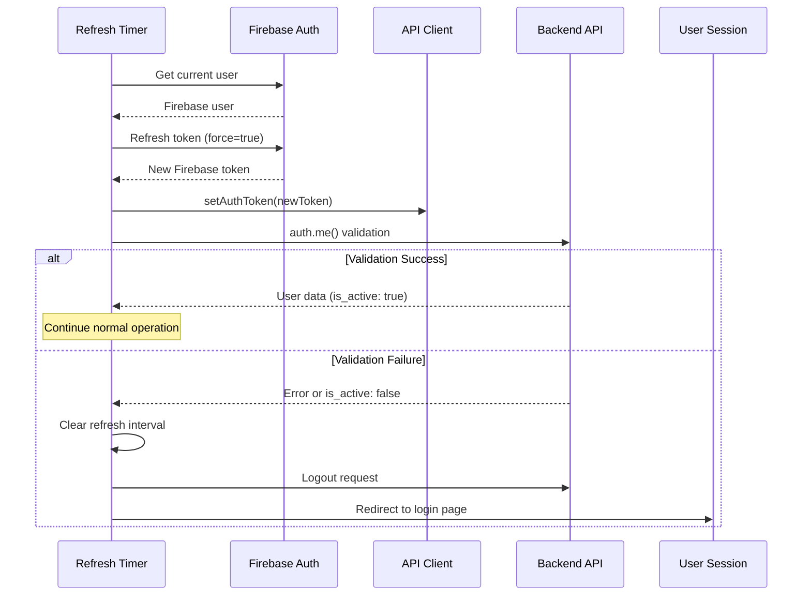

# Token Refresh Validation Security Improvement

## Overview

This document describes the security enhancement added to the Firebase authentication token refresh mechanism to prevent unauthorized access after account deactivation.

## Problem Statement

**Security Vulnerability**: Previously, when a user's account was deactivated by an administrator, the user could continue using the application until their current Firebase token expired (up to 1 hour). The automatic token refresh mechanism would refresh the Firebase token without validating with the backend, allowing continued access even though the account was deactivated.

### Attack Scenario

1. User logs in successfully → receives Firebase token (valid for 1 hour)
2. Administrator deactivates user's account in the backend
3. User continues working normally
4. After 55 minutes, token refresh occurs → **new Firebase token issued**
5. **BUG**: User can continue accessing the system for another hour
6. This cycle could continue indefinitely

## Solution

**Backend Validation After Token Refresh**: After each automatic token refresh (every 55 minutes), the frontend now validates the refreshed token with the backend by calling `apiClient.auth.me()`. This validation:

1. Confirms the session is still valid
2. Checks if the account is still active (`is_active: true`)
3. Forces logout if validation fails or account is deactivated

## Implementation Details

### Changes to `firebase-auth.ts`

**File**: `frontend-hormonia/src/services/firebase-auth.ts`

```typescript
export function setupTokenRefresh(): void {
  // ... existing code ...

  tokenRefreshInterval = setInterval(async () => {
    try {
      // 1. Get current Firebase user
      const firebaseUser = await firebaseAuth.getCurrentUser()

      // 2. Refresh Firebase token
      const newToken = await firebaseUser.getIdToken(true)

      // 3. Update API client
      apiClient.setAuthToken(newToken)

      // 4. SECURITY: Validate with backend
      try {
        const validationResponse = await apiClient.auth.me()

        // Check if response is valid
        if (!validationResponse || !validationResponse.data) {
          throw new Error('Session validation failed')
        }

        // Check if account is still active
        if (!validationResponse.data.is_active) {
          throw new Error('Account has been deactivated')
        }

        // Validation successful - continue
      } catch (validationError) {
        // Validation failed - force logout
        clearInterval(tokenRefreshInterval)
        await logoutUser()
        window.location.href = '/login?session_invalid=true'
      }
    } catch (error) {
      // Handle errors gracefully
    }
  }, 55 * 60 * 1000)
}
```

### Validation Flow



## Security Benefits

1. **Immediate Effect**: Account deactivation takes effect within 55 minutes (next refresh cycle)
2. **Prevents Token Refresh Loop**: No more indefinite access through token refresh cycles
3. **Session Validation**: Ensures backend session is still valid after token refresh
4. **Graceful Logout**: Forces clean logout and redirect when validation fails
5. **Error Recovery**: Handles network errors and validation failures gracefully

## Test Coverage

**Test File**: `frontend-hormonia/tests/unit/services/token-refresh-validation.test.ts`

### Test Scenarios

1. **Successful Validation**
   - Token refreshes successfully
   - Backend validation passes
   - User continues working normally

2. **Account Deactivation Detection**
   - Token refreshes successfully
   - Backend returns `is_active: false`
   - Forces logout and redirects to login

3. **Validation Failure**
   - Token refreshes successfully
   - Backend validation fails (401, network error, etc.)
   - Forces logout and redirects to login

4. **No Firebase User**
   - No Firebase user found during refresh
   - Stops refresh interval
   - No validation attempted

5. **Multiple Refresh Cycles**
   - Validates multiple successful refresh cycles
   - Ensures interval continues after successful validation
   - Ensures interval stops after failed validation

6. **Edge Cases**
   - Firebase token refresh failure
   - Network errors during validation
   - Logout failure during forced logout
   - Null/invalid validation responses

## Integration Points

### Frontend Services

- **firebase-auth.ts**: Token refresh and validation logic
- **api-client.ts**: Backend API communication
- **AuthContext.tsx**: Authentication state management

### Backend Endpoints

- **GET /api/v1/auth/me**: User validation endpoint
  - Returns user data including `is_active` status
  - Validates Firebase token
  - Checks Redis session validity

- **DELETE /api/v1/session/logout**: Logout endpoint
  - Invalidates Redis session
  - Clears httpOnly session cookie

### Session Management

- **Redis**: Session storage with TTL
- **httpOnly Cookies**: Secure session ID storage
- **Firebase Auth**: Token management and refresh

## Monitoring and Logging

### Log Events

```typescript
// Successful refresh and validation
logger.log('Token refreshed successfully')
logger.log('Backend validation successful after token refresh')

// Validation failures
logger.error('Backend validation failed after token refresh - session invalid')
logger.error('Account deactivated - forcing logout')
logger.error('Token validation failed, forcing logout:', validationError)

// Recovery
logger.error('Logout during validation failure encountered error:', logoutError)
```

### Metrics to Monitor

1. **Token Refresh Success Rate**: Percentage of successful token refreshes
2. **Validation Failure Rate**: Percentage of validations that fail
3. **Account Deactivation Detection**: Number of deactivated accounts caught during refresh
4. **Forced Logout Count**: Number of forced logouts due to validation failures

## Configuration

### Refresh Interval

```typescript
const REFRESH_INTERVAL = 55 * 60 * 1000 // 55 minutes
```

**Rationale**: Firebase tokens expire after 1 hour. Refreshing at 55 minutes provides a 5-minute safety buffer.

### Query Parameters

- `?session_invalid=true`: Added to login redirect URL when validation fails
  - Frontend can display appropriate message to user
  - Example: "Your session has expired. Please log in again."

## Security Considerations

### Limitations

1. **55-Minute Window**: Deactivated users can continue for up to 55 minutes until next refresh
2. **Network Dependency**: Validation requires network connection to backend
3. **Race Conditions**: Rapid deactivation/reactivation could have edge cases

### Mitigation Strategies

1. **Reduce Refresh Interval**: Could be shortened to 30 minutes for faster detection
2. **Real-time WebSocket**: Could implement WebSocket for instant account deactivation notifications
3. **Middleware Validation**: Backend already validates on every API request as additional layer

### Defense in Depth

This validation is **one layer** of a multi-layered security approach:

1. **Layer 1**: Backend validates on every API request
2. **Layer 2**: Redis session with TTL (expires after inactivity)
3. **Layer 3**: Token refresh validation (this feature)
4. **Layer 4**: httpOnly cookies prevent XSS token theft

## Deployment Notes

### Pre-deployment Checklist

- [x] Implementation completed in `firebase-auth.ts`
- [x] Unit tests written and passing
- [x] Documentation completed
- [ ] Integration tests with backend
- [ ] Performance testing (no significant latency added)
- [ ] Security review

### Rollback Plan

If issues arise, the feature can be rolled back by:

1. Reverting `setupTokenRefresh()` to previous version (without validation)
2. Tests remain in place for future re-implementation
3. No database or backend changes required

### Monitoring Post-Deployment

1. Monitor validation failure rate (should be low under normal conditions)
2. Check for increased logout events
3. Watch for user complaints about unexpected logouts
4. Verify no performance degradation

## Future Enhancements

1. **Real-time Notifications**: WebSocket-based instant account status updates
2. **Configurable Refresh Interval**: Admin-configurable refresh interval
3. **Graceful Degradation**: Continue working offline with cached data
4. **User Notification**: Show warning before forced logout
5. **Retry Logic**: Retry validation before forcing logout (in case of transient network errors)

## Related Documentation

- [Firebase Authentication Flow](./firebase-auth-flow.md)
- [Session Management](./session-management.md)
- [Backend API Security](./backend-api-security.md)
- [httpOnly Cookie Implementation](./httponly-cookies.md)

## Change Log

- **2025-10-09**: Initial implementation and documentation
  - Added backend validation after token refresh
  - Created comprehensive test suite
  - Documented security improvement
