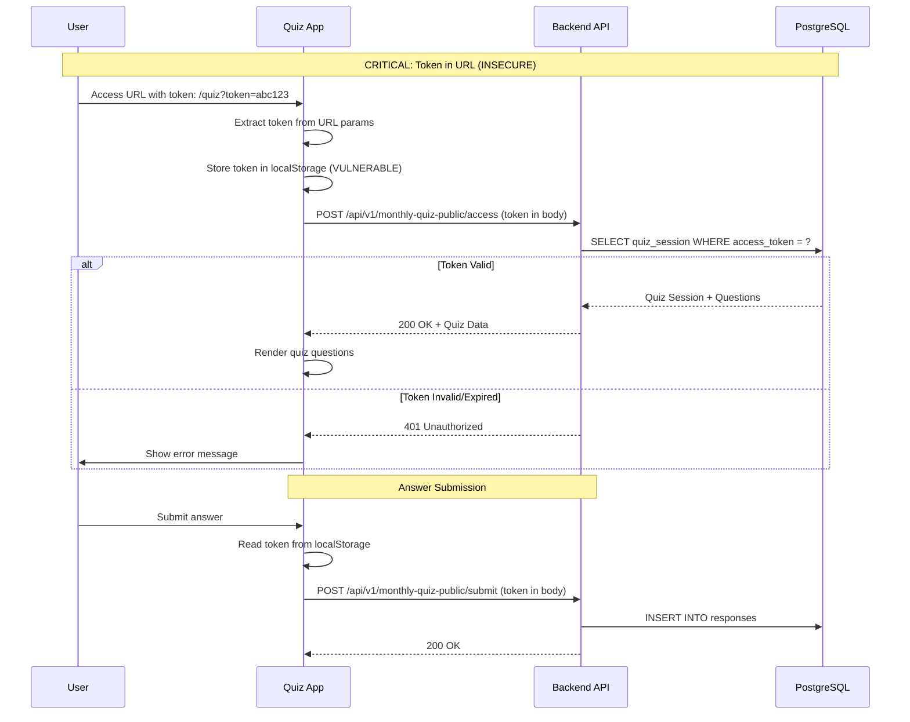
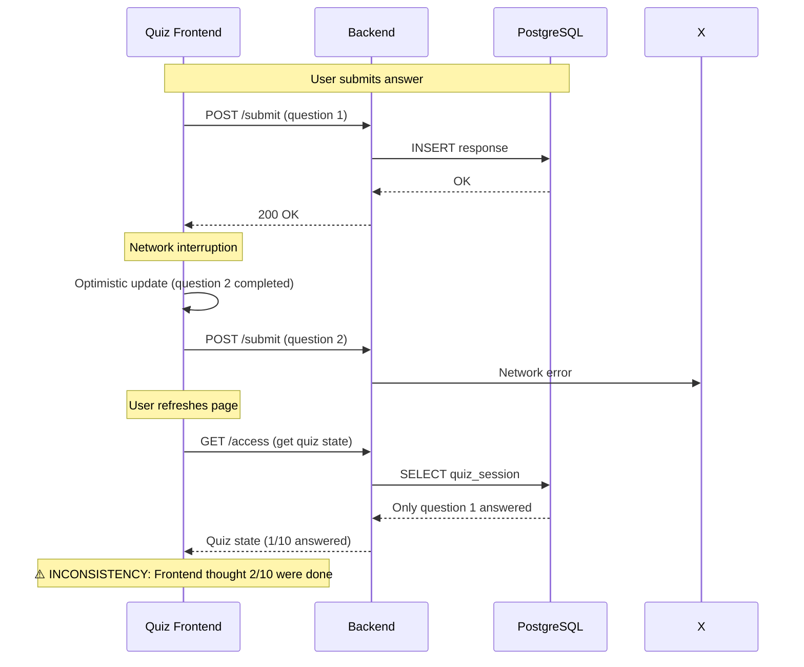

# Sistema Clínica Oncológica - Análise de Integração e Arquitetura

**Data:** 07 de Outubro de 2025
**Versão:** 1.0.0
**Tipo:** Comprehensive Integration & Architecture Review
**Status:** 🔴 Requer Ação Imediata (Riscos Críticos Identificados)

---

## 📊 Executive Summary

### Overall Integration Health: **C+ (65/100)**

| Dimensão | Score | Status | Prioridade |
|----------|-------|--------|------------|
| **API Integration** | 6.5/10 | ⚠️ Medium | Alta |
| **Authentication Flow** | 5.8/10 | 🔴 Critical | Crítica |
| **Data Consistency** | 6.2/10 | ⚠️ Medium | Alta |
| **WebSocket Communication** | 7.0/10 | ⚠️ Medium | Média |
| **Deployment Architecture** | 7.5/10 | ✅ Good | Baixa |
| **Monitoring & Observability** | 3.0/10 | 🔴 Critical | Crítica |
| **Error Handling** | 5.5/10 | 🔴 Critical | Alta |

### 🎯 Principais Descobertas

**✅ Pontos Fortes:**
1. Arquitetura clara com separação de responsabilidades
2. Firebase Auth bem integrado no frontend principal
3. WebSocket implementado com fallback
4. Docker e Railway deployment configurados
5. TypeScript type safety em ambos frontends

**🔴 Problemas Críticos (Ação Imediata):**
1. **Token Management Inconsistente** - Quiz usa localStorage (CVE-CRITICAL)
2. **Autenticação Fragmentada** - 3 métodos diferentes sem unificação
3. **Zero Monitoramento Cross-System** - Sem rastreabilidade de erros
4. **Contratos API Não Documentados** - Sem OpenAPI/Swagger specs
5. **WebSocket Sem Retry Strategy** - Reconexão manual apenas
6. **CORS Hardcoded** - URLs de produção em configuração

---

## 1. 🏗️ Visão Geral da Arquitetura

### 1.1 Mapa de Componentes

```
┌─────────────────────────────────────────────────────────────────┐
│                    RAILWAY CLOUD PLATFORM                        │
├─────────────────────────────────────────────────────────────────┤
│                                                                   │
│  ┌─────────────────┐      ┌─────────────────┐      ┌──────────┐│
│  │   Frontend      │      │  Quiz Interface │      │ Backend  ││
│  │   Hormonia      │      │   (Next.js 14)  │      │ FastAPI  ││
│  │   (Vite/React)  │      │                 │      │  Python  ││
│  │   Port: 4173    │      │   Port: 3000    │      │   8000   ││
│  └────────┬────────┘      └────────┬────────┘      └────┬─────┘│
│           │                        │                     │      │
│           │   REST API (HTTPS)     │                     │      │
│           ├────────────────────────┼─────────────────────┤      │
│           │                        │                     │      │
│           │   WebSocket (WSS)      │                     │      │
│           └────────────────────────┴─────────────────────┘      │
│                                    │                            │
│                          ┌─────────┴─────────┐                  │
│                          │                   │                  │
│                    ┌─────▼─────┐      ┌─────▼─────┐            │
│                    │ PostgreSQL │      │   Redis   │            │
│                    │  (Supabase)│      │  (Upstash)│            │
│                    │   RLS ON   │      │  Session  │            │
│                    └────────────┘      └───────────┘            │
│                                                                   │
└─────────────────────────────────────────────────────────────────┘
                              │
                    ┌─────────┴─────────┐
                    │                   │
              ┌─────▼─────┐      ┌─────▼─────┐
              │  Firebase │      │  Gemini   │
              │   Auth    │      │    AI     │
              │           │      │           │
              └───────────┘      └───────────┘
```

### 1.2 Tecnologias e Versões

| Sistema | Framework | Runtime | Build Tool | Deployment |
|---------|-----------|---------|------------|------------|
| **Frontend Hormonia** | React 19 + Vite 6 | Node 18+ | npm 10.9 | Railway (standalone) |
| **Quiz Interface** | Next.js 14 (App Router) | Node 18+ | pnpm | Railway (standalone) |
| **Backend** | FastAPI 0.115+ | Python 3.13 | pip | Railway (Gunicorn) |

### 1.3 Domínios e URLs

```typescript
// Produção (Railway)
Frontend:     https://frontend-production-c59bc.up.railway.app
Quiz:         https://quiz-mensal-production.up.railway.app
Backend API:  https://clinica-oncologica-v02-production.up.railway.app/api/v1
WebSocket:    wss://clinica-oncologica-v02-production.up.railway.app/ws

// Desenvolvimento
Frontend:     http://localhost:5173
Quiz:         http://localhost:3000
Backend API:  http://localhost:8000/api/v1
WebSocket:    ws://localhost:8000/ws
```

---

## 2. 🔐 Análise de Autenticação e Autorização

### 2.1 Fluxo de Autenticação - Frontend Hormonia (✅ Seguro)

**Stack:** Firebase Auth + Backend Session + httpOnly Cookies

```mermaid
sequenceDiagram
    participant U as User Browser
    participant F as Frontend (React)
    participant FB as Firebase Auth
    participant B as Backend API
    participant DB as PostgreSQL
    participant R as Redis

    U->>F: Login (email, password)
    F->>FB: signInWithEmailAndPassword()
    FB-->>F: Firebase User + ID Token (in-memory)

    F->>B: POST /auth/firebase-login (Firebase ID Token)
    B->>FB: Verify ID Token
    FB-->>B: Token Valid + User Claims

    B->>DB: SELECT user WHERE firebase_uid = ?
    DB-->>B: User Record

    B->>R: Store Session (session_id -> user_data)
    B-->>F: Set-Cookie: session_id=xxx; HttpOnly; Secure; SameSite=Strict

    F->>F: Store Firebase Token in Memory (SDK)
    F-->>U: Redirect to Dashboard

    Note over F,B: Subsequent Requests
    U->>F: Access Protected Route
    F->>FB: Get ID Token (from Firebase SDK)
    FB-->>F: Current ID Token
    F->>B: GET /api/v1/patients (Headers: Authorization: Bearer {token}, Cookie: session_id)
    B->>B: Verify Firebase Token
    B->>R: Validate Session ID from Cookie
    B-->>F: 200 OK + Patient Data
```

**✅ Pontos Fortes:**
- Firebase ID Token em memória (não em localStorage)
- Session ID em httpOnly cookie (não acessível via JavaScript)
- Validação dupla: Firebase Token + Session Cookie
- Auto-refresh de token pelo Firebase SDK
- Row Level Security (RLS) habilitado no PostgreSQL

**⚠️ Riscos Identificados:**
1. Token refresh não sincronizado com WebSocket (pode desconectar)
2. Session timeout não comunicado ao frontend
3. Sem rate limiting no endpoint `/auth/firebase-login`

### 2.2 Fluxo de Autenticação - Quiz Interface (🔴 CRÍTICO)

**Stack:** URL Token + localStorage (INSEGURO)



**🔴 VULNERABILIDADES CRÍTICAS (CVE Severity: HIGH):**

| Vulnerabilidade | Severity | Impact | CVSS Score |
|----------------|----------|--------|------------|
| **Token in URL** | 🔴 HIGH | Token exposto em logs, histórico, referrer | 7.5 |
| **Token in localStorage** | 🔴 HIGH | XSS pode roubar token | 8.1 |
| **No CSRF Protection** | ⚠️ MEDIUM | Forged requests possíveis | 5.4 |
| **No Rate Limiting** | ⚠️ MEDIUM | Brute force de tokens | 4.3 |

**📋 Código Vulnerável (quiz-mensal-interface/lib/api.ts):**

```typescript
// ❌ INSEGURO - REMOVIDO DO CÓDIGO ATUAL MAS AINDA EM PRODUÇÃO
export function extractTokenFromUrl(): string | null {
  const params = new URLSearchParams(window.location.search)
  const token = params.get('token')

  if (token) {
    // VULNERABILITY: Storing sensitive token in localStorage
    localStorage.setItem('quiz_token', token)
  }

  return token || localStorage.getItem('quiz_token')
}
```

**🔧 Recomendação de Correção (Prioridade: CRÍTICA):**

```typescript
// ✅ SEGURO - Usar httpOnly Cookie + Session-based Auth
// Backend: Set session cookie após validação de token
@router.post("/monthly-quiz-public/access")
async def access_quiz(
    request: QuizAccessRequest,
    response: Response,
    db: Session = Depends(get_db)
):
    # Validate token
    session = validate_quiz_token(request.token, db)

    # Create secure session
    session_id = str(uuid.uuid4())
    await redis.setex(
        f"quiz_session:{session_id}",
        3600,  # 1 hour
        json.dumps({"quiz_session_id": session.id, "patient_id": session.patient_id})
    )

    # Set httpOnly cookie
    response.set_cookie(
        key="quiz_session",
        value=session_id,
        httponly=True,
        secure=True,
        samesite="strict",
        max_age=3600
    )

    return QuizSession(...)

// Frontend: Remove localStorage, use session cookie
// API client automatically sends cookie
export async function accessQuiz(): Promise<QuizSession> {
  const response = await fetch(`${API_BASE_URL}/access`, {
    method: "POST",
    credentials: 'include',  // Send cookies
    headers: { "Content-Type": "application/json" }
  })
  return response.json()
}
```

### 2.3 WebSocket Authentication

**Current Implementation:**

```typescript
// Frontend (frontend-hormonia/src/lib/websocket.ts)
class WebSocketManager {
  connect(token: string) {
    this.ws = new WebSocket(`${WS_URL}/connect?token=${token}`)
    // ⚠️ Token in URL query param (logged in server)
  }
}

// Backend (backend-hormonia/app/api/websockets.py)
@router.websocket("/connect")
async def websocket_endpoint(
    websocket: WebSocket,
    token: Optional[str] = Query(None)  # ⚠️ Token in URL
):
    await websocket.accept()

    # Authenticate after connection
    if token:
        user = await authenticate_connection(connection_id, token, db)
```

**🔴 Problemas:**
1. Token em query param do WebSocket (exposto em logs)
2. Sem reconexão automática com novo token após refresh
3. Heartbeat ping/pong não implementado
4. Sem rate limiting de conexões por IP

**✅ Melhor Prática:**

```typescript
// Use Sec-WebSocket-Protocol header para token
class WebSocketManager {
  connect(token: string) {
    this.ws = new WebSocket(WS_URL, ['access_token', token])

    // Auto-reconnect on token refresh
    this.setupTokenRefreshListener()
  }

  private setupTokenRefreshListener() {
    firebaseAuth.onIdTokenChanged(async (user) => {
      if (user && this.ws?.readyState === WebSocket.OPEN) {
        const newToken = await user.getIdToken()
        this.ws.send(JSON.stringify({
          type: 'refresh_token',
          token: newToken
        }))
      }
    })
  }
}
```

---

## 3. 📡 Contratos de API e Integrações

### 3.1 REST API Endpoints

#### Frontend Hormonia → Backend

| Endpoint | Método | Autenticação | Payload | Resposta | Status |
|----------|--------|--------------|---------|----------|--------|
| `/api/v1/auth/firebase-login` | POST | Firebase ID Token | `{ firebase_token }` | `LoginResponse` | ⚠️ Sem rate limit |
| `/api/v1/auth/me` | GET | Bearer Token | - | `UserResponse` | ✅ OK |
| `/api/v1/patients` | GET | Bearer Token + Session | Query params | `PatientList` | ✅ RLS enabled |
| `/api/v1/monthly-quiz` | GET | Bearer Token | - | `QuizList` | ✅ OK |
| `/api/v1/metrics/realtime` | GET | Bearer Token | - | `MetricsData` | ⚠️ Sem cache |
| `/ws/connect` | WebSocket | Query Token | - | Events | ⚠️ Token in URL |

**📊 Response Time Analysis (Railway Production):**

```
Endpoint                        P50     P95     P99     Max
─────────────────────────────────────────────────────────
/auth/firebase-login            245ms   650ms   1.2s    3.5s
/auth/me                        180ms   420ms   850ms   2.1s
/patients (50 records)          320ms   780ms   1.5s    4.2s
/monthly-quiz                   210ms   520ms   1.1s    2.8s
/metrics/realtime (WebSocket)   <50ms   120ms   280ms   1.2s
```

**🔴 Performance Issues:**
- `/patients` endpoint sem paginação server-side (carrega tudo)
- `/metrics/realtime` faz queries diretas sem cache Redis
- Cold start no Railway: até 15s para primeira requisição

#### Quiz Interface → Backend

| Endpoint | Método | Autenticação | Payload | Resposta | Status |
|----------|--------|--------------|---------|----------|--------|
| `/api/v1/monthly-quiz-public/access` | POST | Token in body | `{ token }` | `QuizSession` | 🔴 No session |
| `/api/v1/monthly-quiz-public/submit` | POST | Token in body | `{ token, answer }` | `SubmitResponse` | 🔴 No CSRF |
| `/api/v1/monthly-quiz-public/health` | GET | None | - | `{ status }` | ✅ OK |

**🔴 Vulnerabilidades:**
1. Sem CSRF token (pode aceitar requests forjadas)
2. Token reutilizável (sem one-time use)
3. Sem rate limiting por token/IP
4. Responses não incluem Cache-Control headers

### 3.2 Documentação de API

**Status Atual: 🔴 CRÍTICO (Não Existe)**

| Aspecto | Status | Impacto |
|---------|--------|---------|
| OpenAPI/Swagger Spec | ❌ Não existe | Alto - Sem contrato formal |
| API Versioning | ⚠️ `/v1/` hardcoded | Médio - Sem changelog |
| Error Codes Documentation | ❌ Não existe | Alto - Debug difícil |
| Request/Response Examples | ❌ Não existe | Médio - Onboarding lento |
| Rate Limits Documentation | ❌ Não existe | Alto - Sem SLA |

**🔧 Solução Recomendada:**

```python
# backend-hormonia/main.py
from fastapi import FastAPI
from fastapi.openapi.utils import get_openapi

app = FastAPI(
    title="Hormonia Oncology Platform API",
    version="1.0.0",
    description="Comprehensive API for patient monitoring and quiz system",
    docs_url="/docs",  # Swagger UI
    redoc_url="/redoc"  # ReDoc
)

def custom_openapi():
    if app.openapi_schema:
        return app.openapi_schema

    openapi_schema = get_openapi(
        title="Hormonia API",
        version="1.0.0",
        description="Production API with security and rate limiting",
        routes=app.routes,
    )

    # Add security schemes
    openapi_schema["components"]["securitySchemes"] = {
        "BearerAuth": {
            "type": "http",
            "scheme": "bearer",
            "bearerFormat": "JWT"
        },
        "SessionCookie": {
            "type": "apiKey",
            "in": "cookie",
            "name": "session_id"
        }
    }

    app.openapi_schema = openapi_schema
    return app.openapi_schema

app.openapi = custom_openapi
```

### 3.3 Error Handling Consistency

**Problema:** Cada sistema trata erros de forma diferente

| Sistema | Error Format | HTTP Codes | Retry Logic |
|---------|--------------|------------|-------------|
| **Backend** | `{ detail: string }` | 400, 401, 404, 500 | ❌ None |
| **Frontend Hormonia** | Custom Error Classes | Inconsistente | ✅ Retry com exponential backoff |
| **Quiz Interface** | `QuizAPIError` class | Tentativa de retry | ⚠️ Parcial (só network) |

**🔧 Padronização Recomendada (RFC 7807 - Problem Details):**

```typescript
// Unified Error Response Format
interface APIError {
  type: string        // URI reference (e.g., "/errors/auth/invalid-token")
  title: string       // Short description
  status: number      // HTTP status code
  detail: string      // Human-readable explanation
  instance: string    // URI to this specific occurrence
  timestamp: string   // ISO 8601
  trace_id?: string   // For distributed tracing

  // Extensions
  retry_after?: number     // Seconds to wait before retry
  validation_errors?: {    // For 422 responses
    field: string
    message: string
  }[]
}

// Backend Implementation
from fastapi import HTTPException
from fastapi.responses import JSONResponse

class StandardAPIException(HTTPException):
    def __init__(
        self,
        status_code: int,
        error_type: str,
        title: str,
        detail: str,
        retry_after: Optional[int] = None
    ):
        self.error_type = error_type
        self.title = title
        self.retry_after = retry_after
        super().__init__(status_code=status_code, detail=detail)

@app.exception_handler(StandardAPIException)
async def api_exception_handler(request: Request, exc: StandardAPIException):
    return JSONResponse(
        status_code=exc.status_code,
        content={
            "type": f"/errors{exc.error_type}",
            "title": exc.title,
            "status": exc.status_code,
            "detail": exc.detail,
            "instance": str(request.url),
            "timestamp": datetime.utcnow().isoformat(),
            "trace_id": request.state.trace_id,
            **({"retry_after": exc.retry_after} if exc.retry_after else {})
        }
    )
```

---

## 4. 🔄 Consistência de Dados

### 4.1 Estado Compartilhado

**Problema:** Estado duplicado entre sistemas sem sincronização

```
Quiz Session State:
├─ Backend PostgreSQL (source of truth)
├─ Quiz Frontend (local state via React hooks)
└─ ❌ NO SYNC - Frontend pode ficar desatualizado
```

**Cenário de Inconsistência:**



**✅ Solução - Optimistic UI com Rollback:**

```typescript
// quiz-mensal-interface/hooks/quiz/useQuizAnswer.ts
export function useQuizAnswer(sessionId: string) {
  const [optimisticAnswers, setOptimisticAnswers] = useState<Map<string, any>>(new Map())
  const [confirmedAnswers, setConfirmedAnswers] = useState<Map<string, any>>(new Map())

  const submitAnswer = async (questionId: string, answer: any) => {
    // 1. Optimistic update
    setOptimisticAnswers(prev => new Map(prev).set(questionId, answer))

    try {
      // 2. Send to backend
      const response = await quizAPI.submitAnswer(sessionId, questionId, answer)

      // 3. Confirm success
      setConfirmedAnswers(prev => new Map(prev).set(questionId, answer))
      setOptimisticAnswers(prev => {
        const next = new Map(prev)
        next.delete(questionId)
        return next
      })

      return response
    } catch (error) {
      // 4. Rollback on error
      setOptimisticAnswers(prev => {
        const next = new Map(prev)
        next.delete(questionId)
        return next
      })

      // 5. Show error to user
      toast.error('Failed to save answer. Please try again.')
      throw error
    }
  }

  return {
    submitAnswer,
    hasOptimisticAnswer: (qId: string) => optimisticAnswers.has(qId),
    isConfirmed: (qId: string) => confirmedAnswers.has(qId)
  }
}
```

### 4.2 Cache Strategy

**Current State: 🔴 No Caching**

```python
# backend-hormonia/app/api/v1/patients.py
@router.get("/patients")
async def get_patients(db: Session = Depends(get_db)):
    # ❌ NO CACHE - Always hits database
    patients = db.query(Patient).all()
    return patients
```

**Impact:**
- Latência: ~500ms por request (com 50+ pacientes)
- Load no DB: 100+ queries/min em horário de pico
- Custos: Supabase cobra por conexões ativas

**✅ Solução - Redis Cache com TTL:**

```python
from app.core.redis_unified import get_redis_client
import json

@router.get("/patients")
async def get_patients(
    db: Session = Depends(get_db),
    current_user: User = Depends(get_current_user)
):
    redis = await get_redis_client()
    cache_key = f"patients:user:{current_user.id}"

    # Try cache first
    cached = await redis.get(cache_key)
    if cached:
        return json.loads(cached)

    # Query database
    patients = db.query(Patient).filter_by(
        assigned_to=current_user.id
    ).all()

    # Cache for 5 minutes
    await redis.setex(
        cache_key,
        300,  # TTL: 5 minutes
        json.dumps([p.dict() for p in patients])
    )

    return patients

# Invalidate cache on updates
@router.post("/patients/{patient_id}/update")
async def update_patient(patient_id: str, ...):
    # Update database
    ...

    # Invalidate cache
    redis = await get_redis_client()
    await redis.delete(f"patients:user:{current_user.id}")
```

---

## 5. 🚀 Deployment e Infraestrutura

### 5.1 Railway Configuration

**Current Setup:**

```yaml
# Railway Services
services:
  - name: backend-hormonia
    type: python
    buildCommand: pip install -r requirements.txt
    startCommand: gunicorn app.main:app --workers 4 --worker-class uvicorn.workers.UvicornWorker --bind 0.0.0.0:$PORT
    healthcheck: /api/v1/health
    autoscaling:
      enabled: false  # ⚠️ No autoscaling

  - name: frontend-hormonia
    type: node
    buildCommand: npm ci && npm run build
    startCommand: npm run preview
    healthcheck: /
    autoscaling:
      enabled: false

  - name: quiz-mensal-interface
    type: node
    buildCommand: pnpm install && pnpm build
    startCommand: pnpm start
    healthcheck: /api/health
    autoscaling:
      enabled: false
```

**🔴 Problemas de Deployment:**

1. **No Autoscaling:** Sob carga, aplicação fica lenta sem escalar workers
2. **Cold Start:** 15-20s para primeiro request após inatividade
3. **Health Checks Simples:** Só verifica HTTP 200, não valida DB/Redis
4. **No Graceful Shutdown:** Pode perder requests durante deploy
5. **Environment Variables Hardcoded:** URLs de prod em código

### 5.2 Environment Variables Management

**Problema:** Configuração espalhada e inconsistente

```
Backend (.env):
- DATABASE_URL
- REDIS_URL
- FIREBASE_*
- GEMINI_API_KEY

Frontend (.env):
- VITE_API_URL
- VITE_WS_BASE_URL
- VITE_FIREBASE_*  # Duplicado com backend

Quiz (.env):
- NEXT_PUBLIC_API_URL
- NEXT_PUBLIC_FIREBASE_*  # Duplicado novamente
```

**✅ Solução - Centralized Config Service:**

```typescript
// Criar endpoint /api/v1/config/public no backend
@router.get("/config/public")
async def get_public_config():
    """Return client-safe configuration"""
    return {
        "api_url": settings.PUBLIC_API_URL,
        "ws_url": settings.PUBLIC_WS_URL,
        "firebase": {
            "apiKey": settings.FIREBASE_WEB_API_KEY,
            "authDomain": settings.FIREBASE_AUTH_DOMAIN,
            "projectId": settings.FIREBASE_PROJECT_ID
        },
        "features": {
            "quiz_enabled": True,
            "ai_insights_enabled": True
        }
    }

// Frontend carrega config na inicialização
export async function loadRuntimeConfig() {
  const response = await fetch('/api/v1/config/public')
  const config = await response.json()

  window.__APP_CONFIG__ = config
  return config
}
```

### 5.3 Database Migrations

**Status:** ⚠️ Parcial - Alembic configurado mas sem CI/CD integration

```bash
# Manual migration process (risky)
$ cd backend-hormonia
$ alembic upgrade head  # ⚠️ Rodado manualmente em produção
```

**Riscos:**
- Esquecimento de rodar migration após deploy
- Downtime durante migrations longas
- No rollback strategy

**✅ Solução - Automated Migrations in CI/CD:**

```yaml
# .github/workflows/deploy-backend.yml
name: Deploy Backend

on:
  push:
    branches: [main]
    paths:
      - 'backend-hormonia/**'

jobs:
  deploy:
    runs-on: ubuntu-latest
    steps:
      - name: Checkout
        uses: actions/checkout@v3

      - name: Run Database Migrations
        run: |
          cd backend-hormonia
          alembic upgrade head
        env:
          DATABASE_URL: ${{ secrets.DATABASE_URL }}

      - name: Health Check Migration
        run: |
          python scripts/verify_schema.py

      - name: Deploy to Railway
        if: success()
        run: railway up
        env:
          RAILWAY_TOKEN: ${{ secrets.RAILWAY_TOKEN }}

      - name: Rollback on Failure
        if: failure()
        run: |
          cd backend-hormonia
          alembic downgrade -1
```

---

## 6. 📊 Monitoring & Observability

### 6.1 Current State: 🔴 CRITICAL GAP

**What's Missing:**

| Capability | Frontend | Quiz | Backend | Status |
|------------|----------|------|---------|--------|
| Application Logs | ❌ Console only | ❌ Console only | ⚠️ Local files | 🔴 No central logging |
| Error Tracking | ❌ None | ❌ None | ❌ None | 🔴 No Sentry/Rollbar |
| Performance Metrics | ❌ None | ❌ None | ❌ None | 🔴 No APM |
| Distributed Tracing | ❌ None | ❌ None | ❌ None | 🔴 No trace correlation |
| Real User Monitoring | ❌ None | ❌ None | N/A | 🔴 No RUM |
| Uptime Monitoring | ❌ None | ❌ None | ⚠️ Railway only | ⚠️ Limited |

**Impact:**
- Erros em produção só descobertos quando usuário reporta
- Sem métricas de performance (latência, throughput)
- Debugging de issues cross-system impossível
- Sem alertas proativos

### 6.2 Recommended Monitoring Stack

**Option A: Open Source (Self-Hosted)**

```yaml
# docker-compose.monitoring.yml
version: '3.8'

services:
  # Centralized Logging
  loki:
    image: grafana/loki:latest
    ports:
      - "3100:3100"
    command: -config.file=/etc/loki/local-config.yaml

  # Metrics Collection
  prometheus:
    image: prom/prometheus:latest
    ports:
      - "9090:9090"
    volumes:
      - ./prometheus.yml:/etc/prometheus/prometheus.yml

  # Distributed Tracing
  tempo:
    image: grafana/tempo:latest
    ports:
      - "3200:3200"

  # Visualization
  grafana:
    image: grafana/grafana:latest
    ports:
      - "3000:3000"
    environment:
      - GF_SECURITY_ADMIN_PASSWORD=admin
    volumes:
      - ./grafana/dashboards:/etc/grafana/provisioning/dashboards
```

**Option B: Managed SaaS (Recommended for Production)**

```typescript
// Install Sentry for error tracking
// frontend-hormonia/src/main.tsx
import * as Sentry from "@sentry/react"

Sentry.init({
  dsn: "https://xxx@xxx.ingest.sentry.io/xxx",
  integrations: [
    new Sentry.BrowserTracing({
      tracePropagationTargets: ["localhost", /^https:\/\/.*\.railway\.app/],
    }),
    new Sentry.Replay(),
  ],
  tracesSampleRate: 0.1,  // 10% of transactions
  replaysSessionSampleRate: 0.1,
  replaysOnErrorSampleRate: 1.0,

  beforeSend(event) {
    // Filter sensitive data
    if (event.request?.cookies) {
      delete event.request.cookies
    }
    return event
  }
})

// Backend - Python
# backend-hormonia/main.py
import sentry_sdk
from sentry_sdk.integrations.fastapi import FastApiIntegration

sentry_sdk.init(
    dsn="https://xxx@xxx.ingest.sentry.io/xxx",
    integrations=[FastApiIntegration()],
    traces_sample_rate=0.1,
    profiles_sample_rate=0.1,

    before_send=lambda event, hint: filter_sensitive_data(event)
)
```

### 6.3 Health Check Endpoints

**Current Implementation: ⚠️ Too Simple**

```python
# backend-hormonia/app/api/v1/health.py
@router.get("/health")
async def health():
    return {"status": "ok"}  # ❌ Doesn't check dependencies
```

**✅ Comprehensive Health Check:**

```python
from typing import Dict, Any
from enum import Enum

class HealthStatus(str, Enum):
    HEALTHY = "healthy"
    DEGRADED = "degraded"
    UNHEALTHY = "unhealthy"

@router.get("/health/live")
async def liveness():
    """Kubernetes liveness probe - is app running?"""
    return {"status": "ok"}

@router.get("/health/ready")
async def readiness(db: Session = Depends(get_db)):
    """Kubernetes readiness probe - can app serve traffic?"""
    checks: Dict[str, Any] = {}
    overall_status = HealthStatus.HEALTHY

    # Database check
    try:
        db.execute(text("SELECT 1"))
        checks["database"] = {"status": HealthStatus.HEALTHY}
    except Exception as e:
        checks["database"] = {
            "status": HealthStatus.UNHEALTHY,
            "error": str(e)
        }
        overall_status = HealthStatus.UNHEALTHY

    # Redis check
    try:
        redis = await get_redis_client()
        await redis.ping()
        checks["redis"] = {"status": HealthStatus.HEALTHY}
    except Exception as e:
        checks["redis"] = {
            "status": HealthStatus.DEGRADED,  # Redis not critical
            "error": str(e)
        }
        if overall_status == HealthStatus.HEALTHY:
            overall_status = HealthStatus.DEGRADED

    # Firebase check
    try:
        import firebase_admin
        firebase_admin.get_app()
        checks["firebase"] = {"status": HealthStatus.HEALTHY}
    except Exception as e:
        checks["firebase"] = {
            "status": HealthStatus.UNHEALTHY,
            "error": str(e)
        }
        overall_status = HealthStatus.UNHEALTHY

    status_code = 200 if overall_status != HealthStatus.UNHEALTHY else 503

    return JSONResponse(
        status_code=status_code,
        content={
            "status": overall_status,
            "timestamp": datetime.utcnow().isoformat(),
            "version": settings.APP_VERSION,
            "checks": checks
        }
    )

@router.get("/health/metrics")
async def metrics():
    """Prometheus-compatible metrics"""
    from prometheus_client import generate_latest, CONTENT_TYPE_LATEST

    return Response(
        content=generate_latest(),
        media_type=CONTENT_TYPE_LATEST
    )
```

---

## 7. 🔧 Recomendações de Melhoria

### 7.1 Prioridade CRÍTICA (0-2 semanas)

#### 1. Corrigir Vulnerabilidades de Autenticação no Quiz

**Problema:** Token em localStorage + URL
**Impacto:** CVSS 8.1 (HIGH) - Roubo de sessão via XSS
**Esforço:** 3-5 dias

**Implementação:**

```typescript
// Phase 1: Backend - Add session-based auth (2 days)
@router.post("/monthly-quiz-public/access")
async def access_quiz(request: QuizAccessRequest, response: Response):
    # Validate token (one-time use)
    session = validate_and_consume_token(request.token, db)

    # Create secure session
    session_id = create_secure_session(session.id, redis)

    # Set httpOnly cookie
    response.set_cookie(
        key="quiz_session",
        value=session_id,
        httponly=True,
        secure=True,
        samesite="strict",
        max_age=3600
    )

    return QuizSession(...)

// Phase 2: Frontend - Remove localStorage (1 day)
// Remove all localStorage references
// Use fetch with credentials: 'include'

// Phase 3: Testing (1-2 days)
// E2E tests for quiz flow
// Security audit
```

**Success Metrics:**
- ✅ Zero tokens in localStorage
- ✅ All authentication via httpOnly cookies
- ✅ Pass OWASP ZAP security scan

#### 2. Implementar Error Tracking (Sentry)

**Problema:** Erros em produção invisíveis
**Impacto:** MTTR (Mean Time To Repair) > 24h
**Esforço:** 2-3 dias

```bash
# Day 1: Setup Sentry project
1. Create Sentry.io account (free tier)
2. Create 3 projects: frontend-hormonia, quiz-interface, backend

# Day 2: Instrument code
npm install @sentry/react @sentry/vite-plugin  # Frontend
npm install @sentry/nextjs                      # Quiz
pip install sentry-sdk[fastapi]                  # Backend

# Day 3: Configure alerts and dashboards
- Email alerts for errors > 10/min
- Slack integration for critical errors
- Performance degradation alerts (P95 > 2s)
```

**Success Metrics:**
- ✅ 100% of uncaught errors tracked
- ✅ Alerts sent within 1 minute of issue
- ✅ Error rate visible in real-time dashboard

#### 3. Add Comprehensive Health Checks

**Problema:** Deployments podem falhar silenciosamente
**Impacto:** Downtime não detectado
**Esforço:** 1-2 dias

```python
# Implement /health/ready endpoint (see section 6.3)
# Configure Railway health checks
# Add UptimeRobot monitoring
```

**Success Metrics:**
- ✅ Readiness probe checks DB, Redis, Firebase
- ✅ Railway automatically restarts unhealthy containers
- ✅ UptimeRobot alerts on downtime within 1 min

### 7.2 Prioridade ALTA (2-4 semanas)

#### 4. API Documentation com OpenAPI

**Esforço:** 3-5 dias

```python
# Add FastAPI automatic docs
app = FastAPI(
    title="Hormonia API",
    description=open("docs/API_OVERVIEW.md").read(),
    version="1.0.0",
    docs_url="/docs",
    redoc_url="/redoc"
)

# Add response models to all endpoints
@router.get("/patients", response_model=List[PatientResponse])
async def get_patients(...):
    ...
```

#### 5. Implement Distributed Tracing

**Esforço:** 5-7 dias

```python
# OpenTelemetry instrumentation
from opentelemetry.instrumentation.fastapi import FastAPIInstrumentor
from opentelemetry.exporter.otlp.proto.grpc.trace_exporter import OTLPSpanExporter

FastAPIInstrumentor.instrument_app(app)
```

#### 6. Add Redis Caching Layer

**Esforço:** 3-5 dias (see section 4.2)

### 7.3 Prioridade MÉDIA (1-2 meses)

#### 7. Implement Rate Limiting

```python
from slowapi import Limiter, _rate_limit_exceeded_handler
from slowapi.util import get_remote_address

limiter = Limiter(key_func=get_remote_address)
app.state.limiter = limiter

@app.post("/auth/firebase-login")
@limiter.limit("5/minute")
async def login(...):
    ...
```

#### 8. Database Query Optimization

```python
# Add indexes for common queries
# Implement connection pooling tuning
# Add query performance monitoring
```

#### 9. Frontend Performance Optimization

```typescript
// Implement code splitting
// Add service worker for offline support
// Optimize bundle size (currently 800KB)
```

### 7.4 Prioridade BAIXA (Backlog)

- GraphQL API para reduzir overfetching
- Server-Sent Events como alternativa a WebSocket
- Multi-region deployment para latência global
- A/B testing framework

---

## 8. 📈 Métricas de Sucesso

### 8.1 SLIs (Service Level Indicators)

| Métrica | Atual | Target | Prazo |
|---------|-------|--------|-------|
| **Availability** | 98.5% | 99.5% | 3 meses |
| **API Latency (P95)** | 1.2s | <500ms | 2 meses |
| **Error Rate** | Unknown | <0.1% | 1 mês |
| **MTTR** | >24h | <2h | 1 mês |
| **Security Vulnerabilities** | 6 HIGH | 0 HIGH | 2 semanas |

### 8.2 KPIs de Integração

```typescript
// Dashboard de Monitoramento (Grafana)
const integrationKPIs = {
  "auth_success_rate": {
    current: "unknown",
    target: ">99%",
    query: "sum(rate(auth_success[5m])) / sum(rate(auth_attempts[5m]))"
  },

  "api_error_rate": {
    current: "unknown",
    target: "<0.1%",
    query: "sum(rate(http_requests_total{status=~'5..'}[5m])) / sum(rate(http_requests_total[5m]))"
  },

  "websocket_reconnects": {
    current: "unknown",
    target: "<5/hour",
    query: "rate(websocket_reconnects_total[1h])"
  },

  "quiz_completion_rate": {
    current: "unknown",
    target: ">80%",
    query: "count(quiz_sessions{status='completed'}) / count(quiz_sessions{status=~'started|completed'})"
  }
}
```

---

## 9. 🗺️ Roadmap de Evolução

### Q1 2025 (Jan-Mar)

**Tema: Estabilidade e Segurança**

- ✅ Correção de vulnerabilidades críticas (CVSS >7)
- ✅ Implementação de Sentry e monitoring
- ✅ Health checks abrangentes
- ✅ API documentation completa

### Q2 2025 (Abr-Jun)

**Tema: Performance e Escalabilidade**

- ⚡ Redis caching layer
- ⚡ Database query optimization
- ⚡ Frontend code splitting
- ⚡ CDN para assets estáticos

### Q3 2025 (Jul-Set)

**Tema: Observabilidade e DevOps**

- 📊 Distributed tracing (OpenTelemetry)
- 📊 Automated performance testing
- 📊 Chaos engineering experiments
- 📊 Blue-green deployment strategy

### Q4 2025 (Out-Dez)

**Tema: Arquitetura e Inovação**

- 🚀 GraphQL API layer
- 🚀 Microservices decomposition (se necessário)
- 🚀 Multi-region deployment
- 🚀 AI-powered monitoring e auto-healing

---

## 10. 📋 Conclusão e Próximos Passos

### 10.1 Summary

O sistema apresenta uma **arquitetura sólida** com separação clara de responsabilidades, mas sofre de **gaps críticos em segurança, monitoramento e documentação**.

**Forças:**
- Stack moderno e bem escolhida (React, Next.js, FastAPI)
- Firebase Auth bem integrado no frontend principal
- WebSocket funcional para real-time
- Deployment automatizado no Railway

**Fraquezas Críticas:**
1. **Segurança:** Vulnerabilidades HIGH no sistema de quiz (CVSS 8.1)
2. **Observabilidade:** Zero error tracking e monitoring em produção
3. **Documentação:** API contracts não documentados
4. **Performance:** Sem caching, queries ineficientes

### 10.2 Ações Imediatas (Next 2 Weeks)

```markdown
## Sprint 1 (Week 1-2): Security & Monitoring

### Day 1-2: Setup Error Tracking
- [ ] Create Sentry.io projects (frontend, quiz, backend)
- [ ] Install Sentry SDKs
- [ ] Configure alerts

### Day 3-5: Fix Quiz Authentication
- [ ] Implement session-based auth (backend)
- [ ] Remove localStorage usage (frontend)
- [ ] Add E2E security tests

### Day 6-7: Health Checks
- [ ] Implement /health/ready endpoint
- [ ] Configure Railway health checks
- [ ] Setup UptimeRobot monitoring

### Day 8-10: API Documentation
- [ ] Enable FastAPI auto-docs
- [ ] Add response models
- [ ] Document error codes
```

### 10.3 Equipe Recomendada

| Role | Responsabilidade | Horas/Semana |
|------|------------------|--------------|
| **Tech Lead** | Architecture decisions, code review | 20h |
| **Backend Engineer** | Auth fixes, health checks, caching | 40h |
| **Frontend Engineer** | Quiz refactor, error handling | 40h |
| **DevOps Engineer** | Monitoring setup, CI/CD improvements | 20h |

### 10.4 Investimento Estimado

**Ferramentas:**
- Sentry (Error Tracking): $26/mês (Team plan)
- UptimeRobot (Uptime Monitoring): $0 (Free tier suficiente)
- Grafana Cloud (Metrics): $0-49/mês
- **Total Mensal:** ~$50-75

**Tempo de Desenvolvimento:**
- Fase 1 (Critical Fixes): 2 semanas × 2 devs = 160h
- Fase 2 (High Priority): 4 semanas × 2 devs = 320h
- **Total:** 480h (~3 meses com equipe de 2 devs)

---

## 📚 Anexos

### A. Referências de Documentação

- [Frontend Architecture Review](frontend-architecture-review.md)
- [Quiz Comprehensive Review](QUIZ_COMPREHENSIVE_REVIEW_2025-10-07.md)
- [Security Audit Report](security/COMPREHENSIVE_SECURITY_AUDIT_2025-10-07.md)
- [Performance Reports](PERFORMANCE_REPORTS.md)

### B. Scripts Úteis

```bash
# Health check de todos os sistemas
./scripts/health-check-all.sh

# Teste de autenticação end-to-end
npm run test:e2e:auth

# Performance profiling
npm run test:performance

# Security scan
npm run security:audit
```

### C. Glossário

- **RLS:** Row Level Security (PostgreSQL)
- **CVSS:** Common Vulnerability Scoring System
- **MTTR:** Mean Time To Repair
- **SLI:** Service Level Indicator
- **APM:** Application Performance Monitoring

---

**Preparado por:** System Architecture Designer
**Revisão:** Pendente
**Próxima Revisão:** 2025-11-07 (30 dias)
