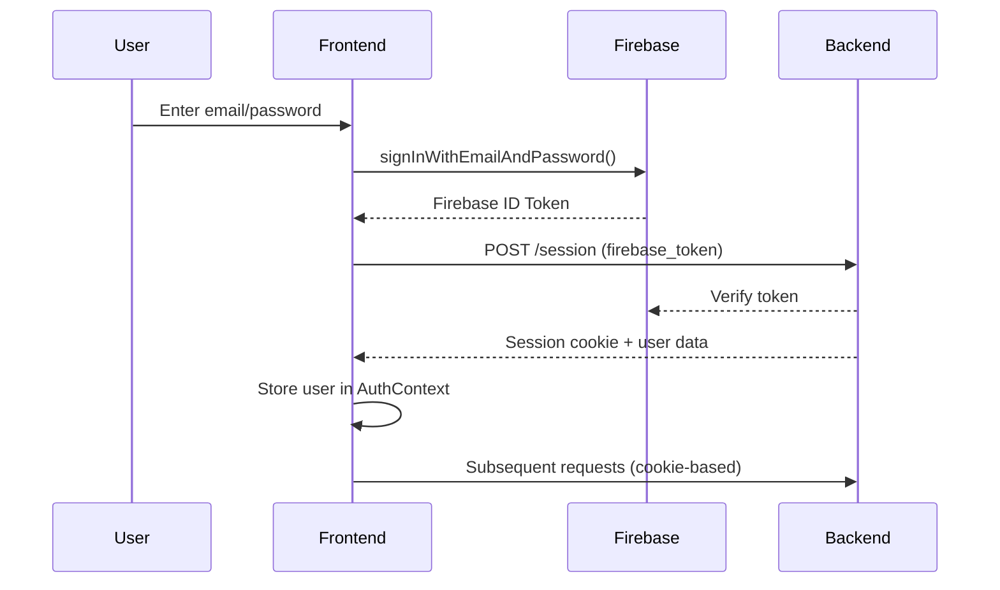

# Frontend API Client Analysis

**Generated**: 2025-11-14
**Purpose**: Comprehensive analysis of frontend API client architecture, endpoints, and request/response formats

---

## Table of Contents

1. [Architecture Overview](#architecture-overview)
2. [Core API Client](#core-api-client)
3. [Domain Modules](#domain-modules)
4. [API Hooks](#api-hooks)
5. [WebSocket Implementation](#websocket-implementation)
6. [Request/Response Formats](#requestresponse-formats)
7. [Error Handling](#error-handling)
8. [Authentication Flow](#authentication-flow)

---

## Architecture Overview

### Modular Design

The API client follows a **modular architecture** with domain-specific modules:

```
frontend-hormonia/src/lib/api-client/
├── core.ts              # Base HTTP client with retry logic
├── auth.ts              # Authentication API
├── patients.ts          # Patient management API
├── monthly-quiz.ts      # Monthly quiz operations
├── analytics.ts         # Analytics and metrics
├── types.ts             # Shared type definitions
└── index.ts             # Main entry point with inline APIs
```

### Design Pattern

- **Base Class**: `ApiClientCore` - Handles HTTP requests, CSRF tokens, auth headers
- **Factory Functions**: Each module exports `createXxxApi(client)` factory
- **Singleton Instance**: `apiClient` exported from `index.ts`

---

## Core API Client

### ApiClientCore (`core.ts`)

**Base URL Configuration:**
```typescript
constructor(baseURL: string)
setBaseURL(url: string): void  // Auto-converts HTTP to HTTPS in production
getBaseURL(): string
```

**Authentication:**
```typescript
setAuthToken(token: string | null): void
clearAuthToken(): void  // Switches to cookie-only auth
getAuthToken(): string | null
setSessionToken(session: { access_token?: string } | null): void
```

**CSRF Protection:**
```typescript
fetchCsrfToken(): Promise<void>  // Non-blocking, 5s timeout
getCsrfToken(): string | null
// Auto-includes X-CSRF-Token header for POST/PUT/DELETE/PATCH
```

**HTTP Methods:**
```typescript
get<T>(endpoint: string, params?: Record<string, string | number | boolean>): Promise<T>
post<T, TData>(endpoint: string, data?: TData, params?): Promise<T>
put<T, TData>(endpoint: string, data?: TData, params?): Promise<T>
delete<T>(endpoint: string, params?): Promise<T>
patch<T, TData>(endpoint: string, data?: TData, params?): Promise<T>
```

**Features:**
- ✅ Automatic retry with exponential backoff (max 3 attempts)
- ✅ Request timeout (30s default)
- ✅ Retries on: 0, 408, 429, 500-599
- ✅ No retry on: 401, 403, 4xx (except 408, 429)
- ✅ Credentials: include (cookie support)

**Error Handling:**
```typescript
class ApiError extends Error {
  status: number
  data: unknown
  userFriendlyMessage: string
  retryable: boolean
  timestamp: string
}
```

User-friendly error messages in Portuguese:
- 401: "Sua sessão expirou. Por favor, faça login novamente."
- 403: "Você não tem permissão para realizar esta ação."
- 500: "Erro interno do servidor. Nossa equipe foi notificada."

---

## Domain Modules

### 1. Authentication API (`auth.ts`)

**Endpoints:**

| Method | Endpoint | Description |
|--------|----------|-------------|
| POST | `/session` | Create session with Firebase token |
| GET | `/session/validate` | Validate current session |
| DELETE | `/session/logout` | Logout (single session) |
| DELETE | `/session/logout-all` | Logout all sessions |

**Key Types:**
```typescript
interface User {
  id: string
  email: string
  full_name: string
  role: string
  is_active: boolean
  permissions: string[]
  created_at: string
  firebase_uid?: string
  session_id?: string
}

interface SessionValidationResponse {
  valid: boolean
  user?: {
    id: string
    email: string
    full_name?: string
    role?: string
    permissions?: string[]
  }
  session_data?: Record<string, unknown>
}
```

**Methods:**
```typescript
auth.createSession(firebaseToken: string, deviceInfo?): Promise<SessionResponse>
auth.getCurrentUser(): Promise<User>
auth.checkAuth(): Promise<{ authenticated: boolean; user?: User }>
auth.logout(): Promise<LogoutResponse>
auth.invalidateAllSessions(): Promise<LogoutResponse>
```

**Note**: Traditional login/register/password operations throw "not supported" errors - Firebase handles these.

---

### 2. Patients API (`patients.ts`)

**Endpoints:**

| Method | Endpoint | Description | V2 |
|--------|----------|-------------|-----|
| GET | `/api/v2/patients` | List patients (cursor pagination) | ✅ |
| GET | `/api/v2/patients/:id` | Get patient by ID | ✅ |
| POST | `/api/v2/patients` | Create patient | ✅ |
| PATCH | `/api/v2/patients/:id` | Update patient | ✅ |
| DELETE | `/api/v2/patients/:id` | Delete patient (soft) | ✅ |
| POST | `/api/v2/patients/:id/activate` | Activate patient | ✅ |
| POST | `/api/v2/patients/:id/deactivate` | Deactivate patient | ✅ |
| POST | `/api/v2/patients/:id/restore` | Restore archived patient | ✅ |
| GET | `/api/v2/patients/:id/timeline` | Get patient timeline | ✅ |
| GET | `/api/v2/patients/search` | Search patients | ✅ |
| GET | `/api/v2/patients/stats` | Get patient statistics | ✅ |
| GET | `/api/v2/patients/export` | Export to CSV | ✅ |
| POST | `/api/v2/patients/import` | Import from CSV | ✅ |

**Key Types:**
```typescript
interface Patient {
  id: string
  name: string
  email?: string
  phone?: string
  cpf?: string
  birth_date?: string
  treatment_type?: string
  treatment_start_date?: string
  diagnosis?: string
  treatment_phase?: string
  gender?: 'M' | 'F' | 'other'
  address?: {
    street?: string
    city?: string
    state?: string
    zip_code?: string
  }
  medical_info?: {
    diagnosis?: string
    allergies?: string[]
    medications?: string[]
  }
  status?: 'active' | 'inactive' | 'archived' | 'paused' | 'completed'
  doctor_id?: string
  current_day?: number
  flow_state?: string
}

interface PaginatedResponse<T> {
  items: T[]
  total: number
  page: number
  size: number
  pages?: number
  has_more?: boolean
  next_cursor?: string
}
```

**Pagination (V2 - Cursor-based):**
```typescript
patients.list(
  pageOrOptions: number | {
    page?: number
    size?: number
    cursor?: string
    limit?: number
    search?: string
    status?: string
    doctor_id?: string
  },
  size?: number,
  filters?: PatientFilters
): Promise<PaginatedResponse<Patient>>
```

Response includes both legacy `items`/`pages` and V2 `has_more`/`next_cursor`.

---

### 3. Monthly Quiz API (`monthly-quiz.ts`)

**Endpoints:**

| Method | Endpoint | Description | V2 |
|--------|----------|-------------|-----|
| POST | `/api/v2/monthly-quiz/links` | Create single quiz link | ✅ |
| POST | `/api/v2/monthly-quiz/links/bulk` | Create bulk quiz links | ✅ |
| GET | `/api/v2/monthly-quiz/links/:id/status` | Get link status | ✅ |
| GET | `/api/v2/monthly-quiz/patients/:id/status` | Get patient quiz status | ✅ |
| GET | `/api/v2/monthly-quiz/patients/:id/history` | Get quiz history | ✅ |
| GET | `/api/v2/monthly-quiz/stats/dashboard` | Dashboard statistics | ✅ |
| GET | `/api/v2/monthly-quiz/links/active` | Get active links | ✅ |
| POST | `/api/v2/monthly-quiz/links/:id/resend` | Resend quiz link | ✅ |
| POST | `/api/v2/monthly-quiz/links/:id/cancel` | Cancel quiz link | ✅ |
| GET | `/api/v2/monthly-quiz/sessions/:id` | Get quiz session | ✅ |
| GET | `/api/v2/monthly-quiz/templates` | List quiz templates | ✅ |

**Key Types:**
```typescript
interface QuizLink {
  id: string
  quiz_session_id: string
  patient_id: string
  quiz_template_id: string
  token: string
  link: string
  delivery_method: 'whatsapp' | 'email' | 'sms' | 'manual'
  status: 'pending' | 'sent' | 'accessed' | 'completed' | 'expired' | 'cancelled'
  expires_at: string
  sent_at?: string
  accessed_at?: string
  completed_at?: string
  access_count?: number
}

interface QuizStats {
  total_sent: number
  total_completed: number
  total_expired: number
  total_active: number
  average_score: number
  completion_rate: number
  expiration_rate: number
  by_period?: {
    daily?: Array<{ date: string; sent: number; completed: number }>
    weekly?: Array<{ week: string; sent: number; completed: number }>
    monthly?: Array<{ month: string; sent: number; completed: number }>
  }
}
```

**Advanced Features:**
```typescript
// Scheduled automation
monthlyQuiz.scheduleAutomated({
  template_id: string
  schedule_type: 'once' | 'daily' | 'weekly' | 'monthly'
  schedule_time: string
  delivery_method?: 'whatsapp' | 'email' | 'sms'
}): Promise<{ schedule_id: string; message: string }>

// Export to CSV
monthlyQuiz.exportToCsv(filters?): Promise<Blob>

// Generate PDF report
monthlyQuiz.generateReport(sessionId: string, format: 'pdf' | 'html'): Promise<Blob>
```

---

### 4. Analytics API (`analytics.ts`)

**Endpoints:**

| Method | Endpoint | Description | V2 |
|--------|----------|-------------|-----|
| GET | `/api/v2/analytics/overview` | Overall analytics | ✅ |
| GET | `/api/v2/analytics/quiz-status` | Quiz status distribution | ✅ |
| GET | `/api/v2/analytics/completion-trend` | Completion trend (6 months) | ✅ |
| GET | `/api/v2/analytics/patient-engagement` | Patient engagement levels | ✅ |
| GET | `/api/v2/analytics/treatment-distribution` | Treatment type distribution | ✅ |
| GET | `/api/v2/analytics/risk-assessment` | Patient risk assessments | ✅ |

**Key Types:**
```typescript
interface DashboardAnalyticsData {
  total_patients: number
  active_patients: number
  active_patients_percentage: number
  response_rate: number
  messages_sent: number
  completed_quizzes: number
  engagement_chart: Array<{
    date: string
    messages_sent: number
    responses_received: number
    response_rate: number
  }>
  recent_alerts: Alert[]
  recent_activity: ActivityItem[]
}

interface TreatmentDistribution {
  period: '7d' | '30d' | '90d' | '12m'
  total_patients: number
  distribution: Array<{
    treatment_type: string
    count: number
    percentage: number
    color: string
  }>
  trend_data: Array<{ week: string; count: number }>
}

interface PatientRiskAssessment {
  id: string
  patient_id: string
  name?: string
  risk_level: 'low' | 'medium' | 'high' | 'critical'
  risk_factors: string[]
  last_response?: string
  recommended_actions: string[]
}
```

---

### 5. Inline APIs (Messages, Flows, Alerts, Reports, Admin)

These are implemented directly in `index.ts` using inline functions:

**Messages API:**
```typescript
messages.list(options?: { page?, cursor?, limit?, ...filters }): Promise<PaginatedResponse<Message>>
messages.send(data: SendMessageRequest): Promise<Message>
messages.markAsRead(messageId: string): Promise<MessageResponse>
messages.getConversation(patientId: string): Promise<ConversationResponse>
messages.sendBulk(data: BulkMessageRequest): Promise<BulkMessageResponse>
```

**Flows API (V2):**
```typescript
flows.list(options?): Promise<PaginatedResponse<FlowTemplate>>
flows.getState(patientId: string): Promise<FlowState>
flows.advance(patientId: string, day?: number): Promise<FlowState>
flows.pause(patientId: string): Promise<FlowState>
flows.resume(patientId: string): Promise<FlowState>
flows.processResponse(patientId: string, responseText: string): Promise<FlowState>
flows.getAnalytics(): Promise<FlowAnalytics>
```

**Alerts API (V2):**
```typescript
alerts.list(options?): Promise<PaginatedResponse<Alert>>
alerts.create(data: CreateAlertRequest): Promise<Alert>
alerts.markAsRead(alertId: string): Promise<MessageResponse>
alerts.markAllAsRead(): Promise<MessageResponse>
```

**Admin API:**
```typescript
admin.users.list(page?, size?): Promise<AdminUser[]>
admin.users.create(data: CreateUserRequest): Promise<AdminUser>
admin.users.resetPassword(userId: string): Promise<MessageResponse>
admin.roles.list(): Promise<Role[]>
admin.audit.list(page?, size?, filters?): Promise<PaginatedResponse<AuditLogEntry>>
admin.system.getHealth(): Promise<SystemHealth>
admin.system.getMetrics(): Promise<SystemMetrics>
```

---

## API Hooks

### Core Hooks (`hooks/`)

**1. useAuth (`useAuth.ts`)**
```typescript
const {
  user,                    // Current user from AuthContext
  token,                   // Firebase access token
  isAuthenticated,         // Boolean auth state
  isLoading,              // Loading state
  login,                  // Firebase email/password login
  logout,                 // Logout and clear session
  hasPermission,          // Check user permission
  hasRole,                // Check user role
  isAdmin,                // Is admin user
} = useAuth()
```

**2. usePatients (`usePatients.ts`)**
```typescript
const {
  patients,               // Patient[] array
  total,                  // Total count
  page,                   // Current page
  limit,                  // Items per page
  hasMore,                // Has more pages
  isLoading,              // Loading state
  filters,                // Current filters
  updateFilter,           // Update single filter
  updateFilters,          // Update multiple filters
  resetFilters,           // Reset all filters
  refetch,                // Refresh data
  prefetchNextPage        // Prefetch next page
} = usePatients({
  initialFilters?: {
    search?: string
    status?: 'active' | 'paused' | 'completed'
    treatment_type?: string
  },
  debounceMs?: 300,
  pageSize?: 20
})
```

Features:
- ✅ Cursor-based pagination with V2 API
- ✅ Debounced search (300ms default)
- ✅ Filter management (search, status, treatment_type, dates)
- ✅ Prefetching for instant pagination
- ✅ Persistent total across pages
- ✅ Auto-reset to page 1 on filter change

**3. useSystemStats (`useSystemStats.ts`)**
```typescript
const {
  stats: {
    users: { total, active, locked, new_today }
    security: { failed_logins, active_sessions, blocked_ips }
    system: { uptime, memory_usage, cpu_usage, disk_usage }
    audit: { total_logs, critical_events, warnings }
  },
  isLoading,
  error,
  refetch
} = useSystemStats({
  realTimeUpdates?: true,
  refreshInterval?: 30000
})
```

**4. useMonthlyQuizAdmin (`useMonthlyQuizAdmin.ts`)**
```typescript
const {
  sendQuizLink,                  // Send to single patient
  sendBulkQuizLinks,             // Send to multiple patients
  resendQuizLink,                // Resend existing link
  cancelQuizLink,                // Cancel quiz link
  useQuizLinkStatus,             // Query hook for status
  useQuizLinkHistory,            // Query hook for history
  useQuizStats,                  // Query hook for stats
  useSendQuizLinkMutation,       // Mutation hook for sending
  useBulkSendQuizLinksMutation   // Mutation hook for bulk send
} = useMonthlyQuizAdmin()
```

### Analytics Hooks (`hooks/api/`)

**useTreatmentDistribution:**
```typescript
const {
  data: {
    period,
    total_patients,
    distribution: Array<{ treatment_type, count, percentage, color }>,
    trend_data
  },
  isLoading,
  error
} = useTreatmentDistribution(period: '7d' | '30d' | '90d' | '12m')
```

**useClinicalMetrics:**
```typescript
const {
  data: {
    active_patients,
    completed_sessions,
    adherence_rate,
    avg_session_duration
  },
  isLoading
} = useClinicalMetrics()
```

**usePhysicianRiskAssessments:**
```typescript
const {
  data: {
    risk_assessments: Array<{
      patient_id,
      risk_level: 'low' | 'medium' | 'high' | 'critical',
      risk_factors,
      recommended_actions
    }>,
    total_patients,
    generated_at
  },
  isLoading
} = usePhysicianRiskAssessments({
  risk_level?: 'high' | 'critical',
  limit?: 10,
  lookback_days?: 30
})
```

---

## WebSocket Implementation

### 1. useWebSocket (`useWebSocket.ts`)

**Configuration:**
```typescript
const {
  isConnected,
  connectionState,      // 'connecting' | 'connected' | 'disconnected' | 'error'
  lastMessage,
  connect,
  disconnect,
  sendMessage
} = useWebSocket({
  url?: string,                            // WS URL (default: ws://localhost:8000/ws/connect)
  reconnectAttempts?: 5,
  reconnectInterval?: 3000,
  onMessage?: (message: WebSocketMessage) => void,
  onError?: (error: Event) => void,
  onOpen?: () => void,
  onClose?: () => void
})
```

**Features:**
- ✅ Auto-connect on authentication
- ✅ Auto-reconnect with exponential backoff
- ✅ Token-based authentication (`?token=xxx`)
- ✅ Duplicate connection prevention
- ✅ Graceful disconnect on logout

**WebSocket URL Resolution:**
1. Check `VITE_WS_BASE_URL` env variable
2. Fallback to `VITE_WS_URL`
3. Default: `ws://localhost:8000/ws/connect`

**Message Format:**
```typescript
interface WebSocketMessage<T = unknown> {
  type: string
  data?: T
  timestamp: string
}
```

### 2. useMetricsWebSocket (`useMetricsWebSocket.ts`)

**Real-time metrics streaming:**
```typescript
const {
  isConnected,
  isConnecting,
  error,
  lastMessage,
  reconnectAttempts,
  send,
  connect,
  disconnect
} = useMetricsWebSocket({
  onMessage?: (data: MetricsWebSocketData) => void,
  reconnectInterval?: 5000,
  maxReconnectAttempts?: 10,
  heartbeatInterval?: 30000
})
```

**Features:**
- ✅ Firebase token integration
- ✅ Heartbeat/ping-pong mechanism (30s interval)
- ✅ Auto-reconnect on token refresh
- ✅ Exponential backoff: min(5000 * 2^attempts, 60000)

**Endpoint:** `${VITE_WS_BASE_URL}/api/v2/metrics/live?token=${firebaseToken}`

### 3. Specialized WebSocket Hooks

**useSystemNotifications:**
```typescript
const {
  notifications: SystemNotification[],  // Last 50 notifications
  isConnected,
  clearNotifications
} = useSystemNotifications()
```

**usePatientUpdates:**
```typescript
const {
  updates: PatientUpdate[],  // Last 100 updates
  isConnected,
  clearUpdates
} = usePatientUpdates()
```

---

## Request/Response Formats

### Common Patterns

**1. Paginated Responses (V2 - Cursor-based):**
```json
{
  "data": [...],           // or "items"
  "total": 150,
  "page": 1,
  "size": 20,
  "has_more": true,
  "next_cursor": "eyJp...="
}
```

**2. Error Responses:**
```json
{
  "detail": "Error message",
  "user_message": "User-friendly message in Portuguese",
  "status_code": 400,
  "timestamp": "2025-11-14T12:00:00Z"
}
```

**3. Success Responses:**
```json
{
  "message": "Operation successful",
  "data": {...}
}
```

### Authentication

**Create Session (POST `/session`):**
```json
// Request
{
  "firebase_token": "eyJhbGc...",
  "device_info": {
    "user_agent": "Mozilla/5.0...",
    "timestamp": "2025-11-14T12:00:00Z"
  }
}

// Response
{
  "status": "active",
  "expires_at": "2025-11-14T18:00:00Z",
  "user": {
    "id": "usr_123",
    "email": "doctor@clinic.com",
    "full_name": "Dr. Silva",
    "role": "doctor",
    "is_active": true
  }
}
```

**Validate Session (GET `/session/validate`):**
```json
// Response
{
  "valid": true,
  "user": {
    "id": "usr_123",
    "email": "doctor@clinic.com",
    "full_name": "Dr. Silva",
    "role": "doctor",
    "permissions": ["patients:read", "patients:write", "quiz:send"]
  },
  "session_data": {
    "created_at": "2025-11-14T12:00:00Z",
    "expires_at": "2025-11-14T18:00:00Z"
  }
}
```

### Patient Management

**Create Patient (POST `/api/v2/patients`):**
```json
// Request
{
  "name": "João Silva",
  "email": "joao@example.com",
  "phone": "+5511999998888",
  "cpf": "123.456.789-00",
  "birth_date": "1985-03-15",
  "gender": "M",
  "doctor_id": "doc_456",
  "treatment_type": "Terapia Hormonal Masculina",
  "medical_info": {
    "diagnosis": "Low testosterone",
    "allergies": ["Penicillin"],
    "medications": ["Testosterone cypionate"]
  }
}

// Response
{
  "id": "pat_789",
  "name": "João Silva",
  "email": "joao@example.com",
  "status": "active",
  "flow_state": "active",
  "created_at": "2025-11-14T12:00:00Z",
  ...
}
```

**List Patients (GET `/api/v2/patients?limit=20&cursor=xxx`):**
```json
// Response
{
  "data": [
    {
      "id": "pat_123",
      "name": "João Silva",
      "email": "joao@example.com",
      "status": "active",
      "treatment_type": "Terapia Hormonal",
      "current_day": 15,
      "created_at": "2025-11-01T12:00:00Z"
    }
  ],
  "total": 150,
  "has_more": true,
  "next_cursor": "eyJpZCI6InBhdF8xMjMifQ=="
}
```

### Monthly Quiz

**Create Quiz Link (POST `/api/v2/monthly-quiz/links`):**
```json
// Request
{
  "patient_id": "pat_123",
  "quiz_template_id": "tpl_456",
  "delivery_method": "whatsapp",
  "expiry_hours": 72,
  "custom_message": "Olá! Responda ao questionário mensal."
}

// Response
{
  "id": "link_789",
  "quiz_session_id": "sess_012",
  "patient_id": "pat_123",
  "quiz_template_id": "tpl_456",
  "token": "abc123xyz",
  "link": "https://quiz.clinic.com/q/abc123xyz",
  "delivery_method": "whatsapp",
  "status": "pending",
  "expires_at": "2025-11-17T12:00:00Z",
  "created_at": "2025-11-14T12:00:00Z"
}
```

**Quiz Statistics (GET `/api/v2/monthly-quiz/stats/dashboard`):**
```json
// Response
{
  "total_sent": 250,
  "total_completed": 180,
  "total_expired": 30,
  "total_active": 40,
  "average_score": 85.5,
  "completion_rate": 72.0,
  "expiration_rate": 12.0,
  "by_period": {
    "daily": [
      { "date": "2025-11-14", "sent": 15, "completed": 12 }
    ],
    "weekly": [
      { "week": "2025-W46", "sent": 85, "completed": 68 }
    ]
  }
}
```

### Analytics

**Treatment Distribution (GET `/api/v2/analytics/treatment-distribution?period=30d`):**
```json
// Response
{
  "period": "30d",
  "total_patients": 200,
  "distribution": [
    {
      "treatment_type": "Terapia Hormonal Feminina",
      "count": 80,
      "percentage": 40.0,
      "color": "#2563eb"
    },
    {
      "treatment_type": "Terapia Hormonal Masculina",
      "count": 70,
      "percentage": 35.0,
      "color": "#10b981"
    }
  ],
  "trend_data": [
    { "week": "2025-W40", "count": 45 },
    { "week": "2025-W41", "count": 52 }
  ],
  "last_updated": "2025-11-14T12:00:00Z"
}
```

**Risk Assessment (GET `/api/v2/analytics/risk-assessment?risk_level=high&limit=10`):**
```json
// Response
{
  "success": true,
  "risk_level_filter": "high",
  "risk_assessments": [
    {
      "id": "risk_123",
      "patient_id": "pat_456",
      "name": "Maria Santos",
      "risk_level": "high",
      "risk_factors": [
        "No quiz completion in 30 days",
        "Missed 2 appointments",
        "Low medication adherence"
      ],
      "last_response": "2025-10-15T12:00:00Z",
      "recommended_actions": [
        "Schedule follow-up call",
        "Send reminder via WhatsApp",
        "Review treatment plan"
      ]
    }
  ],
  "total_patients": 15,
  "generated_at": "2025-11-14T12:00:00Z",
  "lookback_days": 30
}
```

---

## Error Handling

### ApiError Class

```typescript
class ApiError extends Error {
  status: number                    // HTTP status code
  data: unknown                     // Raw error data from server
  userFriendlyMessage: string       // Portuguese user message
  retryable: boolean                // Can retry this error
  timestamp: string                 // Error timestamp

  toJSON() {
    return {
      name: 'ApiError',
      message: this.message,
      userFriendlyMessage: this.userFriendlyMessage,
      status: this.status,
      data: this.data,
      retryable: this.retryable,
      timestamp: this.timestamp,
      stack: environment.isDevelopment ? this.stack : undefined
    }
  }
}
```

### HTTP Status Handling

| Status | Retryable | User Message |
|--------|-----------|--------------|
| 0 (Network) | ✅ Yes | "Não foi possível conectar ao servidor" |
| 400 | ❌ No | "Os dados enviados estão incorretos" |
| 401 | ❌ No | "Sua sessão expirou" |
| 403 | ❌ No | "Você não tem permissão" |
| 404 | ❌ No | "Recurso não encontrado" |
| 408 | ✅ Yes | "Requisição demorou muito" |
| 409 | ❌ No | "Conflito nos dados" |
| 422 | ❌ No | "Dados não puderam ser processados" |
| 429 | ✅ Yes | "Muitas tentativas" |
| 500 | ✅ Yes | "Erro interno do servidor" |
| 502-504 | ✅ Yes | "Servidor temporariamente indisponível" |

### Retry Logic

```typescript
// Exponential backoff: 1s, 2s, 4s
await sleep(Math.pow(2, retries) * 1000)

// Max 3 retries for:
- Network errors (status 0)
- Timeouts (408)
- Rate limiting (429)
- Server errors (500-599)

// No retry for:
- Auth errors (401, 403)
- Client errors (400, 404, 409, 422)
```

---

## Authentication Flow

### Firebase-based Authentication



### Session Management

**1. Create Session:**
```typescript
// Called automatically by AuthContext after Firebase login
const session = await apiClient.auth.createSession(firebaseToken, {
  user_agent: navigator.userAgent,
  timestamp: new Date().toISOString()
})
```

**2. Validate Session:**
```typescript
// Called on app initialization and periodically
const { valid, user } = await apiClient.auth.checkAuth()
if (valid) {
  // User authenticated
} else {
  // Redirect to login
}
```

**3. Logout:**
```typescript
// Single session logout
await apiClient.auth.logout()

// All sessions logout
await apiClient.auth.invalidateAllSessions()
```

### Token Flow

1. **Initial Login**: Firebase token → Backend session cookie
2. **Subsequent Requests**: Session cookie only (no Bearer token)
3. **API Calls**: `credentials: 'include'` sends cookie automatically
4. **Token Refresh**: Firebase SDK handles automatically
5. **WebSocket**: Uses Firebase token in query parameter

---

## Summary

### Key Features

✅ **Modular Architecture** - Domain-specific API modules
✅ **V2 API Support** - Cursor-based pagination, enhanced endpoints
✅ **Firebase Auth** - Secure token-based authentication
✅ **CSRF Protection** - Auto-injected tokens for state-changing operations
✅ **Error Handling** - User-friendly Portuguese messages
✅ **Retry Logic** - Exponential backoff for transient errors
✅ **WebSocket Support** - Real-time metrics and notifications
✅ **Type Safety** - Full TypeScript coverage
✅ **React Query Integration** - Caching, pagination, optimistic updates

### API Coverage

- **Authentication**: Firebase-based with session management
- **Patients**: Full CRUD with timeline, statistics, CSV import/export
- **Monthly Quiz**: Link generation, bulk operations, analytics, scheduling
- **Analytics**: Dashboard metrics, engagement, risk assessment
- **Messages**: List, send, bulk operations, conversations
- **Flows**: Template management, state control, processing
- **Alerts**: CRUD operations, notifications
- **Reports**: Generation, download, scheduling
- **Admin**: User management, roles, audit logs, system health

### Best Practices

1. **Always use cursor pagination** for V2 endpoints
2. **Handle `has_more` flag** for infinite scroll
3. **Check `retryable` property** on errors before retry
4. **Use React Query hooks** for caching and state management
5. **Monitor WebSocket `connectionState`** for reconnection UI
6. **Validate CSRF token** availability before state-changing operations
7. **Prefer `apiClient.*` methods** over direct HTTP calls
8. **Use TypeScript types** from `api-client/types.ts`

---

**End of Analysis**
